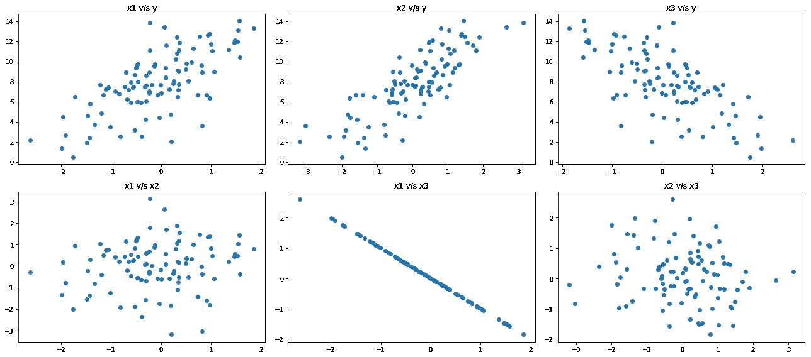

# 多重共线性对线性回归的影响

> 原文：<https://medium.com/analytics-vidhya/effect-of-multicollinearity-on-linear-regression-1cf7cfc5e8eb?source=collection_archive---------21----------------------->

这个故事分为以下几个实验-

> **实验 1** —高相关属性对其各自系数的影响
> **实验 2** —无/低相关属性对其各自系数的影响
> **实验 3** —具有高/低相关属性的数据对其各自系数的影响
> **实验 4** —相关属性对模型预测的影响

最后我们将学习 VIF。

开始之前，我们应该了解一些基础知识，

*   与属性相关的回归系数值代表自变量移动一个单位时**因变量的平均变化。**
*   我们不能比较两个回归系数，因为它们可能在不同的尺度上，例如，如果 x1 的系数是 2，x2 的系数是 4，那么我们不能直接说 x2 比 x1 更重要，因为它们可能在不同的尺度上。比如 x1 是以公里为单位的距离，x2 是以克为单位的重量。
*   但是我们可以比较两个标准化的回归系数。

> 在整个笔记本中，我将直接比较回归系数，因为它们与我人工处理的数据处于同一尺度。

**注:**每当我说**x 的估计**时，我指的是**x 的系数估计**。

首先，导入所有必需的库。

## 实验 1

> 高度相关属性对其各自系数的影响。

首先我们伪造一些人工数据，

现在，我们应用线性回归来估计每个属性的系数。

## 结果的解释

这些估计系数意味着*x1 的一个单位变化平均变化大约。相同方向上的 y 的 2 个单位和 x2 的 1 个单位变化平均约为。相反方向的 2 个 y 单位*。我们知道这是真的，因为我们在处理数据时做了这些设置。因此，当这两个高度相关的特征被独立地馈入线性回归时，系数的估计值非常接近真实值。

> 估计参数中的微小误差是由于数据中的噪声，如果我们有没有噪声的干净数据，则估计参数收敛到真实参数。

现在，拟合 x1 和 x2

## 结果的解释

这些估计系数意味着*x1 的一个单位变化大约。1 个单位的 y 在同一方向，一个单位的 x2 变化大约。1 个 y 单位，方向相反。我们知道这不是真的，因为我们在处理数据时做了不同的设置。*

其原因是因为这两个特征高度相关(本例中为*完全相关*),它们在改变响应方面的贡献被平均分配。x1 的系数不再被解释为 x1 单位变化时 y 的变化，而是现在被解释为给定 x2 单位变化时 x1 单位变化时 y 的**变化**，也就是说，它现在以**为条件**。这是因为如果 x1 & x2 之间的相关性为 0，那么我们可以保持 x2 不变，将 x1 改变一个单位，并检测 y 的变化，但现在由于它们之间的相关性如此之高，我们无法在改变 x1 时保持 x2 不变，如果我们改变 x1 一点，x2 也会改变，这取决于它与 x1 的相关性。

长话短说，如果现在有人查看这些系数，他们会将结果解释为*x1 的一个单位变化在相同方向上改变大约 1 个 y 单位，x2 的一个单位变化在相反方向上改变大约 1 个 y 单位*。*如此糟糕的估计是非常危险的，因为我们对模型的解释会导致关键的决策，如果结果是错误的，那么解释也是错误的，因此决策也是错误的*。这可能在医学领域具有关键的影响，因为这两个特征可能是药物的一些成分，并且我们可能对它们对一些疾病的影响感兴趣(例如，在这种情况下是 y)。

> 因此，当两个或更多高度相关的特征被送入线性回归时，它们的估计是非常糟糕的，不可信的。因此，多重共线性导致不太可靠的估计，这种可靠性与多重共线性水平成反比，即多重共线性越多，系数越不可靠。

## 实验二

> 不相关/不太相关的属性对其各自系数的影响。

首先我们伪造一些人工数据，

从图中我们可以看出，x1 和 x2 都与 y 正相关，但彼此之间的相关性很小，这也通过下面的皮尔逊相关得到了验证。

x1 和 x2 之间的低 pearson 相关性表明它们之间的相关性非常小，甚至可以在 5%的显著性水平下被拒绝。

> 因此，由于多重共线性减少，估计的系数现在更加可靠。

现在，我们应用线性回归来估计每个属性的系数。

> 虽然估计的参数非常合理，但是其中存在一些误差，这不仅仅是由于数据中的噪声，还由于 y 依赖于 x1 和 x2(因为 y=y1+y2)

现在，拟合 x1 和 x2

我们可以看到，由于多重共线性非常小，两个估计系数都没有受到很大影响，甚至在取 x1 和 x2 后估计值都有所改善，因为 y 是 y1+y2。因此，取决于 x1 和 x2，因此使用影响 y 的两个预测值，我们得到更好和更准确的估计。

## 实验三

> 具有高/低相关属性的数据对其各自系数的影响。

首先我们伪造一些人工数据，

所以基本上 x1 和 x3 是完全相关的，但是对(x1，x2)和(x2，x3)的相关性很小。

现在，我们应用线性回归来估计每个属性的系数。我们将首先分别拟合 x1、x2 和 x3，

现在，将 x 配对

x1、x2、x3 的系数估计值非常接近真实参数，但是有一点噪声，原因已经在上面解释过了。另外**由于多重共线性较高，当 y 在 x1 & x3 组合上回归时，估计值会受到很大影响。**但是，当 y 在两个 x2 上回归时，估计值得到改善& x3，因为 y 由(x1，x2)组成，而 x3 只是-x2，因此回归器得到了估计真实行为所需的一切。

现在，拟合所有 x1、x2 和 x3

所以，如果你跟着笔记本走，那么这个结果对你来说并不意外。

由于 x1 和 x3 完全相关，因此它们的系数估计值受到很大影响，在这种情况下，由于相关性为-1，估计值正好是一半。但是你可能已经注意到 x2 的系数一点也没有受到影响，甚至得到了提高。这是因为 x2 与 x1 和 x3 的相关性非常低，因此 x1 和 x3 之间的多重共线性对其估计值没有影响。此外，由于 y 同时依赖于 x1 和 x2，并且我们同时提供了这两个参数，因此估计值也有所提高。

> **地面实况**
> —x1 一个单位变化同方向 y 变化 1 个单位
> —x2 一个单位变化同方向 y 变化 2 个单位
> —x3 一个单位变化反方向 y 变化 1 个单位
> 
> **结果解读**
> —x1 的一个单位变化使 y 向同方向变化 1 个单位(绝对错误)
> —x2 的一个单位变化使 y 向同方向变化 2 个单位(绝对正确)
> —x3 的一个单位变化使 y 向反方向变化 1 个单位(绝对错误)

虽然我们看到多重共线性影响估计参数但是**预测呢？**因为在一些罕见的情况下，与获得高预测准确性相比，我们可能对解释结果不太感兴趣(尽管这种情况非常罕见，但我们的想法是，如果我们获得良好的整体预测，即使个别估计是错误的，我们也会很高兴)。

## 实验 4

> 相关属性对模型预测的影响。

我们将使用相同的实验 1 数据并进行训练测试分割，

我们首先仅拟合 x1，

现在，拟合 x1 和 x2

> 因此多重共线性对模型的性能没有显著影响，这是有意义的，因为各个估计值只相互影响。你可以这样想，如果**两个相关变量只是两个纠缠的变量**(其中纠缠的强度与它们之间的共线性强度成比例)，这样，如果一个变量改变，另一个变量也会改变，从而使最终结果相同。

## 结论

从这些实验中，我们得出以下结果

*   如果模型具有耦合/共线特征，则它们的估计系数会受到影响，因此不可信。此外，影响取决于共线性的程度/严重性，共线性较低的影响可以忽略不计，共线性较高的影响巨大。(**从 exp1 & exp2** 中证实)
*   在模型中，估计系数只对那些与其他要素存在共线性的要素有影响。(**从 exp3** 证明)
*   多重共线性不会影响模型的预测能力。(**从 exp4** 证明)

## 长话短说

如果模型的预测性能是您的唯一目标，则无需担心多重共线性，但如果拟合模型的解释是您的主要目标或与性能一样重要，则您不应依赖拟合模型的基础来做出决策。

因此，出现的下一个问题是，我们是否需要手动查找多重共线性，如果需要，那么在大量预测值的情况下该怎么办。难道没有工具吗？答案是我们不需要手动操作。大多数工具使用**方差膨胀因子(VIF)** 来寻找预测因子之间多重共线性的强度。

## 方差膨胀因子

VIF 在回归分析中检测每个预测值的多重共线性，方法是获取该预测值，并针对模型中的每个其他预测值对其进行回归，给出 R 平方值，然后将其代入 VIF 公式。

其中，R_{i}^{2}是第 I 个预测值的 r 平方值。

VIF 的值表明每个系数的方差百分比(即标准误差平方)增加了多少。例如，1.9 的 VIF 表明，如果没有多重共线性(如果与其他预测值没有相关性)，特定系数的方差会比预期值大 90%。

> VIF 的解释:
> 1 不相关。
> 1–5 中度相关。
> > 5 高度相关。

让我们为 VIF 定义一个函数，

我们将使用相同的实验 3 数据，

让我们首先仅在 x1 和 x2 上拟合 OLS(它们不相关)，

因此，所有的估计参数都与真实参数相同。此外，x1 和 x2 的 VIF 几乎为 1，表明它们彼此不相关，因此**OLS 计算的每个估计和统计都是正确的，可以信任。**

现在，在所有 x1、x2 和 x3 上拟合 OLS(注意，x1 和 x3 是相关的)，

因此，所有的估计参数并不与真实参数相同。由于完全相关，x1 和 x3 具有错误的估计，但是由于没有相关，x2 具有正确的估计。此外，x1 和 x3 的 VIF 都是无穷大，表明它们彼此完全相关，因此，OLS 计算的它们的估计和统计是不正确的，不能被信任。但是 x2 没有影响，我们可以相信它所有的估计和统计。

> 还要注意警告[2]，OLS 自动在设计矩阵中找到如此高的多重共线性。

## 处理多重共线性的一些技巧

*   逐步去除具有大 VIF 的预测值，即**回归-去除-回归**循环，直到所有 VIF 都在令人满意的范围内。
*   岭回归和套索回归都用于处理多重共线性或多重共线性的混合，即弹性网回归。
*   应用 PCR(主成分正则化),但这将导致模型解释的损失，因为主成分很难解释，如果是这样的话，你就不会应用它。

套索回归，

岭回归，

弹性网回归，

> 我们看到，这种正则化回归移动一个相关变量接近零，导致另一个变量更好的估计。这是因为在这种情况下，x1 和 x2 中的一个是冗余的，即只需要一个，因此最好使其中一个接近或等于零，从而对另一个进行更好的估计。

> 你可以从[这里](https://www.kaggle.com/gauravsharma99/effect-of-multicollinearity-on-linear-regression)获得这个博客的**完整文档 jupyter 笔记本**，你只需要叉它。同样，如果你喜欢这个笔记本，那么**投票支持**，它会激励我创造更多高质量的内容。

**如果你喜欢这个故事，请鼓掌并与他人分享。**

此外，请阅读我的其他故事，其中包括各种主题，

*   [**python 中的统计分析**](/@greatsharma04/statistical-analysis-using-python-e83f10ca3c82)
*   [**使用 keras 的面部情感识别**](/@greatsharma04/facial-emotion-recognition-fer-using-keras-763df7946a64)

还有更多的 T21。

## 参考

*   [识别重要独立变量](https://statisticsbyjim.com/regression/identifying-important-independent-variables/)
*   [线性回归的经典假设](https://statisticsbyjim.com/regression/ols-linear-regression-assumptions/)
*   [VIF](https://www.statisticshowto.datasciencecentral.com/variance-inflation-factor/)

**再次感谢朋友们阅读我的故事:**