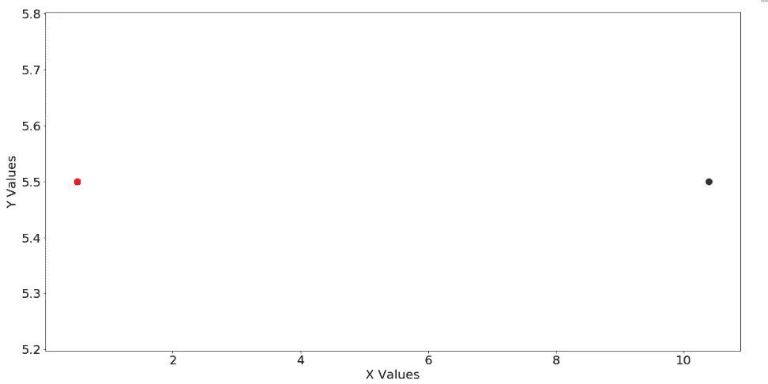
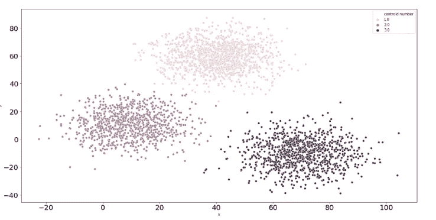
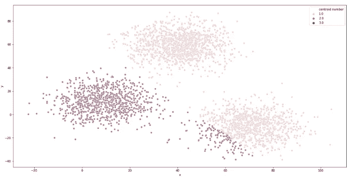
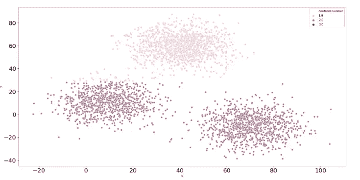

# Python 中离群点对 K-Means 算法的影响

> 原文：<https://medium.com/analytics-vidhya/effect-of-outliers-on-k-means-algorithm-using-python-7ba85821ea23?source=collection_archive---------2----------------------->


杰西卡·鲁斯切洛在 [Unsplash](https://unsplash.com?utm_source=medium&utm_medium=referral) 上的照片

[**K-Means 聚类**](/@joel_34096/k-means-clustering-using-python-from-scratch-7ccdace7789) 是一种无监督学习算法，旨在将 n 个观测值划分为 K 个聚类，其中每个观测值属于质心最近的聚类。该算法旨在最小化观测值与其所属聚类质心之间的平方欧氏距离。

但是有时 K-Means 算法不能给出最好的结果。它对异常值很敏感。离群点是不同于其余数据点的点。让我们来看一种发现单变量数据(一维)异常值的方法。

下四分位数“Q1”是前半部分数据的中间值。上四分位数“Q3”是数据后半部分的中值。四分位数间距“IQR”是 Q3 和 Q1 的差值。异常值是指大于(Q3 + 1.5*IQR)或小于(Q1-1.5 * IQR)的点。下面给出的代码可以用来找出异常值。

```
**Q1 = np.percentile(data, 25, interpolation = ‘midpoint’)** # The lower quartile Q1 is calculated.**Q3 = np.percentile(data, 75, interpolation = ‘midpoint’)** # The upper quartile Q3 is calculated.**IQR = Q3 — Q1** # The Interquartile range is calculated.**Q3 + 1.5*IQR, Q1–1.5*IQR** # The outlier range is calculated.
```

我们将在另一篇文章中讨论发现多元数据异常值的方法。

让我们举一个例子来理解异常值如何影响使用 python 的数据的平均值。

```
**X = list(np.random.rand(100))** # ‘X’ is a list of 100 random numbers between 0 and 1.
**Y = list(np.linspace(1,10,100))** # ‘Y’ is a list of 100 random numbers equally spaced between 1 and 10.**plt.figure(figsize=(20,10))** # Size of figure is adjusted.
**plt.xticks(fontsize=20)** # Size of number labels on x-axis is adjusted.
**plt.yticks(fontsize=20)** # Size of number labels on y-axis is adjusted.
**plt.xlabel(‘X Values’,fontsize=20)** # x-axis is labelled.
**plt.ylabel(‘Y Values’,fontsize=20)** # y-axis is labelled.**mean_X = sum(X)/len(X)** # ‘mean_X’ is the mean value of ‘X’.
**mean_Y = sum(Y)/len(Y)** # ‘mean_Y’ is the mean value of ‘Y’.
**plt.plot(mean_X,mean_Y,’ro’,markersize = 10)** # The mean value (mean_X,mean_Y) point is plotted.**outlier = 1000** # An outlier of value 1000.
**X.append(outlier)** # The outlier is added to ‘X’.
**Y.append(Y[99] + Y[1] — Y[0])** # An extra number is added to ‘Y’ such equal spacing still holds.**mean_X_new = sum(X)/len(X)** # ‘mean_X_new’ is new mean value of ‘X’.
**mean_Y_new = sum(Z)/len(Z)** # ‘mean_Y_new’ is new mean value of ‘Y’.
**plt.plot(mean_X_new,mean_Y_new,’go’,markersize = 10)** # The mean value (mean_X,mean_Y) point is plotted in green.
```



红点是排除异常值的数据的平均值。绿点是包括异常值数据的平均值。

我们观察到异常值使数据的平均值增加了大约 10 个单位。考虑到所有数据点的范围从 0 到 1，这是一个显著的增加。这表明平均值受到异常值的影响。

因为 K-Means 算法是关于寻找聚类的平均值，所以该算法受到离群值的影响。让我们举一个例子来理解异常值如何影响使用 python 的 K-Means 算法。

我们有一个名为“集群”的二维数据集，由 3000 个点组成，没有异常值。在应用 K-means 算法后，我们得到以下散点图。



现在，我们将 60 个异常值添加到“群集”数据集。异常值大约是非异常值的 2%。在应用 K-means 算法后，我们得到了以下不同异常值的散点图。



散点图中未显示异常值。为了更好的可视化，散点图中只显示了 3000 个非异常点。离群值形成一个单独的聚类，由质心数= 3 表示。



散点图中未显示异常值。为了更好的可视化，散点图中只显示了 3000 个非异常点。离群值形成一个单独的聚类，由质心数= 3 表示。

我们观察到异常值显示为一个单独的聚类，并导致其他聚类合并，这表明当异常值包含在数据集中时，聚类是无效的。

尽管异常值只占现实世界数据集中常见的非异常值的 2 %,但它们对聚类有重大影响。因此，在应用 K-means 聚类算法之前，最好识别并去除异常值。在后续的文章中，我们将寻找识别和去除数据集中异常值的方法。