# 离群点对神经网络性能的影响

> 原文：<https://medium.com/analytics-vidhya/effect-of-outliers-on-neural-networks-performance-ca1d9185dce9?source=collection_archive---------1----------------------->

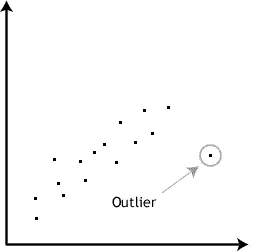

因为当涉及到理解将输入变量映射到输出的数学函数时，神经网络被认为是块盒，这种数学函数的推导相当复杂。不幸的是，神经网络对异常值的处理也是如此。

在开始这篇文章之前，我给你的建议是对神经网络和机器学习的某些方面有一些基本的了解，以便对这篇博客有一个全面的了解。

如果你不熟悉神经网络，请参考以下内容:

[](/@johnolafenwa/introduction-to-neural-networks-ca7eab1d27d7) [## 神经网络导论

### “机器不会思考”是大多数人持有的一种信念，那是因为我们的机器最擅长计算…

medium.com](/@johnolafenwa/introduction-to-neural-networks-ca7eab1d27d7) 

我一直想知道神经网络如何处理异常值，特别是当我们使用**整流线性单元** (ReLU)作为激活函数时。你可能会问为什么只有 ReLU，而没有其他激活单元，如 **Sigmoid，Tanh** 和 **arctan** 等。主要原因是 ReLU 具有半线性特性，可能会受到异常值的影响，其次是它在 2019 年得到了最广泛的使用。

为什么我只关注 Relu？

为了找到答案，我们应该看看逻辑回归中一个叫做挤压的概念。让我们首先理解逻辑回归是如何工作的，并通过使用 *Sigmoid* 激活函数来处理异常值。我正在考虑逻辑回归，因为如果使用 *sigmoid* 激活，单个神经元(感知器)与逻辑回归相同，否则在没有任何激活函数的情况下，它是线性回归。

**逻辑回归和单神经元(感知器)**

逻辑回归是一种分类技术，这意味着它试图区分两个类别，即是或否、零或一等，也可以区分多个类别，即零或一或二或三。

示例:

1.两类:动物是猫或狗。

2.多类:天气晴朗或下雨或刮风。

**逻辑回归如何工作**

概括地说，它试图画一条线/平面来区分两个或更多的类别。我将用一种简单可行的方式来解释逻辑回归，这足以理解这篇博客。如果你想知道更多关于逻辑回归的细节，点击这里。

**目标**:找到一条减少误差的直线或平面“w”。

**工作:**考虑一个具有特征*高度* 和*权重*的 2 类分类问题的例子。任务是确定给定的动物是猫还是狗。

将猫标记为-1，将狗标记为+1。输出 y=+1 或-1，输入 x(矢量)=重量和高度

***假设*** 是给定的数据是线性可分的。

让我们从容易掌握的几何角度来理解逻辑回归。画出重量和高度。

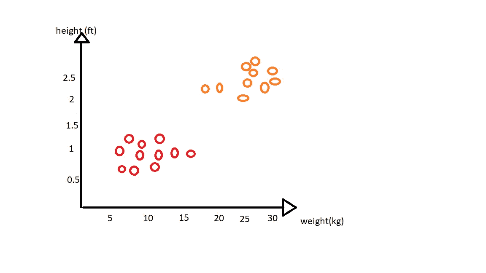

查看这些图，任何人都可以说，重量和高度较高的点是狗(标记为橙色圆圈)，重量和高度较低的点是猫(标记为红色圆圈)。但是逻辑回归如何解决这个问题呢？简单地画一条线来划分这两个类。

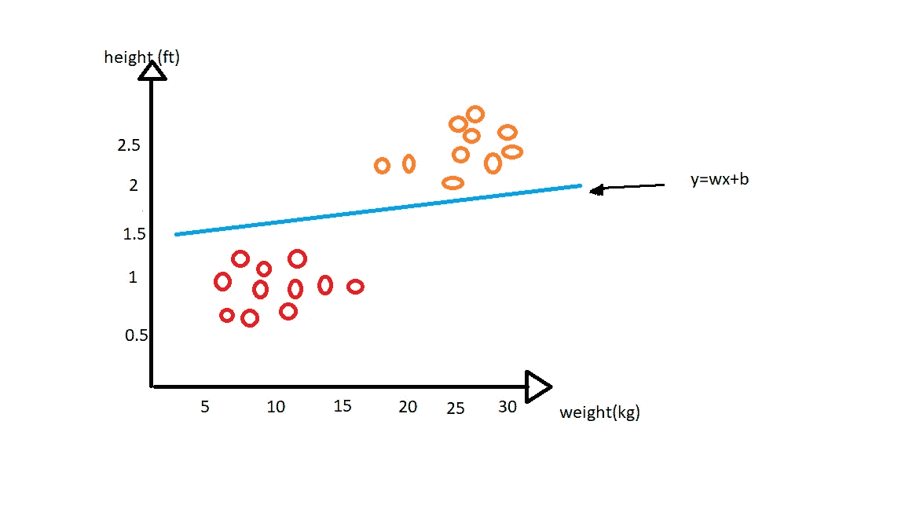

画完线后，我们可以很容易地说，线上的点是狗，线下的点是猫。

让我们进入简化程序。

第一步:逻辑回归首先在空间中画一条随机线。

步骤 2:计算从每个点到线的距离，并自我更新，以使结果输出距离总是最大的。

点到平面的距离(d)是 wx，其中 w 垂直于平面，x 是输入向量。平面上方的点将具有正距离，即 wx=+ve，平面下方的点将具有负距离，即 wx=-ve。

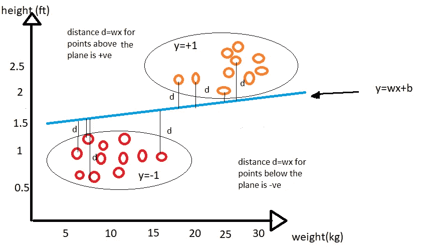

数学等式变成了:

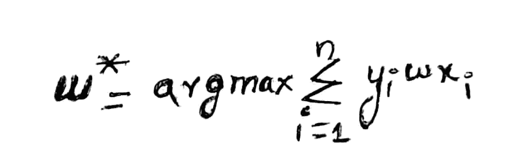

其中 w 是线/面，y 是输出，x 是输入向量，求和(I 到 n)表示所有输入数据点，argmax(w)表示我们想要最大距离。

如果所有的点都被正确分类，那么与存在一些错误分类的情况相比，得到的总和将更为正。

**异常值情况下的逻辑回归**

上述等式的结果是 100%准确，直到没有异常值或极值点，也没有错误分类。当异常值被引入数据并因此在线/平面上移动时，请看下图。

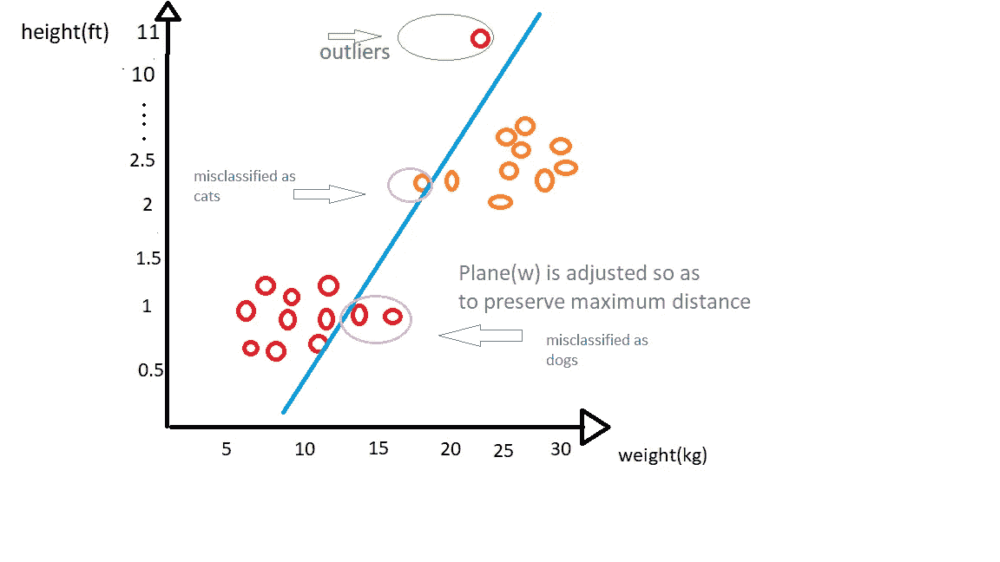

当我们应用相同的等式时，得到的平面就是我们在上面的图像中得到的，这是由 3 个错误分类组成的，以最大化距离。为了解决这个问题，我们应该在博客中引入挤压的概念。挤压是一种减少极端/异常值影响的现象。由于挤压的影响，线/平面较少受到异常值的影响，因此减少了错误分类。

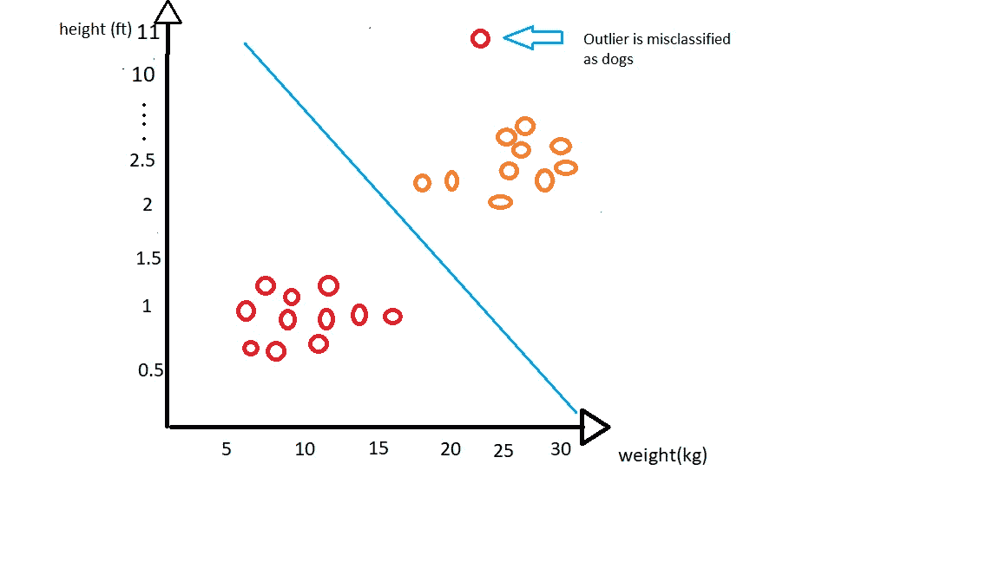

从这张图片(挤压后的左图)我们可以看到只有 1 点是错误分类的，这比我们上面得到的要好。挤压的效果来自称为*‘SIGMOID***’的底层数学函数。**


对于 x 的所有值，Sigmoid f(x)位于 0 和 1 之间。当我们对距离应用 Sigmoid 时，我们试图在位于端点和正常点的异常值之间取得平衡，因此异常值对被调整的线/平面的影响较小，导致错误分类较少。这就是 ***压扁*** 的原因。

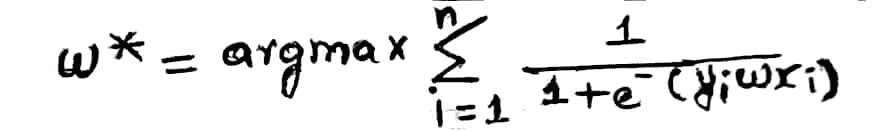

这是应用 sigmoid 后的方程，不容易出现异常值。

让我们应用另一个数学函数 RELU 代替 SIGMOID 来处理上述 CATS 和 DOGS 问题中引入的异常值

在此之前，让我们看看 ReLU

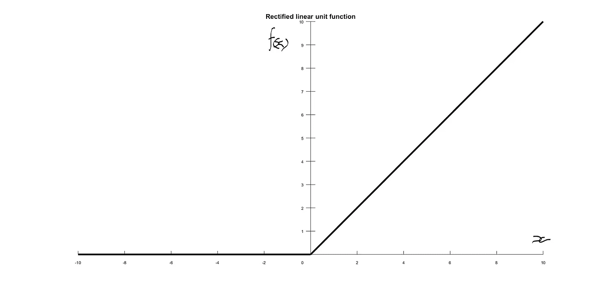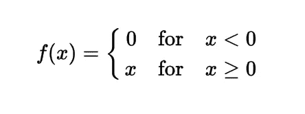

正如我们所看到的，对于 x≥0 的任何值，f(x)线性依赖于 x，否则为零。

然而，当我们将 Relu 应用于上述问题时，得到的线/平面类似于我们在没有挤压的情况下在逻辑回归中得到的线/平面，因为当 wx≥0 时它只是得到一个线性函数(wx ),如果 wx <0.That means Relu cannot squash the impact of outliers or to be more precise extreme points.So we can say that ReLU is more prone to outliers than Sigmoid by the analysis we did so far.

> ***为零，现在让我们回到神经网络***

简单地让我们通过采用回归数据集，用 Relu 和 sigmoid 对神经网络进行实验。

> 我正在使用**加州住房数据集**(详情[点击这里](https://scikit-learn.org/stable/datasets/index.html#california-housing-dataset))

使用这个数据集的原因是，它有一些极值点或异常值，以便我们可以更好地执行我们的分析。这种分析分两个阶段进行

*第一阶段*:对数据应用各种神经网络架构，并测试产生的误差。

*第二阶段*:从数据中去除异常值后，应用神经网络并测试结果误差。

> 获取数据集

```
from sklearn.datasets import fetch_california_housingd = fetch_california_housing()
```

> 在训练和测试中拆分数据集

```
from sklearn.model_selection import train_test_split
X_train, X_test, y_train, y_test = train_test_split(da, d.target,test_size = 0.30,)
```

> 标准化数据

```
from sklearn.preprocessing import StandardScalersc=preprocessing.StandardScaler()
X_train = sc.fit_transform(X_train)
X_test=sc.transform(X_test)
```

## **阶段 1:应用神经网络而不移除异常值**

> **模型 1** :架构:输入输出分层神经网络(1–1)

```
from keras.layers import Input, Dense
from keras.models import Model
model = Sequential()
model.add(Dense(1 ,activation='relu', input_shape=(8,)))
model.add(Dense(1))
model.compile(optimizer='adam', loss='mean_squared_error')
history=model.fit(X_train,y_train, batch_size=32, epochs=600, validation_data=(X_test, y_test))
```

**以 Relu 为激活函数的模型 1。在训练结束时，训练中的 MSE(损失)是 0.50，测试中是 0.509。**

**以乙状结肠为激活函数的模型 1。在训练结束时，训练中的 MSE(损失)是 0.389，测试中是 0.402。**

正如所料，与 Sigmoid 相比，Relu 的损失更高，因为我们没有从数据集中移除异常值。由于 Relu 不具有挤压属性，这是巨大损失背后的原因，而 sigmoid 通过挤压这些离群值做得很好。

然而，我们只在每一层中使用单个神经元，并且在模型 1 中也没有隐藏层。如果我们通过添加隐藏层来改变架构，结果可能会有所不同。让我看看..

> 模型 2 :架构:输入- 2 隐输出分层神经网络(64–32–16–1)

```
model = Sequential()
model.add(Dense(64, input_shape=(8,)))
model.add(Dense(32))
model.add(Dense(16))
model.add(Dense(1))
model.compile(optimizer='adam', loss='mean_squared_error')
history=model.fit(X_train,y_train, batch_size=32, epochs=600 ,validation_data=(X_test, y_test))
summarize_diagnostics(history)
```

**以 Relu 为激活函数的模型 2。在训练结束时，训练中的 MSE(损失)是 0.2334，测试中是 0.279。**

**以乙状结肠为激活函数的模型 2。在训练结束时，训练中的 MSE(损失)是 0.257，测试中是 0.309。**

现在的结果令人惊讶，因为 relu 比 sigmoid 表现得更好。你认为这背后的原因是什么？这个问题还有很多答案，让我用最简单的方式来说吧。当我们深入到神经网络时，损失不仅取决于离群值本身，而是有许多方面要考虑，但最重要的是主要在 sigmoid 激活中观察到的*消失梯度*问题。消失梯度是反向传播中的现象，其中神经网络仅通过保持其权重(wx)恒定来学习任何东西。

逻辑回归中的 Sigmoid 主要用于挤压，但在神经网络中，挤压功能不再保持不变，现在充当激活功能，帮助激活特定神经元。

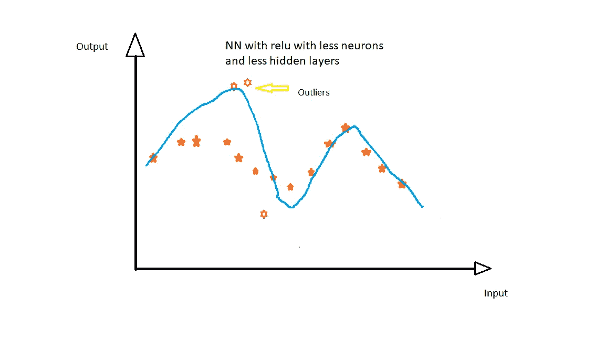

上面的图像是一个例子，说明了较少数量的隐藏层和神经元使映射函数(蓝线)受到离群值的影响，离群值主要发生在 Relu 激活函数中，较少发生在 sigmoid 上。说到这里，现在让我们进入第二阶段。

## **第二阶段:去除异常值后应用神经网络**

由于我们的要素较少，我们可以通过使用箱线图来检测数据集中的异常值，从而单独分析每个要素。下图显示了数据集中 6 个要素的箱线图

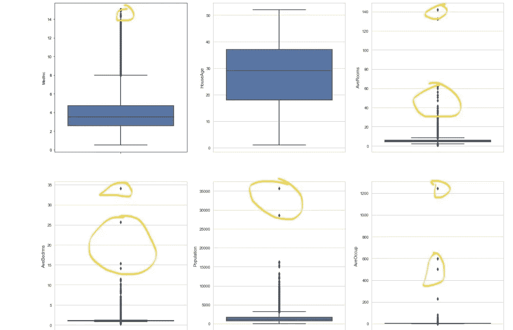

我们可以看到带黄色圆圈的点是异常值。因此，让我们看看从数据集中删除这些点是否可以减少 MSE(损失)。

计算每个特征的百分位数

```
print('99TH AND 100TH PERCENTILES OF FEATURE AVEBEDRMS:',np.percentile(da.AveBedrms, [99,100]))
# OUTPUT:99TH AND 100TH PERCENTILES OF FEATURE AVEBEDRMS: [ 2.12754082 34.06666667]
```

类似地，对于剩余的特征，如果第 99 百分位和第 100 百分位有很大的差异，则选择阈值作为第 99 百分位，并删除剩余的点。

```
c=np.where(da.AveBedrms>=3)
da.drop(da.index[c],inplace=True)
dy.drop(dy.index[c],inplace=True)
```

在去掉约占整个数据集 2 . 4%的极值点后，我们可以再次将数据分成训练、测试和标准化。

> 对该数据应用上面讨论的相同架构。

**以 Relu 为激活函数的模型 1。在训练结束时，训练中的 MSE(损失)是 0.431，测试中是 0.395。**

**以乙状结肠为激活函数的模型 1。在训练结束时，训练中的 MSE(损失)是 0.394，测试中是 0.353。**

在去除异常值之后，具有 relu 的模型 1 与在阶段 1 中具有 Relu 的模型 1 相比表现得明显更好，甚至具有 sigmoid 的模型 1 也具有一些改进的性能，这是因为 sigmoid 倾向于压制异常值的影响，而不是完全消除它们的存在，所以这就是带来损失变化的原因。

**以 Relu 为激活功能的模式 2。在训练结束时，训练中的 MSE(损失)是 0.242，测试中是 0.246。**

**具有乙状结肠激活功能的模型 2。在训练结束时，训练中的 MSE(损失)是 0.258，测试中是 0.257。**

具有 relu 的模型 2 在这里似乎表现得好一点，这主要是因为它比 sigmoid 收敛得更快，并且不容易出现消失梯度问题。

**结论。**

从整个实验来看，如果神经网络不太深，Relu 会受到离群值的影响。当建筑深入时，Relu 的行为和其他激活函数一样，甚至比其他函数更有规律，收敛更快。

完整代码:[https://github . com/santoshketa/handling-outliers-in-Neural-in-nn-](https://github.com/santoshketa/handling-outliers-in-Neural-in-nn-)

这里可以流我- [Linkedin](https://www.linkedin.com/in/santosh-santosh-bhargav-354974192)

如有任何意见或问题，**写在评论里吧。**