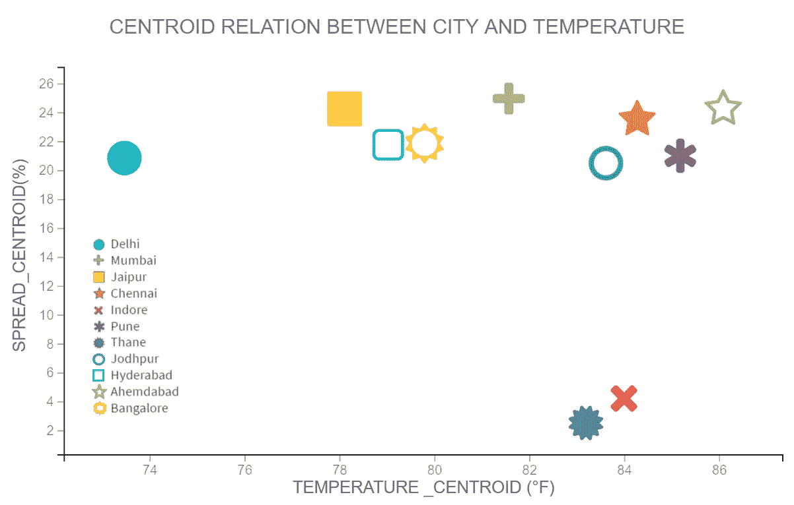

# 天气因素对新冠肺炎的影响

> 原文：<https://medium.com/analytics-vidhya/effect-of-weather-factors-on-covid-19-4346e79036b7?source=collection_archive---------9----------------------->

## 一个由[大台库](http://www.dataiku.com)和【covindia.com】T2 驱动的执行装置

在这份文件中，我们试图分析和回答两个非常重要的问题，关于新冠肺炎教在印度的传播，以及随之而来的世界。

> 1)全国范围的封锁是否达到了减缓传播的预期效果？
> 
> 2)天气在新冠肺炎的传播中扮演了什么角色？

有非常明显的证据表明，封锁降低了新冠肺炎在受影响最严重的印度地区的传播。然而，天气的作用并不明显。虽然从表面上看，似乎是更高的温度导致了传播的减少，但这可能是实施封锁后温度上升的人为因素。然而，我们提出了我们的初步结果，并邀请其他数据科学家进一步调查，以找到更多的结论性结果。

这两项分析之所以成为可能，是因为作者所在的 https://covindia.com[团队提供了详细可靠的地区数据集。](https://covindia.com)

# **目标变量:**

为了选择一个目标变量，我们需要一些东西来告诉我们到底是什么情况。如果我们使用每日阳性病例数，它不能告诉我们情况是在好转还是在恶化，因为久而久之每日报告的病例数肯定会增加。

因此，我们选择报告病例数的百分比变化(分布)。由公式给出:

某一天“t”的分布被定义为该天病例总数的百分比增加。

这让我们看到了每日阳性病例的趋势。然而，阳性病例数据仍有噪声。为了抵消这一点，我们使用高斯滤波器(方差=1.5)来减轻噪声并计算扩展。

上图显示了封锁期间所有城市的综合分布值。绿线向我们显示阳性病例每日报告本身的扩散值，这可能是有噪声的，蓝线向我们显示应用了高斯滤波器的每日病例的扩散值。

# 参数:

我们主要关注影响新冠肺炎传播的参数如下:

**封锁对新冠肺炎在印度传播的影响。**

**温度的影响(以及为什么我们不能相信它)**

**不同湿度类型的影响**

**———————1。** **相对湿度**

**———————2。比湿度**

由于封锁，我们大多数人选择留在室内。因此，一些外部天气因素(如风寒)并不那么有效，因为它们与室内天气没有很好的相关性。不过大部分都是和室内天气高度相关的(就像上面说的那些)。

新冠肺炎的潜伏期约为 5 至 15 天。因此，新冠肺炎病毒传播的任何变化都有可能与 5-15 天前的天气因素有关。因此，对于 spread 值的每个条目，我们将其与之前 5 到 14 天的天气特征数据的平均值相关联。

我们关注病例最多的城市:

X **德里**

X **孟买**

X **斋浦尔**

X **Indore**

X **奈**

我们使用从 OnPoint API 收集的天气数据和从我们的网站 API:covindia.com API 收集的新冠肺炎案例数据。

# 链接:

> 印度石油协会:[https://covindia-api-ocs.readthedocs.io/en/latest/](https://covindia-api-docs.readthedocs.io/en/latest/)
> 
> on point API:[https://weathersource.com/products/onpoint-api/](https://weathersource.com/products/onpoint-api/)

# 锁定的影响:

x 轴表示日期，y 轴表示新冠肺炎的范围

在印度，封锁的效果相当成功，因为我们看到传播已经随着时间的推移而下降。

# 温度的影响:

在这些散点图中，x 轴表示华氏温度，y 轴表示经过高斯滤波的阳性病例条目的百分比分布。

在这些城市中，我们观察到传播值呈下降趋势，也就是说，报告病例的变化随着温度的降低而降低。

现在，这是否意味着温度在传播病毒中起了作用？

**也许。**

但是，如果你仔细想想，这也可能是我们被封锁的一个简单后果。

这是一些城市温度和日期的散点图:

x 轴表示比湿度(单位为 g/kg ), y 轴表示范围

在这些图表中，我们观察到温度随着时间的推移而升高。从我们之前的图表中，我们还看到了由于封锁而导致的传播下降，**这意味着封锁在这里发挥了真正的作用。**

可以肯定地说，报告病例的变化确实有所减少。**但这并不意味着温度会影响新冠肺炎的传播**。同样的道理也适用于其他特征。

> 这是一个简单的“关联”案例！=因果关系”。

以下是一些与时间相关的其他特征:

相对湿度(百分比):

x 轴表示日期，y 轴表示相对湿度(百分比)

比湿度(单位为克/千克(g/kg)):

x 轴表示日期，y 轴表示特定湿度(单位为克/千克(g/kg))

在分析温度的过程中，我们观察了处于封锁状态的不同城市以观察趋势，并认为我们发现了相对较冷的城市与相对较暖的区域相比有较高的扩散值，而相对较暖的区域有较低的扩散值。这意味着尽管采取了封锁措施，但高温导致新冠肺炎病毒的传播减少。

为了验证这一点，我们计算了每个城市相对于其温度的扩散值的质心。

***城市“C”的质心= (Xcentroid-C，Ycentroid-C) =***

在绘制该图时，我们观察到塔那和印多尔的质心负责创建一个负趋势，而其余的则表明一个中性趋势。

# **湿度的影响:**

**相对湿度的影响:**

在这些散点图中，x 轴表示相对湿度，y 轴表示阳性病例条目的百分比分布，这些条目经过高斯滤波。这里也可以看到锁定的效果。

这里的趋势因城市而异。有些呈上升趋势(斋浦尔和德里),有些呈下降趋势(印多尔),而孟买和钦奈分别没有任何进展。

# 湿度的影响:

**比湿度的影响:**

在这些散点图中，x 轴表示以克/千克(g/kg)为单位的比湿度，y 轴表示正例条目的百分比分布，这些条目经过高斯滤波。这里也可以看到锁定的效果。

在这里，趋势也因城市而异。有些显示出略微上升的趋势(德里),有些显示出下降的趋势(孟买、钦奈和印多尔),斋浦尔没有显示出任何进展。

x 轴表示比湿度(单位为 g/kg ), y 轴表示范围

# 结论:

虽然我们仍处于初级阶段，但历史告诉我们，病毒的传播和周围的天气之间总有某种联系。它存在于以前的病毒中，也主要存在于新型冠状病毒病毒中。这完全取决于病毒在不同天气条件下如何影响其宿主，以及它在每种天气条件下的稳定性。

在这些领域需要更多的数据和研究，这是应该的。每天都有伟大的发现，不久的将来，我们将不再需要戴着面具，提心吊胆地走在外面。

我们将一如既往地继续我们的研究，并为您提供进一步的更新。注意安全，呆在家里。

# 感激的表示:

非常感谢[**Data aiku**](https://www.dataiku.com/)提供了数据科学工具，这些工具可以轻松地绘制图形，并产生美丽的可视化效果。

阿查尔·阿加瓦尔博士以坚忍的耐心指导我，没有他的支持和建议，这一切都不可能实现。

[**Weather Source，LLC**](https://weathersource.com/) 通过提供从 [OnPoint API](https://weathersource.com/products/onpoint-api/) 访问他们的天气数据来支持我的研究。

# 最后，

Covindia dev 团队**是他们给了我机会，让我在这个黑暗而严峻的时代从事如此美好而有意义的工作。**

## ***喜欢吗？讨厌？在 mayank@covindia.com 给我们发电子邮件***