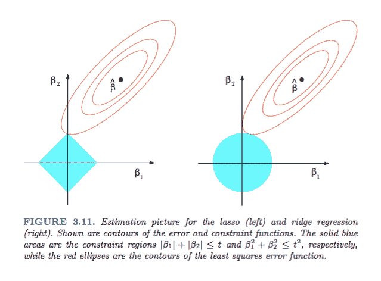
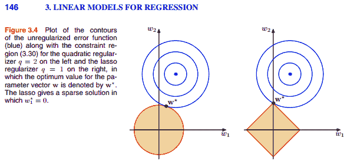
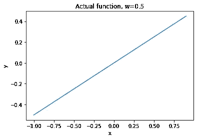
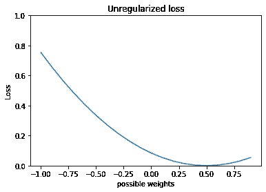
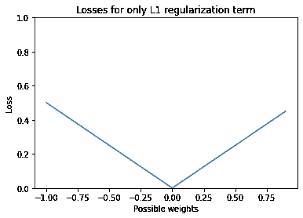
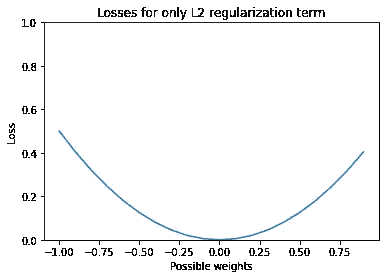
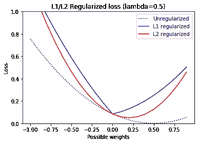

# L1 和 L2 正则化的更好的可视化

> 原文：<https://medium.com/analytics-vidhya/effects-of-l1-and-l2-regularization-explained-5a916ecf4f06?source=collection_archive---------7----------------------->

马尔科·博诺莫在 [Unsplash](https://unsplash.com/s/photos/gradient-descend?utm_source=unsplash&utm_medium=referral&utm_content=creditCopyText) 上的照片

## L1 正则化为什么把权重缩小到 0 的直观解释。

正则化是一种防止模型过度拟合的流行方法。想法很简单:我想保持我的模型权重小，所以我会为拥有大的权重增加一个惩罚。两种最常见的正则化方法是拉索(或 L1)正则化和岭(或 L2)正则化。他们用绝对重量(L1)或重量的平方(L2)来惩罚模型。这就引出了一个问题:那么我应该选择哪一个呢？还有 Lasso 为什么要进行特征选择？

# 老办法

在正则化的所有最佳解释中，你经常会听到“L1 正则化倾向于将不重要特征的系数缩小到 0，但 L2 不会”，如这里的[和这里的](https://towardsdatascience.com/l1-and-l2-regularization-methods-ce25e7fc831c)[和](https://towardsdatascience.com/intuitions-on-l1-and-l2-regularisation-235f2db4c261)所示。视觉解释通常由图表组成，就像这张非常受欢迎的图片，来自 Hastie、Tibshirani 和 Friedman 的《统计学习的*元素》*:

在 Bishop 的*模式识别和机器学习*中也可以看到:

我发现这些图表不直观，所以做了一个更简单的，感觉更容易理解。

# 新的方式

这是我的观点，一步一步的可视化。首先，上面的图像实际上是三维的，不能很好地翻译到书或屏幕上。相反，让我们回到线性数据集的基础。

首先，我们创建一个非常简单的数据集，只有一个权重: *y=w*x* 。我们的线性模型将尝试学习权重 *w* 。

假装我们不知道 *w* 的正确值，我们随机选择 *w* 的值。然后，我们计算不同的 *w* 值的损失(均方误差)。在 *w=0.5* 时损耗为 0，这是我们之前定义的 *w* 的正确值。随着我们远离 *w=0.5* ，损耗会增加。

现在我们绘制正则化损失函数。当 *w* 为 0 时，L1 损耗为 0，并且随着远离 *w=0* 而线性增加。随着远离 *w=0* ，L2 损耗非线性增加。

现在是有趣的部分。正则化损失的计算方法是将损失项加到正则化项上。对上面的每个损失都这样做，我们会得到下面的蓝色(L1 正则化损失)和红色(L2 正则化损失)曲线。

在 L1 正则化损失(蓝线)的情况下，使损失最小化的 *w* 的值在 *w=0* 。对于 L2 规则化损失(红线)，使损失最小化的 *w* 的值低于实际值(0.5)，但不完全达到 0。

就这样，对于相同的 lambda 值，L1 正则化将特征权重缩小到 0！

对此的另一种思考方式是在使用梯度下降来最小化损失函数的背景下。我们可以沿着损失函数的梯度到损失最小的点。然后，正则化将一个梯度添加到非正则化损失的梯度上。L1 正则化在除 0 之外的每个值处将固定梯度添加到损失，而由 L2 正则化添加的梯度随着我们接近 0 而减小。因此，当 *w* 的值非常接近 0 时，使用 L1 正则化的梯度下降继续将 *w* 推向 0，而 L2 上的梯度下降随着越接近 0 而减弱。

*用来创建这些可视化效果的笔记本和代码可以在我的*[*github repo*](https://github.com/nickyeolk/regularization_visualized)*中找到！也可以在 Twitter*[*@ ninjanaugget*](https://twitter.com/ninjanugget)或者在[*LinkedIn*](https://www.linkedin.com/in/nickyeolk/)上关注我