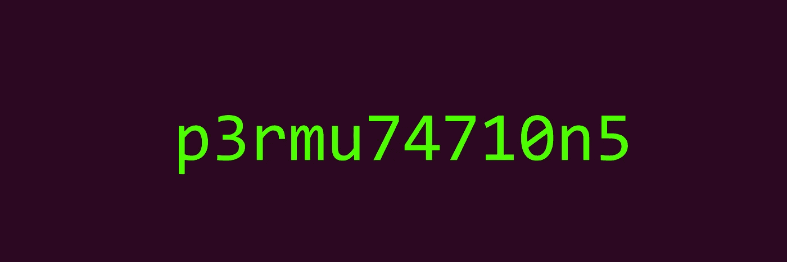

# 用于排列分组的高效数据结构

> 原文：<https://medium.com/analytics-vidhya/efficient-data-structures-for-permutations-grouping-e9d37d41e8c3?source=collection_archive---------13----------------------->



假设你有一个单词列表，我们如何找到它们之间的排列？

这似乎是一个理论问题…的确如此！然而，解决这个问题帮助我赢得了一份周报的谜语奖:)

## 蛮力，机智的蛮力

给定一个单词，简单、麻烦的强力方法是生成它的所有排列，并对给定列表中出现的所有排列进行分组。

由于种种原因，这种方法是不好的，所以让我们继续寻找一个更可行的解决方案；

一个更好的强力解决方案是检查所有单词，将每个单词的字母排序并分组；

即

单词 listen 和 silent 在同一个单词组 eilnst 中

对每个单词的字母进行排序效率不高，尤其是在设计一个可以处理长单词的通用数据结构时，所以让我们尝试另一种方法…

## 柱状图

你可能已经想到，排列只是字母之间的交换——所以每个字母的总数保持不变。因此，当给出两个单词的直方图时，我们可以立即确定它们是否属于同一家族。

让我们将字典关键字设置为每个单词的字母直方图:

运行基准测试时，它甚至比排序方法花费更多的时间。

让我们将 _get_item_key 函数分成两部分[ _get_item_key_to_histogram，_get_item_key_to_hashable ]并运行 cProfile 进行分析:

```
ncalls  tottime  percall  cumtime  percall filename:lineno(function)
   466551    1.561    0.000    1.807    0.000 permutations_grouping.py:44(_get_item_key_to_histogram)
   466551    0.474    0.000    0.474    0.000 permutations_grouping.py:50(_get_item_key_to_hashable)
```

我们看到构建直方图花费了一秒多的时间，然后将结果转换成可散列的形式花费了将近半秒。

我们能想出一个更好的解决方案吗？

## 数论对我们有帮助

让我们把问题转到数论领域；

字母将是数字，我们正在寻找一个序列是否等价于另一个序列，而不考虑顺序的重要性——因此乘法运算符对我们有好处，因为它具有交换性质。

然而，如果我们给字母随机分配不同的数字，我们很可能会以冲突结束:

即

对于赋值{ a : 3，b : 5，r : 15 }我们可能认为‘ab’= 3 * 5 = 15 和‘r’= 15 是一样的。

当用于表示不同单词排列族的键的数字具有相同的除数时，问题就出现了。

所以，分配的数字必须是质数！

质数没有公约数，这最适合于识别不同的字母——这样我们可以避免冲突。

急切地，让我们将理论见解转换成代码；

让我们运行分析:

```
ncalls  tottime  percall  cumtime  percall filename:lineno(function)
   466551    1.017    0.000    1.262    0.000 permutations_grouping.py:71(_get_item_key)
```

我们将总的密钥创建时间减少到了一秒——还不错:)

## 频率分析

现在作为质数乘法计算的一些密钥会产生很大的数字，这也会影响性能。

这可以通过单词域中的频率分析来减轻；不同的字母以不同的概率出现——这是阿拉伯学者 Al-Kindi 在 9 世纪首次描述的；有人建议，对《古兰经》进行仔细的文本研究，首先发现阿拉伯语有一个特征性的字母频率。

所以让我们给最频繁出现的字母分配较低的质数；

让我们运行分析器，我们可以看到，对于 466，551 个项目，当前生成密钥的总时间不到半秒钟！

```
ncalls  tottime  percall  cumtime  percall filename:lineno(function)
   466551    0.466    0.000    0.466    0.000 permutations_grouping.py:71(_get_item_key)
```

***喜欢这篇文章吗？随意长按👏下面的按钮😀***