# 在 VSCode 中激活 Conda 的有效方法

> 原文：<https://medium.com/analytics-vidhya/efficient-way-to-activate-conda-in-vscode-ef21c4c231f2?source=collection_archive---------0----------------------->

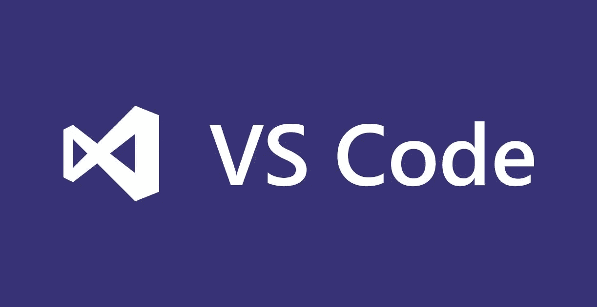

当我开始使用 VSCode 时，我挣扎了很久，因为 VSCode 有很大的灵活性，但它也意味着有大量的详细设置，允许各种替代用法。这篇文章将介绍如何在 VSCode 中使用 Conda 环境的从头到尾的过程。这篇文章将重点放在 Windows 系统上，但是其他操作系统用户也会发现它很有用。

由于我使用的主要语言是 Python，所以在这个演示中我将使用 **Python** 配置，让我们先来看看在 VSCode 中运行 Python 代码的两种方式。

在 VSCode 中你可以选择在**调试器**中运行 Python 文件，或者**在终端中运行 Python 文件。**

# 以终端模式运行

运行 Python 的一个选择是在终端中运行它。
右上角有一个按钮“在终端运行 Python 文件”。一旦您点击它，您的 Python 脚本将在**终端**窗口中执行。

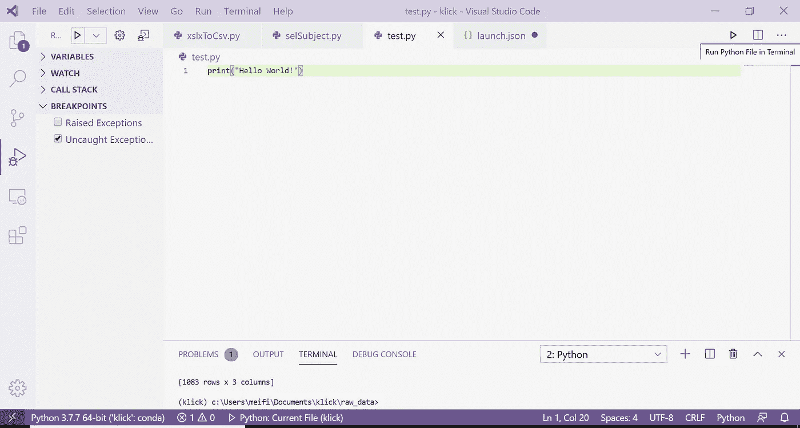

当您在终端中运行 python 时，它将采用“ *settings.json* 中的配置。

要找到配置文件，使用 **CTRL+SHIFT+P** 调出命令行面板，搜索“设置”。

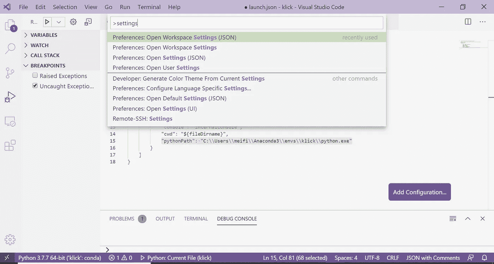

您将看到两个 JSON 设置:**首选项:打开工作区设置(JSON)** 和**首选项:打开用户设置(JSON)**

这两者之间的区别在于，**工作区** one 只会将您的设置配置到您当前的工作区(工作目录)，而**用户** one 就像一个全局默认的回退设置，它适用于您所有的 VSCode 项目，而没有**。在您的工作目录中找到 vscode** 文件夹(工作区设置)。

这里，我使用**首选项:打开工作空间设置(JSON)，**，因为我只想将这个 Python 环境用于这个项目。

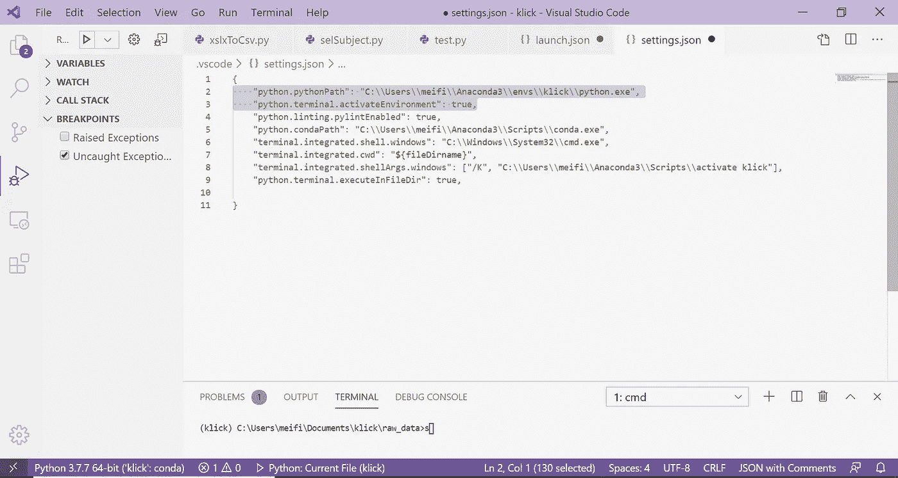

这里我们在配置中添加了三个东西:

> "**python . python path**":" C:\ \ Users \ \<your-usrname>\ \ anaconda 3 \ \ envs \ \<your-conda-env>\ \ python . exe "
> 
> "**python . terminal . activate environment**":true
> 
> **" terminal . integrated . shell . Windows "**:" C:\ \ Windows \ \ System32 \ \ cmd . exe "，

如果您在查找 conda 虚拟环境路径时遇到问题，您可以打开一个终端，激活您的目标 conda env，然后键入:`where python`，它将显示您系统中现有的 python.exe。


***python . Python path***将指定您想要使用哪个 Python 版本在终端中运行 Python。我们只是在特定的 conda 环境中使用一个。

第二个设置*"****python . terminal . activate environment****":true，*将允许 VSCode 激活 conda 环境，这是在创建终端时通过 **python.pythonPath，**检测到的。

第三个**" terminal . integrated . shell . windows "**是你喜欢用的默认终端控制台。我设置默认为***cmd.exe***，因为其他 Windows 选项 ***powershell*** 大家并不熟悉。


完成设置后，现在您有两个选项**来激活 VSCode 终端的 conda 环境**。一个是**创建新的集成终端(在活动工作区)**，终端将根据您在*Python . Python path****中指定的 Python 解释器激活 conda 环境。*** 另一个是**手动运行“conda activate<env>”**端子。

# 选项 1:创建新的集成终端(在活动工作区中)

1.  **Ctrl+Shift+P** ，搜索**终端**。
2.  选择**终端:**创建新的集成终端(在活动工作区)
3.  在终端窗口，你可以看到“conda activate <env>”命令已经执行，终端在你的 conda 环境下。</env>

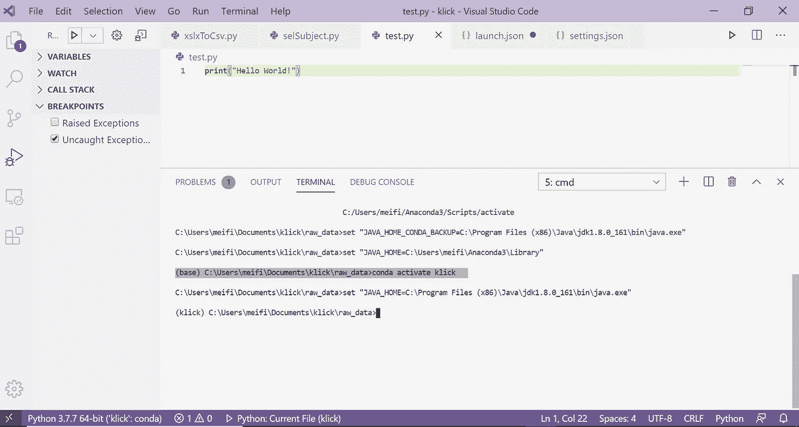

# 选项 2:在终端运行“conda activate <env-name>”</env-name>

第二种方法是在终端中手动控制 conda 环境的切换。为此，我们需要让 VSCode 终端识别“conda”命令。

1.  CTRL+SHIFT+P 打开**首选项:打开用户设置(JSON)** 。我们选择用户设置而不是工作区设置是因为我们希望在不同的项目中在 VSCode 中全局设置这些命令。
2.  将" **python.condaPath** "变量设置为

> " python . conda path ":" C:\ \ Users \ \<your-user-name>\ \ anaconda 3 \ \ Scripts \ \ conda . exe "，</your-user-name>

你可以在网上搜索如何在你的系统中找到 conda 的可执行路径，因为我注意到不同的 Anaconda 版本可能有不同的路径。

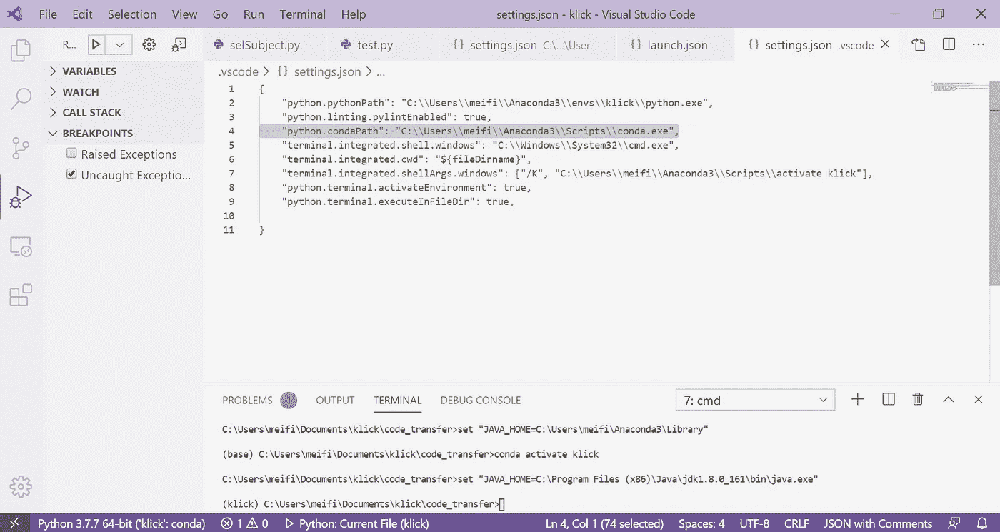

3.现在，您可以开始在 VSCode 终端中使用“conda”命令:

```
conda activate <env-name>
conda install <pkg-name>
conda info --envs
```

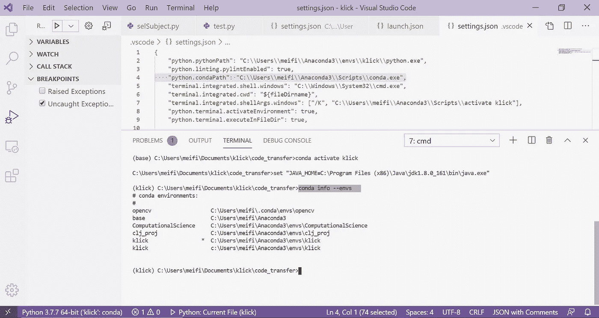

# **调试器模式**

另一种选择是使用调试模式。调试模式允许您设置断点，以便在您指定的特定行停止代码执行，从而让程序员有机会在代码返回输出之前调查代码中间发生了什么。

人们可以按下左侧菜单面板上看起来像一个三角形的图标，然后在顶部工具栏上，一个三角形按钮显示“*开始调试*”。

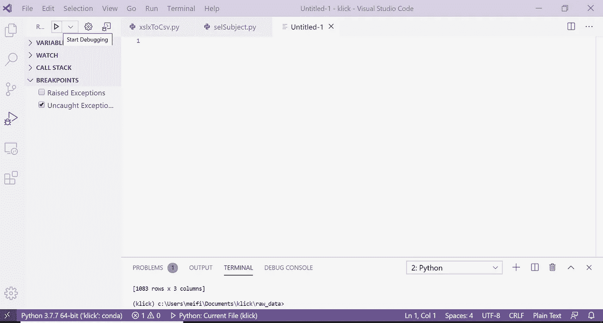

然后调用“ ***launch.json*** ”文件中指定的相应 Python 解释器。要找到该文件，单击下拉按钮并选择默认的“Python: Current File”。然后会弹出“ *launch.json* ”。

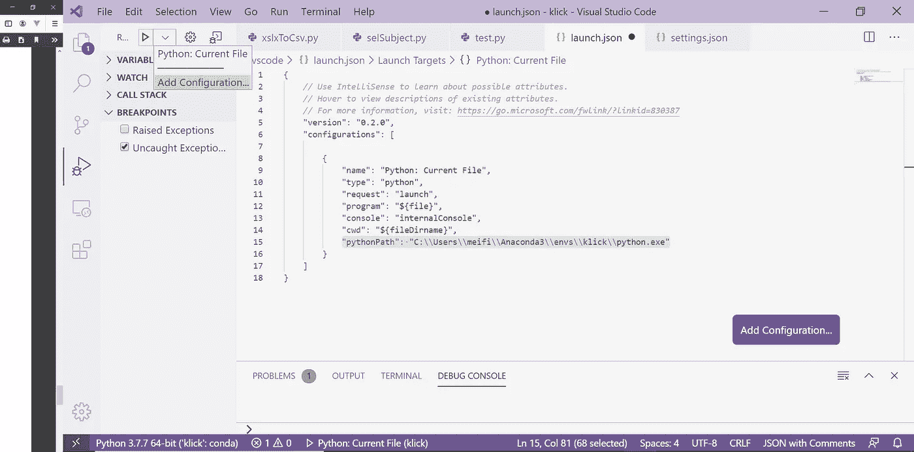

在"*launch . JSON****"***文件中，指定您的 **pythonPath** 指向来自 conda 环境的***【python.exe】***:

> " python path ":" C:\ \ Users \ \<your-user-name>\ \ anaconda 3 \ \ envs \ \<your-conda-env>\ \ python . exe "</your-conda-env></your-user-name>


注意 1: Windows 用户在指定路径时需要使用\\双斜线。注 2:Anaconda 3 路径可能会有所不同，这取决于您安装 miniconda 或 Anaconda 的位置。

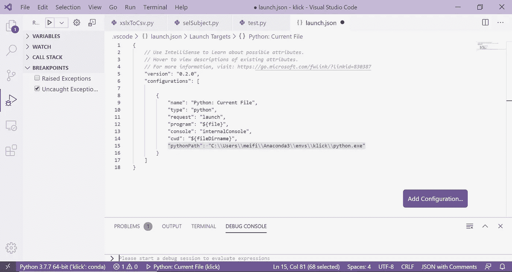

该配置将自动适应在您在此指定的 conda 环境下使用 Python(因为 python.exe 的*将从自己目录下的“ *Lib/site-packages* ”导入库)。现在，您可以开始调试您的 Python 代码以及您在此环境下安装的所有库。您可以在**调试控制台**窗口中找到结果。*

**

***【更新】***

*虽然这在大多数情况下都有效，但最近我发现，在调试运行之前，vs code*" internal console "*调试模式不会*而*抢先激活 *conda* 环境。这并没有影响我的第三方 Python 库的大部分，但是特别是我的 *numpy* 导入失败了。(许多人在 VSCode 的 [Github 论坛](https://github.com/microsoft/vscode-python/issues/4300)上报告了同样的错误，直到我写这篇文章的时候，人们仍然在报告同样的问题。)*

*一个更像黑客的变通方法是:
(1) **在“ *launch.json”中将控制台类型改为*integrated terminal****。*

> *"控制台":"集成终端"*

*(2) **在“ *settings.json* ”中添加集成外壳参数**，强制集成终端每次启动时运行 conda 命令。*

> *" terminal . integrated . shellargs . windows ":["/K "，" conda activate <env-name>"]</env-name>*

**注意:您需要首先设置 Python.condaPath 才能像这样使用 conda 命令。参见上一节选项 2。**

*(3) **允许“internalConsole”在“ *launch.json* ”中的会话开始时**打开。*

> *" internal console options ":" openOnSessionStart "*

**

*有了这三个步骤，你就可以通过【集成终端】启动你的调试了，它拥有**激活 conda 环境**的完全控制权，而 **internalConsole** (一个 Python 控制台)会同时在**调试控制台**打开一个窗口进行调试。*

*例如，在第 5 行和第 7 行设置了两个断点，因此从第 4 行开始的第一个 *print(a)* 在终端中输出。*

*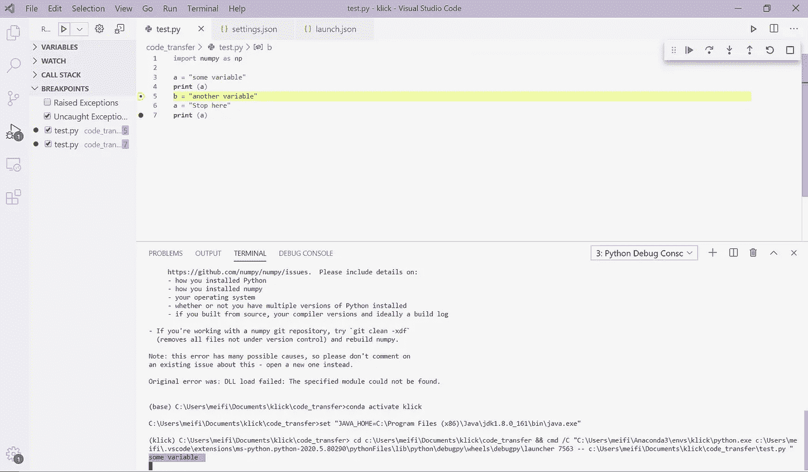*

*而当切换到调试控制台时，你可以与正在运行的 Python 代码进行交互。例如，在底部输入区，你可以使用一个活动的解释器来检查当前变量:*

*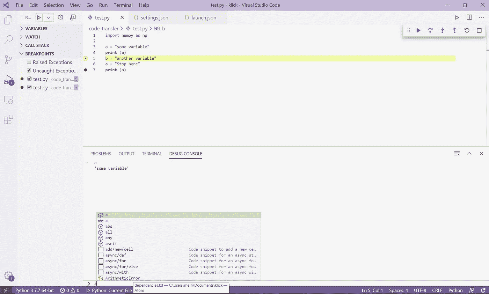*

***然而，**有一件事仍然很烦人，那就是在调试环境启动后，有一个“conda 环境激活”的**延迟**(参见[*stack overflow*](https://stackoverflow.com/questions/56475068/why-doesnt-vscode-activate-conda-before-starting-the-debugger)*)*中的顶部答案)。因此，当我第一次在这个环境中运行“开始调试”时，我的 *import numpy* 仍然会失败(也就是说，没有预先启动“ *Python 调试控制台”*)。但是当调试会话保持活动状态时，在我单击“继续”之后，它就可以工作了，并且以后还可以工作。*

*就是这样！希望你喜欢这篇关于如何在 conda 环境下使用 VSCode 的教程！如果你觉得这个帖子有用，请给这个帖子留个“拍手”吧！也欢迎你留下你的想法、评论或反馈！感谢您的阅读！*