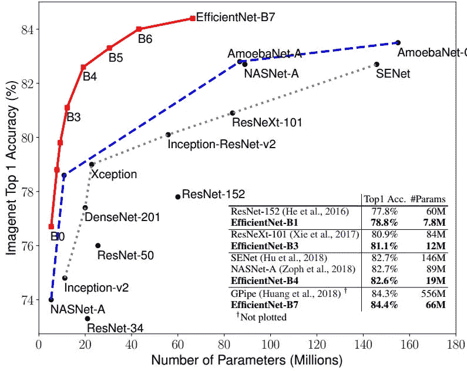
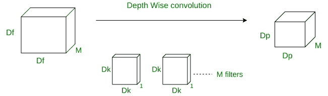
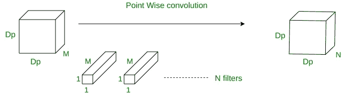
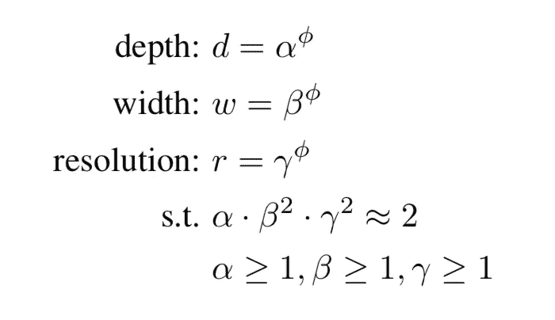

# efficient net:ImageNet 的最新技术

> 原文：<https://medium.com/analytics-vidhya/efficientnet-the-state-of-the-art-in-imagenet-701d4304cfa3?source=collection_archive---------15----------------------->


Markuss Gigengaar 在 Unsplash 上的图片

EfficientNet 是一组卷积网络模型，与 imagenet 中的其他竞争模型相比，它在 imagenet 数据库中以非常少的参数实现了最先进的准确性。高效模型组有 8 个来自 B0-B7 的模型，其中每个模型按时间顺序指的是更高的精度和更多数量的参数。下图总结了参数对获得精确度的影响。



# EfficientNet 如何工作:

该模型强调在提高精度的同时保持较少的参数数量。为此，它使用在 MobileConvnet 中引入的深度方向可分离卷积和点方向卷积。下图给出了深度方向卷积的概述。



在深度方向卷积的情况下，我们一次对一个通道进行滤波，而不是同时对所有通道进行滤波。当我们有 M 个大小为 Dk * Dk * 1 的不同滤波器时，我们得到大小为 Dp*Dp*1 的输出。



类似地，在逐点卷积的情况下，在 M 个信道上应用 1*1 卷积。这里我们将有 N 个大小为 1*1*M 的过滤器。要了解这两个操作如何减少参数的数量，请参见本文
[https://medium . com/@ adityamohanty/mobilenet-the-whos-who-of-fast-CNN-classifier-b 6 D5 ab 6a 79 c 2](/@adityamohanty/mobilenet-the-whos-who-of-faster-cnn-classifier-b6d5ab6a79c2)。

# 模型缩放:

当我们增加架构的宽度或深度，甚至增加输入图像的分辨率时，我们通常会获得更好的精度。但是超过一定限度，这并不能改善模型性能。因此，当我们处理更大的模型时，平衡这三个部分是很重要的。现在的问题是，我们应该如何调整上面讨论的三个超参数。该论文的作者提出了一种称为复合缩放的技术来做同样的事情。

## 复合缩放:

为了知道缩放到什么程度，作者提出了下面的公式。



这里，phi 是用户指定的源，它控制用于模型缩放的资源，例如宽度、分辨率和深度。α、β和γ也是将资源分配给这三个参数的系数。作者发现α、β和γ的最佳值应分别为 1.2、1.1 和 1.15。对于 efficientnet-B0 架构，我们将 phi 的值固定为 1。对于后续架构(如 B1-B7 ),我们增加 phi 的值，同时假设资源在每个阶段都翻倍。执行该步骤时，保持α、β、γ值与之前发现的相同。

# 实施:

最初，efficientnet 是为具有 1000 个类的 imagenet 数据库构建的。但是，假设我们有一个二进制分类问题，那么我们必须删除最后一层，就像我们在其他迁移学习中通常做的那样。要做到这一点，我们可以首先使用画中画的架构。

```
pip install efficientNet
**from** **efficientnet** **import** EfficientNetB0 **as** efficient
**from** **efficientnet** **import** center_crop_and_resize, preprocess_inputinitial = efficient(weights='imagenet', include_top=**False**)
```

这就是创建模型的方式。下面的代码片段实现了进行二进制分类所需的所有功能。

```
model = Sequential()
model.add(initial)
model.add(layers.GlobalMaxPooling2D())
model.add(layers.Dense(2, activation='softmax', name="fc_out"))
```

以上只是使用 efficientNet 的二进制分类的伪实现。根据我们的数据集和类的数量，我们应该在冻结有效净重后添加更多的层或相应地添加更多的类。