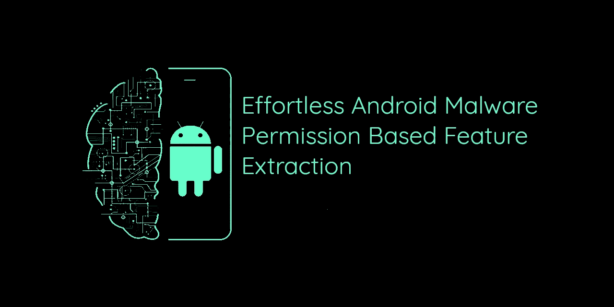

# 轻松提取基于 ML 的 Android 恶意软件检测项目的特征

> 原文：<https://medium.com/analytics-vidhya/effortless-feature-extraction-for-your-ml-based-android-malware-detection-project-b14f205ae488?source=collection_archive---------9----------------------->

## 使用一个 Python 脚本简化 android 数据集的基于权限的特征提取



# 背景

长期以来，恶意软件检测和分析一直是安全领域的热门话题，随着时间的推移，恶意软件作者提升了他们的技能和复杂性，这也是我们寻找新的有效的恶意软件检测和分类方法的主要原因。

随着人工智能和人工智能解决一般问题的蓬勃发展，恶意软件的分析和检测也没有被忽视。使用机器学习方法在恶意软件检测领域已经发表了许多研究。但在做所有模型训练和神经网络形成的小发明或大脑魔术中的任何电线之前，我们需要从目标收集某些信息来训练我们的机器，这就是我们所说的 ***特征*** ，这就是本文的全部内容，让您在该领域起步。

# 基线

下面的文章只关注特性生成和格式化，特别是 android 应用程序的基于权限的特性生成。

在这里，我们将只看到我们如何可以通过使用简单的脚本来加速这一过程，其中*做这一切*将在其他一些文章中分解它，我们将讨论一般的特征提取之后，我训练我们自己的 ML 模型来检测 Android 恶意软件！

# **剧本**

让我们进入有趣的部分，探索脚本本身。

[](https://github.com/Saket-Upadhyay/Android-Permission-Extraction-and-Dataset-Creation-with-Python) [## saket-Upadhyay/Android-权限提取-数据集创建-Python

### 该脚本将从恶意软件和良性应用程序各自的文件夹中提取权限信息，并…

github.com](https://github.com/Saket-Upadhyay/Android-Permission-Extraction-and-Dataset-Creation-with-Python) 

该脚本将从恶意软件和良性应用程序各自的文件夹中提取权限信息，然后创建一个逗号分隔值(。csv)文件将它们存储在一个地方，准备好输入到 ML 算法中。

**如何使用脚本？**

**只需将您想要在其上训练您的 ML 模型的恶意软件和良性应用程序复制到各自的文件夹中，并通过在终端中执行命令来运行脚本。**

```
python3 ExtractorAIO.py
```

仅此而已。是的。完成了。休息，脚本会处理

**如何使用生成的数据集？**

生成的数据将在*中。csv 格式，并且可以在许多已经可用的库或模块的帮助下进行解析。(建议使用 python 中的 pandas 模块)

# 格式化

示例权限状态数据集

*这是 6 个应用程序的样本数据集(3 个恶意软件& 3 个良性软件)*

第一列包含相应应用程序的**名称**，最后一列“**类别**包含该应用程序是来自训练集的良性还是恶意软件家族的信息。**【0 =良性，1 =恶意】。**在两者之间有所有权限(公共+在第一阶段中找到的所有)和各自的信息位，[0 =应用程序不使用此权限，1 =此权限在应用程序中使用]

# 在 sklearn 中导入数据示例

假设你想把你的新数据集导入到 sklearn，并从那里训练你的新模型，这里有一个方法可以做到这一点。

上面的代码将删除 **NAME** 列，然后将 **FEATURE_MATRIX** (从* **NAME** *之后的列到倒数第二列)和**LABEL _ VECTOR**(**CLASS***列)分别存储在 X 和 Y 中，稍后可以将它们拆分成所需的训练集和测试集。

# 结论

我希望这篇文章能让你开始使用机器学习进行恶意软件分析的特征提取。这不是结束，但我们只是完成了一步！


下一篇文章再见，在那之前，保持足够的咖啡因含量。