# 轻松自动化您的 Python 脚本！

> 原文：<https://medium.com/analytics-vidhya/effortlessly-automate-your-python-scripts-cd295697dff6?source=collection_archive---------1----------------------->

曾经希望您的 Python 脚本可以自动运行吗？

如今自动化的力量是不可否认的。没有人愿意做超出他们需要的事情，人们总是在生活的各个方面寻找捷径。当然，人们可能认为这只是懒惰，但我相信创造力的美妙之处在于找到一种更简单的做事方法。


在 [Unsplash](https://unsplash.com/?utm_source=unsplash&utm_medium=referral&utm_content=creditCopyText) 上由 [Franck V.](https://unsplash.com/@franckinjapan?utm_source=unsplash&utm_medium=referral&utm_content=creditCopyText) 拍摄的照片

我曾经不得不打开我的 Spyder IDE，每天运行我的每一个金融算法，但我知道一定有更简单的方法。我做了一些研究，阅读了无数的堆栈溢出文章，幸运的是，我发现确实有！

在我进入这个过程之前，我只想简单介绍一下这种自动化对于编码的重要性，特别是对于金融用途的 Python。市场瞬息万变，财务数据可能会在几周甚至几天内过时。

许多编码算法都是定期运行的，无论是日复一日、月复一月，甚至是年复一年，能够自动化这一过程是非常宝贵的。随着时间的推移，运行这些脚本所浪费的时间越来越多，可能会非常无聊/累人。

现在继续阅读，了解如何在 Windows 和 macOS 上执行这种自动化！

当开始这个过程时，第一步是**将这些 Python 脚本转换成应用程序**，你只需点击一个按钮就可以启动。第二，你必须**安排这些应用程序运行**，这样它们就可以在你毫不犹豫的情况下启动。

# Windows 操作系统

## 第 1 部分:*将 Python 脚本变成应用程序*

为了让 Windows 用户完成第 1 部分，您必须**创建一个批处理文件**，该文件将在目录中导航，选择首选脚本，并启动它。要实现这一点，您需要打开任何文本编辑器并编写以下几行:

```
REM This is a comment cd 'path_to_file'
file_name.py neonphotography ECHO Ran first batch PAUSE
```

用包含文件的目录(例如:coding/Finance)替换“path_to_file ”,用实际文件名替换 file_name.py。*注意* : *不要将文件路径放在引号中。*

该批处理文件将从。bat 文件将保存在。如果你把你的。bat 文件在 Documents 文件夹中，您将无法访问位于上一个文件夹的文件夹中的脚本，除非您计划在 bat 文件中使用它(通过使用 cd 命令)。

现在，您必须用。蝙蝠分机。这将创建一个可执行文件，当点击它时，将运行写在其中的任务。现在，您可以双击您的文件，观察控制台获取您的脚本并启动它。

## 第 2 部分:S **安排 Python 脚本应用程序运行**

现在我们有了。bat 文件，调度它们执行的最简单方法是使用 Windows 中已经安装的 Windows 任务调度器。

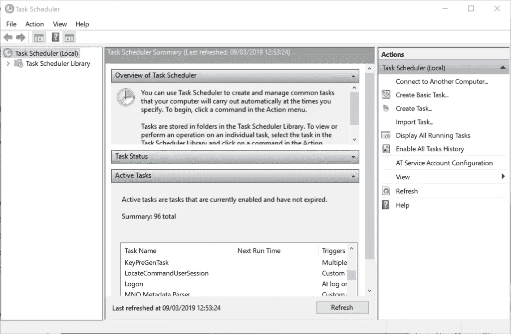

雅尼丝·伊鲁尔与[玛特切维特姆](https://martechwithme.com/schedule-python-scripts-windows-mac/)的合影！

为了不意外地将我们自己与我们的计算机正在执行的重要任务混淆，最好创建一个新文件夹来包含我们所有预定的 Python 脚本。

在窗口左侧的“任务计划程序库”文件夹下创建一个“新文件夹”。

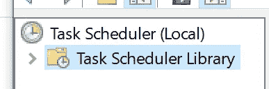

照片由雅尼丝·伊鲁尔和[玛特切维斯·梅](https://martechwithme.com/schedule-python-scripts-windows-mac/)提供！

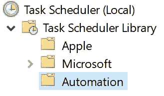

照片由 Yaniss Illoul 与 [martechwithme](https://martechwithme.com/schedule-python-scripts-windows-mac/) 提供！

我们可以创建在这个新文件夹中易于访问和更改的任务。要为新任务创建简单的时间表，请单击“创建 Baci 任务”,并按照给出的说明进行操作。然而，在本文的其余部分，我们将探索允许大量定制的高级方法。

点击“创建任务”后，给你的任务起一个简单易记的名字。您可以根据自己的喜好更改其余设置。

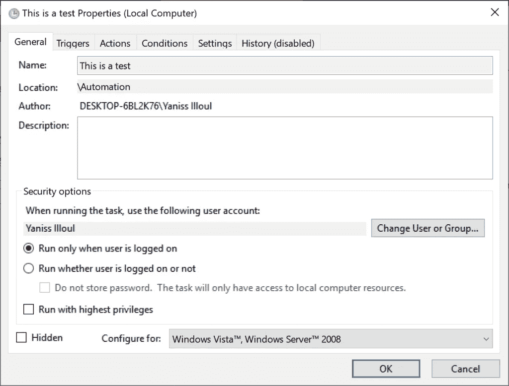

照片由 Yaniss Illoul 与 [martechwithme](https://martechwithme.com/schedule-python-scripts-windows-mac/) 提供！

在顶部的“触发器”选项卡中，将有一个选项来实际设置您希望 Python 脚本运行的时间表以及许多其他有用的参数。

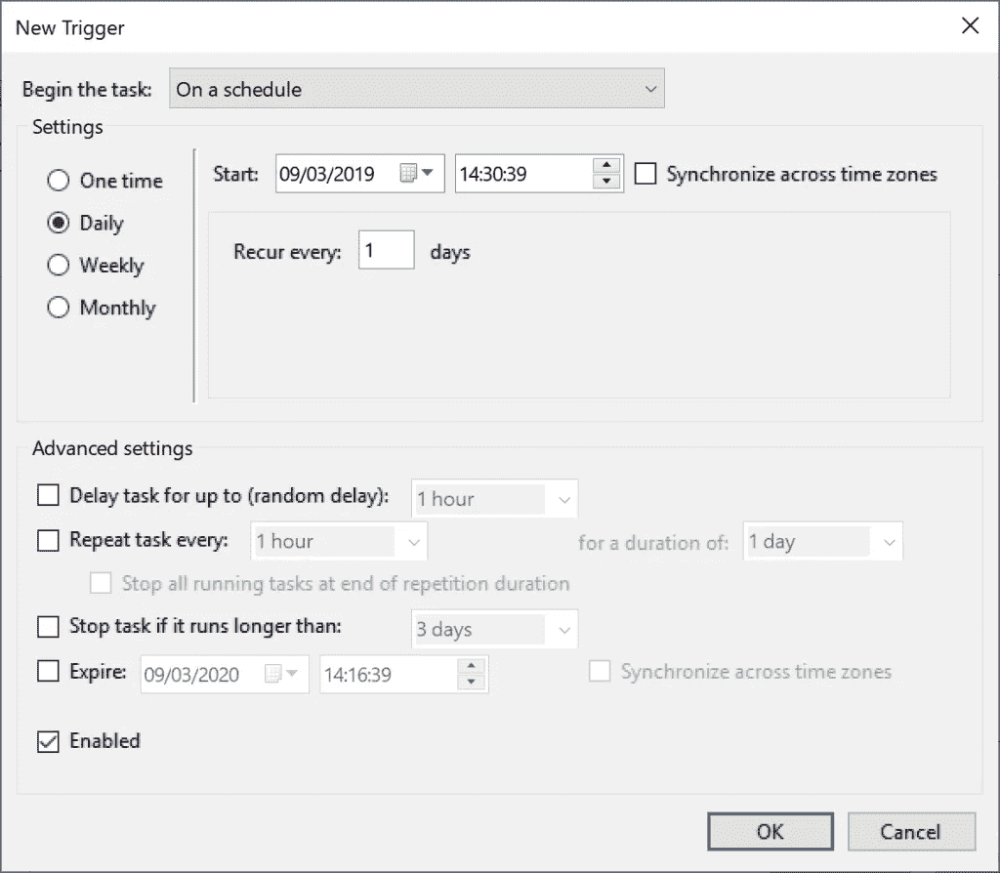

照片由 Yaniss Illoul 与 martechwithme 提供！

完成本部分后,“Actions”选项卡将包含将要运行的应用程序和任务实际执行的具体内容。您可以单击“新建”按钮，这将打开一个“新建操作”窗口。

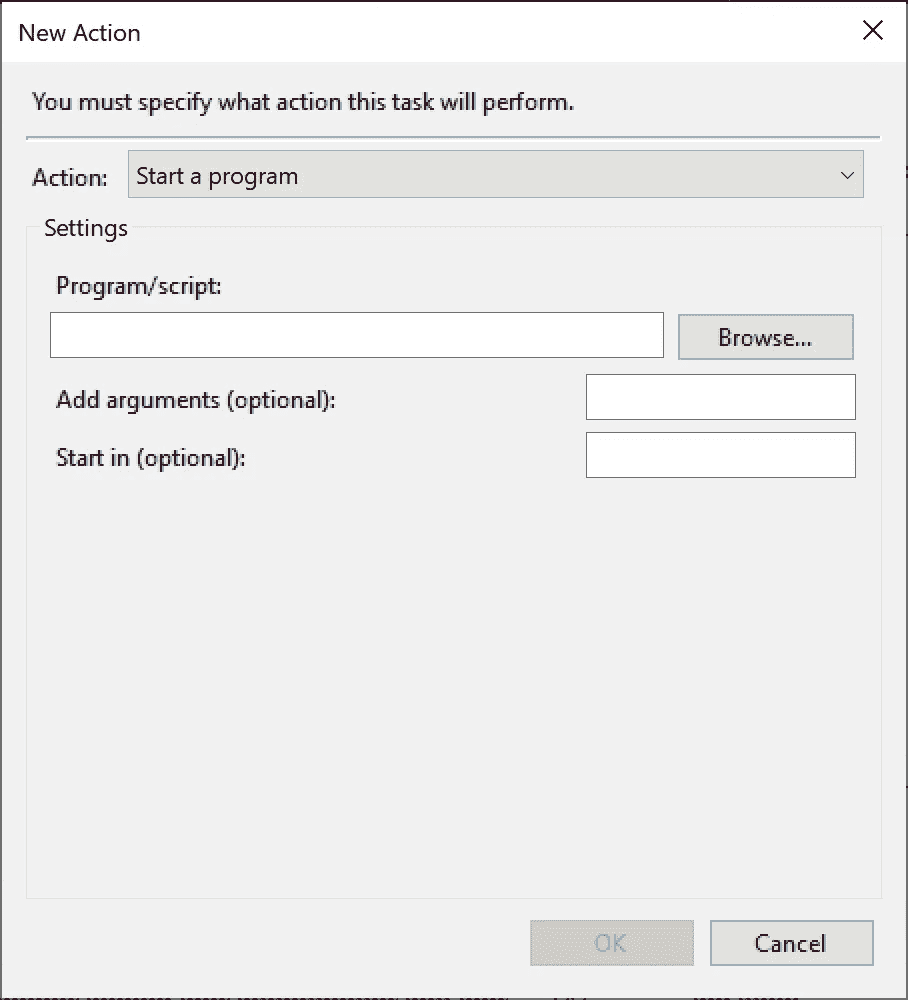

照片由 Yaniss Illoul 提供，照片由 [martechwithme](https://martechwithme.com/schedule-python-scripts-windows-mac/) 拍摄！

您现在可以选择。bat 文件，它在“Browse”选项下启动 Python 脚本。

您还必须在“开始于”部分填写批处理脚本位置的完整路径。此部分不是可选的，不会启动任务。一个例子是 C:\Users\Shashank\Desktop if my。bat 文件位于 C:\Users\Shashank\Desktop 下。

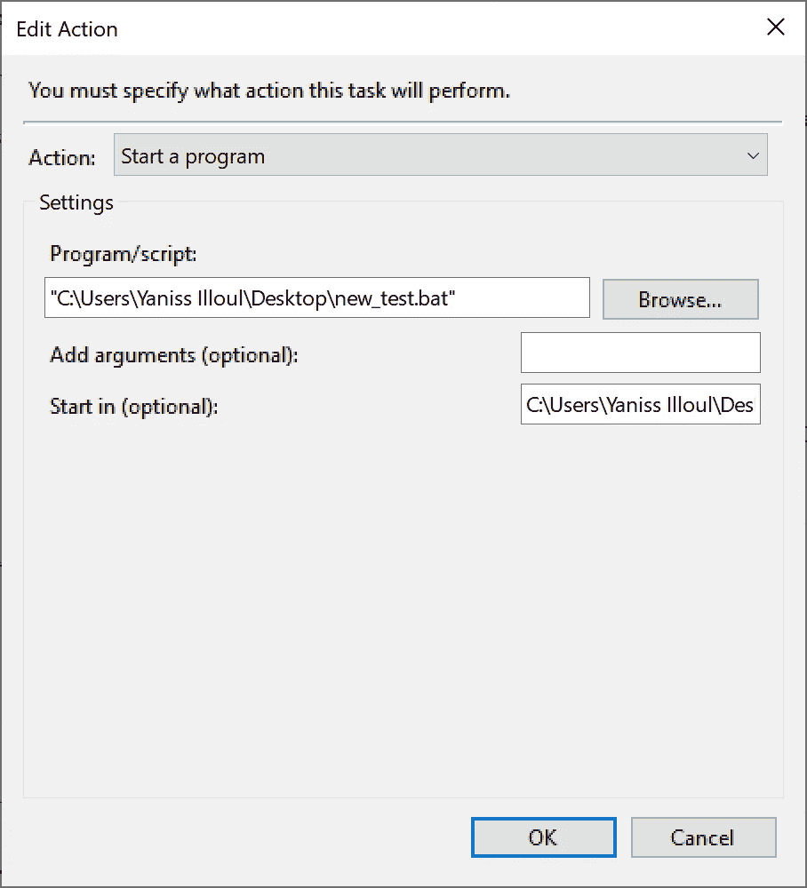

照片由 Yaniss Illoul 和 martechwithme 提供！

现在您可以保存该任务，它将出现在“自动化”文件夹的任务列表中。终于完成了！

# 马科斯

## 第 1 部分:将 Python 脚本转换成 Unix 可执行文件

为了让 macOS 用户完成第 1 部分，您必须首先创建一个可执行文件，该文件将自动打开指定的 Python 脚本。

要开始这个过程，打开任何文本编辑器并输入以下行:

```
#!/bin/sh
Python /Users/Shashank/Documents/Code/Finance/file_name.py neonphotography
```

当然，您必须将文件路径设置为您想要的文件路径，并在最后加上 python 文件。记得包括' #！/bin/sh '作为第一行，Python 在文件路径之前，neonphotography 在文件路径之后。不要用任何扩展名保存文件。

复制这个新文件的文件路径并启动终端。

键入“chmod 755”，然后将路径名粘贴到文件中，然后按 enter 键。请参考下图以获得进一步的说明。

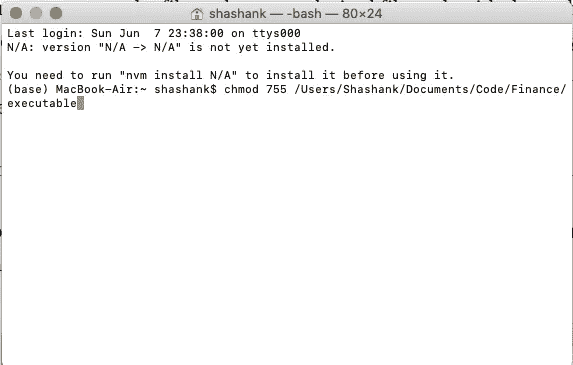

例子

该命令会将新文件转换为 Unix 可执行文件，只需双击即可启动脚本。

现在，为了调度 Unix 可执行文件，您必须首先将其转换为应用程序。幸运的是，你可以在 macOS 上启动已经安装好的 Automator 应用程序，然后按照下面的指南来操作。

Automator 打开后，选择创建一个“应用程序”。

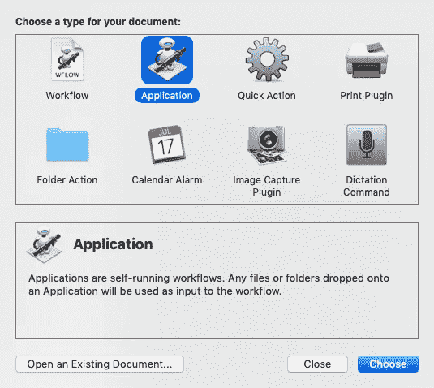

在 Automator 应用程序上选取“应用程序”

您可以将许多操作拖放到屏幕右侧。出于本教程的目的，您将使用两个操作:“获取指定的 Finder 项目”和“打开 Finder 项目”

选择页面左侧的“获取指定的 Finder 项目”操作。一旦它被添加到 Automator 的右侧面板，就会有一个选项将项目“添加”到此操作。按下此按钮，浏览您的文件，并选择您以前创建的 Unix 可执行文件。

然后，选择“打开 Finder 项目”并将其拖到“获取指定的 Finder 项目”下方，如下图所示。这将实际打开上面操作中指定的文件。

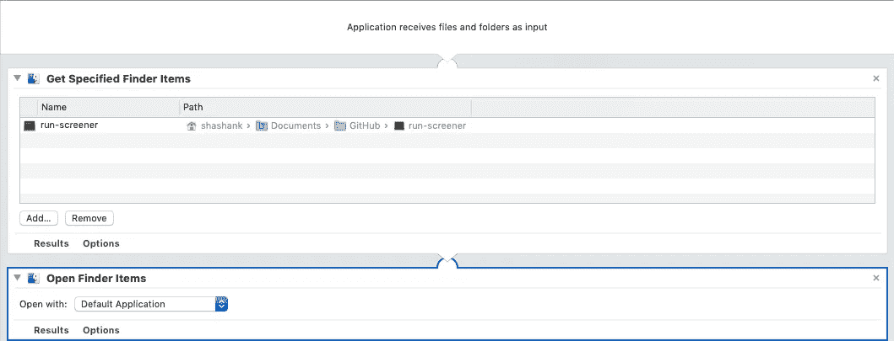

例子

最后，用一个容易记住的名字将文件保存为应用程序！

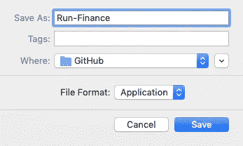

以“文件格式”另存为应用程序

## 第 2 部分:计划 Python 脚本应用程序的运行

现在，为了实际安排 Python 脚本的运行，您必须打开您的 Apple Calendar 应用程序(不是 Google 或任何其他类型的日历应用程序)。选择您的 iCloud 日历帐户，然后创建一个新事件。

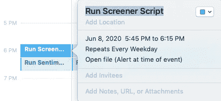

日历事件

在警报部分，如下面最后一个选项所示，选择“自定义”选项，然后选择选项下的“打开文件”。

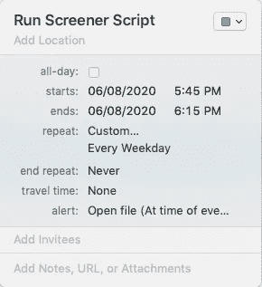

选择合适的。一旦事件开始，您希望启动的应用程序文件，并将“提醒”设置为“在事件发生时”启动

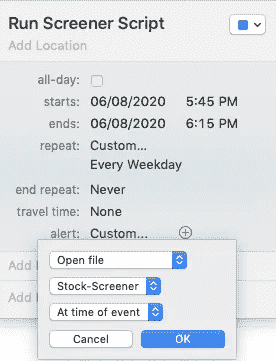

为了更改脚本运行的频率，您可以根据自己的喜好更改事件的“重复”设置。

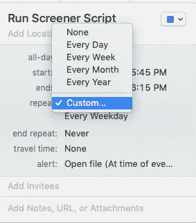

就是这样！这个过程将允许你运行你的脚本，只要你愿意。不幸的是，日历事件实际运行时必须打开机器，但如果您的计算机在事件发生时关闭，事件将在您再次打开它时开始。

非常感谢您的宝贵时间！我希望这篇文章能对你的编码之旅有所帮助，也希望它能为你节省大量的时间。

## 参考

[1]:“将 Python 脚本转换为 Mac 和 Windows 的可执行应用”。martechwithme.com，2020，[https://martechwithme . com/convert-python-script-app-windows-MAC/。](https://martechwithme.com/convert-python-script-app-windows-mac/.)

[2]:“如何在 Mac 和 Windows 上调度你的 Python 脚本”。martechwithme.com，2020，[https://martechwithme . com/schedule-python-scripts-windows-MAC/。](https://martechwithme.com/schedule-python-scripts-windows-mac/.)

如果你喜欢这篇文章，看看我下面的其他文章吧！

[](https://towardsdatascience.com/parse-thousands-of-stock-recommendations-in-minutes-with-python-6e3e562f156d) [## 使用 Python 在几分钟内解析数千份股票推荐！

### 了解如何在不到 3 分钟的时间内解析顶级分析师的数千条建议！

towardsdatascience.com](https://towardsdatascience.com/parse-thousands-of-stock-recommendations-in-minutes-with-python-6e3e562f156d) [](https://towardsdatascience.com/making-a-stock-screener-with-python-4f591b198261) [## 用 Python 制作股票筛选程序！

### 学习如何用 Python 制作一个基于 Mark Minervini 的趋势模板的强大的股票筛选工具。

towardsdatascience.com](https://towardsdatascience.com/making-a-stock-screener-with-python-4f591b198261) [](https://towardsdatascience.com/creating-a-finance-web-app-in-3-minutes-8273d56a39f8) [## 在 3 分钟内创建一个财务 Web 应用程序！

### 了解如何使用 Python 中的 Streamlit 创建技术分析应用程序！

towardsdatascience.com](https://towardsdatascience.com/creating-a-finance-web-app-in-3-minutes-8273d56a39f8)