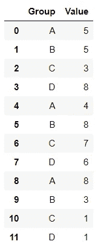

# Eh-F 测试:使用*args 更容易运行 ANOVA

> 原文：<https://medium.com/analytics-vidhya/eh-f-tests-run-anova-easier-with-args-e4a55f3be21d?source=collection_archive---------10----------------------->


如果您必须运行 ANOVA 测试来比较多个组的平均值，您可能会想知道是否有一种方法可以做到这一点，而无需手动输入每个组的数据。我将通过一个简单的例子向您展示这样做的方法。

让我们凭空创建一个数据框架:

```
import pandas as pd
import numpy as npdata = pd.DataFrame(data=[['A', 'B', 'C', 'D']*3]).T
data.columns=['Group']
data['Value'] = np.random.randint(1,10,size=len(data))
```



如你所见，我们有 4 组。如果您在*值*列中有不同的数字，请不要担心。稍后重要的是，你从我比较的两种方法中得到相同的测试结果。我们想测试每个*组*的*值*的平均值是否相同，或者是否至少有一个组的平均值在统计上有显著差异。很自然，我们会进行 f 检验，并可能会编写 Python 代码，如下所示:

```
import scipy.stats as stats
stats.f_oneway(
                data.loc[data['Group']=="A", 'Value']
                , data.loc[data['Group']=="B", 'Value']
                , data.loc[data['Group']=="C", 'Value']
                , data.loc[data['Group']=="D", 'Value']              
            )
F_onewayResult(statistic=0.27946127946127947, pvalue=0.8388488338536153)
```

现在，这段代码看起来并没有那么难写。但是想象一下，如果你的数据中有更多的组(我曾经为 NBA 的所有 30 支球队做过 f 检验)。你必须为每组写一行(就像我上面对 4 组所做的那样)。如果有一种方法可以写出更容易适应更多群体的测试，那会怎么样？

**回答**:可以使用*args，让生活更轻松。你可能在函数描述中看到过*args 或者**kwargs。两者的目的相同:传入可变数量的 **arg** 文件或**k**ey**w**ord**arg**文件。让我们通过简单的例子快速地看看它们的用法。我不会在我们的 F-test 应用程序中使用**kwargs，但是，由于它们都提供相似的功能，我想为什么不包含一个例子呢。

让我们创建一个函数，在这个函数中，我们用*args 制作一道菜:

```
def make_a_dish(dish_name, ingredient_1, *ingredients):  
    print(f"I will make {dish_name}")
    print(f"Start with {ingredient_1}")
    for ingredient in ingredients:
        print(f"Add {ingredient}")make_a_dish("ice cream", "ice", "cream", "sprinkles", "whipped cream", "cherry")I will make ice cream
Start with ice
Add cream
Add sprinkles
Add whipped cream
Add cherry
```

该函数将 *dish_name* 和 *ingredient_1* 作为必需参数，以及您想要使用的任何附加可选配料(**配料*，您甚至可以输入 0 个附加配料)。这些额外的成分被解释为一个元组，通过它我们可以遍历每个元素。然后，您可以再次使用该功能来制作不同的菜肴，并指定不同数量的配料。使用*args 的好处在于，您不必重新创建函数来处理不同数量的参数，因此您可以不使用原始函数。

让我们快速查看一下**kwargs 在一个函数中的使用情况，我可以用它来创建一个约会档案:

```
def introduce_yourself(name, **facts):  
    print(f"My name is {name}")
    for key, value in facts.items(): 
        print(f"My {key} is {value}")introduce_yourself(name="Aneesh", sign="Aquarius", age=27, height="6 ft")My name is Aneesh
My sign is Aquarius
My age is 27
My height is 6 ft
```

如我所说，**kwargs 的行为类似于*args，除了您指定变量和它们相应的值。我输入一个 *name* 参数，后跟我想要的任意数量的变量值对。这些对将被解释为字典的键值对，因此我使用*遍历它们。物品()*。我可以指定尽可能多或尽可能少(甚至 0)的变量值对。

现在，回到我们的 f 检验。我们可以使用*args 的概念在一行中按需创建我们的值组。见下文:

```
import scipy.stats as stats
stats.f_oneway(
 *(data.loc[data[‘Group’]==group, ‘Value’] 
 for group in data[‘Group’].unique())
 )F_onewayResult(statistic=0.27946127946127947, pvalue=0.8388488338536153)
```

可以这么想: *stats.f_oneway(*args)* 等价于 *stats.f_oneway(arg1，arg2，…，argN)* 。在这种情况下，每个参数都是对应于每个组的数据的子集。

*Stats.f_oneway()* 和其他任何函数一样；它需要一定数量的参数，其中每个参数是对应于每个组的数据的子集。F-test 函数中的代码返回一个元组(类似于上面的 arg 示例)，其中元组中的每个元素都是每个组的一组*值*值。因此，不管你有 4 个、30 个还是 100 个组，代码都可以处理任意数量的组，并将每个组作为一个“参数”传递给 F-test 函数。