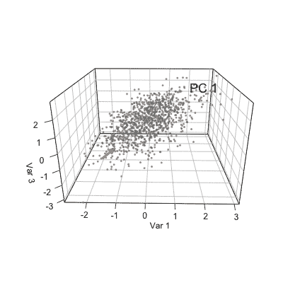

# 特征向量和特征值及其在主成分分析-机器学习中的应用

> 原文：<https://medium.com/analytics-vidhya/eigenvectors-and-eigenvalues-and-there-use-in-principal-component-analysis-machine-learning-1f97fdbdb303?source=collection_archive---------7----------------------->

特征向量和特征值在计算机科学的不同分支中有许多重要的应用。众所周知的例子是建模软件中使用的 2D 和 3D 对象的几何变换或用于人脸识别的特征脸，计算机视觉中用于降维的 PCA(主成分分析)和…