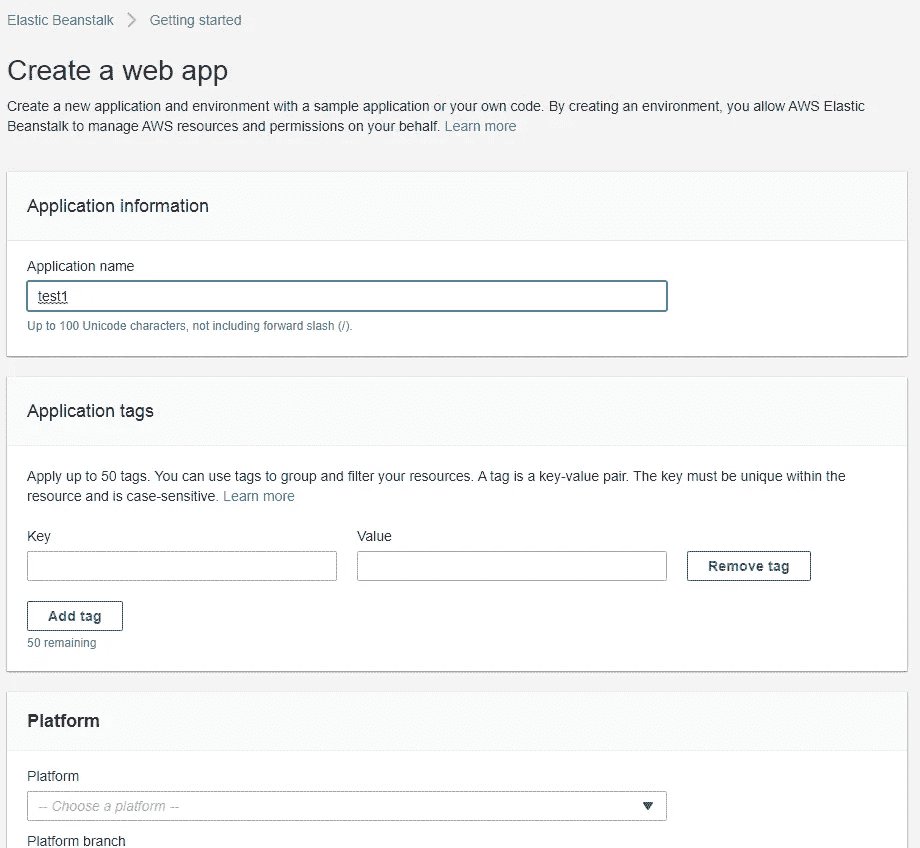

# 弹性豆茎概述

> 原文：<https://medium.com/analytics-vidhya/elastic-beanstalk-overview-5511d4232b4a?source=collection_archive---------21----------------------->

云形成和弹性豆茎有什么区别

由 [Unsplash](https://unsplash.com?utm_source=medium&utm_medium=referral) 上的 [chuttersnap](https://unsplash.com/@chuttersnap?utm_source=medium&utm_medium=referral) 拍摄

# 免责声明:

这是关于亚马逊网络服务(AWS)系列的第二篇文章，我将写这篇文章作为对[认证开发者考试助理](https://aws.amazon.com/certification/certified-developer-associate/)的准备。

## 什么是弹性豆茎？

Elastic Beanstalk 是一个将应用程序自动部署到 AWS 云的工具。

## CloudFormation 和 Beanstalk 有什么区别？

云形成用于创建和更新资源和基础设施。

弹性豆茎用于部署，监控和扩展您的应用程序。

## 它看起来怎么样？

核心要素是**应用**。

你需要选择你的应用程序的类型，期望的平台，它会做所有的工作。

## 特点:

版本化**—每个新部署都有自己的版本，因此如果出现问题，您可以回滚应用程序。**

****环境** —您可以创建一些环境，比如开发或生产环境，并使用不同的设置部署不同版本的代码。**

****缩放** —您可以创建和更改应用程序的可缩放功能。**

****监控** —对您的应用程序进行健康检查。**

## **简短演示:**

**点击**“创建应用程序”****

****

****重要提示** —选择应用名称和平台。**

****

**如你所见，相当不错的选择。**

**让我们试着创造。Net 在 Windows 上的应用。我们可以选择，基本上，无论我们想要的应用程序，创造的过程不会有很大的不同。**

**我们还能配置什么？**

****

**很好的选择！更改选项，点击**“创建 app”****

****

**在这个黑色窗口中，您可以看到日志消息**

**过一会儿你的申请就准备好了。点击**“应用程序”**按钮。**

****

**通过点击应用程序名称，您将打开应用程序面板。**

****

**这里是关于你申请的所有主要信息。**

**点击**网址**，您将打开您的申请网站:**

****

**恭喜你！**

**您使用 Elastic Beanstalk 创建您的新应用程序！**

**干得好！**

## **结论:**

**Elastic Beanstalk 是部署应用程序的强大工具，具有所有必需的特性。它在引擎盖下有 CloudFormation，可以从 Web 控制台、Amazon CLI 或使用框架的代码进行管理。**