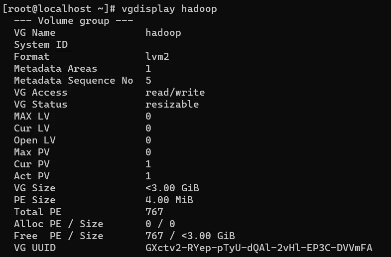

# 创建弹性 Hadoop 集群

> 原文：<https://medium.com/analytics-vidhya/elastic-hadoop-cluster-fc08997048cc?source=collection_archive---------16----------------------->

许多跨国公司使用 Hadoop 来解决大数据的容量问题，这需要弹性存储，但 Hadoop 集群本身并不具有弹性。因此，Linux 操作系统的逻辑卷管理被用来使 Hadoop 集群具有弹性。在这里，我将简单演示如何构建一个弹性 Hadoop 集群。弹性的优势在于，您可以动态地增加/减少存储，而不会影响集群中已经存在的文件和数据。

> 克隆这个 GitHub [存储库](https://github.com/sukesh2000/AWSHadoopSetup-CLI_Tool)以在几秒钟内设置 Hadoop 集群。要了解更多关于如何在 Hadoop 集群中共享有限的存储空间，你可以参考这篇[文章](https://sukeshseth.medium.com/share-a-limited-amount-of-storage-in-hadoop-cluster-cea41c2af922)。

在继续之前，将一个 3GB 的新卷连接到为 datanode 配置的系统中，并创建一个包含一个 namenode 和一个 datanode 的 Hadoop 集群。

# 设置弹性 Hadoop 集群

1.  检查卷是否已连接。

> fdisk -l

2.从连接的卷创建新的物理卷。

> pvcreate<device1_name></device1_name>

3.为物理卷创建新的卷组。

> vgcreate<volume_group_name></volume_group_name>

显示创建的卷。

> vgdisplay<volume_group_name></volume_group_name>

4.创建所需大小的新逻辑卷。这样做的好处是，我们可以根据需要扩展/减少逻辑卷的大小。

> lvcreate - size <size_in_gb>- name<logical_volume_name><volume_group_name></volume_group_name></logical_volume_name></size_in_gb>

检查新创建的逻辑卷。

> lvdisplay <volume_group_name>/<logical_volume_name></logical_volume_name></volume_group_name>

5.格式化新创建的逻辑卷，并将其装载到 datanode 在 Hadoop 集群中共享的目录中。

> 使用 ext4 文件系统格式化:mkfs.ext4 <logical_volume>挂载到 datanode 目录:Mount<logical _ volume><data _ node _ directory>
> 检查挂载的卷:df -hT</logical_volume>

6.启动 namenode & datanode 并检查它当前在 Hadoop 集群中共享了多少存储。

> Start datanode:Hadoop-daemon . sh Start NameNode
> Start NameNode:Hadoop-daemon . sh Start datanode
> 检查配置的容量:hadoop dfsadmin -report

**弹性 Hadoop 集群已经安装完毕！！**

# 动态扩展 Hadoop 集群的配置容量

1.  将一个新卷附加到为 datanode 配置的系统上，并从中创建一个新的物理卷。

> pvcreate<device_name></device_name>

2.使用这个新的物理卷扩展以前创建的卷组的大小。

vgextend<volume_group_name></volume_group_name>

检查卷组的大小。

> vgdisplay<volume_group_name></volume_group_name>

3.扩展先前创建的逻辑卷。

lvextend - size <size><volume_group_name>/<logical_volume_name></logical_volume_name></volume_group_name></size>

4.现在，我们已经向先前创建的逻辑卷添加了一个新的未格式化的逻辑卷，因此要使用这个扩展卷，我们需要在不影响现有逻辑卷的情况下对其进行格式化。为此，Linux 提供了动态调整卷大小的特性。

> resize2fs

5.再次检查 Hadoop 集群的配置容量。

**最后，Hadoop 集群的配置容量增加了，而无需终止 namenode 和 datanode！！**