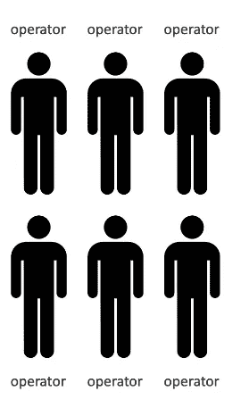

# 弹性负载平衡和自动扩展组部分

> 原文：<https://medium.com/analytics-vidhya/elastic-load-balancing-auto-scaling-groups-section-73edae491431?source=collection_archive---------13----------------------->

## 这就是我们看到 AWS 云的强大之处。

## a)可扩展性和高可用性

*   可伸缩性意味着应用程序/系统可以通过适应来处理更大的负载。
    —>如果应用程序可以扩展，这意味着它可以通过适应来处理更大的负载。
*   有两种可伸缩性:
    ·垂直可伸缩性
    ·水平可伸缩性(也称为弹性)

**垂直可扩展性**

*   让我们以呼叫中心为例来理解它:
    所以想象一下，我们有一个呼叫中心，我们只是接收呼叫，在 AWS 中，当你是垂直可扩展的，这意味着你可以增加实例的大小。因此，对于我们的呼叫中心，假设我们有一个初级接线员，并且我们能够升级该接线员，我们将得到一个高级接线员。例如，高级接线员比初级接线员能处理更多的电话，因为他更有经验。这就是呼叫中心的垂直可扩展性。如果我们能明显地将初级操作员升级为高级操作员。

*   在 AWS 中，假设您的应用程序运行在 t2.micro 上，为了实现该应用程序的垂直可伸缩性，这意味着现在我们在 t2.large 上运行我们的应用程序。因此，我们更改了 EC2 实例的大小。在非分布式系统中，垂直可伸缩性非常普遍。例如数据库，如果您想提高数据库的性能，只需增加数据库的大小。但是，通常对于垂直可扩展性，您可以垂直扩展的范围是有限的，这是硬件的限制。即使在今天，这些限制也可能非常非常高。

## 积分:

*   垂直可伸缩性意味着增加实例的大小。
*   例如，您的应用程序运行在 t2.micro 上
*   纵向扩展应用程序意味着在 t2.large 上运行它
*   垂直可伸缩性对于非分布式系统(如数据库)来说非常常见。
*   您可以垂直扩展的范围通常是有限制的(硬件限制)

**水平可扩展性**

现在，在水平可伸缩性中，不是增加 EC2 实例的大小，而是增加应用程序的实例或系统的数量。回到我们的例子，呼叫中心有运营商，我们希望为该运营商提供横向可扩展性，这意味着我们将添加另一个运营商。如果我们需要更多的操作符，我们将添加另一个操作符，等等。因此，我们可以从一个操作员水平扩展到六个操作员。

因此，当您进行水平扩展时，正如您在右侧看到的，这意味着您需要一个分布式系统。对于呼叫中心来说，这是有意义的。你不需要这些人不停地说话。对于呼叫中心来说，每个接线员都可以自己接听电话。在 AWS 或 web 应用程序中，这将非常普遍，因此如果您有一个 web 应用程序或现代应用程序，通常会在设计时考虑水平可伸缩性。多亏了 Amazon EC2 和 auto scaling 组，AWS 上的扩展非常容易。

**分:**

*   水平可伸缩性意味着增加应用程序的实例/系统数量。
*   水平扩展意味着分布式系统。
*   这对于 web 应用程序/现代应用程序来说非常常见。
*   得益于 Amazon EC2 等云产品，横向扩展变得非常容易

## 高可用性

它与水平扩展密切相关。高可用性意味着您在 AWS 上的至少两个可用性区域中运行您的应用程序和系统。但是对于我们呼叫中心来说，这意味着什么呢？这意味着我们在纽约有一个呼叫中心，也许在旧金山还有第二个呼叫中心。不知何故，如果其中一个呼叫中心关闭，例如，纽约停电，那么我们仍然可以在旧金山接听电话。所以我们是高度可用的。显然，旧金山会更加繁忙，但我们至少在一栋大楼停电的灾难中幸存了下来。显然，在 AWS 中，您使用两个可用性区域。它的目标通常是在数据中心损失或灾难中幸存下来。在 AWS 中，可能是地震，可能是停电，这可能会导致很多事情。

积分:

*   高可用性通常与水平扩展密切相关。
*   高可用性意味着在至少两个可用性区域中运行您的应用程序/系统。
*   高可用性的目标是在数据中心丢失(灾难)时幸存下来。

**EC2**高可用性&可扩展性总结

*   纵向扩展:增加实例大小(=向上/向下扩展)
    从:T2 . nano-0.5G RAM，I vCPU
    到:u-i2tbi . metal-12.3 TB RAM，448 vCPUs
*   水平扩展:增加实例数量(=横向扩展/纵向扩展)
    自动扩展组
    负载平衡器
*   高可用性:跨多个 AZ 运行同一应用程序的实例
    自动扩展组多个 AZ
    负载平衡器多个 AZ

## 这些是可扩展性还是弹性(还是敏捷性)

*   **可伸缩性:**通过增强硬件(纵向扩展)或增加节点(横向扩展)来适应更大负载的能力
*   **弹性:**一旦一个系统是可伸缩的，弹性意味着将会有一些“自动伸缩”，以便系统可以根据负载进行伸缩。这是“云友好的”:按使用付费，匹配需求，优化成本。

> (在 AWS 中，弹性是关键概念)

*   **敏捷性:**(与可扩展性无关——干扰因素)只需点击一下鼠标，即可获得新的 IT 资源，这意味着您可以将向开发人员提供这些资源的时间从数周缩短到几分钟。以便组织变得更加敏捷。

## b)弹性负载均衡[https://medium . com/@ chetanyapatil/Elastic-Load-Balancing-fb6a 9 f 851 c 53](/@chetanyapatil/elastic-load-balancing-fb6a9f851c53)