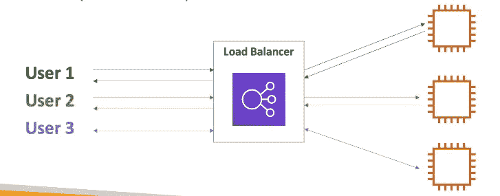
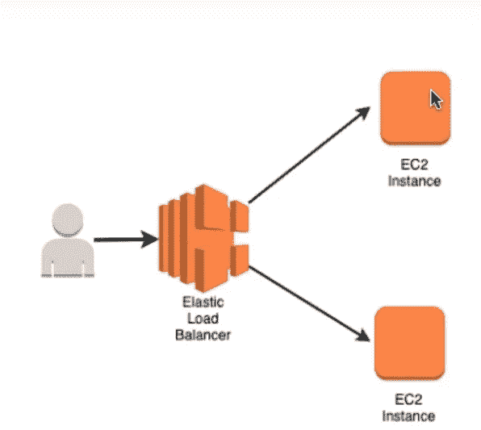

# 弹性负载平衡

> 原文：<https://medium.com/analytics-vidhya/elastic-load-balancing-fb6a9f851c53?source=collection_archive---------15----------------------->

**什么是负载均衡？**
负载平衡器是将互联网流量转发到下游多个服务器(EC2 实例)的服务器。

**为什么要使用负载均衡器？**

*   将负载分散到多个下游实例。
*   向您的应用程序公开单点访问(DNS)。
*   无缝处理下游实例的故障。
*   对实例进行定期运行状况检查。
    →如果其中一个实例出现故障，那么负载均衡器不会将流量导向该实例，因此我们可以使用负载均衡器隐藏 EC2 实例的故障。
*   为您的网站提供 SSL 终端(HTTPS)。
*   跨区域的高可用性。

**为什么要使用弹性负载均衡器？**

在单个区域的一个或多个 az 中的 EC2 实例之间分配流量。
托管服务— AWS 确保其高度可用
自动扩展以处理巨大负载
负载平衡器可以是公共的或私有的
运行状况检查—将流量路由到运行状况良好的实例

*   ELB(弹性负载平衡器)是一种受管理的负载平衡器。
    →ELB 是一款托管负载平衡器。因此，您不需要配置服务器。AWS 会帮你做的。AWS 将保证它们能够正常工作。AWS 将负责该弹性负载平衡器的所有升级、维护和高可用性。我们唯一要做的就是为负载平衡器的行为配置一些东西。
    AWS 保证它将正常工作
    AWS 负责升级、维护和高可用性
    AWS 仅提供几个配置旋钮
*   建立自己的负载均衡器花费较少，但在您这一端(维护、集成)会花费更多的精力
*   AWS 提供 3 种负载均衡器:
    ·应用负载均衡器(仅限 HTTP/HTTPS)——第 7 层
    ·网络负载均衡器(超高性能，支持 TCP)——第 4 层
    ————>用于每秒有数百万个请求的游戏目的。
    ·经典负载平衡器(慢慢退役)—第 4 层&7
    →经典负载平衡器是 AWS 老一代产品的一部分。它正在慢慢退休。它同时提供第四层和第七层。有一天 AWS 决定将传统的负载均衡器分成两种新的负载均衡器。应用程序平衡器和网络平衡器，一个用于第七层，另一个用于第四层。