# 弹性搜索—基础知识

> 原文：<https://medium.com/analytics-vidhya/elasticsearch-d8fdbc830e51?source=collection_archive---------37----------------------->

大家好，我希望你们都做得很好，在这篇文章中，我们将和我以及我的同事 [Youssef Amzil](https://medium.com/u/e8fd96c21209?source=post_page-----d8fdbc830e51--------------------------------) 谈谈 Elasticsearch 的基础知识，什么是 Elasticsearch，以及如何使用它，享受它。


## **什么是弹性搜索**？

Elasticsearch 是一个实时分布式开源搜索和分析引擎，它是用 java 开发的，被世界上许多大公司使用，如 stack-overflow、Slack、GitHub 等等。

现在我们知道了什么是 Elasticsearch，让我们看看 Elasticsearch 的主要特点和优势。

## 弹性搜索功能

*   Elasticsearch 是一个开源软件，在 Apache 2.0 许可下发布。
*   Elasticsearch 可扩展至数 Pb 的结构化和非结构化数据。
*   Elasticsearch 可以作为类似 MongoDB 和 RavenDB 的文档库的替代。
*   Elasticsearch 使用反规范化来提高搜索性能。

## 弹性搜索优势

*   Elasticsearch 是用 Java 编写的，这使得它可以跨平台(即兼容所有平台)
*   Elasticsearch 是实时的，换句话说，一秒钟后添加的文档就可以在这个引擎中搜索到了
*   Elasticsearch 是分布式的，这使得它很容易在任何大型组织中扩展和集成。
*   Elasticsearch 使用 JSON 对象作为响应，这使得用大量不同的编程语言调用 Elasticsearch 服务器成为可能。

在我们深入研究 Elasticsearch 的用法之前，我们需要了解一些关键概念。

## 术语

***集群*** 是一个节点的集合，一个集群默认的名称是 Elasticsearch，当搜索的时候我们在集群中搜索。

***节点*** 节点是运行在服务器上的 Elasticsearch 的一个实例，它响应发送到集群的请求，它依赖于物理硬件的能力(RAM、CPU、存储……)。我们认为节点是存储数据的单元。

***索引*** 文档集合，无论是否符合*类型，一个簇中的索引数量不受限制，搜索时使用索引名称。*

****类型*** 是文档的一种表示，它类似于 OOP 中的类概念，每种类型都有一个映射。*

****映射*** :描述类型的字段及其类型{字符串日期或整数等。}映射既可以明确指定，也可以在文档被索引时自动生成，这就是我们所说的“动态映射”。*

****Documents*** 是存储在 JSON 对象中的索引信息的基本单位，它包含的字段是键值对，值可以是各种类型之一:字符串、日期、对象……文档就像 OOP 范例中的对象。*

*此外，我们还可以谈论两个概念 ***分片*** 或 ***分片*** 和 ***副本*** 。*

****Shard*** 是一个索引片段，它可以比索引本身大得多，因为它独立于索引，所以可以存储在另一个节点上，我们可以在创建索引时指定碎片数。碎片允许跨碎片分布操作，这有助于提高性能。*

****副本*** :是一个分片的副本，以增加其可用性，以防包含该分片的节点出现故障，然后我们使用存储在不同节点的副本。默认情况下，每个碎片都有一个副本。*

*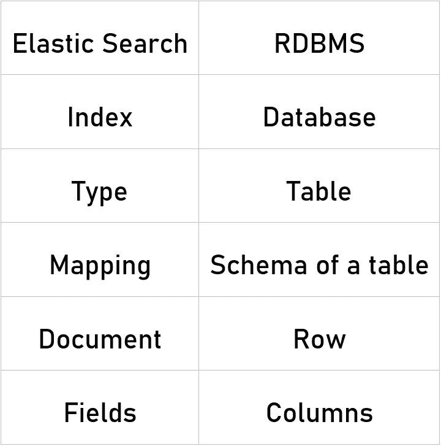*

*现在让我们使用这个 [**链接**](https://www.elastic.co/downloads/elasticsearch) **下载并安装 Elasticsearch。***

*下载文件后，您可以使用下面的命令运行它，但是首先检查您是否设置了 JAVA_HOME 变量。*

*在 Linux 上*

```
*$ cd elasticsearch-2.1.0/bin$ elasticsearch*
```

*在 Windows 上*

```
*> cd elasticsearch-7.6.2\bin> .\elasticsearch.bat*
```

*或者只需执行 bin 文件夹中的 elasticsearch.bat 文件。*

*运行实例后，Elasticsearch web 界面的默认端口是 9200，或者您可以通过更改存储在 bin 目录下的 elasticsearch.yml 文件中的 HTTP.port 属性来更改它。然后转到 [http://localhost:9200](http://localhost:9200) 来检查实例是否正确运行，您应该会得到如下消息:*

*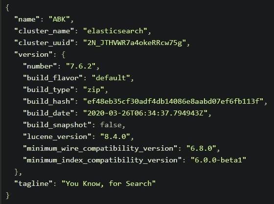*

*[http://localhost:9200/](http://localhost:9200/)*

*让我们创建我们的第一个索引，在此之前，我们需要一个 API 客户端，如 postman 或失眠症患者，向 Elasticsearch 服务器发出请求，或者我们可以使用 curl 命令。*

*要获得关于我们刚刚创建的集群的更多详细信息，我们可以使用以下请求:*

```
***GET** localhost:9200/_cat/health?v*
```

*这将在不同的信息中显示集群的当前状态，如节点和碎片的数量等。*

*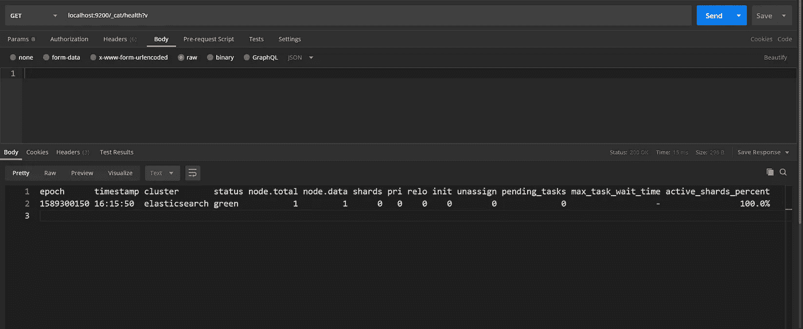*

*关于我们星团的细节。*

*让我们使用 PUT HTTP request 创建一个名为 students 的索引。*

*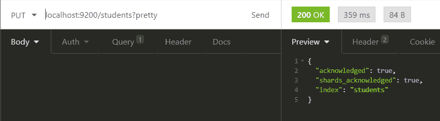*

*创建“学生”索引。*

*太棒了。！我们的索引“学生”已成功创建。现在，让我们向“学生”索引添加一些文档。*

```
***POST** : localhost:9200/{index_name}/_doc/{document_id}*
```

*正如您在请求-响应中看到的，我们拥有关于文档的所有信息。*

```
*localhost:9200/students/_doc/1
{
 "name":"Youssef",
 "street":"street 1",
 "city":"Agadir",
 "age":22
}*
```

*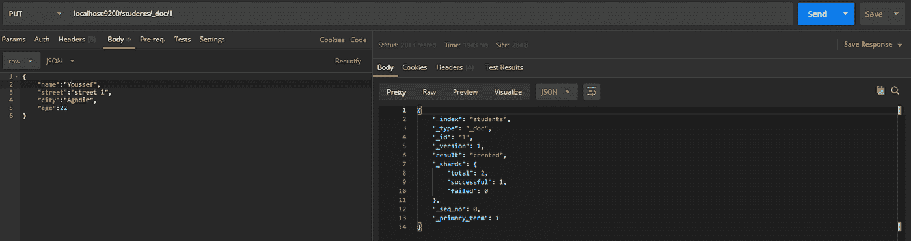*

*将第一个学生添加到索引中。*

*我们实际上可以在不指定 id 的情况下添加文档，id 会自动生成。*

```
***POST :** localhost:9200/students/_doc
{
 "name":"Ayoub Babakhouya",
 "street":"street 36",
 "city":"Berrechid",
 "age":21
}*
```

*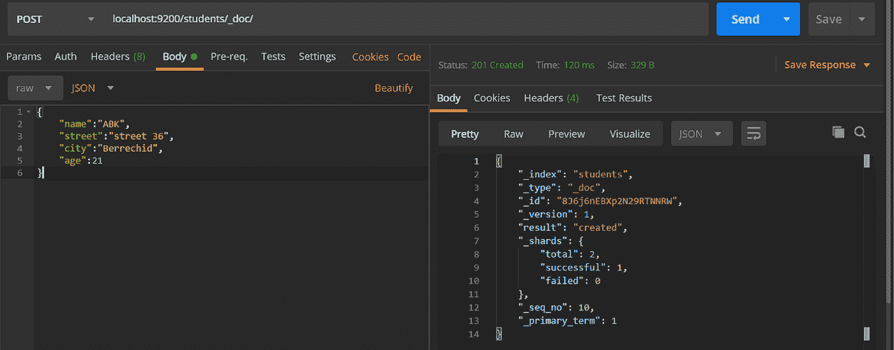*

*为“学生”索引创建另一个文档。*

> *我们可以使用 PUT HTTP 请求，但唯一的区别是，如果文档已经存在于索引中，引擎将更新它的值，如果它不存在，它将创建它。*

*Elasticsearch 还提供版本控制功能。我们可以使用版本查询参数来指定特定文档的版本。*

```
***POST** :localhost:9200/students/_doc/2?version=3&version_type=external
{
 "name":"Ayoub Babakhouya",
 "street":"street 36",
 "city":"Berrechid",
 "age":21
}*
```

*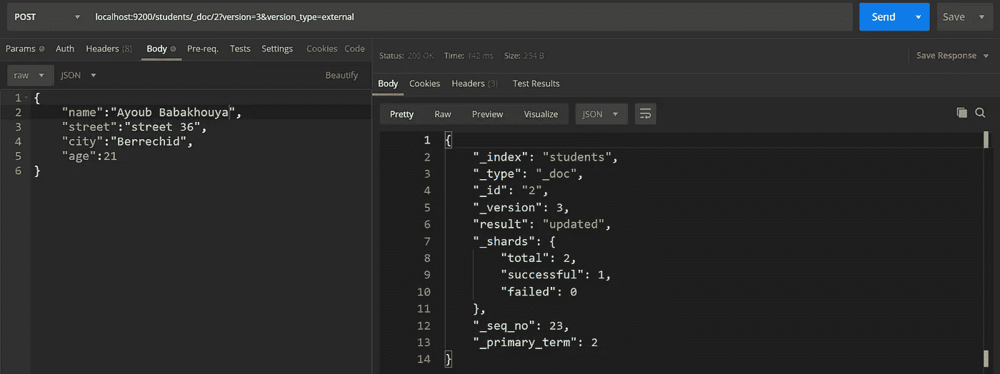*

*使用版本参数指定某个版本。*

*让我们谈谈内部版本控制和外部版本控制之间的区别，内部版本控制是默认版本，从 1 开始，每次更新时递增，包括删除，当文档的版本控制存储在外部系统(如第三方版本控制系统)中时，使用外部版本控制。要启用此功能，我们需要将 version_type 设置为 external。在这里，Elasticsearch 将存储外部系统指定的版本号，并且不会自动递增。*

# *操作*

*要通过 Id 获取文档，我们可以使用 GET HTTP request。*

```
***GET :** localhost:9200/students/_doc/2*
```

*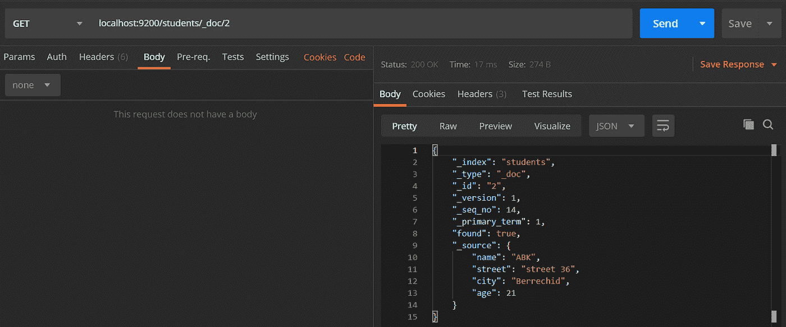*

*获取特定文档。*

*要删除一个文档，我们应该使用 HTTP delete 请求并传递文档的 id。*

```
***DELETE** : localhost:9200/students/*
```

*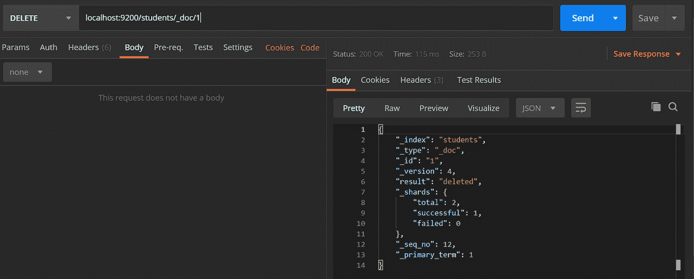*

*删除文档。*

> *可以指定文档的版本来删除该特定版本。*

*如果我们想更新一个文档怎么办？*

*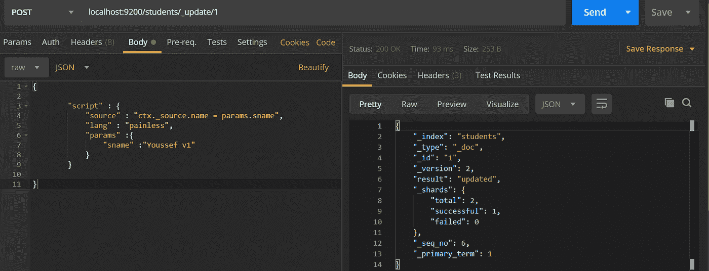*

*更新文档。*

```
***POST** : localhost:9200/students/_update/1
{

  "script" : {
   "source" : "ctx._source.name = params.sname",
   "lang" : "painless",
   "params" :{
    "sname" :"Youssef v1"
   }
  }

}*
```

*要更新一个文档，我们需要使用 Get HTTP 请求，指定文档的 id。正如您所看到的，主体有点混乱，脚本对象用于执行该操作，版本控制用于确保在获取和重新索引期间没有发生更新。“params”是一个包含文档新值的对象。*

*现在，既然我们创建了一个索引并应用了所有的 CRUD 操作，让我们开始在索引中搜索。*

# *搜索*

*为了进行搜索，我们使用以下请求:*

```
***GET** : localhost:9200/students/_search
{
  "query": { "match": {"city":"Agadir"} },
   "sort": [
    { "age": "asc" }
  ]
}*
```

*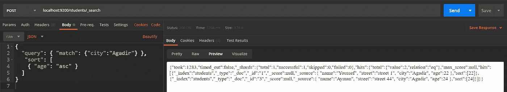*

*搜索索引*

*query 属性允许我们向 Elasticsearch 提出特定的问题。在本例中，我们使用 match 搜索某个术语或值，我们还使用 match_phrase 搜索确切的值，sort 用于升序或降序排序。*

*结果是一个 JSON 对象，包含关于搜索操作的细节，例如“take”表示搜索花费了多少时间，“timed_out”表示搜索请求是否超时，而“_shards”表示搜索操作检查的碎片数量。*

*为了从索引数据中获取更多信息，我们可以使用 bool 属性，它允许使用“必须”和“必须”not 和“应该”来组合多个标准，这意味着它是可取的*

```
***GET** : localhost:9200/students/_search
{
    "query": {
        "bool": {
            "must": [
                {
                    "match": {
                        "age": 21
                    }
                }
            ],
            "must_not": [
                {
                    "match_phrase": {
                        "street": "street 39"
                    }
                }
            ]
        }
    }
}*
```

*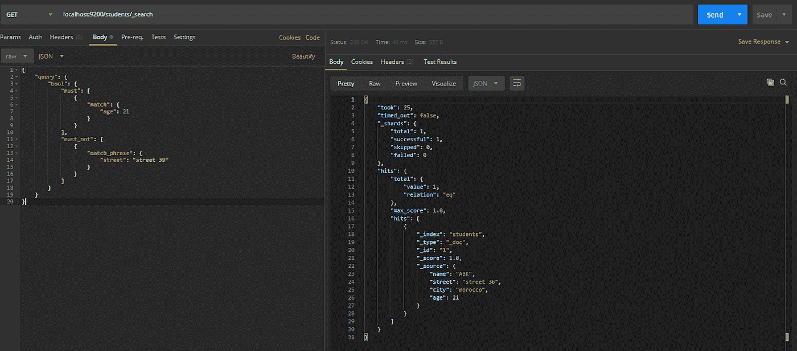*

*更复杂的搜索查询*

**

> *敬请期待优素福·阿姆兹尔将出版的第二部分！*

# *参考资料:*

*   *[术语](https://codingexplained.com/coding/elasticsearch/terminology)*
*   *使用 Docker 的 Elasticsearch (T1)*
*   *[Elastricsearch 教程(T3)](https://www.tutorialspoint.com/elasticsearch)*
*   *Elasticsearch 词汇表 (T5)*