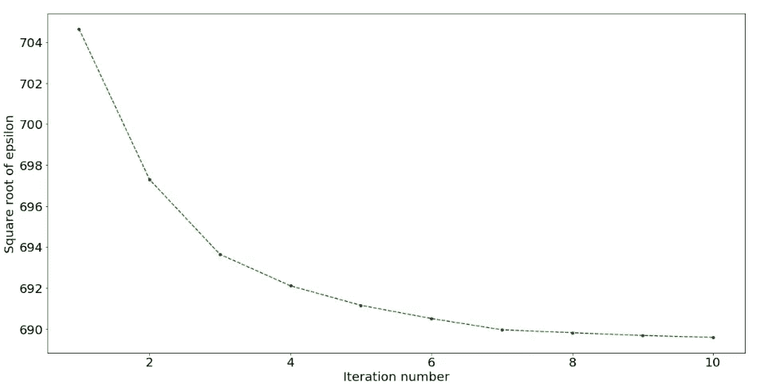
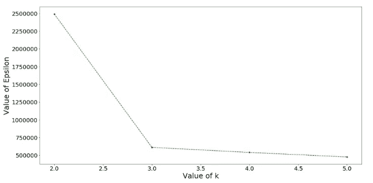

# 用 Python 实现 K-means 聚类的肘方法

> 原文：<https://medium.com/analytics-vidhya/elbow-method-of-k-means-clustering-algorithm-a0c916adc540?source=collection_archive---------1----------------------->

约翰-马克·史密斯在 [Unsplash](https://unsplash.com?utm_source=medium&utm_medium=referral) 上的照片

K-means 聚类是一种无监督学习算法，旨在将 n 个观察值划分为 k 个聚类，其中每个观察值属于质心最近的聚类。该算法旨在最小化观测值与其所属聚类质心之间的平方欧氏距离。本文提供了算法的详细代码:- [K-means 从零开始使用 Python 进行聚类。](/@joel_34096/k-means-clustering-using-python-from-scratch-7ccdace7789)

在这篇文章中，我们将看到 K-means 聚类算法的肘方法。肘方法通过用“k”值的范围来拟合模型来帮助选择“k”(聚类数)的最佳值。这里我们将使用二维数据集，但肘方法适用于任何多元数据集。

让我们从理解 K-means 聚类的成本函数开始。我们将 K 均值聚类的代价函数定义为“ε”,它是数据点和该数据点所属的聚类的相应质心之间的距离的平方和。我们期望成本函数随着迭代次数的增加而减少。让我们通过绘制ε的平方根与迭代次数的关系来验证这一点。

该图是针对 k = 5 的二维数据集绘制的。

因为‘ε’的期望值随着迭代次数而减小。我们还观察到，在第 8 次迭代之后，ε的值少量减少，这表明算法几乎已经收敛，我们可以停止 8 次迭代，以节省计算能力和时间。算法收敛所需的迭代次数取决于数据集的维数和“k”值。数据集的维数越高，k 值越高，算法收敛所需的迭代次数就越多。

现在让我们用从 2 到 5 的‘k’值范围来拟合模型。对于“k”的每个值，算法运行 15 次迭代，并且计算第 15 次迭代结束时的成本函数“ε”。下面提供了代码。

当我们绘制 x 轴上的“k 值”和 y 轴上的“ε值”时，在“k”的最佳值处有一个弯头形成。让我们通过绘制“k 值”对“ε值”的图表来检验这一点。

从上图中，我们观察到在 k = 3 时有一个弯头形成。因此 k 的最佳值是 3。因此，我们将数据集分为 3 类。