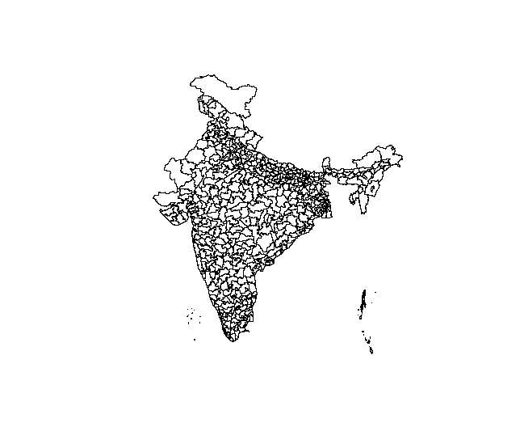
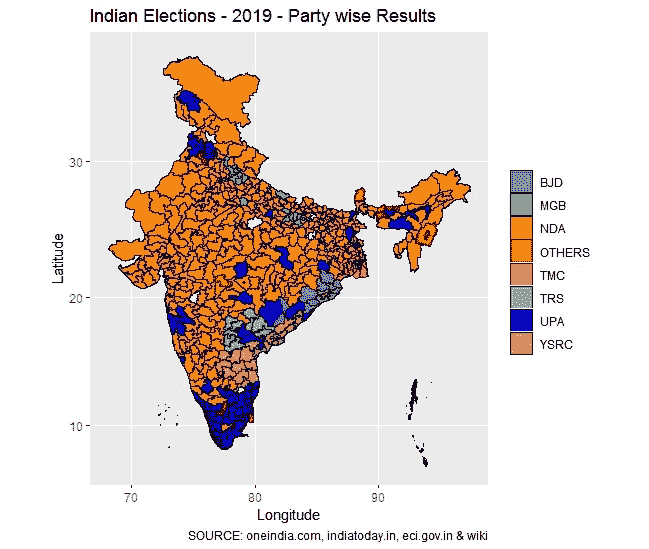
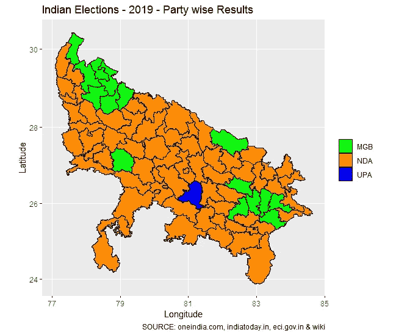
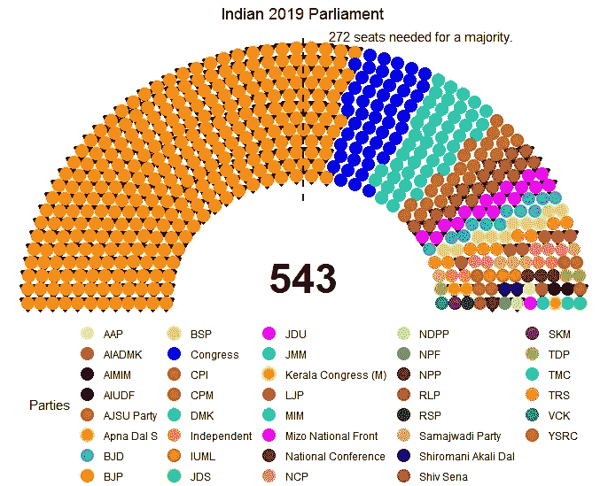
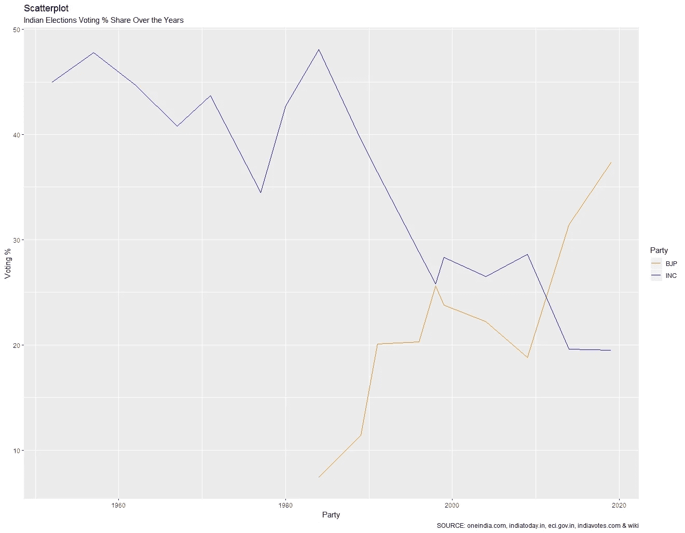
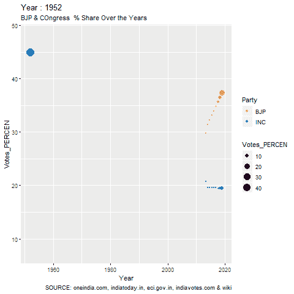

# 选举可视化与 R

> 原文：<https://medium.com/analytics-vidhya/election-visualization-with-r-8b790250d889?source=collection_archive---------7----------------------->


埃利奥特种马在 [Unsplash](https://unsplash.com?utm_source=medium&utm_medium=referral) 上拍摄的照片

你曾经在电视频道上观看选举结果吗？激动人心，戏剧性和动作是无与伦比的。无论是印度选举结果还是美国选举结果，尖叫的电视主持人都会增加你的肾上腺素。结果每分钟都在变化。随着计票消息的涌入，不同的电视频道显示出不同的结果。慢慢地，兴奋达到了顶峰。每一个政党都声称他们赢了。这是一个充满动作戏的新世界，甚至可以在那天打败邦德电影。

但有一点是所有电视频道共有的，即选举结果的可视化。哪一个电视频道展示了最好的视觉效果，哪一个就赢得了那天的战斗。

展示选举结果是一门艺术，只有通过可视化才能实现。

选举结果可以以不同的方式呈现，以下是其中几种:

1.  *国家地图图表*

*2。议会图表*

*3。条形图*

*4。气泡图*

*5。树形图*

*6。动画图表*

*7。散点图*

*8。棒棒糖图表*

9。甜甜圈图表

10。牛眼图等等。

然而，当谈到观赏，国家地图是最好的观赏和最有吸引力的。市场上有很多开源的选举结果软件，你可以在这里找到一些

如果你知道 Tableau，那么你也可以很容易地在上面画出选举结果。

但是所有这些可视化都可以在 R 中轻松完成。你只需要相当多的 R 语言编码知识，最先进的可视化软件包 ggplot2，可视化选举结果的地区/国家的形状文件，excel/csv 中的地区/国家的选举结果，最后但同样重要的是耐心。

在这篇文章中，我将向你展示如何在 R 中可视化选举结果，我将采取 2019 年印度大选结果。因为我已经从不同的网站取得了结果，如果你发现任何错误，请告诉我。这篇文章是从教育的角度写的，你可以把它作为可视化选举结果或你正在做的任何可视化项目的基础。我在几乎所有的图表中都提到了结果来源。然而，你可以在这里找到印度 2019 年大选的最终结果。

我很难在正确的印度文件中找到正确的印度和州边界。我试着在网上搜索文件印度的形状，最后在这里找到了一个。

当你下载一个形状文件时，其他文件也会以不同的格式下载。shp，。dbf，。shx，。sbn 和. sbx。

形状文件是一个庞大复杂的文件。根据维基百科，**形状文件**格式是地理信息系统(GIS)软件的地理空间矢量数据格式。它是由 Esri 开发和管理的，是 Esri 和其他 GIS 软件产品之间数据互操作性的开放规范。它包含了各个地方的经度和纬度数据。点击阅读更多关于形状文件[的信息。](https://en.wikipedia.org/wiki/Shapefile)

让我们在 r 中开始可视化。

为了可视化一个形状文件，你需要各种不同的 R 包，如下所示:

```
*library(ggplot2)
library(maptools)
library(rgeos)
library(ggmap)
library(scales)
library(RColorBrewer)
library(sf)
library(rgdal)
library(dplyr)
library(plotly)
library(mapproj)*
```

设置一个随机种子并加载形状文件。

```
*set.seed(8000)**shp <- readOGR(‘D:/Harish/R practice projects/india/Election/india_pc_2019.shp’)* *# India shape file With Telangana, Chattisgarhand J&K
names(shp)**[1] “ST_NAME” “PC_NAME” “ST_CODE” “PC_CODE” “Res”*
```

如果你在一个形状文件上做一个 str，你会在屏幕上得到一个很大的结果。在这里粘贴一部分输出:

```
*str(shp)**.. .. .. .. .. .. ..@ area : num 1.35
 .. .. .. .. .. .. ..@ hole : logi FALSE
 .. .. .. .. .. .. ..@ ringDir: int 1
 .. .. .. .. .. .. ..@ coords : num [1:5812, 1:2] 80.2 80.2 80.2 80.2 80.2 …
 .. .. .. ..@ plotOrder: int 1
 .. .. .. ..@ labpt : num [1:2] 80.1 29.9
 .. .. .. ..@ ID : chr “19”
 .. .. .. ..@ area : num 1.35*
```

字段 ID 在这里很重要。让我们绘制形状文件。见下图 1。

```
*plot(shp*)
```



带有形状文件的印度地图

我对形状文件做了一些特征工程和数据清理，因为我发现一些地名在两种状态下是常见的。所以我不得不纠正他们。

*#根据状态手动分离部分位置*

```
*shp$PC_NAME[ shp$RId == 3] <- “HAMIRPUR, HIMACHAL PRADESH”
shp$PC_NAME[ shp$RId == 119] <- “HAMIRPUR, UTTAR PRADESH”
shp$PC_NAME[shp$RId == 135] <- “MAHARAJGANJ, UTTAR PRADESH”
shp$PC_NAME[shp$RId == 171] <- “MAHARAJGANJ, BIHAR”
shp$PC_NAME[shp$RId == 181] <- “AURANGABAD, BIHAR”
shp$PC_NAME[shp$RId == 359] <- “AURANGABAD, MAHARASHTRA”*
```

根据此形状文件制作数据框。

```
#making dataframe*shp.f <- fortify(shp, region=”PC_NAME”)
head(shp.f)**long lat order hole piece id group
1 78.33642 19.88331 1 FALSE 1 ADILABAD(ST) ADILABAD(ST).1
2 78.33689 19.88322 2 FALSE 1 ADILABAD(ST) ADILABAD(ST).1
3 78.33868 19.88331 3 FALSE 1 ADILABAD(ST) ADILABAD(ST).1
4 78.34025 19.88344 4 FALSE 1 ADILABAD(ST) ADILABAD(ST).1
5 78.34203 19.88310 5 FALSE 1 ADILABAD(ST) ADILABAD(ST).1
6 78.34388 19.88283 6 FALSE 1 ADILABAD(ST) ADILABAD(ST).1**> nrow(shp.f) #no of records
[1] 3199318*
```

让我们加载我们的选举数据。在加载数据之前，我必须对选举结果文件进行特征工程，以使其与形状文件相匹配。在这两个文件中，电脑的拼写名称是不同的。我不得不手动纠正它们。

```
*Results <- read.csv(‘D:/Harish/R practice projects/india/election/Data/2019 Results New.csv’)
names(Results)**> names(Results)
 [1] “From.election.2019” “comp1” “id” “comp2” 
 [5] “id_1” “Winning.Candidate” “Party” “W_Alliance” 
 [9] “Losing.Candidate” “Party.1” “Alliance” “X.REF.”*
```

让我们来看看数据。它有 543 条记录。对于一个议会选区来说，在此期间没有举行选举。而且是后来举办的。该结果不包含在本文中。

```
*> head(Results, n = 2)
 From.election.2019 comp1 id comp2 id_1 Winning.Candidate Party W_Alliance
1 ADILABAD(ST) ADILABAD(ST) ADILABAD(ST) ADILABAD(ST) ADIL Soyam Bapu Rao BJP NDA
2 AGRA (SC) AGRA (SC) AGRA (SC) AGRA (SC) AGRA Satyapal Singh Baghel BJP NDA
 Losing.Candidate Party.1 Alliance X.REF.
1 Godam Nagesh TRS OTHERS #REF!
2 Manoj Kumar Soni BSP MGB/OTHERS #REF!
> nrow(Results)
[1] 543*
```

“ID”字段包含议会选区名称。这两个文件中都有该字段。所以我们将使用这个字段来合并这两个文件，然后对这个文件进行排序。

```
*#merging the data by constituency**merged <-merge(shp.f,Results, by=”id”)**final.data<-merged[order(merged$order), ]**head(final.data, n = 2)**> head(final.data, n = 2)
 id long lat order hole piece group From.election.2019 comp1
5568 ADILABAD(ST) 78.33642 19.88331 1 FALSE 1 ADILABAD(ST).1 ADILABAD(ST) ADILABAD(ST)
5569 ADILABAD(ST) 78.33689 19.88322 2 FALSE 1 ADILABAD(ST).1 ADILABAD(ST) ADILABAD(ST)
 comp2 id_1 Winning.Candidate Party W_Alliance Losing.Candidate Party.1 Alliance X.REF.
5568 ADILABAD(ST) ADIL Soyam Bapu Rao BJP NDA Godam Nagesh TRS OTHERS #REF!
5569 ADILABAD(ST) ADIL Soyam Bapu Rao BJP NDA Godam Nagesh TRS OTHERS #REF!*
```

让我们看看最终文件中的字段名。

```
*> names(merged)
 [1] “id” “long” “lat” “order” 
 [5] “hole” “piece” “group” “From.election.2019”
 [9] “comp1” “comp2” “id_1” “Winning.Candidate” 
[13] “Party” “W_Alliance” “Losing.Candidate” “Party.1” 
[17] “Alliance” “X.REF.”*
```

我想用颜色代表政党。所以我为此写了一小段代码。

```
*cols <- c(
 “TRS” = “darkseagreen3”,
 “NDA” = “darkorange”,
 “UPA” = “blue”,
 “MGB” = “green”,
 “YSRC” = “darksalmon”,
 “TMC” = “deeppink1”,
 “BJD” = “darkorchid2”,
 “NA” = “cyan”,
 “OTHERS”= “red”
 )*
```

# **国家地图图表**

我们已经准备好了最终文件。让我们开始在印度的地图上展示这些数据。我将使用 ggplot2 来制作这个图表。我将使用美学— ggpolygon 在印度的地图上绘制数据。请参见下面的代码:

```
*chart <- ggplot()+
 geom_polygon(data = final.data,aes(x = long, y = lat, group = group, 
 fill = W_Alliance,color=id),color=”black”,size = 0.25) +
 coord_map() +
 xlab(‘Longitude’)+
 ylab(‘Latitude’) +
 labs(title=”Indian Elections — 2019 — Party wise Results”, 
 caption = “SOURCE: oneindia.com, indiatoday.in, eci.gov.in & wiki”) +
 scale_fill_manual(name=”id”, values = cols) + theme(legend.title=element_blank())*
```

我们在图表变量中得到了可视化。让我们打印这个。

*#打印图表输出
打印(图表)*

请参见下面印度地图的最终结果



2019 年印度大选结果

如果你想显示一个州的结果。这很简单。我添加了一个状态变量，然后根据状态过滤数据。让我们看看下面 State = 'UP '的代码

```
State.data <- filter(final.data, State == ‘UP’)# Making final Indian Map
chart_state <- ggplot()+
 geom_polygon(data = State.data,aes(x = long, y = lat, group = group, 
 fill = W_Alliance,color=id),color=”black”,size = 0.25) +
 coord_map() +
 xlab(‘Longitude’)+
 ylab(‘Latitude’) +
 labs(title=”Indian Elections — 2019 — Party wise Results — Uttar Pradesh”, 
 caption = “SOURCE: oneindia.com, indiatoday.in, eci.gov.in & wiki”) +
 scale_fill_manual(name=”id”, values = cols) + theme(legend.title=element_blank())# prining chart output
print(chart_state)
```



2019 年北方邦大选

# **议会图表**

现在让我们制作一个议会图表。r 有一个名为“ggparliament”的库，它可以帮助像弧形或像国会议员坐在议会中一样呈现数据。

让我们为此编写代码。我使用下面的库来制作这个图表:

```
library(ggplot2)
library(ggparliament)
library(readr)
library(dplyr)
```

我已经对我的数据进行了功能设计，以显示各个政党以及各个政党赢得的席位数。

```
#get the data
Results <- read.csv(‘D:/Harish/R practice projects/india/election/Data/NoOfSeats 2019.csv’, stringsAsFactors = T, na.strings=c(“”,”NA”))head(Results)> head(Results)
 party_short seats government
1 BJP 303 1
2 Congress 52 0
3 DMK 24 0
4 TMC 22 0
5 YSRC 22 0
6 Shiv Sena 18 1
```

你可以把数据画成不同的形状，像马蹄形或半圆形。我在这里选择半圆。

```
#Decide type of parliament
Parlia_semicircle <- parliament_data(election_data = Results,
 type = “semicircle”,
 parl_rows = 12,
 party_seats = Results$seats)
```

现在让我们用 ggplot 画出我们的议会图。因为我想用不同的颜色来表示不同的团体，所以我将使用“scale_color_manual”美学来传递团体名称和它所代表的颜色。下面是完整的代码。主题 ggparliament 中使用的主题。

```
ind <- ggplot(Parlia_semicircle, aes(x =x, y = y, colour = party_short)) +
 geom_parliament_seats(stat = “identity”,position = “identity”,size = 5) + 
 theme_ggparliament() +
 labs(colour = “Parties”, 
 title = “Indian 2019 Parliament”, legend.position = “center”) +
 scale_color_manual(values=c(‘BJP’=’#FF8C00',
 ‘Congress’=’#0000FF’,
 ‘DMK’=’#00FA9A’,
 ‘TMC’=’#20B2AA’,
 ‘YSRC’=’#B8860B’,
 ‘Shiv Sena’=’#B22222',
 ‘JDU’=’#FF00FF’,
 ‘BJD’=’#6495ED’,
 ‘BSP’=’#ADFF2F’,
 ‘TRS’=’#FF7F50',
 ‘LJP’=’#CD5C5C’,
 ‘NCP’=’#F08080',
 ‘Samajwadi Party’=’#E9967A’,
 ‘Independent’=’#FA8072',
 ‘CPM’=’#FF0000',
 ‘IUML’=’#FF4500',
 ‘National Conference’=’#800000',
 ‘TDP’=’#9ACD32',
 ‘Apna Dal S’=’#FFD700',
 ‘CPI’=’#FF0000',
 ‘Shiromani Akali Dal’=’#000080',
 ‘AAP’=’#EEE8AA’,
 ‘AIADMK’=’#E81B23',
 ‘AIMIM’=’#000000',
 ‘AIUDF’=’#000000',
 ‘AJSU Party’=’#FF0000',
 ‘JDS’=’#00FF00',
 ‘JMM’=’#20B2AA’,
 ‘Kerala Congress (M)’=’#FFFF00',
 ‘MIM’=’#00FFFF’,
 ‘Mizo National Front’=’#FF00FF’,
 ‘NDPP’=’#C0C0C0',
 ‘NPF’=’#808080',
 ‘NPP’=’#800000',
 ‘RLP’=’#808000',
 ‘RSP’=’#008000',
 ‘SKM’=’#800080',
 ‘VCK’=’#008080' )) +
 theme(legend.position = “bottom”) +
 geom_highlight_government(government == 1, shape = 25) +
 draw_totalseats(n = 543, type = ‘semicircle’) +
 draw_majoritythreshold(
 n = 272,
 label = TRUE,
 type = ‘semicircle’
 ) +
 theme(plot.title = element_text(hjust = 0.5))
```

这是我们最终的议会图表:

```
#Display the plot
ind
```



印度议会图表 2019 年大选

# **历年投票率散点图及前两大政党动画图**

我们将需要' gganimate '和' gifsky '包来制作一个动画图表。让我们加载库。

```
#This code displays animation chart for vote % over the years for parties two largest parties Congress and BJP
#Data source given below
##devtools::install_github(‘thomasp85/gganimate’) load latest gganimate packages
#load the packages
library(ggplot2)
library(readr)
library(dplyr)
library(tidyr)
library(gganimate)
library(gifski) #part of gganimate
```

加载数据。

```
#get the dataResults <- read.csv(‘D:/Harish/R practice projects/india/election/Data/Voting_Per_Over_The_Years_BJP_INC.csv’, stringsAsFactors = F, na.strings=c(“”,”NA”))#EDA
typeof(Results)
head(Results)
sum(is.na(Results))
str(Results)
nrow(Results)> head(Results)
 Year Party Seats Votes_PERCEN
1 2019 INC 52 19.49
2 2014 INC 44 19.60
3 2009 INC 206 28.60
4 2004 INC 145 26.50
5 1999 INC 114 28.30
6 1998 INC 141 25.80
```

# **散点图**

画散点图。看看 1980 年后 BJP 是如何崛起的。

```
#1 Scatter Plot
ind_1 <- ggplot(data = Results, aes(x = Year, y = Votes_PERCEN, colour = Party)) +
 geom_line() +
 scale_color_manual(values=c(‘BJP’=’#FF8C00',
 ‘INC’=’#0000FF’)) +
 labs(subtitle=”Indian Elections Voting % Share Over the Years”, 
 y=”Voting %”, 
 x=”Party”, 
 title=”Scatterplot”, 
 caption = “SOURCE: oneindia.com, indiatoday.in, eci.gov.in, indiavotes.com & wiki”)ind_1
```



多年来 BJP 和国会之间的投票百分比散点图

# **动画图表**

让我们用下面的代码画一个动画图表。

```
#animation chart with geom points
theme_set(theme_bw())
#Result_Sel_BJP <- Results %>% filter(Results$Party == ‘BJP’ )ind_2 <- ggplot(Results, aes(Year, Votes_PERCEN, size = Votes_PERCEN, frame = Year, colour = Party)) +
 geom_point() + transition_time(Year) +
 labs(title = “Year : {frame_time}”) + shadow_wake(wake_length = 0.1, alpha = FALSE) +
 labs(subtitle=”BJP & COngress % Share Over the Years”, 
 caption = “SOURCE: oneindia.com, indiatoday.in, eci.gov.in, indiavotes.com & wiki”)

ind_2 
#saving the animation chartanim_save(“animation_chart_with_geom_points.gif”)
```

下面是带有 gganimation 包的动画图。看看分数是如何随着年份的变化而变化的。



动画图表:历年来 BJP 和国会之间的投票百分比

你可以使用上述代码为任何选举绘制这样的图表。各种图表的完整 R 代码，请从我的 github 页面[这里下载代码和图表。](https://github.com/harnagpal/Indian-Election-2019-Visualization)

就这样，我完成了我的文章。感谢阅读全文。很快会遇到一篇新文章。

请随时给我留言或给我发邮件到 harnagpal@gmail.com。

看看我其他关于 Medium.com 的文章

[](/analytics-vidhya/data-science-use-cases-in-life-insurance-8cfbfd8b2fff) [## 人寿保险中的数据科学用例

### 数据科学是当今科技界的一个新现象。随着计算能力的增加，它已经改变了世界…

medium.com](/analytics-vidhya/data-science-use-cases-in-life-insurance-8cfbfd8b2fff) [](/analytics-vidhya/create-beautiful-visualization-of-data-in-trelliscopejs-package-in-r-c67879c55864) [## 用 R 语言在 TrelliscopeJS 包中创建漂亮的可视化数据

### 对于那些希望生动展示数据的人来说，这是一次很好的学习体验

medium.com](/analytics-vidhya/create-beautiful-visualization-of-data-in-trelliscopejs-package-in-r-c67879c55864) 

在这里看我的数据科学数学艺术[。](https://www.instagram.com/artofhary/)

# **参考文献**

 [## 用于绘制全印度地图的笔记本

### 编辑描述

rstudio-pubs-static.s3.amazonaws.com](https://rstudio-pubs-static.s3.amazonaws.com/435552_5656a7fe6636474fb0f8d4222d79db2c.html) 

[https://www.oneindia.com/](https://www.oneindia.com/)

[](https://www.indiatoday.in/) [## 最新消息，今日突发新闻-宝莱坞，板球，商业，政治-今日印度

### 查看来自印度和世界各地的最新消息。关于宝莱坞，政治，商业，板球的最新印度新闻…

www.indiatoday.in](https://www.indiatoday.in/) [](https://eci.gov.in/) [## 印度选举委员会

### 从 Play Store 下载我们新的手机应用程序“选民热线”。Android 应用程序“选民帮助热线”为您提供了简单的…

eci.gov.in](https://eci.gov.in/) [](http://www.indiavotes.com/) [## 印度选票|印度最大的选举数据库

### 编辑描述

www.indiavotes.com](http://www.indiavotes.com/) [](https://drive.google.com/drive/folders/0ByLjiBJ1xOpuTVRIWThhazBLdWM) [## 形状文件- Google Drive

### 编辑描述

drive.google.com](https://drive.google.com/drive/folders/0ByLjiBJ1xOpuTVRIWThhazBLdWM)