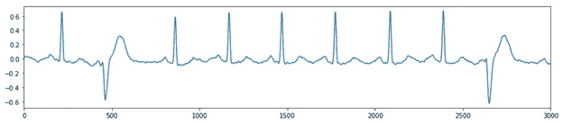
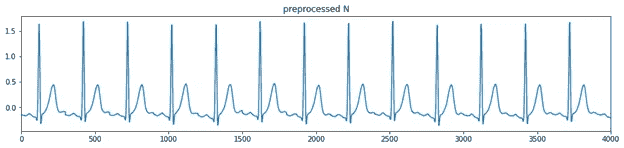

# 心电图分类深度学习方法

> 原文：<https://medium.com/analytics-vidhya/electrocardiogram-classification-deep-learning-approach-8bb201e10164?source=collection_archive---------13----------------------->

概述:心电图分类系统设计示例(抱歉分辨率低)

在这篇文章中，我将谈论我建立的一个心电图分类系统。分类系统获取记录并将其映射到标签中。这篇论文有七个部分，为了帮助你阅读，我标出了一些你可以跳过的段落。我的 ECG 分类系统在分类记录方面做得不错，它给出了 81.2%的平均 F1 分数。在最后一节，我还会把自己的作品和别人的进行比较。

# 概述

第 1 部分:数据描述

第 2 部分:数据可视化和形态学

第 3 部分:评估标准

第 4 节:心电图分类系统

第 5 部分:结果和数据分析

第 6 节:系统利弊

第七部分:参赛模特(与他们比较)

# 第 1 部分:数据描述

心电图数据集来自[2018 中国心理学大赛](http://2018.icbeb.org/Challenge.html)，它有九个类别(见下文)。该数据集中有 **6877 条记录**。每条记录以 **500 Hz** 采样，并有 **12 个通道/导联**。此外，每个记录还包含那个人的性别和年龄，但是我没有使用它们作为输入。

九个类别:

1.  正常(N)
2.  心房纤维性颤动
3.  一级房室传导阻滞(AVB)
4.  左束支传导阻滞(LBBB)
5.  右束支传导阻滞(RBBB)
6.  房性早搏
7.  室性早搏
8.  ST 段抬高(STE)
9.  ST 段压低(性病)

数据删除:很少有记录属于一个以上的类别，为了使研究更简单，我删除了它们。还剩 **6397 条记录**。

数据删除后，数据分布如下图所示。

心电图数据分布

下表显示了每个类别中的记录数。

每个类别中的记录数

# 第 2 部分:数据可视化和形态学

在我们进入数据集之前，我想谈谈 PQRST-waves。**如果你对这部分不感兴趣，可以跳过下面一段，跳转到“各个范畴的形态学”。**

心脏的电系统。来源: [www.healthlinkbc.ca](https://www.healthlinkbc.ca/health-topics/zm6205)

一个周期的心跳信号。来源:[aclsmedicaltraining.com](https://www.aclsmedicaltraining.com/basics-of-ecg/)

**(跳过)**。心跳的起点是窦房结。窦房结是天然的和平缔造者，它启动心跳并决定心率。窦房结的放电遍及两个心房，并使它们去极化，即 P 波。PR 段是 P 波结束和 Q 波开始之间的持续时间，它代表信号从窦房结传播到房室结的时间。房室结是心室的电通道。它接收来自窦房结的信号，并将它们传递到房室束(希氏束)。房室束分为左束支和右束支。室间隔的去极化从左束开始到右束，这导致 Q 波的负偏转。然后，电信号同时移动到左心室和右心室，但是左心室的信号占优势，因此 ECG 在 R 波处显示大的正偏移。s 波代表心室去极化的最后阶段。心房复极被心室去极化所掩盖，所以我们在 QRS 复合体中看不到它。ST 段代表心肌动作电位的平稳状态。最后，T 波反映了心室的复极。基于这些波、间隔和段的形态，我们可以分析心电图。

**形态学中的每一类**

为了形象化，我将使用引线 I (见下图)。下面我将展示的每一个 ECG 信号都来自我的数据集。对于快速阅读，您可以跳过关于异常形成的详细解释，您可以直接阅读每个类别部分中的粗体字。例如，在“AF 类型部分”，你可以只阅读“QRS 复合体之前的振荡”。

无创 12 导联心电图。来源于[firstaidforfree.com](https://www.firstaidforfree.com/recording-a-12-lead-ecgekg/12-lead-ecg-planes/)

**N 型**

情节 1

在 N 型中，RR 间隔是一致的，这表明患者具有正常的心率。PQRST 波无异常形态。

**自动对焦类型**

情节 2

房颤是最常见的心律失常。心跳的起点不是窦房结，而是异位的部位。电脉冲是从许多引起心房纤维性颤动的异位部位随机产生的。在图 2 中，**QRS 复合物**前的振荡反映了许多异位位点的电脉冲。有时这些异位点激活房室结，因此心室去极化(QRS 复合体)。因此，**P 波缺失**。房颤会导致心房低效收缩，进而形成血凝块。血凝块进入血液并卡在大脑的小动脉中会导致中风。

**IAVB 型**

曲线 3:时间= (105 个样本)×(1 秒)/(500 个样本)=0.21 秒

IAVB 的症状是房室结传导延迟，导致**PR 间期延长(> 0.2s)或 PR 段延长**。大多数 IAVBs 是良性的，不需要治疗。图 3 显示了 IAVB 心跳的示例，PR 间隔有 105 个样本。通过计算绿色矩形中的时间，PR-interval 约为 0.21 秒，因此 PR-interval 大于 0.2 秒。

**LBBB 式**

正常情况下，两个心室同时去极化，然后同时收缩。在束支传导阻滞(BBB)中，未受影响的心室先去极化，然后另一个心室再去极化。这导致受影响心室的延迟去极化，因此 QRS 复合物的形态是异常的。

情节 4

对于 LBBB，我们使用图 4 来说明异常 QRS 复合物的形成。不正常的是，隔膜的去极化是从右向左开始的，因此在 QRS 综合征的起点显示出正的偏转。右心室首先激活，这将导致一个小的向下偏转。然后，电信号传播到大左心室，这将导致另一个正偏转，因此**一个宽特征“兔子耳朵”QRS 复合体**。有时，由右心室去极化引起的小的向下偏转是不可见的，或者左心室去极化的幅度小于隔膜去极化的幅度。

**RBBB 型**

地块 5

地块 5 是 RBBB 的一个例子。正常情况下，隔膜的去极化从左向右开始。左心室正常去极化，这导致正常的 R 波。然后电脉冲传播到右心室，导致**大的负偏转和更宽的 S 波。**

**包装类型**

地块 6

当一个心房中有异位点放电时，就会发生 PAC。PAC 有几种形态。首先，**由于异位部位的激活，P 波可以合并到前面的 T 波**。其次，**P 波可以反转，出现负偏转**。第三，异位心房激动可进入窦房结，使其去极化并重置其时序，从而**改变 PP 间期。**曲线 6 显示了合并的 PT 波。

**PVC 类型**

情节 7

当一个心室的异位部位过早放电时，就会发生 PVC。因为 PVC 不影响 SA 节点，所以**PP-interval 保持不变**。QRS 复合体的形态取决于异位部位的位置。QRS 情结可以更广、更高、更深。图 7 显示了 QRS 复合体的两个负偏差。

**STE 型**

地块 8

STE 的形态是以基线为参照，ST 段抬高。图 8 显示**与 PR 段相比，每个 ST 段具有向上的斜率**和更大的振幅。

**标准类型**

情节 9

STD 的形态学是以基线为参照，ST 段压低。图 9 显示**每个 ST 段都有负振幅，且低于基线。**

根据这九种形态，在数据预处理中从每个记录中提取心跳是必要的，因为每个异常部分都出现在每个心跳信号中，除了 PAC(它涉及 PP 间隔，但在本研究中我将忽略这一事实)。

# 第 3 部分:评估标准

因为数据集非常不平衡，所以我将选择 F1 分数作为评估指标。

等式 1

等式 1 对应每个类别的 F1 分数，其中 N_ij 是预测为类别 j 的类别 I 的测试样本的数量。从 1 到 9 的数字对应 N、AF、I-AVB、LBBB、RBBB、PAC、PVC、STE 和 STD。

— — — — — — — — — — — — — — — — — — — — — — — — — — — — — — —

等式 2

其中 F1 是 F1 的平均分数。

— — — — — — — — — — — — — — — — — — — — — — — — — — — — — — —

等式 3

F_AF 测量 AF。

F_Block 测量 LBBB、RBBB 和 IAVB。

F_PC 测量 PAC 和 PVC。

F_ST 测量标准偏差和 STE。

# 第 4 节:心电图分类系统

在本节中，有四个小节。

在第 4.1 节:基于 r 峰数量的数据集分割中

在 4.2 节:数据预处理和数据扩充中

在 4.3 节:神经网络设计中

在第 4.4 节:模型训练和测试中

**第 4.1 节:基于 r 峰数量的数据集分割**

直方图:“记录的长度”与“记录的数量”

上面的直方图显示了“记录的长度”与“记录的数量”。我们可以看到大多数记录都属于短长度，大约 5000 条，但仍有大量记录分布在不同的长长度中。对于批量训练，重要的是将所有训练数据预处理成统一的长度。首先，我将整理我的数据集。

我将根据 r 峰的数量将数据集分为训练和测试两部分。感谢我的朋友艾哈迈德，他帮我开发了 r 峰检测算法。这个算法我就不细说了，简单说一下。基于小波变换提出了 r 峰检测算法。重构信号后，大部分噪声被去除。通过以滑动窗口方式计算局部能量，峰值被增强。因为有 12 个通道，所以我们用投票法来寻找最可靠的峰值。然后有一些细化工作，以消除假峰。图 10 显示了一个例子。在我的研究中，由于分割过程，我删除了第一个和最后两个 r 峰(这四个峰有时会导致程序错误，因为样本不够)。

地块 10

在每个类别中，我希望有 80%的数据用于训练，20%的数据用于测试。通过使用 r 峰检测算法，大多数记录具有少于 20 个 r 峰，我决定使用 20 作为边界来分割数据集。如果记录具有小于或等于 20 个 r 峰，则该记录被移动到训练数据集，否则被移动到测试数据集。

以上流程无法承诺 80%的训练和 20%的测试。拆分数据集后，一个类别可以有 87%的训练数据和 13%的测试数据，或者 70%的训练数据和 30%的测试数据。第一种情况很容易处理，其中 7%的训练数据可以移动到 13%的测试数据，因此在数据预处理期间不会产生问题。然而，第二种情况会产生问题。如果 10%的测试数据移动到 70%的训练数据，我不再知道我想要复制到一个统一心跳中的心跳数。因此，我需要找到 r 峰的数量，它可以用作从测试数据集中选择一些记录并将它们移动到训练数据集中的参考。我仔细检查了每个类别的测试数据集，发现 40 r-peaks 和 60 r-peaks 是最佳选择。因此，我进一步将具有“小于或等于 40 个 r 峰”和“小于 60 个 r 峰且大于 40 个 r 峰”的记录从测试数据集中移到训练数据集中。最后，对于每个类别，数据集分为 80%的训练和 20%的测试。下表显示了培训和测试记录的数量。

资料组

**第 4.2 节:数据预处理和数据扩充**

这个数据预处理的关键是提取心跳。一旦提取了每个记录的心跳，就更容易操作数据集。下图显示了数据预处理的四个步骤。

**步骤 1** ，通过使用 r 峰检测算法，找到 r 峰的位置。

**第二步**，通过选取相应 r 峰前后的样本，可以分割或提取每一次心跳。在本文中，我将选取 r 峰之前的 119 个样本和 r 峰之后的 180 个样本，因此每个心跳有 300 个样本。因为有 12 个导联，所以每个提取的心跳的形状是 300 乘 12。

**第三步**，复制过程允许神经网络批量训练。在这里，我将跳过这个演示。

**步骤 4** ，我们连接从每个记录中提取的所有心跳。对于每个预处理数据，它具有 300n 乘 12 的形状，其中 n 是心跳或 R 峰的数量。下面的图是指步骤 2 中的图。

**数据增强**

心跳提取之后，操纵数据就容易多了。我可以利用数据预处理的优势进行数据扩充。因为检测到的 r 峰位置总是有序的。对于数据扩充，我可以随机改变 r 峰的顺序，这可以帮助神经网络增强对心跳形状的学习，而不是记住异常心跳的位置。数据预处理中的复制步骤也有助于数据扩充。这是因为它随机复制了与记录相关的现有心跳。然后，复制的心跳也会随着连接前的所有心跳随机改变它们的顺序。下图显示了数据扩充。

原始预处理记录

扩充原始预处理记录

**第 4.3 节:神经网络设计**

对于现实生活中的应用，我们总是希望算法能够快速准确地执行。当我在设计神经网络的时候，我把速度和架构都记在了脑子里，你会明白我为什么要这样设计。神经网络有三个部分:特征提取器、心跳分析器和分类器。我将讨论如何为神经网络选择超参数，特别是为特征提取器。

**特征提取器**

特征提取器是串行连接的卷积层的堆栈。预处理记录是心跳的连接，因此在每两个相邻心跳之间，信号不是自然连接的。换句话说，我应该避免每两个相邻心跳之间的卷积运算。为了实现这一点，**内核大小应该等于步长大小**，以便在卷积期间没有重叠。此外，在每个卷积层中有一个挑选内核大小的规则。我希望特征提取器在不涉及其他心跳的情况下提取每个心跳的特征，以便心跳分析器可以在一个时间步长内处理每个心跳的特征。**现在我们开始吧。**

在每个卷积层中，核的大小总是等于步长

因为每次心跳的样本数是 300，**内核大小一定是 300 的约数**。在选择每个卷积层的核大小**之前，需要首先决定卷积层的数量**，这是因为卷积层的数量也是 300 的除数。例如，如果有两个卷积层，那么内核大小可以是 10 和 30，或者 12 和 25，等等。如果有三个卷积层，那么内核大小可以是 5 和 6 和 10，或者 5 和 5 和 12，等等。每组数的乘积是 300。一个插图显示在这一段的旁边(很抱歉分辨率低)。

我在特征提取器中选择超参数的方式不能捕获心跳的所有潜在特征，这是因为在卷积期间没有重叠。心跳的各种异常需要不同尺度的滤波器来检测。为了更好地捕捉心跳的特征，我需要沿着卷积层的其他分支并行添加具有不同内核大小的卷积层。下图显示了具有不同内核大小的卷积层的两个分支。每个分支的输出大小是相同的，所以这些输出可以连接成一个张量。

分配有不同内核大小的卷积层的两个分支，其中 N 是心跳数，N 是滤波器数，F 是内核大小，S 是步幅大小。来自两个分支的输出可以连接成一个张量。在这种情况下，串联输出的大小为 n 乘以 24。

**心跳分析仪**

Heartbeat analyzer 是长短期记忆(LSTM)层的堆栈。来自特征提取器的输出具有两个维度:第一个维度表示心跳的数量，第二个维度表示关于每个心跳的不同尺度的一组特征。因此，第一维决定了 LSTM 层过程中的时间步数。在每个时间步骤中，心跳分析器将一个心跳的一组特征作为输入。它从每个 LSTM 层产生一系列输出，直到到达最后一层。最后的 LSTM 层输出固定大小的矢量。固定大小的向量是概括整个记录的一组聚集特征。

心跳分析仪的流程，其中“HB”表示“心跳”

左图显示了心跳分析器如何处理特征提取器的输出。有 20 个心跳，因此每个 LSTM 层有 20 个时间步长。每个心跳都有一组特征，其中特征的大小为 d。第三 LSTM 层是心跳分析器的最后一层，因此输出大小是固定的。此外，我将 LSTM 层替换为双向 LSTM 层，这有助于顺序学习。

**分类器**

我可以使用全连接层(fcl)作为分类器，因为输入大小是固定的。fcl 也称为多层感知器。该层不共享权重。一层中的每个神经元连接前一层和后一层中的每个单个神经元，如果层的宽度很大，这会导致大量的参数。在我们的小数据集中使用大尺寸的分类器是不切实际的。然而，**特征提取器和心跳分析器大大降低了输入数据的维度**。首先，特征提取器提取心跳的有用信息，并丢弃冗余信息，其中有用信息是代表原始心跳的低维特征集。然后，心跳分析器分析每组特征，并进一步降低数据的维度。最后，heartbeat analyzer 的输出是一个紧凑的特性，它表示来自一个记录的所有心跳。通过使用用于分类的紧凑特征，分类器的大小可以非常小。

**神经网络设计的一个实例**

下图显示了我们的神经网络的实例。特征提取器具有卷积层的五个分支，参数的数量是 23，184。心跳分析器有 74，240 个参数，分类器有 3，689 个参数。除了最后一个 FCL，图中的每一层后面都有一个批量标准化层和 ReLu 激活函数。最后一层只是跟着 Softmax 激活函数。损失函数是分类交叉熵损失函数。

**第 4.4 节:模型训练和测试**

现在是时候讨论如何训练神经网络了。我在三个不同的文件夹里有训练记录:20 个 r 峰，40 个 r 峰，60 个 r 峰。因此，在每个训练迭代中有三个训练阶段。为了避免神经网络偏向一个类别而不是另一个类别，我们希望均匀地训练每个类别。培训过程的细节如下所示:

*对于每次迭代:*

*== >在 20 次心跳记录中(第一阶段):*

*====== >在每个类别中随机挑选 128 个录像*

*========== >数据预处理和扩充*

*========== >列车 128*9 个记录全部在一起*

*== >在 40 次心跳记录中(第 2 阶段):*

*====== >在每个类别中随机选择 32 个录像*

*========== >数据预处理和扩充*

*========== >列车 32*9 个记录全部在一起*

*== >在 60 次心跳记录中(第三阶段):*

*====== >在每个类别中随机选择 16 个录像*

*========== >数据预处理和扩充*

*========== >列车 16*9 个录音全部在一起*

*如果 F1 平均分数饱和，则通过乘以 0.1 来降低学习率*

**对于测试数据集，我们不使用复制步骤和数据扩充。**

# 第五部分:结果和分析

**表 5.1:每个模型和集合模型的结果**

集成模型是多种学习算法的组合，比单一学习算法具有更好的预测性能(见表 5.1)。我用相同的设计理念独立训练四个神经网络。每个神经网络都有不同数量的参数(见表 5.1)。例如，神经网络的特征提取器可以具有或多或少的卷积层分支。双向 LSTM 层的大小可以是 32 或 50。重点是将神经网络的损失函数减少到不同的局部最小值，以便每个神经网络可以在不同的方向学习数据集。**所有模型的训练数据集和测试数据集都是相同的**，这里我不使用交叉验证。

图 5.1:集合模型

最后一个全连接层的输出是九个概率的向量。在图 5.1 中，我通过分段求和的方式组合了四个向量，得到了一个有九个值的向量。最大值的索引决定了输入数据的类别。图 5.1 中的“9”是每个神经网络输出的大小。我的集成模型的大小是 703，153 个参数，这是四个神经网络的总和。此外，与比赛中的其他模型相比，系综模型相对较小(稍后我将展示其他模型结果)。

下表是集合模型的详细结果。现在，让我们分析结果。

表 5.2:测试数据集的结果(平均 F1 分= 0.812)

**PAC 记录分析**

表 5.2 显示了最差的 F1 分数在 PAC 中，其中大多数数据落入 n。我提到过 PAC 的形态包括 PP 间隔的变化。我们的数据预处理是提取心跳，去除心跳之间的相关性。因此，系统不能学习 P 波到 P 波之间的时间。为了更好地理解为什么大多数 PAC 数据归入 N，我们需要可视化归入 N 的 PAC 数据(图 5.1)和正确分类的 N 数据(图 5.2)。

地块 5.1

地块 5.2

地块 5.3

通过比较两个图(5.1 和 5.2)，我们可以看到它们看起来很相似。如果我们看一看这个 PAC 数据的原始信号，我们会看到根本问题来自数据预处理。图 5.3 是未经数据预处理的图 5.1 中的 PAC 数据。在图 5.3 中，绿色矩形是 P 波与前一个 T 波融合的异常部分。在分割步骤，我使用固定的阈值来提取心跳，因此**异常在分割步骤后消失**。这是另一种情况，在图 5.4 中，我们可以看到 PP 间隔在变化。因为我们的数据预处理，分段的部分看起来就像 N 个数据。因此，这解释了为什么大多数 PAC 记录被错误分类为 n。

图 5.4:显示数据预处理问题的 PAC 数据

**STE 和性病记录分析**

地块 5.5

地块 5.6

情节 5.7

图 5.2:心电图数据分布

根据表 5.2，STE 和 STD 的 F1 分数也相对较低，低于 80%。他们的大部分数据被错误分类为 n，我们将使用 lead V5 来可视化这种情况下的数据。我们比较了正确分类的 N 数据(图 5.5)和归入 N 的 STE 数据(图 5.6、5.7)。在所有的图中，ST 段都有向上的坡度。就每次心跳的形态而言，图 5.5 和图 5.7 非常相似，这解释了为什么该 stE 记录被错误分类为 n。然而，图 5.6 显示了 ST 段最陡的向上斜坡，很容易被识别为 STE，但模型将其分类为 n。我能想到的唯一原因是 STE 类别没有足够的数据(图 5.2)进行训练，这导致了我们系统的学习偏差。STD 的 F1 分数比 STE 的分数高 6%，因为 STD 有更多的记录要训练，但 STD 对系统来说仍然很难学习。

**LBBB 战绩分析**

LBBB 的数据最少，但是 F1 的分数很高，0.896。这是因为 LBBB 在所有九个类别中具有最独特的形态。

**其他**

此外，训练神经网络需要大数据集和复杂的数据扩充技术，以便神经网络可以从数据中捕捉某些类型的不变性。我的数据集很小，很难应用数据扩充技术。尽管我使用数据预处理来简化系统的训练，并使用数据扩充技术来增强系统的学习，但是系统不能完全捕获不变性，例如信号失真不变性。信号失真是原始心电图上的噪声，它导致信息的破坏。这些噪声包括基线漂移、运动伪影、电力线干扰、肌肉噪声等。模型的良好性能还需要数据集的良好质量。我的数据集包含大量噪声，一些导联没有有用的信息(图 5.8、5.9)。另外，标签也有可能是错的。

情节 5.8:线索不包含有用的信息

情节 5.9:铅是无用的

# 第 6 节:系统利弊

**优点**

我的心电分类系统设计比较特别。它将每个心跳映射到单个时间步长的情况下，减少了双向 LSTM 层的处理时间。我在特征提取中选择超参数的方式也减少了处理时间，因为核大小等于每层中的步长。更重要的是，它可以并行运行四个神经网络，花费与单个神经网络相同的时间。

**缺点**

我已经提到了我的数据预处理的缺点。因为我提取的是单个心跳，所以预处理后的数据不提供心跳之间的关系信息，例如 PP 间隔。因此，我的神经网络无法学习导致 PAC 性能不佳的 PP 区间的统计信息。为了改善 PAC 的结果，我需要分割两到三个连续的心跳。

我的神经网络设计也有缺陷。在每个卷积层中，内核大小等于步幅大小，因此捕获心跳的所有底层特征是有限制的。相同大小的内核和步距的原因是卷积运算不应该在两个相邻的分段心跳之间卷积(它们不是自然连接的)。然而，如果我在心跳分析器中应用卷积运算，我们可以使用任何步长。这种类型的设计称为递归卷积神经网络，其中卷积运算用于递归层。但是，权衡当然是处理速度(可以很慢)。

# 第七部分:参赛模特

现在我的项目完成了，我想把我的工作和其他人的先驱研究进行比较。其他的成绩来自[2018 中国心理学大赛](http://2018.icbeb.org/Challenge.html)。**这里我需要声明一下，有两个数据集来自**[**2018 中国心理学大赛**](http://2018.icbeb.org/Challenge.html) **。我只使用数据集 1，因为数据集 2 是隐藏的，没有人可以访问它，但参加这个比赛的人用隐藏的数据集评估他们的模型。不幸的是，比赛后我不被允许使用隐藏数据集，所以我的集合模型用 4.1 节中的测试数据集进行评估。不管怎样，我们开始吧。**

表 7.1

表 7.1 总结了使用隐藏数据集的比赛结果。序列号表示每个型号的等级。比赛有 34 款，我只拿前 15 款。表 7.1 中的 F1 是平均 F1 分数，它决定了模型的位置。

地块 7.1

图 7.1 是根据表 7.1 绘制的；它显示了模型的等级与 F1 分数的类型。水平虚线是某些类型 F1 分数的平均值。正如我们所见**所有型号在学习 PC 型和 ST 型录音时都有困难。**PC 型和 ST 型的性能对模型的等级有很大的影响。在图 7.1 中，星形标记是我通过使用 4.1 节中的测试数据集的集合模型的结果。星形标记仅用于 y 轴可视化，x 轴不适用于星形标记。虽然由于不同的测试数据集，我的模型的结果与其他模型的结果没有可比性，但它给出了我的模型的性能如何的一般概念。我 ST 型的 F1 分挺高的，PA 型的 F1 分低于平均水平。房颤型和阻滞型的 F1 分数均高于平均水平。

如果有任何问题，请告诉我。感谢您阅读我的作品！