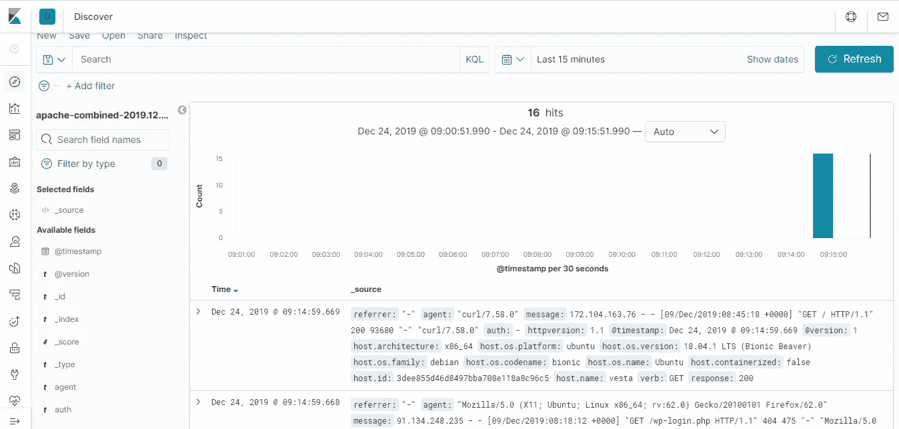

# 码头上的麋鹿栈

> 原文：<https://medium.com/analytics-vidhya/elk-stack-in-docker-6285ec1ac1aa?source=collection_archive---------0----------------------->


码头上的麋鹿

[Elastic stack](https://www.elastic.co/what-is/elk-stack) 以前被称为 ELK stack ( **E** lasticsearch， **L** ogstash， **K** ibana)是一个流行的开源日志分析工具，在每天产生大量数据的不同功能领域都有用例。人们可以读取这些异构数据，提取相关部分，并使用弹性堆栈实时可视化它们。栈的第四个元素是 beat(data shippers ),它被添加到 ELK 栈中，并被重命名为 elastic stack。

如果你是新手，在安装/配置 elastic stack 时可能会遇到困难，甚至可能会花费你估计的额外时间。使用 Docker 的安装过程的自动化将在很大程度上减少安装过程的时间和复杂性。因此，让我们从安装 Docker 开始，到在 Kibana Dashboard 中可视化 Apache 日志。

# 安装 Docker

用下面的一组命令安装 Docker。如果您已经为 Docker 设置了环境，请跳过这一步。

```
$ yum install wget
$ wget -qO- https://get.docker.com/ | sh
$ systemctl enable docker.service
$ systemctl start docker.service
$ systemctl status docker.service
```

# 安装 Docker 撰写

有了 docker compose，在 YAML 文件中为容器定义/配置服务和为应用程序设置环境变得很容易，我们也需要它，因为我们将使用 Docker compose 来定义多容器弹性堆栈。

```
$ yum install -y epel-release
$ yum install -y python-pip
$ pip install --upgrade pip
$ pip install docker-compose
```

# 弹性搜索容器

我们将从 [elasticsearch](https://www.elastic.co/products/elasticsearch) 开始集装箱化弹性堆栈。首先，创建一个根文件夹，在这个文件夹中，elastic stack 的每个组件都将被放在一起。

```
$ mkdir ~/docker-elk
```

导航到 elastic stack 的根文件夹，为 elasticsearch 创建文件夹，并为 elasticsearch 创建相关的配置/存储。

```
$ cd ~/docker-elk
$ mkdir -p elasticsearch/{config,storage}
$ chown -R 1000:1000 elasticsearch/storage/
```

`config`和`storage`文件夹将用于在后期定义 docker 合成文件中的 **docker 卷**。docker 卷将使主机中的文件夹与容器中的文件夹保持连接，并且将始终保持彼此同步。

为 elasticsearch 创建一个 docker 文件，这是放置所有需要组装图像的命令的方法。

```
$ cd ~/docker-elk/elasticsearch
$ vi Dockerfile
ARG ELK_VERSION
FROM docker.elastic.co/elasticsearch/elasticsearch:${ELK_VERSION}
```

定义您想要在环境文件中打包的 elasticsearch 的版本。

```
$ vi ~/docker-elk/.env
ELK_VERSION=7.5.1
```

现在继续在`config`文件夹中创建 elasticsearch 配置文件。在主机中有 ES 配置文件将使我们能够轻松地调整设置，并使用 docker volume 将其安装到容器中。

```
$ vi ~/docker-elk/elasticsearch/config/elasticsearch.yml
cluster.name: "docker-cluster"
network.host: 0.0.0.0
discovery.zen.minimum_master_nodes: 1
discovery.type: single-node
logger.level: DEBUG
```

通过 docker compose 定义 elasticsearch 容器所需的所有文件和文件夹现在都准备好了。继续在项目`~/docker-elk`的根目录下创建 docker compose 文件。

```
$ vi ~/docker-elk/docker-compose.yml
version: '3'
services:
  elasticsearch:
     container_name: elasticsearch
     build:
        context: elasticsearch
        args:
           ELK_VERSION: $ELK_VERSION
     volumes:
       - ./elasticsearch/config/elasticsearch.yml:/usr/share/elasticsearch/config/elasticsearch.yml
       - ./elasticsearch/storage:/usr/share/elasticsearch/data:rw

     ports:
       - "9200:9200"
       - "9300:9300"

     environment:
       - ELASTIC_PASSWORD="changeme"
       - ES_JAVA_OPTS=-Xmx256m -Xms256m
       - discovery.type=single-node
       - bootstrap.memory_lock=true
       - http.cors.allow-origin=*

     ulimits:
       memlock:
         soft:  -1
         hard:  -1

networks:
   elk:
     driver: bridge
```

构建容器:

```
$ cd ~/docker-elk
$ docker-compose build elasticsearch
```

以分离模式启动容器:

```
$ docker-compose up -d elasticsearch
```

列出容器:

```
$ docker ps -a
```

从您的主机 ping ES 容器:

```
$ curl http://127.0.0.1:9200/
{
  "name" : "a85bd40e10de",
  "cluster_name" : "docker-cluster",
  "cluster_uuid" : "cnGc-4uLSIWS-bFwr8ywug",
  "version" : {
    "number" : "7.5.1",
    "build_flavor" : "default",
    "build_type" : "docker",
    "build_hash" : "3ae9ac9a93c95bd0cdc054951cf95d88e1e18d96",
    "build_date" : "2019-12-16T22:57:37.835892Z",
    "build_snapshot" : false,
    "lucene_version" : "8.3.0",
    "minimum_wire_compatibility_version" : "6.8.0",
    "minimum_index_compatibility_version" : "6.0.0-beta1"
  },
  "tagline" : "You Know, for Search"
}
```

要找到任何有用的信息，您可以导航到 elasticsearch 容器的外壳:

```
$ docker exec -it elasticsearch /bin/bash
```

# Logstash 容器

像以前一样，在项目的根目录中为 [logstash](https://www.elastic.co/products/logstash) 及其配置设置创建以下文件夹。

*   **config**:`config`文件夹将保存 logstash 系统范围的配置设置。
*   **管道**:`pipeline`文件夹将保存您想要处理的每个日志文件的 logstash 配置设置。
*   **日志文件:**`logfile`文件夹将包含日志文件(网络日志、Apache 日志等等)

```
$ cd ~/docker-elk
$ mkdir -p logstash/{config,pipeline,logfile}
```

为 Logstash 创建 Dockerfile。

```
$ vi ~/docker-elk/logstash/Dockerfile
ARG ELK_VERSION
FROM docker.elastic.co/logstash/logstash-oss:${ELK_VERSION}
RUN logstash-plugin install logstash-input-beats
USER root
RUN mkdir -p /home/logstash/logfile
RUN chown -R logstash:logstash /home/logstash/logfile/
```

现在创建 Logstash 配置文件

```
$ vi ~/docker-elk/logstash/config/logstash.yml
http.host: "0.0.0.0"
path.config: /usr/share/logstash/pipeline
```

我们将使用 Apache 访问和错误日志来测试 Logstash 管道配置。那么如何将 apache 日志事件流式传输到 logstash 呢？一种实时传输 apache 日志的方法是使用 filebeat。

为 logstash 创建一个管道配置，它将在端口号 5000 中接受 apache 日志事件，并在应用适当的过滤器后将它们推送到 elasticsearch 容器。

```
$ vi ~/docker-elk/logstash/pipeline/01.apache.confinput {
        beats {
                port => 5000
                type => apache
        }
}filter {
       if [type] == "apache" {
        grok {
               match => { "message" => "%{COMBINEDAPACHELOG}" }
             }
        }
}output {
         if [type] == "apache" {
         elasticsearch {
                         hosts => ["http://elasticsearch:9200"]
                         index => "apache-combined-%{+YYYY.MM.dd}"
                       }
         stdout { codec => rubydebug }
         }
}
```

logstash 的所有必要配置设置都已就绪，可以在 docker compose 中为它定义服务。编辑 docker 合成文件，并在其中添加以下内容。

```
$ vi ~/docker-elk/docker-compose.yml
...
...
  logstash:
     container_name: logstash
     build:
        context: logstash
        args:
          ELK_VERSION: $ELK_VERSION
     volumes:
       - ./logstash/config/logstash.yml:/usr/share/logstash/config/logstash.yml
       - ./logstash/pipeline:/usr/share/logstash/pipeline ports:
       - "5000:5000" networks:
       - elk depends_on:
       - elasticsearch
...
...
```

构建日志存储容器

```
$ docker-compose build logstash
```

在没有分离模式的情况下运行 Logstash 容器，以在终端中查看 logstash 启动日志。

```
$ docker-compose up logstash
```

如果一切正常，按 CTRL+C，在分离模式下再次运行 logstash 容器。

```
$ docker-compose up -d logstash
```

列出集装箱

```
$ docker ps -a
```

# 基巴纳集装箱

从容器化 [Kibana](https://www.elastic.co/products/kibana) 开始，创建名为 **config** 的文件夹来保存 Kibana 配置。

```
$ cd ~/docker-elk
$ mkdir -p kibana/config
```

创建一个 docker 文件来组装最新 kibana 的映像。

```
$ vi ~/docker-elk/kibana/Dockerfile
ARG ELK_VERSION
FROM docker.elastic.co/kibana/kibana:${ELK_VERSION}
```

编辑和创建 Kibana 配置文件。

```
$ vi ~/docker-elk/kibana/config/kibana.yml
server.name: kibana
server.host: "0"
server.basePath: "/kibana"
elasticsearch.hosts: http://elasticsearch:9200
apm_oss.enabled: true
xpack.apm.enabled: true
xpack.apm.ui.enabled: true
logging.dest: stdout
```

最后，在 docker 文件中追加 Kibana 服务。

```
$ vi docker-compose.yml
…
…
  kibana:
     container_name: kibana
     build:
        context: kibana/
        args:
          ELK_VERSION: $ELK_VERSION
     volumes:
       - ./kibana/config/:/usr/share/kibana/config
     ports:
       - "5601:5601"
     environment:
       - ELASTICSEARCH_PASSWORD="changeme"
     networks:
       - elk
     depends_on:
       - elasticsearch
```

构建并运行 kibana

```
$ docker-compose build kibana
$ docker-compose up -d kibana
```

列出基巴纳容器:

```
$ docker ps -a
```

# NGINX 容器

添加 NGINX 容器的主要动机是通过反向代理提供对 Kibana 接口的密码保护访问。

在 docker 项目的根目录下为 NGINX 容器创建文件夹，然后创建两个名为`public`和`data`的子文件夹

```
$ cd ~/docker-elk
$ mkdir -p nginx/{public,data,etc}
```

为 NGINX 创建一个简单的索引文件

```
$ vi nginx/public/index.html
<html>
It Works
</html>
```

创建 NGINX 配置文件。

```
$ vi ~/docker-elk/nginx/etc/nginx.conf
worker_processes 4; events {
              worker_connections 1024;
}http {server {
       listen 80;
       server_name IP_OR_DOMAIN ; location / {
       root /usr/share/nginx/html;
       index index.html; 
       } location /elastic/ {
       proxy_pass http://elasticsearch:9200/;
       proxy_set_header X-Real-IP $remote_addr;
       proxy_set_header X-Forwarded-For $proxy_add_x_forwarded_for;
       proxy_set_header Host $http_host; auth_basic "Restricted Content";
       auth_basic_user_file /etc/nginx/.htpasswd.user;
       } location /kibana/ {
       proxy_pass http://kibana:5601/;
       proxy_set_header X-Real-IP $remote_addr;
       proxy_set_header X-Forwarded-For $proxy_add_x_forwarded_for;
       proxy_set_header Host $http_host;
       rewrite ^/kibana/(.*)$ /$1 break;
       auth_basic "Restricted Content";
       auth_basic_user_file /etc/nginx/.htpasswd.user;                     
       }
     }
}
```

对于 kibana 的密码保护访问，您需要安装`httpd-tools`并使用 htpasswd 创建用户/密码。

```
$ yum install httpd-tools
$ cd ~/docker-elk/nginx/etc
$ htpasswd -c .htpasswd.user admin
```

为 GINX 定义 docker 服务

```
$ vi ~/docker-elk/docker-compose.yml
…
…
 nginx:
    image: nginx:alpine
    container_name: nginx
    volumes:
      - './nginx/etc/nginx.conf:/etc/nginx/nginx.conf:ro'
      - './nginx/public:/usr/share/nginx/html:ro'
      - './nginx/etc/.htpasswd.user:/etc/nginx/.htpasswd.user:ro'
    links:
      - elasticsearch
      - kibana
    depends_on:
      - elasticsearch
      - kibana
    ports:
      - '80:80'
    networks:
      - elk
```

运行 NGINX 容器

```
$ docker-compose up -d nginx
```

列出 NGINX 容器:

```
$ docker ps -a
```

一旦 NGINX 容器启动并运行，使用 [http://SERVER_IP/kibana](http://server_ip/kibana) 访问 kibana 接口

使用以下命令检查任何容器的日志

```
$ docker logs container_name_or_id
e.g. docker logs elasticsearch
```

列出所有正在运行的容器

```
$ docker ps -a
```


测试弹性搜索容器

打开自己喜欢的网页浏览器，指向 [http://SERVER_IP/elastic](http://SERVER_IP/elastic)


# Filebeat 配置(客户端):

既然您的 ELK 栈已经启动并运行，那么使用 [filebeat](https://www.elastic.co/products/beats/filebeat) 从任何远程系统流式传输 Apache 日志来测试设置。您还可以选择一些其他日志事件，如 NGINX、CISCO syslog 等。但是要确保您有正确的 logstash 管道配置。

安装 filebeat:

```
$ wget [https://artifacts.elastic.co/downloads/beats/filebeat/filebeat-6.5.0-amd64.deb](https://artifacts.elastic.co/downloads/beats/filebeat/filebeat-6.5.0-amd64.deb)
$ dpkg -i filebeat-6.5.0-amd64.deb
```

配置 filebeat:

```
$ vi /etc/filebeat/filebeat.yml
...
...
filebeat.inputs:
- type: log
  enabled: true
  paths:
    - /var/log/apache2/*.log
...
...
output.logstash:
  # The Logstash hosts
  hosts: ["123.45.67.89:5000"]
...
...
```

运行 filebeat

```
$ filebeat -e -d "*"
```

通过导航到管理->索引模式->创建索引模式并在文本框中键入 apache-combined-*来找到 kibana 仪表板中的 ES 索引，以完成该过程。



基巴纳仪表板

# 结论

如果你已经弥补了这一点:——祝贺你！您已成功对接 ELK 堆栈。继续创建几个 logstash 管道，以便从不同的源传输日志事件。

代码@[https://github.com/DwijadasDey/docker-elk](https://github.com/DwijadasDey/docker-elk)