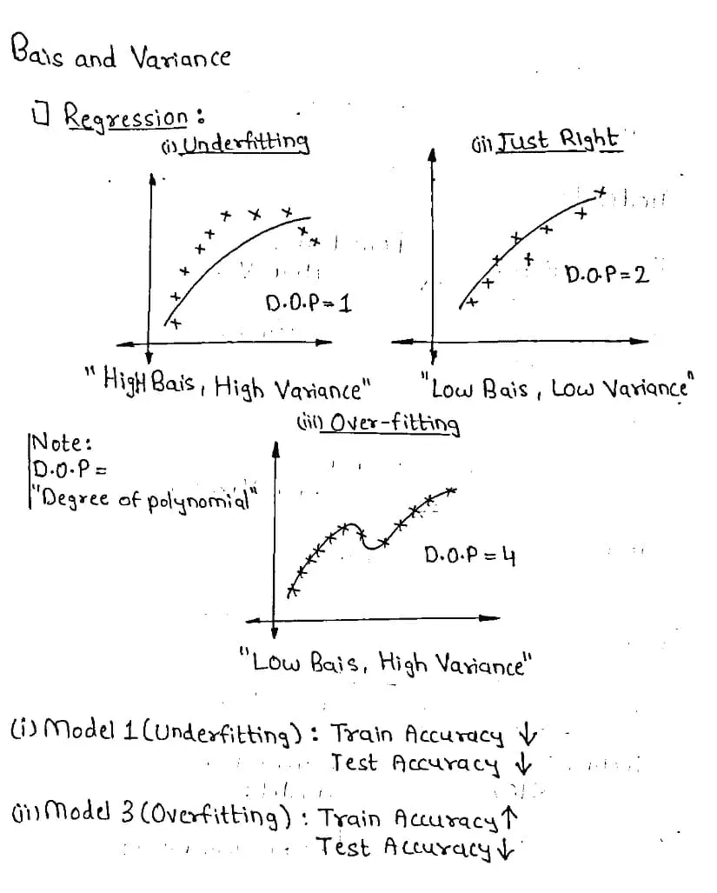
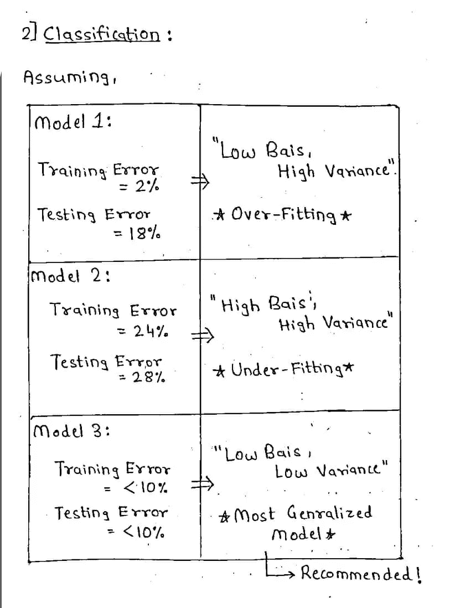

# 阐明偏差、方差、欠拟合和过拟合。

> 原文：<https://medium.com/analytics-vidhya/elucidating-bias-variance-under-fitting-and-over-fitting-273846621622?source=collection_archive---------0----------------------->

O **过拟合、欠拟合和偏差-方差权衡**是机器学习中的基本概念。它们很重要，因为它们根据模型的性能来解释模型的状态。理解这些术语的最佳方式是将它们视为模型的**偏差**和**方差**之间的权衡。我们来了解一下过度拟合和欠拟合的现象。

**过拟合**发生在[统计模型](https://chemicalstatistician.wordpress.com/2014/01/05/machine-learning-lesson-of-the-day-classification-and-regression/)或[机器学习](https://chemicalstatistician.wordpress.com/2014/01/04/machine-learning-lesson-of-the-day-supervised-and-unsupervised-learning/)算法**捕捉到数据的噪声**时。直觉上，当模型或算法与数据拟合得太好时，就会发生过度拟合。具体来说，如果模型或算法显示**低偏差**但**高方差**，则发生过度拟合。过度拟合通常是模型过于复杂的结果，可以通过拟合多个模型并使用[验证](https://chemicalstatistician.wordpress.com/2014/01/07/machine-learning-lesson-of-the-day-using-validation-to-assess-predictive-accuracy-in-supervised-learning/)或[交叉验证](https://chemicalstatistician.wordpress.com/2014/01/17/machine-learning-lesson-of-the-day-cross-validation/)来比较它们对测试数据的预测准确性来防止过度拟合。

**当统计模型或机器学习算法**无法捕捉数据的潜在趋势**时，就会出现欠拟合**。直观地说，当模型或算法与数据拟合得不够好时，就会出现拟合不足。具体来说，如果模型或算法显示**低方差**但**高偏差**，则发生欠拟合。拟合不足通常是模型过于简单的结果。

过度拟合和欠拟合都会导致**对新数据集的预测**不佳。

让我们用更简单的术语来理解偏差和方差。(**很简单的术语！**)

**什么是偏见？**

偏差是我们模型的平均预测值和我们试图预测的正确值之间的差异。具有高偏差的模型很少关注训练数据，并且过度简化了模型。

**简单定义:**“训练数据产生错误！”

**什么是方差？**

方差是给定数据点或告诉我们数据分布的值的模型预测的可变性。具有高方差的模型非常关注训练数据，并且不会对以前没有见过的数据进行归纳。

**简单定义:**“测试数据产生误差！”

为了更清楚、更好地理解这些概念，我将概念分成了两部分，在**回归**和**分类**模型的情况下的偏差和方差。

考虑**回归**模型:

图 1:回归模型的偏差和方差

我们可以清楚地看到，1 型和 3 型分别是**欠拟合**和**过拟合**。

模型-1 没有正确地捕捉趋势，或者模型太简单，因此很明显，训练和测试的准确性将受到影响！

如前所述，**“偏差是训练集产生的误差，而方差是测试集产生的误差！”**。模型-1 将具有较低的训练和测试精度，即具有高偏差(**高训练误差**)和高方差(**高测试误差**)。

类似地，对于模型-3，该模型在训练数据上训练得太好，这是它未能测试数据的原因(**测试精度低**)。由于模型 3 的训练精度高而测试精度低，因此模型 3 将具有低偏差(**低训练误差**)和高方差(**高测试误差**)。

考虑到 Model-2，由于 Model-2 处于“**恰到好处**的状态，因此该模型在训练集和测试集上都训练得很好。原因是，模型训练精度高(**低偏差-低训练误差**)和测试精度高(**低方差-低测试误差**)。

现在，让我们来考虑**分类**模型的条件，请看下图！

图 2:分类模型的偏差和方差

这里我们有 3 个模型，它们有以下训练和测试错误。

正如我们可以看到的，我们的分类模型-1 具有较低的训练误差(2%)，而具有较高的测试误差(18%)。正如前面所解释的概念，我们可以得出模型具有低偏差(低训练误差)和高方差(高测试误差)的结论，即**模型-1 明显过度拟合**！

类似地，我们可以得出结论，我们的分类模型-2 显然是一个欠拟合模型。对于模型-3，该模型应被视为最通用的**模型或最推荐的**模型进行训练！

这就是分别对回归和分类模型的欠拟合、过拟合、偏差和方差的解释！

我们已经完成了解释部分，现在让我们看看这些概念的**图形绘制**。请看下图！

图 3:偏差和方差的权衡

考虑图 3，穿过这些点的**虚线**是我们应该为其设计模型的点，这将是“**最一般化的模型**”。

这都是我一手造成的！如果你觉得这个博客有帮助，请喜欢(鼓掌！)这个博客，也评论一下你的观点，如果我漏掉了什么点。因为这些评论帮助我成长，下次带来更好的内容！

还有，在 **LinkedIn** 上联系我！(**我喜欢和像你这样了不起的人交往！**)。

 [## Gaurav Sahani -数据分析师实习生-neu brain Solutions Pvt Ltd | LinkedIn

### 机器学习，深度学习，云爱好者。喜欢探索新事物，增强和扩展我的知识…

www.linkedin.com](https://www.linkedin.com/in/gaurav-sahani-6177a7179/) 

此外，请关注并检查我的工作和项目贡献的 **GitHub** ！

 [## GauravSahani1417 -概述

### 每天都在学习新东西！每天都在学习新东西！机器学习、深度学习和云爱好者…

github.com](https://github.com/GauravSahani1417) 

感谢您为我的博客付出宝贵的时间！