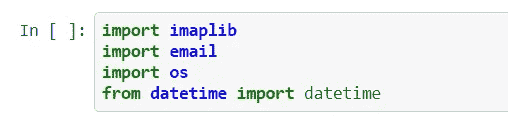
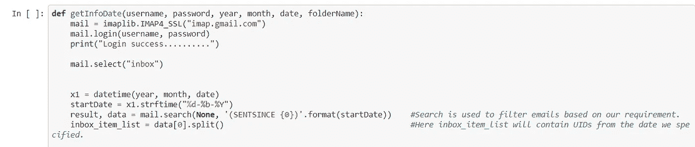
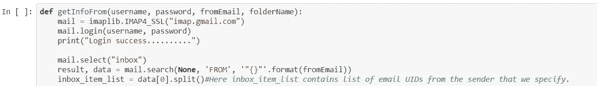
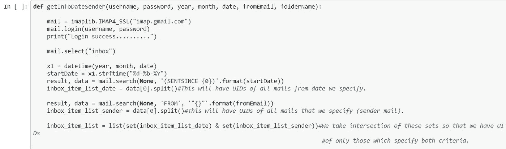
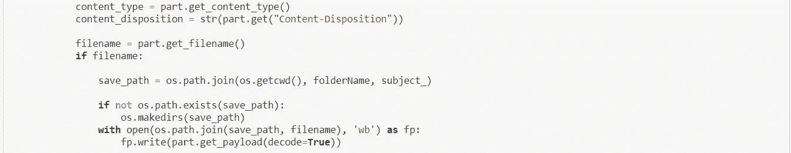
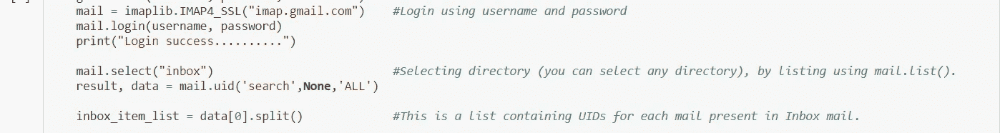
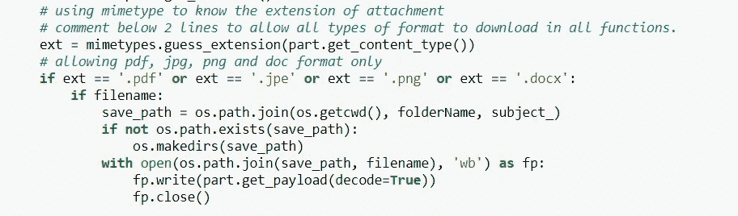

# 使用 Python 和一些过滤器提取电子邮件

> 原文：<https://medium.com/analytics-vidhya/email-extraction-using-python-with-some-filters-233ae451f011?source=collection_archive---------7----------------------->

本文介绍了如何通过提供用户名和密码从给定的 gmail 中提取电子邮件的概念。现在，该脚本从 gmail 服务器提取邮件，但是您可以通过访问此处的查看 imap 提供的其他邮件服务器来推广该脚本。

我们将使用以下库:

1.  imaplib
2.  电子邮件
3.  操作系统（Operating System）
4.  日期时间

确保通过检查此处的来允许不太安全的应用程序。

我介绍了 4 种过滤器，即:

1.  getInfoAll —这将保存指定文件夹中的所有信息(在我们的例子中是“收件箱”)。
2.  getinfoter——这将从我们指定的日期开始保存指定文件夹(在我们的例子中是“收件箱”)中的所有信息。

3.getInfoFrom——这将保存来自我们指定的发件人 gmail 的指定文件夹(在我们的例子中是“收件箱”)中的所有信息。

4.getinfodatasender——这将保存指定文件夹(在我们的例子中是“收件箱”)中来自发件人 gmail 和我们指定日期的所有信息。

请随意添加更多。这里我们使用 imap 从邮件服务器中检索信息。Content_disposition 帮助我们决定邮件是否有附件。Content_type 用于了解邮件的内容类型，如 text/plain 或 html。

为了理解这一点，我强烈建议在 gmail 的“显示原始选项”中打开带有附件的邮件。os.getcwd()用于返回当前工作目录，或者您可以指定您选择的特定目录。我正在创建“超过+计数器”作为目录的名称，如果主题长度超过 30，你可以用任何其他方法。我已经为所有邮件定义了“textfile.txt”来下载除邮件附件之外的所有信息。在每个文本文件中，我都保存了以下信息—[收件人、发件人、日期、主题、正文]。您可以根据需要添加更多信息。

为了访问提取文件夹而不是“收件箱”，请使用 mail.list()浏览其他文件夹。

#注意:当使用邮件的主题名称作为目录来下载信息时，一定要检查路径的长度，因为 windows 对路径长度有一些限制。

#注意:确保检查您系统支持的编码类型，并相应地进行修改。

#UPDATE:通过使用 mimetype 模块，您还可以只允许下载某些特定的文件格式。下面我们只允许 pdf，jpg，png 和 doc 文件。您可以根据自己的要求进行修改。

只允许下载特定的格式

有关代码详情，请访问[此处](https://github.com/jainyk/Email-extraction-along-with-some-filters-using-python)。对于任何建议和改进，请在下面提出请求或评论。