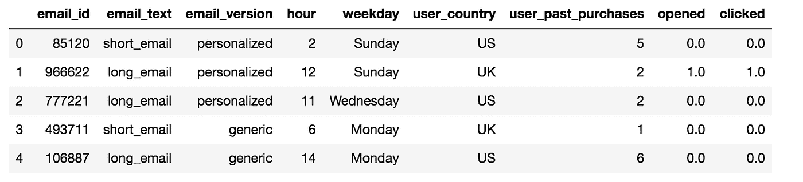
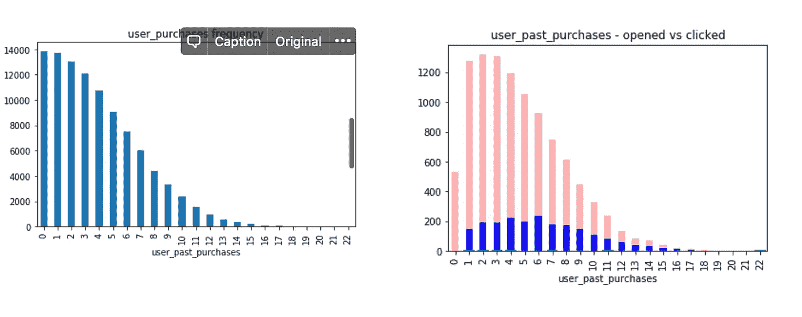
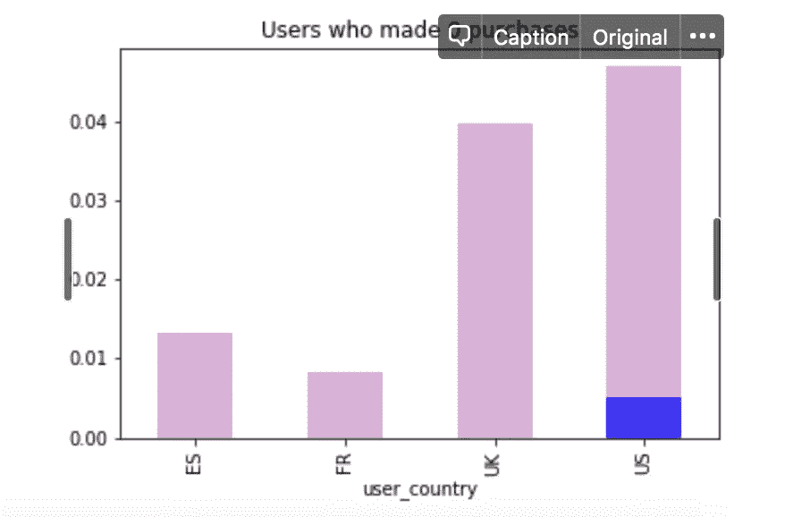
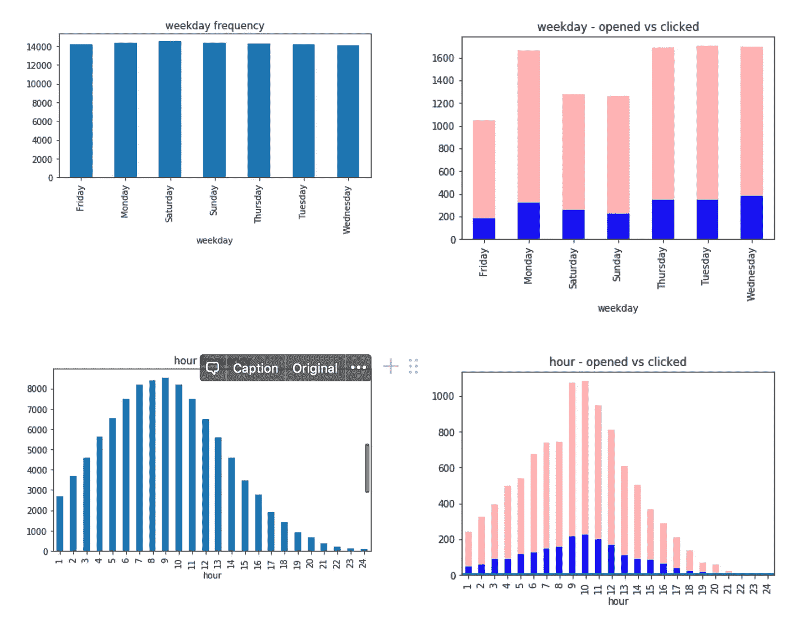
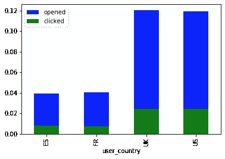
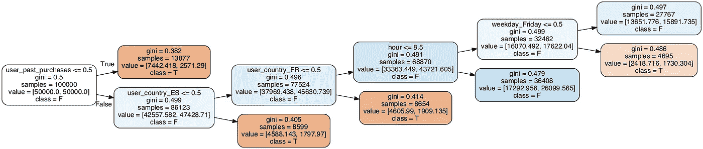
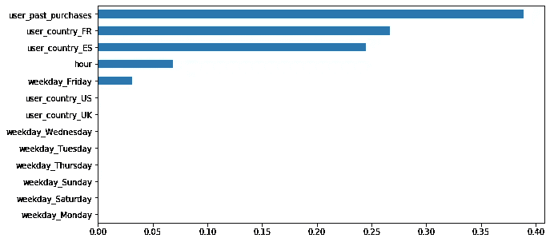
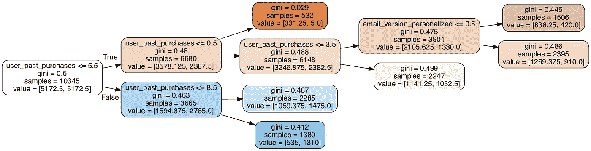
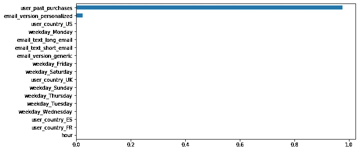

# 电子邮件营销活动——机器学习视角

> 原文：<https://medium.com/analytics-vidhya/email-marketing-campaign-a-machine-learning-perspective-146bdafc44be?source=collection_archive---------7----------------------->

威廉·艾文在 [Unsplash](https://unsplash.com?utm_source=medium&utm_medium=referral) 上的照片

这篇文章基于一个数据科学项目，用于分析电子邮件营销数据，如下图所示。jupyter 笔记本的链接在这里:[https://github . com/vnb/Data-Science-Portfolio/blob/master/Email % 20 marketing/Email % 20 marketing . ipynb](https://github.com/vnb/Data-Science-Portfolio/blob/master/email%20marketing/Email%20Marketing.ipynb)

电子邮件营销活动的样本数据集

“email_id”字段中的每个 email_id 都是唯一的，并且已经在一周的不同日期和一天的不同时间以上述字段中列出的相应格式发送了每个 email _ id。电子邮件被认为是以随机的方式发送的，没有考虑过去的任何客户行为或客户群。用户会采取两个动作:打开邮件，点击邮件中的链接。这本质上类似于客户漏斗。只有在电子邮件首先被打开的情况下，客户才能点击该链接。

大约 10%的客户打开了邮件，其中 20%的客户点击了里面的链接。为了提高点击率，寻找客户如何回复电子邮件的模式非常重要。

上面列出的功能可能有助于确定客户是否会首先打开邮件:

*   客户细分——按用户国家
*   时间—一周中的小时和天
*   过去的购买

如果电子邮件一开始就没有被打开过，那么与电子邮件本身相关的其他特征就无关紧要了。

为了提高点击率，电子邮件必须发送给最有可能首先打开它的客户。一种直觉可能是，与从未在网站上购买过产品的用户相比，过去购买过产品的用户可能对打开邮件更感兴趣。

电子邮件已经发送给过去购买过产品的顾客，也发送给过去从未购买过产品的顾客。那些从未购物的顾客最不可能打开这封邮件。然而，这一部分不能被忽视，因为他们是潜在的未来客户，电子邮件是获得他们的一种方式。

上面的可视化是针对以前从未购买过的 email _ ids 的。非常有趣的是，英国和美国的用户比西班牙和法国的用户更有可能打开邮件。在打开邮件的人中，来自美国的用户更有可能点击里面的链接。然而，这些转化率仍然很小。

其次，发邮件的时机很重要。虽然季节性可能是发挥作用的一个因素(在黑色星期五期间，用户可能更有可能打开营销电子邮件)，但没有年度或月度数据可供分析。这里唯一与时间相关的数据是一周中的小时和日期。

用户细分数据显示，来自英国和美国的客户更有可能打开并点击电子邮件。

基于以上所有信息，可以建立一个简单的决策树。如上所述，email_text 和 email_version 可以省略，因为这些功能对于衡量打开电子邮件的转化率无关紧要。

一个简单的决策树分类器产生以下结果:

正如所料，用户过去的购买、用户群和星期几起了很大的作用。像之前怀疑的那样，在周五和周末发送的邮件的转换率导致客户打开邮件的百分比较低。

正如之前观察到的，大约 20%打开邮件的顾客点击了里面的内容。由于电子邮件一开始是以随机的方式发送的，因此转换率非常低，点击邮件的用户总数仅占所有邮件收件人的 2%。因此，即使必须应用如上所述的 ML 方法，也存在巨大的阶级不平衡，并且这样的模型是不可靠的。

可以为打开邮件的所有电子邮件 id 建立与上述相似的决策树。训练集将包括除了一周中的小时和天之外的所有特征。为了简单起见，可以删除时间数据，因为既然邮件已经被打开，那么它是在一天中的什么时间发送的以及它是在一周中的哪一天发送的还重要吗？由于我们不知道邮件发送和打开之间的时间差，这些功能可以忽略。生成的决策树如下所示:

同样，user_past_purchases 是最重要的特征之一，其次是电子邮件是否个性化，这是决定客户是否点击 insider 链接的重要因素。

结论:

*   与没有购买的用户相比，至少购买过一次的用户更有可能打开邮件。因此，就提高打开和点击邮件的转化率而言，瞄准以前的客户会带来改进。如果邮件发送给之前至少购买过一次的用户，那么他们打开邮件的可能性会增加 10%。此外，与之前从未购买过邮件的顾客相比，之前购买过邮件并打开过邮件的顾客点击邮件的可能性至少高 5%
*   与美国和英国的客户相比，西班牙和法国的客户不太可能通过打开或点击链接来回复邮件。语言可能是转化率较低的一个原因。
*   在较小的程度上，一周中发送邮件的时间会影响转化率。与周末相比，客户平均在工作日打开和点击邮件。