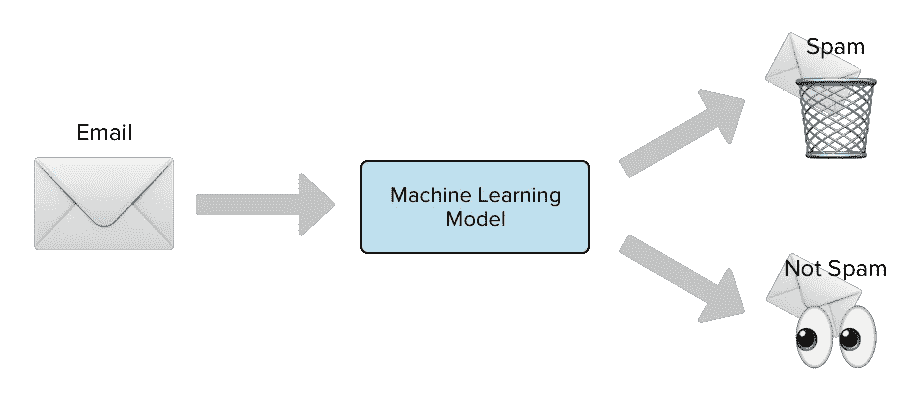
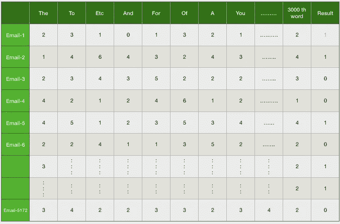

# 基于朴素贝叶斯的垃圾邮件分类器

> 原文：<https://medium.com/analytics-vidhya/email-spam-classifier-using-naive-bayes-a51b8c6290d4?source=collection_archive---------6----------------------->

如果你们想了解机器学习的基础知识。我已经用一种非常简单的语言写了一篇关于这个话题的文章，用真实世界的例子，并且简单的解释了所有的术语和分类。看完我的帖子后，你可以回答任何关于机器学习基础的问题。

以下是链接:-

[https://medium . com/@ 143 jshubham/机器学习及其对我们这一代的影响-4c0dbc201c1a](/@143jshubham/machine-learning-and-its-impact-on-our-generation-4c0dbc201c1a)



# 项目简介:-

这些信息是从不同的来源收集的

垃圾邮件，成为互联网上的一大麻烦。垃圾邮件浪费时间、存储空间和通信带宽。垃圾邮件的问题多年来一直在增加。在最近的统计中，40%的电子邮件是垃圾邮件，每天大约有 154 亿封电子邮件，每年花费互联网用户大约 3.55 亿美元。知识工程和机器学习是电子邮件过滤中常用的两种方法。在知识工程方法中，必须指定一组规则，根据这些规则将电子邮件分类为垃圾邮件或 ham。

机器学习方法比知识工程方法更有效；它不需要指定任何规则。取而代之的是一组训练样本，这些样本是一组预先分类的电子邮件消息。然后使用特定的算法从这些电子邮件中学习分类规则。机器学习方法已经得到了广泛的研究，有很多算法可以用于邮件过滤。它们包括朴素贝叶斯、支持向量机、神经网络、K 近邻、粗糙集和人工免疫系统。

## 为什么我们使用朴素贝叶斯作为过滤电子邮件的算法

朴素贝叶斯研究的是**相关事件**和未来发生的事件的概率，该概率可以从同一事件的先前发生中检测出来。这种技术可以用来分类垃圾邮件，**单词概率在这里起主要作用**。如果一些单词经常出现在垃圾邮件中，但不出现在 ham 中，那么这封传入的电子邮件很可能是垃圾邮件。朴素贝叶斯分类技术已经成为邮件过滤中一种非常流行的方法。每个单词在其数据库中都有一定的概率出现在垃圾邮件中。如果单词概率的总和超过某个限制，过滤器会将该电子邮件标记为任一类别。这里，只需要两个类别:垃圾邮件或火腿。

这里有一些计算帮助你理解它是如何工作。

我们对令牌 T 最感兴趣的统计数据是其垃圾邮件程度(垃圾邮件等级)，计算如下


其中，CSpam(T)和 CHam(T)分别是包含令牌 T 的垃圾邮件或 Ham 消息的数量。为了计算具有标记{T1，…，TN}的消息 M 的可能性，需要结合单个标记的垃圾信息来评估整个消息的垃圾信息。进行分类的一种简单方法是计算单个令牌的垃圾邮件度的乘积，并将其与单个令牌的垃圾邮件度的乘积进行比较

(H[M]=π(1-S[T]))

如果总垃圾邮件度乘积 S[M]大于汉明度乘积 H[M]，则该消息被认为是垃圾邮件。

## 所有的机器学习算法都在两个阶段上工作

1.  训练阶段。
2.  测试阶段。

因此，在训练阶段，朴素贝叶斯创建了一个查找表，其中存储了我们将在预测结果的算法中使用的所有概率可能性。

在测试阶段，假设你给了算法一个测试点来预测结果，他们从存储了所有可能性的查找表中获取值，并使用该值来预测结果。

## 现在我们对垃圾邮件分类器的主要工作开始了

首先，我想让你明白，我们有一个名为“电子邮件”的文件夹，其中有大约 5172 个文件，每个文件都是电子邮件中的一个，在每个电子邮件中，他们都提到特定的电子邮件是垃圾邮件或垃圾邮件。

我们的第一个目标是列出 5172 电子邮件中使用的所有单词。为此我们有一些步骤:

1.  在操作系统的帮助下，在 Jupiter 笔记本中加载“电子邮件”文件夹，其中每个文件都是一封电子邮件。

```
import os
folder='Desktop/e-mail/'
files=os.listdir(folder)
emails=[folder+file for file in files]
```

1.  借助 **f=open(e-mail)
    打开每个文件，如果你已经在 f=open()中给了一个文件，它打开那个文件进行阅读。**
2.  阅读文件。
    ***f.read()它读取那个邮件文件的所有内容并以字符串格式存储。***
3.  用空格(" ")分割文件并追加到列表中。

```
words=[]
for e-mail in e-mails:
 f=open(e-mail,encoding='latin-1')
 blob=f.read()
 words+=blob.split(" ")
```

此时，我们有一个单词列表，其中存储了 5172 电子邮件中使用的所有单词。但是我们不知道哪个单词出现了多少次，为了找到这个，我们将从集合中*导入计数器，这个计数器将给出哪个单词出现了多少次的结果
**从集合中导入计数器** 并在计数器中传递单词列表，它形成一个字典，显示哪个单词出现了多少次
 **word _ dict = Counter(words)***

现在我们有一个 Word_dict，其中存储了哪个单词出现了多少次，但我们不使用所有这些单词，因为这可能会降低我们算法的准确性，所以我们使用最常见的 3000 个单词，你可以选择任何数字，如 2500 个单词或任何东西，但这里我将选择前 3000 个单词。我们有一个从字典中找到最常见单词的方法
**word _ dict = word _ dict . most _ common(3000)**

word_dict 是这样的:-
**这里的键是单词，值是它出现的时间。**


这是垃圾邮件分类器中非常重要的一部分

我们都知道，为了训练数据，我们必须以行和列的形式制作数据，所以我们将制作一个表格数据，其中有一些行和列，其中每行是一封电子邮件，每列是一个在 word_dict 中出现的单词，值是一个整数，它显示 word_dict 中的特定单词在特定电子邮件中出现的次数。因此，它形成了(5172 x 3000)的形状，其中 5172 封电子邮件和所有 3000 个最常用的单词都存储在 word_dict 中。

在这里，我们制作了一个我们想要制作的表格



在 Email-1 中，你可以看到行是 Email，列是 word_dict 中的单词。在第一封邮件中，你会看到单词“the”出现了 2 次，“To”出现了 3 次，就像这样，你会看到最后一列是结果，其中有两个值 0 和 1，这表明给定的电子邮件是垃圾邮件还是非垃圾邮件。0 表示垃圾邮件，1 表示非垃圾邮件。

现在是在代码的帮助下制作这个表格的时候了，只要看看并试着理解:-


**我试着让你清楚这段代码如何帮助形成一个表格格式:-**
首先我们取两个空的标签和特性列表。然后，我们逐个接收电子邮件，在 f=open(email，encoding='latin-1 ')的帮助下，我们打开该文件，然后我们读取该文件，并根据空格(" ")进行分割，然后存储在 blob 中，现在我们从 word_dict (the，to，etc，for....)并检查 blob 中的出现并存储在数据列表中，因此内部 for 循环运行 3000 次，有 3000 个元素附加在数据列表中(data=[]),最后该数据列表附加在特征列表中(feature=[]),这意味着在特征列表中存在 5172 个数据列表，对于每封电子邮件都有一个数据列表。最后，我们检查单词“spam”是否在电子邮件标签中，如果单词“ham”在电子邮件标签中(label=[])，则添加 0

现在在这种情况下，我们有长度为(5172 )
的**特征列表和长度为(5172，)**的标签

在这里，要素和标注都是训练数据的列表格式，我们知道我们给了一个 Numpy 数组，因此我们将该列表更改为 Numpy 数组。

**features = NP . array(features)
label = NP . array(label)
shape(feature)必须是(5172 x3000)
shape(label)必须是(5172，)**

现在，我们在 sklearn.model_selection 的帮助下对数据进行训练测试分割

```
from sklearn.model_selection import train_test_split
X_train, X_test,y_train,y_test=train_test_split(features,label,test_size=0.2)
```

在这里，您可以看到 test_size =0.2，这意味着我们将 80%的数据提供给算法来学习或训练模型，其余的 20%用于测试。

为了训练模型，我们使用朴素贝叶斯算法

```
from sklearn.naive_bayes import MultinomialNB

Creating a object for this called clf
**clf=MultinomialNB()**
```

现在我们把数据交给算法来训练模型

```
clf.fit(X_train,y_train)
```

现在你的模型已经训练好了，你也可以在 accuracy_score 的帮助下检查你的模型是如何工作的。

```
from sklearn.metrics import accuracy_score
accuracy_score(y_pred,y_test)
```

这个准确度分数帮助我们预测您的算法的准确度。

现在我们的模型已经可以预测了，所以我们将接收一封输入电子邮件，然后检查我们的模型预测是否正确。


这里我们用一个变量 new_email 来表示一封邮件。在那之后，我们分开了整封邮件。然后，我们将统计这封输入邮件中存储在 word_dict 中最常见的单词。接下来，我们将该列表转换成一个 numpy 数组，并将其整形为(1，3000)。最后，我们使用 clf 对象中的模型预测结果，因为所有垃圾邮件或 Ham 的逻辑都存在于我们模型的 clf 对象中。这里 1 代表垃圾邮件，0 代表火腿。

**如果你想从头看到干净清晰的代码，你可以访问我的 Github 源代码。下面是链接:-**

[](https://github.com/143jshubham/Email-Spam-Classifier-jupiter_file/blob/master/Email%20spam%20classifer.ipynb) [## 143 jshubham/电子邮件-垃圾邮件-分类器-jupiter_file

### permalink dissolve GitHub 是 4000 多万开发人员的家园，他们一起工作来托管和审查代码，管理…

github.com](https://github.com/143jshubham/Email-Spam-Classifier-jupiter_file/blob/master/Email%20spam%20classifer.ipynb) 

如果任何一个人想在网站上转换这个垃圾邮件分类器，你想从用户那里得到一封输入的邮件，在垃圾邮件分类器算法的帮助下，你想预测输入的邮件是垃圾邮件还是垃圾邮件。为了这个你。可以访问我在 Medium 上的下一个博客。
**以下是链接:——即将推出…..**

# 结论:-

垃圾邮件分类器是机器学习领域中最好的项目之一。过滤垃圾邮件真的很有帮助，因为它已经成为互联网上的一大麻烦。机器学习是过滤垃圾邮件的最佳方式。在这个过滤过程中，我们可以使用多种算法，但我们正在研究朴素贝叶斯，因为这种算法的性能或准确性比其他算法更好。