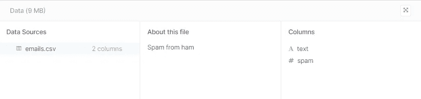
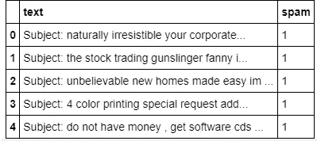
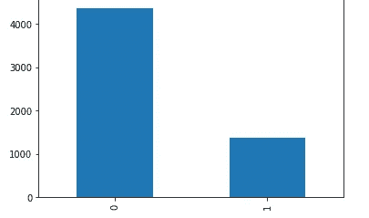
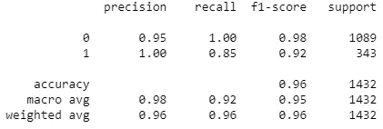
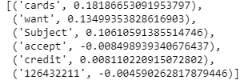
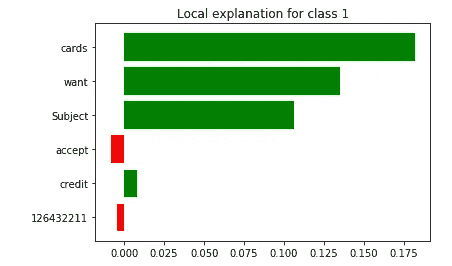
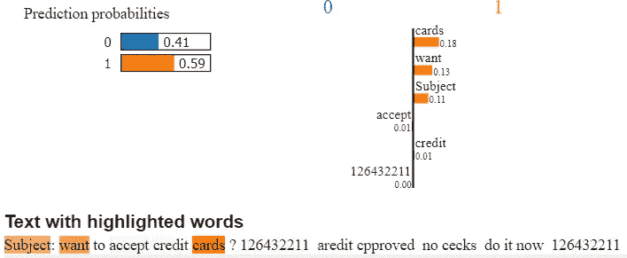

# 基于可解释人工智能的垃圾邮件检测

> 原文：<https://medium.com/analytics-vidhya/email-spam-detection-with-explainable-ai-lime-325f14ba683f?source=collection_archive---------10----------------------->


这篇博文讨论了一个简单的垃圾邮件检测逻辑回归算法，该算法使用朴素贝叶斯来预测电子邮件是否是垃圾邮件。之后使用 LIME(可解释的 AI)解释算法的结果。

# 数据源:

[](https://www.kaggle.com/karthickveerakumar/spam-filter) [## 垃圾邮件过滤器

### 使用电子邮件识别垃圾邮件

www.kaggle.com](https://www.kaggle.com/karthickveerakumar/spam-filter) 

数据规格

# 加载数据:

```
**import** **numpy** **as** **np** 
**import** **pandas** **as** **pd** 
**import** **matplotlib.pyplot** **as** **plt**
% matplotlib inline

df=pd.read_csv("emails.csv")
df.head()
```



# 数据集分布:

```
df['spam'].value_counts().plot.bar()
```



# 文本矢量化:

```
**from** **sklearn.feature_extraction.text** **import** TfidfVectorizer
tfidf = TfidfVectorizer(sublinear_tf=**True**, min_df=5, norm='l2', ngram_range=(1, 2), stop_words='english')
features = tfidf.fit_transform(df['text']).toarray()
features.shape
X=pd.DataFrame(data=features)
Y=df['spam'].astype(str)
df['spam']=df['spam'].astype(str)
```

# 训练朴素贝叶斯分类器:

```
**from** **sklearn.model_selection** **import** train_test_split
**from** **sklearn.feature_extraction.text** **import** CountVectorizer
**from** **sklearn.feature_extraction.text** **import** TfidfTransformer
**from** **sklearn.naive_bayes** **import** MultinomialNB

X_train, X_test, y_train, y_test = train_test_split(X, Y, random_state = 0)

clf = MultinomialNB().fit(X_train, y_train)
```

# 进行预测:

```
y_pred=clf.predict(X_test)
```

# 分类指标:

```
**from** **sklearn.metrics** **import** classification_report
print(classification_report(y_test, y_pred))
```



分类报告

# 使用石灰建立可解释的模型:

## 什么是可解释的人工智能，为什么它很重要？

在一个产品背后，有一个由数据分析师、业务分析师、产品工程师、销售、市场营销等组成的团队。很明显，一个团队的范围从技术专家到没有技术语言或技术语言有限的业务专家。所以现在的问题是，作为一名机器学习开发者，我如何解释我的见解。我怎样才能给我的结果带来自信？我一个商业人士怎么能在“黑匣子”上做决定。

答案是“可解释的人工智能”砰！。**可解释的人工智能**指的是解决方案的结果可以被人类专家理解的方法和技术。

## 石灰安装:

Lime 可以使用 pip 命令简单地安装。

```
pip install lime
```

## 实施:

```
**from** **lime.lime_text** **import** LimeTextExplainer
class_names=['0','1']
explainer = LimeTextExplainer(class_names=class_names)idx = 30
exp = explainer.explain_instance(df.text[idx], c.predict_proba, num_features=6)
print('Document id: **%d**' % idx)
print('Probability=', c.predict_proba([df.text[idx]])[0,1])
print('True class: **%s**' % df.spam[idx])exp.as_list()
```



exp.as_list()

```
%matplotlib inline
fig = exp.as_pyplot_figure()
```



```
exp.show_in_notebook(text=**True**)
```



## 结论:

我们能够构建一个简单的二进制垃圾邮件分类问题。不仅如此，我们还学会了用石灰构建可解释的人工智能。

Lime 解释了为什么某封邮件被识别为垃圾邮件。它通过颜色编码给出了在分类任务中使用的每个表征重要性的见解。

该算法给出了 97%的正确预测。该算法以 59%的置信度预测上述特定电子邮件为“垃圾邮件”，以 41%的置信度预测为“非垃圾邮件”。像“卡”、“想要”这样的词更有可能出现在垃圾邮件中。