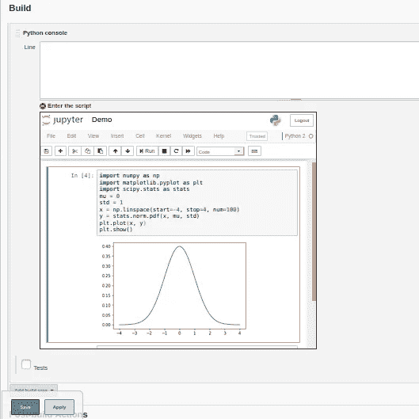

# 在本地静态网页中嵌入 Jupyter 笔记本

> 原文：<https://medium.com/analytics-vidhya/embed-jupyter-notebook-into-static-webpages-locally-79e8a6f9f987?source=collection_archive---------5----------------------->

## 嵌入 Jupyter 笔记本的快速教程

数据科学和机器学习爱好者正在他们自己的博客和文章中发布他们的研究以及主要用 Python 或 R 编写的代码。我们中的许多人仍然在努力公开我们的代码，以便在我们的网页上交互运行，而不分散持续阅读我们博客的用户的注意力。一个新的 web 开发人员无需任何深入的分析就能解答这个难题。

<**iframe src = " http://localhost:8888/"**></**iframe**>

上面的 HTML 标签可以解决这个问题，直到**内容-安全-策略**进入上下文。为什么要使用**内容安全策略**？CSP 的主要好处是防止利用跨站点脚本漏洞。这一点很重要，因为 XSS 的漏洞有两个特点，这两个特点使得它们对 web 应用程序的安全性构成了特别严重的威胁。

*   XSS 无处不在。跨站点脚本一直被列为 web 应用程序中最常见的缺陷之一；过去，几乎所有大型应用程序都遭受过 XSS。
*   XSS 正在**破坏**。利用这种缺陷并在另一个用户会话的上下文中执行 JavaScript 的攻击者可以完全访问易受攻击的应用程序以及同一域中托管的所有其他应用程序中的数据。在许多情况下，攻击者可以破坏帐户并保持持久访问，而用户不会意识到有问题。

如果不考虑 CSP，最终会给网站和服务器带来有害的后果。互联网上有很多借助 binder 和 GitHub gist 将 Jupyter 笔记本代码嵌入网页的教程。文章末尾提供了链接。

让我们快速地继续我们在这篇文章中探索的内容。

现在，流行的应用程序有基于 Java 的后端和基于 web 的前端。这种非凡的方法得到了软件开发人员和技术极客的回报。例如，Jenkins 使用 Java 后端的订书机进行 Web UI 绑定。在这种情况下，在某些方面，这些应用程序应该通过支持机器学习和数据科学来发展，这可能会吸引大量技术用户使用他们的服务。

当这些应用程序使用网页时，可能需要集成流行的笔记本、代码编辑器和沙盒。来自 web UI 的每个请求对于后端来说都应该是安全和健壮的。

让我们看看如何在本地将你的 Jupyter 笔记本嵌入到静态网页中。

1.  确保您的系统中安装了 Jupyter 笔记本电脑。

```
jupyter -- version
```

2.配置**jupyter _ notebook _ config . py**

*   如果你没有一个生成它。它将在`~/.jupyter/jupyter_notebook_config.py`中生成文件

```
jupyter notebook --generate-config
```

*   添加您的网关服务器 IP 和端口

```
# These are default configs. You have change if you are using 
# Enterprise Jupyter Hub or other gateway servers.
c.NotebookApp.ip = ‘localhost’
c.NotebookApp.port = 8888
```

*   由于 Jupyter 使用 tornado 进行 HTTP 服务，您需要将 CSP 头添加到 tornado_settings 中。确保您提供了正确的 http/https 地址以使用 CSP 头。

```
c.NotebookApp.tornado_settings = {
    'headers': {
        'Content-Security-Policy': "frame-ancestors http://localhost:8080/jenkins 'self' "
    }
}
```

*   最后，用户将会更喜欢一个标签的笔记本，而不是在一个页面中使用多个标签。您应该在 jupyter 目录中创建一个 custom.js。`~/.jupyter/custom/custom.js`

```
define(['base/js/namespace'], function(Jupyter){
    Jupyter._target = '_self';
});
```

3.稍后配置好一切，你就可以使用标签将你的 jupyter 笔记本成功嵌入到你的网页中了。

```
<**f:entry**>
    <**iframe width = "700" height=" 600" src="http://localhost:8888** </**iframe**>
</**f:entry**>
```

您可以根据自己的需要调整 **iframe** 的参数:)。



在 config.jelly 中嵌入 Jupyter 笔记本后

4.已知问题

*   如果您的控制台中仍然出现类似“连接失败”的错误。原因可能是在使用 wss 时，web 套接字连接被浏览器拒绝。你可以试试添加`'unsafe-inline'` 和`connect-src https: wss:` ，肯定能解决你的问题。

我希望大家都读过一篇关于在网页中嵌入 Jupyter 笔记本的综合文章。

和平✌.

参考资料:

1.  [https://elc.github.io/posts/embed-interactive-notebooks/](https://elc.github.io/posts/embed-interactive-notebooks/)
2.  [https://www.w3schools.com/tags/tag_iframe.asp](https://www.w3schools.com/tags/tag_iframe.asp)