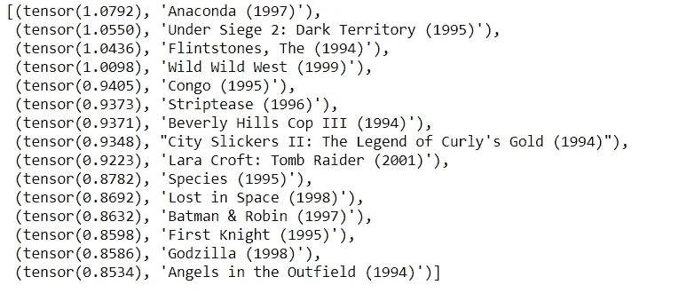

# 嵌入矩阵

> 原文：<https://medium.com/analytics-vidhya/embedding-matrices-ba8d0e6b85d7?source=collection_archive---------23----------------------->

## 神经网络学习的奇妙方式。

直到上周，我看待模型“学习”的方式是通过准确性。如果精确度很高，那么模型就相当不错；这种看法当然有助于分类问题。但是看着其他的应用，直觉变得很模糊，损失变得越来越低，我只能在非常基础的水平上理解。

上周，当我在观看 Fastai MOOC 的[第 5 课](https://course.fast.ai/videos/?lesson=5)时，杰瑞米·霍华德(fast.ai 的联合创始人)展示了一个模型的解释，该模型来自一个团队，该团队在[罗斯曼商店销售卡格尔竞赛](https://www.kaggle.com/c/rossmann-store-sales)中获得第二名。他们在一个表格问题中使用了神经网络，这在 2016 年是前所未有的。他们使用实体嵌入来学习分类变量之间的内在关系。

嵌入的神奇之处在于，如果我们看这个图表，它学会了地理。罗斯曼是一家德国零售药店，他们在德国有大量的商店。销售受地理位置的影响。这意味着像我们一样的机器可以学习决定产品或服务的许多因素之间的关系。

嵌入是*低维、* *学习到的*离散变量的连续向量表示。在神经网络的上下文中，这个抽象的定义并没有给我多少关于嵌入到底是什么的清晰的概念，我想要对它有一个感觉。

我决定用这个[笔记本](https://nbviewer.jupyter.org/github/fastai/course-v3/blob/master/nbs/dl1/lesson4-collab.ipynb)做一个协同过滤模型来推荐电影。我用最新的[电影镜头](https://grouplens.org/datasets/movielens/) 100K 数据集得出一些有趣的见解。

我取了评分最高的 1000 部电影的平均评分，并根据偏差进行了排序。在这种情况下，偏见是我们对电影的先入为主的观念，一个例子是提到马丁·斯科塞斯制作电影已经让我觉得它会很好(积极的偏见)。

倒数 15 部电影。

前 15 部电影。

偏向正面的电影收视率高，底层的电影收视率差。《肖申克的救赎》是 IMDB 上评价最高的电影之一。现在让我们转到嵌入矩阵，机器学习的特征。

模型有 40 个因素或属性，很难掌握一个 40 维的图。所以我用主成分分析把因子数减少到 3。

## 因素 1 —质量

倒数 15 名

前 15 名

顶部的电影制作精良，《搏击俱乐部》堪称经典。随着我们在名单上的位置越来越靠后，电影的质量越来越差，《蟒蛇》肯定不是我想让自己再次经历的事情。

## 因素 2 —受众

倒数 15 名

前 15 名

排在最前面的电影非常粗糙，主题阴暗，与排在最后面的相比，观众相对较少。谁不爱狮子王(动画那部)？

## 因素 3——行动/暴力

倒数 15 名

前 15 名

《音乐之声》几乎没有任何暴力，在光谱的另一端，300 有血、剑和男人的胸部。

因子 2 和因子 3 的散点图

在这张绘制了前 50 部电影的图表中，我们看到大量的大片都有相当数量的暴力/动作。

# 结论

我从摆弄模型和解释因素中获得了很多乐趣。真正让我惊讶的是，这个模型是如何在没有任何背景的情况下学习这些因素的，不像人类那样已经拥有广博的世界知识。有些因素我们人类甚至没有意识到，这是令人兴奋的。