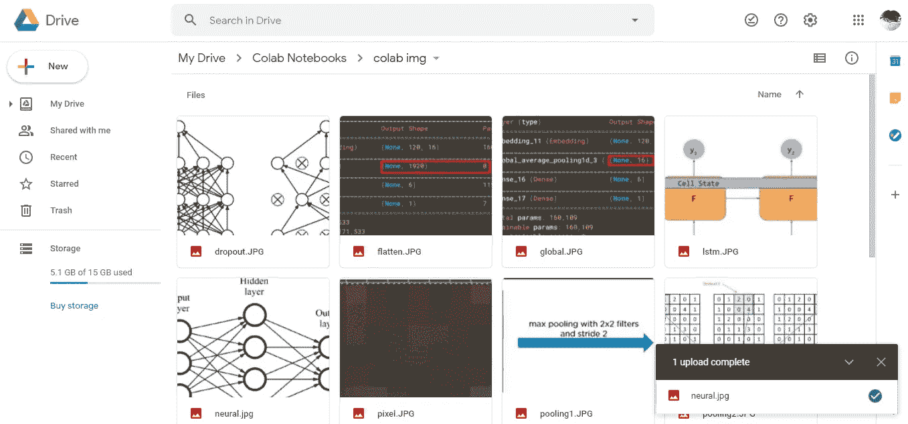
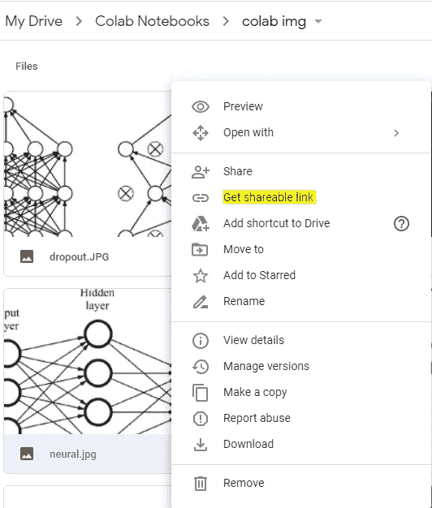
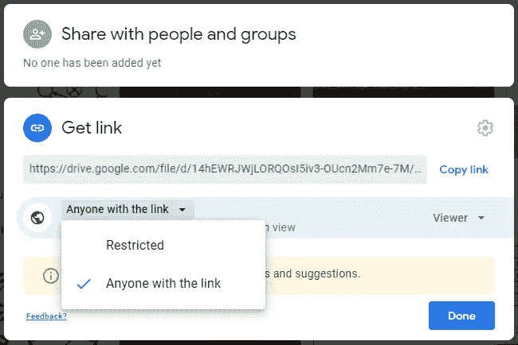
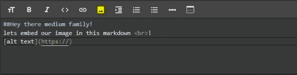
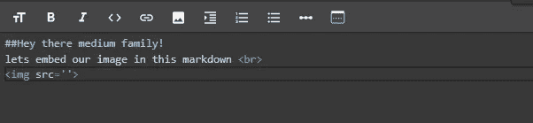
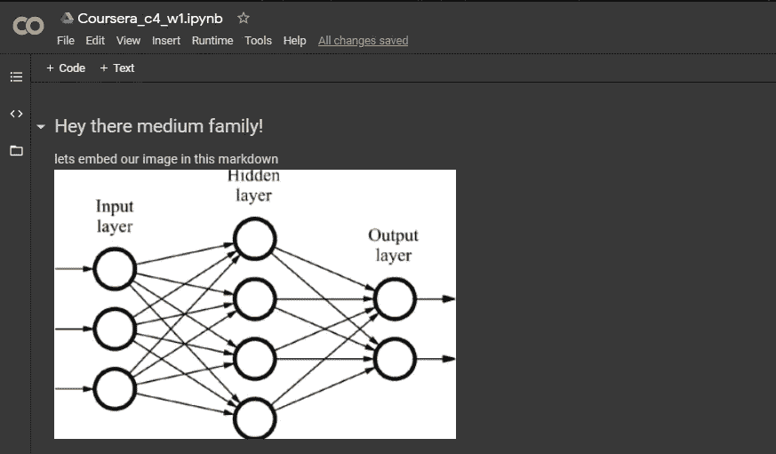

# 在 google colab markdown 中嵌入您的图像

> 原文：<https://medium.com/analytics-vidhya/embedding-your-image-in-google-colab-markdown-3998d5ac2684?source=collection_archive---------0----------------------->

这篇文章是一个快速指南，可以帮助你在 google colab markdown 中嵌入图片，而无需安装你的 google drive！

## **简单介绍一下 google colab**

Google colab 是一项云服务，向开发者和学习者提供免费的 python 笔记本环境，以及免费的 GPU 和 TPU。用户可以在浏览器中编写和执行 Python 代码，无需任何预先配置。它提供两种类型的单元格:*文本*和*代码*。“代码”单元的作用类似于代码编辑器，编码和执行在这个模块中完成。“文本”单元用于嵌入文本描述/解释以及代码，它使用一种称为“markdown”的简单标记语言进行格式化。

## 在 markdown 中嵌入图像

如果你像我一样，是一个经常使用 colab 的用户，使用 markdown 向代码中添加额外的细节也会成为你的习惯！在开发 colab 的时候，我试图在 markdown 中嵌入图片和文本，但是我花了将近一个小时才找到方法。所以这里有一个简单的指南可以帮助你。

**第一步:**

第一步是将图片放入你的 google drive。所以把你想嵌入 markdown 的所有图片上传到你的 google drive。

**第二步:**

Google Drive 为你提供了通过共享链接分享图片的选项。右键单击你的图片，你会发现一个选项来获得一个可共享的链接。

选择“获取可共享链接”，谷歌将创建和显示特定图像的可共享链接。

确保将共享的“受限”模式更改为“任何有链接的人”,并复制类似的内容

**第三步:**

复制的可共享链接将采用以下格式

> https://drive.google.com/file/d/**<图片 ID>**/查看？usp =共享

该格式将来可能会改变，但我们需要嵌入的只是来自 URL 的图像> 的 **< ID。一旦你确定了“ID ”,复制它。**

**第四步:**

现在我们有了 ID，我们将使用下面的 URL 格式来嵌入图像

> [https://drive.google.com/uc?id=](https://drive.google.com/uc?id=)**<图片 ID>**

用复制的 ID 替换<id of="" image="">。此 URL 将用于您的降价以嵌入图像。</id>

**第五步:**

现在，最后一步是在 markdown 中实际嵌入图像。这可以通过以下两种方法中的任何一种来完成

*   使用 colab 插入图像功能

单击“降价”单元格顶部的图像图标。这将在 markdown 中插入“[alt text](https://)”。将“https://”替换为我们在上面创建的 URL。

*   使用 HTML 标签

使用 HTML 标签，并将我们创建的 URL 指定为它的“src”(source)。HTML 标签可以让你指定图片的大小。

这两种方法的最终结果都是

谢谢你，希望这个指南有一天对你有用！