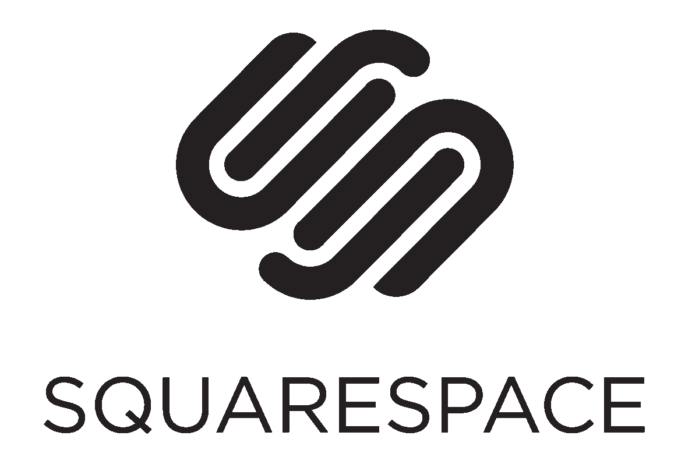

# 将您自己的代码嵌入到 Squarespace 中

> 原文：<https://medium.com/analytics-vidhya/embedding-your-own-code-into-squarespace-d758bdf9f9b2?source=collection_archive---------18----------------------->

# 开发者也用！

如果你不知道 Squarespace 是什么，即使你自己是一个新的 web 开发人员，你也应该去看看。虽然它看起来像一个简单的模板网站，允许企业家和艺术家炫耀他们的项目或投资组合，轻松设计自己的网站，但它实际上给了开发者许多工具，允许他们定制自己的网站。我强烈推荐 Squarespace，即使是从开发者的角度。如果你刚开始做开发，这是一个制作个人网站的好方法，不用担心必须从头开始编码，这样你就可以专注于快速清晰地展示你的项目和你自己。实现你自己的代码来获得 CSS 或 JavaScript 功能也是可能的！

# 添加 HTML

在提供自己的代码时，向 Squarespace 添加 HTML 是最简单的过程。在您的个人资料上，选择一个模板并开始向您的页面添加内容。他们的用户界面很容易做到这一点，一旦你添加了一张图片或一些文本，你会开始看到更多可用的选项。

将鼠标悬停在页面上，会看到菜单出现在右上角，显示“**页面内容**”这个小菜单会给你编辑的选项，这就是我们想要的！一旦我们选择了 edit，我们的页面将会打开，其中包含我们添加的所有独立元素。这可以是文本块、标题、图像、按钮等。做你自己的 HTML，确保不要编辑已经存在的元素，而是*创建一个新的部分*。

这可以通过屏幕左侧的一个灰色小点发现，上面有一条横线，这将让您知道您可以在这里添加新元素。当你点击灰点时，它会给你很多选项来添加(图片、文本、横幅等)。我们想做的是在这一部分添加*代码*。

选择此项后，将弹出一个窗口，显示文本区域。在这里我们可以添加我们的 HTML！这是我们添加标签或

标签的地方，而不是简单地将图像放入或写入它们的预制部分。请注意，这将没有终端或 IDE 的可能性，只有一些标签的颜色(比记事本好，但不多)。小的编辑窗口和文本区域也不能变大，所以我建议使用您最喜欢的代码编辑器编写您的代码，然后将其复制并粘贴到文本区域(我建议使用 VS code！).

# 添加 CSS

难的部分完成了；我们找到了添加代码的位置以及添加代码的最佳方式！接下来是添加 CSS。由于我们在 Squarespace 的文本编辑器中没有多个可用文件，我们需要在 HTML 顶部的

我们这里也有一些不同的选项来改变页面！如果我们想将 CSS 应用到更大的区域，我们可以在进入“**页面内容**菜单时进入**设置**而不是**编辑**。从这里我们点击**高级**，然后我们可以添加 CSS 到页面中。

更进一步，我们可以将**覆盖 CSS** 应用到我们创建的整个网站。不过要小心**因为这将覆盖所有写入网站的 CSS！这包括设计者为使预先设计的元素看起来漂亮而编写的 CSS——所以如果我们用自己的 CSS 编写，这可能会覆盖他们的代码，搞乱我们的网站。请记住这一点！**

如果我们的主菜单是折叠的，我们必须点击网站的左上角——会有一个带箭头的小白角。一旦点击，我们的主菜单就会出现。点击**主页**菜单中的**设计**，然后点击**自定义 CSS** 。在这个区域，我们可以添加任何我们需要的 CSS，并看到它实时改变网站。如果你这样做的话，一定要检查你的每一页，因为它会改变你不想要的元素的布局！

# 添加 JavaScript

JavaScript 可以添加到 Squarespace，但只能从付费墙后面添加。一旦你决定开始为 Squarespace 的高级功能付费，包括你自己的域名，你就可以在你的网站上添加 JavaScript。虽然我不是一个会为奢侈服务付费的人，但我认为任何专业人士都应该真正考虑为 Squarespace premium 打电话，如果他们希望自己的业务或投资组合真正发光发热并受到重视的话。

如果已经做了这个选择，那就再简单不过了！要添加 JavaScript，我们执行与添加 HTML 相同的过程；我们将打开那个小的文本编辑窗口。打开后，我们可以从下拉菜单中看到 JavaScript 现在可用了！这样，我们的页面就会自动选中编辑器中的一个框，这个框显示我们的代码，而不是我们在站点上的内容。这很好，但是*我们不能在主窗口*中编辑代码——它只是显示它。

给我们的文本编辑器添加一个

# 我们现在可以用模板制作自己的网站了！

现在我们知道了如何在 Squarespace 中实现自己的代码，这使得它成为一个更有吸引力的工具，可以让早期开发人员在自己的投资组合中使用，同时仍然能够添加他们的代码！这是一个很好的实践场所，在我们发展自己技能的同时，给 Squarespace 的人们提供更复杂的设计元素。试试看！尤其是在使用免费版本的时候。