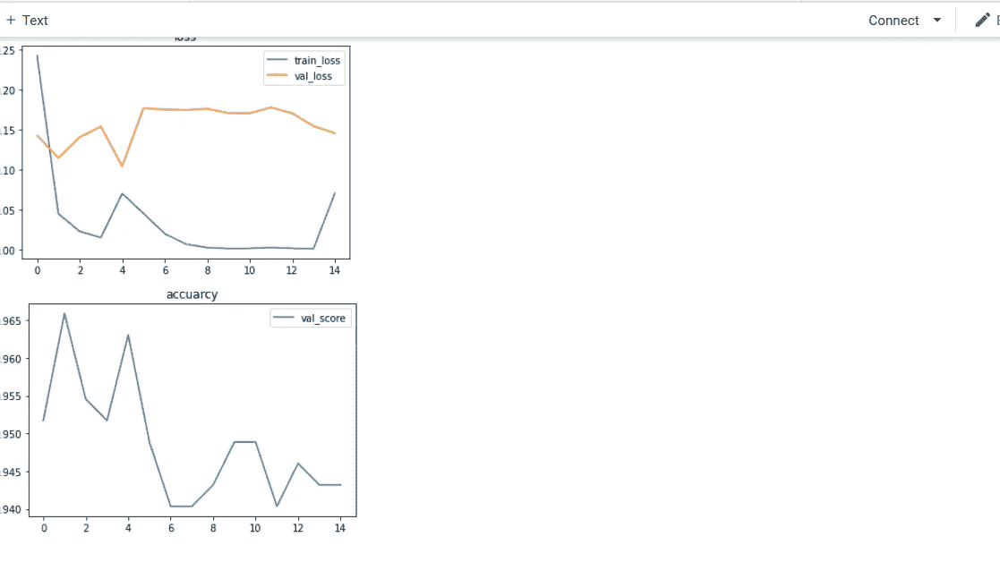

# 紧急与非紧急车辆分类

> 原文：<https://medium.com/analytics-vidhya/emergency-vs-non-emergency-vehicle-classification-cc5907977fe5?source=collection_archive---------12----------------------->


## 动机

最近我参加了由 Analytics Vidhya 主办的 JanataHack:计算机视觉黑客马拉松。比赛的目的是创造一个二进制图像分类器，可以区分非紧急车辆，如私人拥有的车辆。来自紧急车辆(警车、救护车等)。

最初我在提交的时候用的是 keras。但后来我决定实现一个 pytorch 版本，看看使用 pytorch 是否有任何优势，因为大多数顶级参与者都使用 fastai，而 fastai 在后端使用 pytoch。

# 为什么这很重要？

由于救护车和消防队等紧急车辆的交通延误造成的死亡是一个巨大的问题。在日常生活中，我们经常看到应急车辆在交通中面临通行困难。

因此，将车辆分为紧急和非紧急类别可能是交通监控以及自动驾驶汽车系统中的一个重要组成部分，因为准时到达目的地对于这些服务至关重要。

## **数据描述**

列车组共有 **1646 辆，试验组**共有 **706 辆。**

有两个。包含训练和测试图像名称的 csv 文件。


**阶级平衡**

阶级不平衡。

```
0    965
1    681
```

这里 **0 代表非紧急**车辆， **1 代表紧急**车辆。

第 0 类中还有大约 284 个图像。

这没有造成任何问题，所以我没有试图在增强阶段平衡它们。

查看标签和问题陈述，我们可以得出结论，这是一个**二元分类问题**

## 埃达。


**来自列车的样本图像**

拥有一个小数据集的一个好处是，我们可以浏览所有的图像，看看是否有异常值，错误标记的样本。

通过这样做，我发现 6 张图片是误分类的，有些图片只包含仪表板。

# **小姐贴上标签的图片。**


通过移除这些图像，我的准确度将 val_score 提高了 2%。从 94%到 96%，有时达到 97%，我使用的模型是 resnet50。同样的实现在 keras 中只得到 94%。

现在我想花点时间在这里欣赏 pytorch。我真的不知道为什么会这样，也许有人能帮我。

# **仪表盘图片。**


通过去除这些图像，精度变得更加稳定(更少的振荡)。

需要注意的是，我之所以能够删除这些仪表板图像，是因为我在测试数据中没有找到任何类似的图像。

# **数据管道。**


我没有在这些项目中使用任何增强功能。

# 模型


这里我使用了教程 4 和 5 中使用的相同模型。我在每个 conb2d 层之后都添加了一个 batchnorm 层。

我也尝试添加一个辍学层，但没有效果，所以我删除了它。

# 权重衰减和梯度剪裁实验

使用简单拟合函数。尝试权重衰减和渐变剪裁

保持一切不变，只改变一个参数，如权重衰减或梯度裁剪。我们可以观察谁的参数会影响学习

## **选择重量衰减**


**试验不同重量衰减的代码。**


**训练，val 损耗和不同体重衰减的评分。**

从上表中我们可以看出，1e-3 和 1e-4 的重量衰减产生了最好的 val_score，但是 1e-4 的 wd 比 1e-3 具有更小的过度拟合

## **选择权重梯度裁剪**


索引值表示所使用的不同梯度限幅值

在上表中，随着权重的衰减，梯度限幅为 0.3

结果 val _ 得分为 78.7%。

现在检查重量衰减= 1e-4


当重量衰减= 1e-4 时，结果是不同的。在这里，权重为 0 的渐变剪切给出了最好的结果。具有较少的过度配合。

所以从上面的实验中，我决定使用 1e-4 的权重衰减和 0 的梯度剪裁。

绘制损失和精度图。


过拟合非常少，val_accuracy 在 90%时达到其峰值 val。这里我想再补充一下，当我在 keras 中创建了一个定制模型时，我所能达到的高度 val_score 是 83%,改变框架使我们提高了 7%。一个

更重要的是模式的大小，使用 pytorch，我可以使用超过 3 个 Conv2d 层的模型，而不会过度拟合。但是在 keras 中，我只能使用 2 层，任何更高或更低的都只会增加训练成本，而不会提高精度。

# 使用预训练模型:

我使用了两种模型架构 resnet 和 densenet。densenet 模型产生的结果与 resnet 模型几乎相似，但 epochs 更低，最重要的是，保存的模型占用了一半的内存空间。

**模型定义。**

对于 resnet50。


resnet 模型和训练循环。

损耗和精度图。


这里可以看到很多过度拟合，现在 val_score 有所改善。我决定尝试使用循环调度训练策略，结果如下。



我仍然需要用这个方法做更多的实验，但是正如你所看到的。我已经在一定程度上减少了过拟合，但是数值精度仍然很低。

# 使用 Densenet169


如果你看一下损耗和精度图。过度配合有所减少。val 精度更好，但这是在没有循环调度程序的情况下完成的。


使用早期停止，训练可以在 5 个时期停止。

## 保存和加载模型。


## 使用 streamlit 创建简单的 web 应用程序。


[https://emervehicledetector.herokuapp.com/](https://emervehicledetector.herokuapp.com/)

[***注意网络应用只接受 jpg 图片。***](https://emervehicledetector.herokuapp.com/)

## 结论

我在 10000 个排名中得到了 200 名，所以我用上面的模型进入了前 2%。使用 keras 的 efficientnet，我在竞争中的最终排名是 147，但遗憾的是，我无法在模型中找到实现。

为了获得更高的排名，需要使用集成方法，这超出了 is 博客的范围。

所有的代码将在我的 github 回购:[https://github.com/evilc3/EmergencyVehicleDetector](https://github.com/evilc3/EmergencyVehicleDetector)不要忘记启动我的回购。如果你喜欢的话。

整个笔记本:[https://colab . research . Google . com/drive/13En-V2A-w2o 4 uxudzk 0 ypktxzx 9 jox iy？usp =分享](https://colab.research.google.com/drive/13En-V2A-w2o4uXuDZk0ypktxzX9joXIY?usp=sharing)

Web app 链接:[https://emervehicledetector.herokuapp.com/](https://emervehicledetector.herokuapp.com/)

**对于任何试图创建 web 应用程序的人，将下面一行添加到 requirements.txt 文件中*-f***[***https://download.pytorch.org/whl/torch_stable.html***](https://download.pytorch.org/whl/torch_stable.html)***这可以确保您使用的是 cpu 版本。Else heroku 下载超过 500mb 限制的 gpu 和 cpu 版本，抛出一个太大的 slug，以至于无法了解更多关于需求文件的内容。***

如果有人能帮我这个忙，那就太好了。如果你想尝试网络应用程序，你可以检查我的回购。位于 web_app 文件夹中。

[**我也将很快在 GeeksforGeeks**](https://www.geeksforgeeks.org/) 上发表