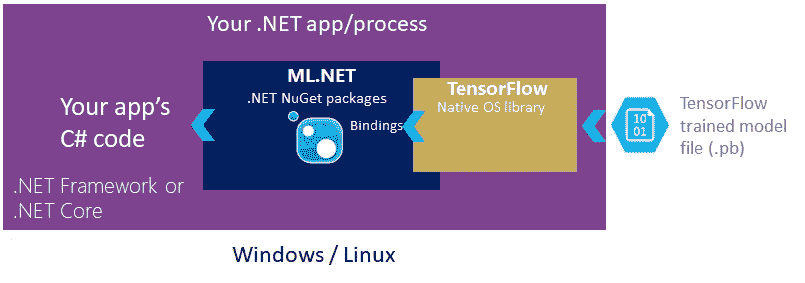
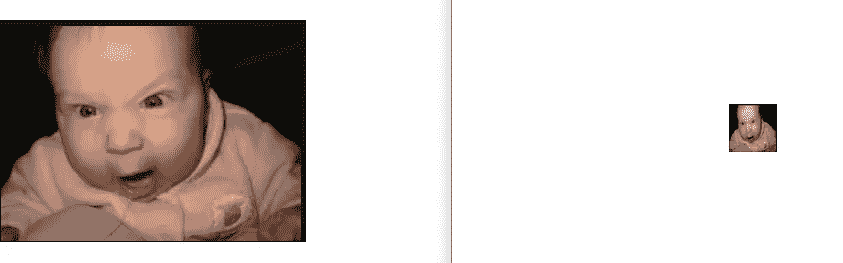
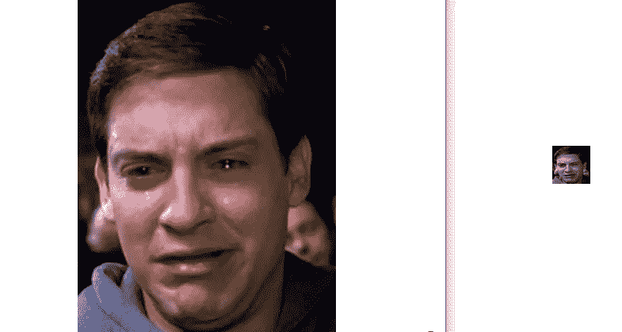
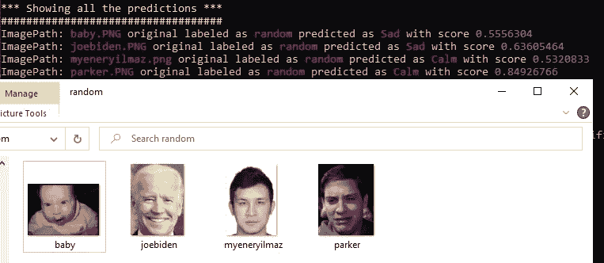
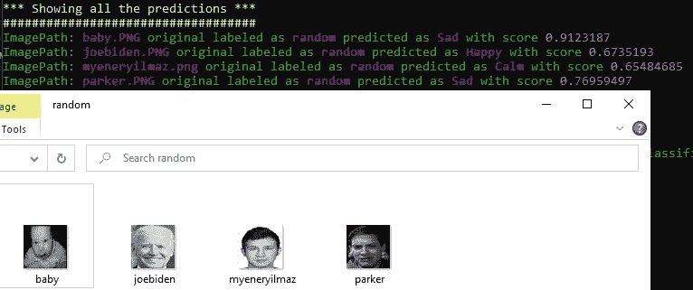

# 基于张量流 ML.NET 构建人工神经网络的情感分析

> 原文：<https://medium.com/analytics-vidhya/emotion-analysis-with-building-an-artificial-neural-network-using-ml-net-powered-by-tensorflow-dd08aeb9aad7?source=collection_archive---------4----------------------->

机器学习和人工智能是信息技术的新亮点。微软作为其最大的市场份额之一，终于在 2018 年 5 月宣布援助 ML.NET。Net 开发人员来实现他们的目标。但是与 Python、Java、LISP 等其他技术相比，它还是相当新的。就开源项目、库或第三方工具而言，还没有足够的资源。还有很长的路要走。Net 赶上其他大的技术公司来发展它的社区

幸运的是，我们不必等到这种情况发生，感谢微软的工程师，他们使 ML.NET 获得了自适应的开发体验，并在与 NimbusML 一起使用时支持 [Python](https://en.wikipedia.org/wiki/Python_(programming_language)) 模型。
我们都应该感谢微软的惊人工作！


有些人更喜欢看而不是读，也制作一个视频来演示这种东西在行动中往往是有意义的，正因为如此，下面的视频的存在。

在我们的项目中，我们将使用现有的预训练 Tensorflow 模型，该模型由具有数千幅图像的神经网络构建，并驻留在谷歌的一个服务器中，并利用[**深度学习**](https://en.wikipedia.org/wiki/Deep_learning) 来构建我们自己的神经网络，以提高我们的准确性并加快训练过程。我将创建一个. Net 核心控制台应用程序来实现这一点，当文章结束时，我们将有一个跨平台的可执行应用程序。



上图展示了 ML.NET 应用程序的拓扑结构

让我说，这篇文章受到了微软官方文档的强烈启发。说得够多了，让我们开始行动吧。

我已经更改了输入数据集并包含了帮助器方法，
最后，为了准确起见，通过重新格式化和灰度化每个图像来标准化模型，下面是一些例子；



这种编辑是如此简单，由于。Net 核心的图像处理库。绘图命名空间，我们所做的只是首先调整图像大小为 48x48，然后转换为灰度。下面这些代码优雅地满足了我们的需求；

```
public static Bitmap TranformToGrayscale(Bitmap original)
        {
            //create a blank bitmap the same size as original
            Bitmap newBitmap = new Bitmap(original.Width, original.Height);//get a graphics object from the new image
            using (Graphics g = Graphics.FromImage(newBitmap))
            {
                //create the grayscale ColorMatrix
                System.Drawing.Imaging.ColorMatrix colorMatrix = new System.Drawing.Imaging.ColorMatrix(
                   new float[][]
                   {
             new float[] {.3f, .3f, .3f, 0, 0},
             new float[] {.59f, .59f, .59f, 0, 0},
             new float[] {.11f, .11f, .11f, 0, 0},
             new float[] {0, 0, 0, 1, 0},
             new float[] {0, 0, 0, 0, 1}
                   });//create some image attributes
                using (ImageAttributes attributes = new ImageAttributes())
                {
                    //set the color matrix attribute
                    attributes.SetColorMatrix(colorMatrix);//draw the original image on the new image
                    //using the grayscale color matrix
                    g.DrawImage(original, new System.Drawing.Rectangle(0, 0, original.Width, original.Height),
                                0, 0, original.Width, original.Height, GraphicsUnit.Pixel, attributes);
                }
            }
            return newBitmap;
        }public static Bitmap ResizeImage(System.Drawing.Image image, int width, int height)
        {
            var destRect = new System.Drawing.Rectangle(0, 0, width, height);
            var destImage = new Bitmap(width, height);destImage.SetResolution(image.HorizontalResolution, image.VerticalResolution);using (var graphics = Graphics.FromImage(destImage))
            {
                graphics.CompositingMode = CompositingMode.SourceCopy;
                graphics.CompositingQuality = CompositingQuality.HighQuality;
                graphics.InterpolationMode = InterpolationMode.HighQualityBicubic;
                graphics.SmoothingMode = SmoothingMode.HighQuality;
                graphics.PixelOffsetMode = PixelOffsetMode.HighQuality;using (var wrapMode = new ImageAttributes())
                {
                    wrapMode.SetWrapMode(WrapMode.TileFlipXY);
                    graphics.DrawImage(image, destRect, 0, 0, image.Width, image.Height, GraphicsUnit.Pixel, wrapMode);
                }
            }return destImage;
        }To improve the accuracy of our model we standardize images as greyscaled and 48x48 length no matter the size of the original image
```

这可以消除数据中的噪声，加快训练过程，并更快地执行预测。

我们将遵循以下步骤来实现它:

# 1.建立模型

构建模型包括以下步骤:

*   从初始数据视图的文件夹中加载图像路径和相关标签
*   根据使用的 TensorFlow 预训练模型(如 InceptionV3)的需要进行变换时，将图像加载到内存中。(根据所使用的深度神经网络的要求，调整像素值的大小并使其正常化)
*   图像*使用深度神经网络模型的特征化*
*   基于 LbfgsMaximumEntropy 的图像分类

不是:你可以访问预先训练好的 Tensorflow 模型的数据库[这里](https://www.tensorflow.org/resources/models-datasets)

在类类型中定义数据的模式，并在使用 TextLoader 加载数据时引用该类型。这里的类类型是 ImageNetData。

```
public class ImageData
    {
        [LoadColumn(0)]
        public string ImagePath; [LoadColumn(1)]
        public string Label;
    }
```

通过 LoadImagesFromDirectory()使用实用方法将所有训练和测试图像分别加载到数据视图中:

```
IEnumerable<ImageData> allImages = LoadImagesFromDirectory(folder: imagesDownloadFolderPath, useFolderNameasLabel: true);IEnumerable<ImageData> testImages = LoadImagesFromDirectory(folder: testimagesDownloadFolderPath);
```

在将数据集拆分为两个数据集(训练数据集和测试数据集)之前，对图像进行混洗，以便通过标注分类更好地平衡数据集。

```
ConsoleHelper.ConsoleWriteHeader("Read model");
Console.WriteLine($"Model location: {inputTensorFlowModelFilePath}");
Console.WriteLine($"Training file: {dataLocation}");// 1\. Load images information (filenames and labels) in IDataView//Load the initial single full Image-Set
IDataView fullImagesDataset = mlContext.Data.LoadFromEnumerable(imageSet);
IDataView trainDataView = mlContext.Data.ShuffleRows(fullImagesDataset);
IDataView testDataView = mlContext.Data.LoadFromEnumerable(testSet);
```

以下步骤定义了培训管道。通常，在处理深度神经网络时，您必须使图像适应网络预期的格式。这就是图像被调整大小然后变换的原因。

```
// 2\. Load images in-memory while applying image transformations 
// Input and output column names have to coincide with the input and output tensor names of the TensorFlow model
// You can check out those tensor names by opening the Tensorflow .pb model with a visual tool like Netron: [https://github.com/lutzroeder/netron](https://github.com/lutzroeder/netron)
// TF .pb model --> input node --> INPUTS --> input --> id: "input" 
// TF .pb model --> Softmax node --> INPUTS --> logits --> id: "softmax2_pre_activation" (Inceptionv1) or "InceptionV3/Predictions/Reshape" (Inception v3)var dataProcessPipeline = mlContext.Transforms.Conversion.MapValueToKey(outputColumnName: LabelAsKey, inputColumnName: "Label")
                .Append(mlContext.Transforms.LoadImages(outputColumnName: "image_object", imageFolder: imagesFolder, inputColumnName: nameof(DataModels.ImageData.ImagePath)))
                .Append(mlContext.Transforms.ResizeImages(outputColumnName: "image_object_resized", 
                                                            imageWidth: ImageSettingsForTFModel.imageWidth, imageHeight: ImageSettingsForTFModel.imageHeight, 
                                                            inputColumnName: "image_object"))
                .Append(mlContext.Transforms.ExtractPixels(outputColumnName:"input", inputColumnName:"image_object_resized", 
                                                            interleavePixelColors:ImageSettingsForTFModel.channelsLast, 
                                                            offsetImage:ImageSettingsForTFModel.mean, 
                                                            scaleImage:ImageSettingsForTFModel.scale))  //for Inception v3 needs scaleImage: set to 1/255f. Not needed for InceptionV1\. 
                .Append(mlContext.Model.LoadTensorFlowModel(inputTensorFlowModelFilePath).
                        ScoreTensorFlowModel(outputColumnNames: new[] { "InceptionV3/Predictions/Reshape" }, 
                                            inputColumnNames: new[] { "input" }, 
                                            addBatchDimensionInput: false));  // (For Inception v1 --> addBatchDimensionInput: true)  (For Inception v3 --> addBatchDimensionInput: false)
```

最后，添加 ML.NET 分级培训师(LbfgsMaximumEntropy)以最终确定培训渠道:

```
// Set the training algorithm and convert back the key to the categorical values (original labels)                            
var trainer = mlContext.MulticlassClassification.Trainers.LbfgsMaximumEntropy(labelColumnName: LabelAsKey, featureColumnName: "InceptionV3/Predictions/Reshape");  //"softmax2_pre_activation" for Inception v1
var trainingPipeline = dataProcessPipeline.Append(trainer)
                                            .Append(mlContext.Transforms.Conversion.MapKeyToValue(PredictedLabelValue, "PredictedLabel"));
```

# 2.火车模型

为了开始培训，在已建管道上执行`Fit`:

```
ITransformer model = trainingPipeline.Fit(trainingDataView);
```

# 3.评估模型

训练结束后，我们使用训练数据对模型进行评估。`Evaluate`函数需要一个`IDataView`作为参数，它包含使用测试数据集分割的所有预测，所以我们将`Transform`应用于模型，然后取`AsDynamic`值。

```
// Make bulk predictions and calculate quality metrics
ConsoleWriteHeader("Create Predictions and Evaluate the model quality");
IDataView predictionsDataView = model.Transform(testDataView);

// Show the performance metrics for the multi-class classification            
var classificationContext = mlContext.MulticlassClassification;
var metrics = classificationContext.Evaluate(predictionsDataView, labelColumnName: LabelAsKey, predictedLabelColumnName: "PredictedLabel");
ConsoleHelper.PrintMultiClassClassificationMetrics(trainer.ToString(), metrics);
```

最后，我们保存模型:

```
mlContext.Model.Save(model, predictionsDataView.Schema, outputMlNetModelFilePath);
```

## 运行应用程序来训练模型

为了训练您的模型，您应该按照以下步骤进行:

1.  在 Visual Studio 中将`ImageClassification.Train`设置为启动项目
2.  在 Visual Studio 中按 F5。训练过程将开始，并会花费或多或少的时间，这取决于您训练的图像数量。
3.  训练过程完成后，为了使用新的训练模型更新消费应用程序，您必须复制/粘贴生成的 ML.NET 模型文件(assets/inputs/image classifier . zip)并将其粘贴到消费应用程序项目(assets/inputs/MLNETModel)中，该项目模拟仅运行模型进行预测的最终用户应用程序。

# 4.模型消耗代码

首先，您需要加载在模型训练期间创建的模型

```
ITransformer loadedModel = mlContext.Model.Load(modelLocation,out var modelInputSchema);
```

然后，创建一个预测器引擎，并进行示例预测:

```
var predictionEngine = mlContext.Model.CreatePredictionEngine<ImageData, ImagePrediction>(loadedModel);IEnumerable<ImageData> imagesToPredict = LoadImagesFromDirectory(imagesFolder, true);//Predict the first image in the folder
//
ImageData imageToPredict = new ImageData
{
    ImagePath = imagesToPredict.First().ImagePath
};var prediction = predictionEngine.Predict(imageToPredict);Console.WriteLine("");
Console.WriteLine($"ImageFile : [{Path.GetFileName(imageToPredict.ImagePath)}], " +
                    $"Scores : [{string.Join(",", prediction.Score)}], " +
                    $"Predicted Label : {prediction.PredictedLabelValue}");
```

预测引擎接收类型为`ImageData`的对象作为参数(包含两个属性:`ImagePath`和`Label`)。然后返回一个类型为`ImagePrediction`的对象，它保存了`PredictedLabel`和`Score` ( *概率*值在 0 和 1 之间)属性。

让我们运行应用程序并检查我们的模型是如何工作的！顺便说一下，对于这次执行，我不会重新格式化测试图像，将它们按其原始形状推送到训练管道，之后我将重新开始执行。

这两种结果都出现在下面的图片中；



结果:1 个正确，3 个错误

正如你在上面看到的，这并不像预期的那样好，我和宝宝还好，但帕克先生在这里感觉不到平静(蜘蛛侠电影中的场景，当他的父亲发生车祸，死在他面前，是的，应该是悲伤的！🤬)

更糟糕的是，我们的网络认为拜登在这里感到悲伤…我认为这不应该是你赢得选举并成为美国总统时的感受。

> 所以很明显我们的模型有问题，我在互联网上搜索人工神经网络的原理和建立训练模型的最佳实践，最终得出了标准化所有图像的想法。我已经在上面提到了它是如何做到的，在文章的最后还有一个链接可以下载完整的源代码

让我们重新启动应用程序，这一次图像将在预测之前经过调整大小和灰度的处理



结果:3 个正确，1 个错误

正如你所看到的，[图像降噪](https://www.ijsr.net/archive/v6i3/25031706.pdf)如何提高准确性和预测以及性能(它的运行速度几乎快了 4 倍！)的重要性。

我不想再看到这篇文章了，我们正处在一个结束的好时机。
您可以下载完整的[源代码](https://github.com/y3n3rrr/EmotionAnalysisWithMLNET)并尝试使用您自己的定制图像，它几乎可以发布用于生产环境，但如果您希望更准确地进行更好的预测，我强烈建议您使用训练有素的模型

这是我正在思考的问题，我想用我最近找到的训练集写一篇新文章。来自 Kaggle 的这个样本包含数以千计的图像，可以用来训练神经网络。这篇不错的[文章](/@jsflo.dev/training-a-tensorflow-model-to-recognize-emotions-a20c3bcd6468)也涵盖了它。您可以跟进基于 python 的工作，或者等我来处理，在内部重新创建它。Net 核心的方法。网

当然，我对你的想法持开放态度，我很乐意知道你希望我为一篇新文章选择什么主题，只要它是一个游乐场。网络核心和反应⚛️.你可以在下面的版块发表评论，或者在 [LinkedIn](https://www.linkedin.com/in/mehmet-yener-yilmaz-833a07101/) 或 [Twitter](https://twitter.com/myeneryilmaz) 上发送消息

未完待续…

回见，
穆罕默德·耶纳尔·耶尔马兹