# 情绪预测 Web 应用程序到 Heroku 部署

> 原文：<https://medium.com/analytics-vidhya/emotion-prediction-web-app-to-heroku-deployment-a33d9dbafd71?source=collection_archive---------18----------------------->

自然语言处理(NLP)处理自然形式的文本数据。原始文本被分解成记号和单词嵌入(单词向量)，这使得机器容易理解。

在这个应用程序中，我们将原始文本转换为标记，然后将单词转换为它们的基本形式，然后将它们与匹配情绪的单词数据集进行比较。

这些情绪的计数被保存，并且在最后，句子的整体情绪被预测。

这个问题陈述的数据集是从[http://sentiment.nrc.ca/lexicons-for-research/](http://sentiment.nrc.ca/lexicons-for-research/)获得的

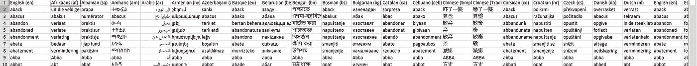

NRC 词典数据集

该数据集有 14000 多个单词，这些单词有其他语言的翻译以及它们所代表的情感。对于我们的应用，我们只考虑英语单词和它所代表的情感。

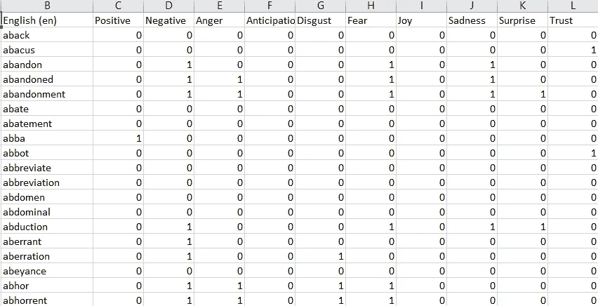

所需数据

在这个问题中，我们处理的情绪有积极、消极、愤怒、期待、厌恶、恐惧、快乐、悲伤、惊讶和信任。

首先，我们在 pandas dataframe 中加载数据集，并选择所需的列。

```
database=pd.read_csv('data.csv')
database=database[['English(en)','Positive','Negative',\
                   'Anger','Anticipation',\
                   'Disgust', 'Fear', 'Joy', 'Sadness',\    Surprise','Trust']]
```

spaCy 是一个**免费的开源库**，用于 Python 中的高级**自然语言处理** (NLP)。我们使用这个库对原始文本进行标记化和词条化。为了我们的使用，我们下载了英语小预训练模型。它分配特定于上下文的标记向量、位置标签、依赖解析和命名实体。

可以通过运行以下代码来下载该模型:

```
python -m spacy download en_core_web_sm
```

更多关于空间的信息，请访问他们的网站，[https://spacy.io/usage/spacy-101](https://spacy.io/usage/spacy-101)

我们将这个模型加载到程序中，并分离出停用词。停用词是那些本身没有任何特定意义的词，它们在句子中用作填充词。因此，从原始文本中删除停用词可以节省我们的计算时间。

```
nlp=spacy.load('en_core_web_sm')
stopwords=nlp.Defaults.stop_words
```

Spacy 中预定义的停用词是，

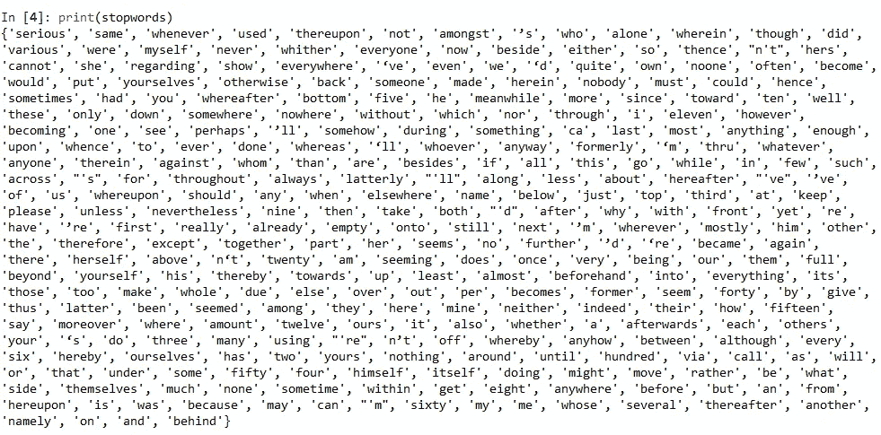

停用词

然后，我们使用内置字符串方法分割原始文本。split()在“空格”上拆分句子并返回单词列表，然后从单词列表中删除停用词，同时删除列表中的标点符号。

```
txt=txt.split()
for i in txt:
   if i in stopwords:
       txt.remove(i)
   if i in string.punctuation:
       txt.remove(i)
```

连接单词列表，然后将句子交给 NLP 模型。

```
txt=' '.join(txt)
doc=nlp(txt)
```

想想这句话，“一天一个苹果，医生远离我。”在执行上述操作后，我们将得到输出句子，

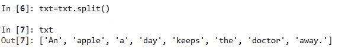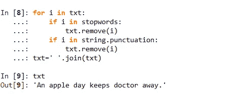

这个 doc 对象包含记号，我们感兴趣的是记号和它们的引理(基本词)。也就是说，如果我们的句子中有单词 running，那么将返回它的基本单词“run”。其他单词也是如此，如 ran、runs 等。

因此，我们循环遍历 doc 对象来获取每一个标记，并将每个标记与我们的单词数据集进行比较，以获取与它一起呈现的情感。例如，对于单词“我们将得到的医生”,

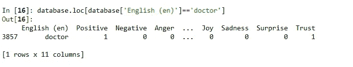

“医生”这个词显示或象征着信任和积极的情绪。对句子中的所有单词都这样做，并且对句子中出现的所有情绪进行计数。

```
emotions=[]
for token in doc:
    a=0
    a=database.loc[database['English (en)']==token.lemma_]
    a=a.values
    a=a[:,1:]
    a=sum(a.tolist(),[])
    columns=['Positive', 'Negative', 'Anger', 'Anticipation',
           'Disgust', 'Fear', 'Joy', 'Sadness', 'Surprise','Trust']
    dictionary={}
    for A,B in zip(columns,a):
        dictionary[A]=B
    for key, value in dictionary.items(): 
        if value == 1: 
              emotions.append(key)
```

所以对于上面的句子，我们得到下面的输出，


每种情绪的计数使用 Counter，并使用 matplotlib 的柱状图直观地表示出来。

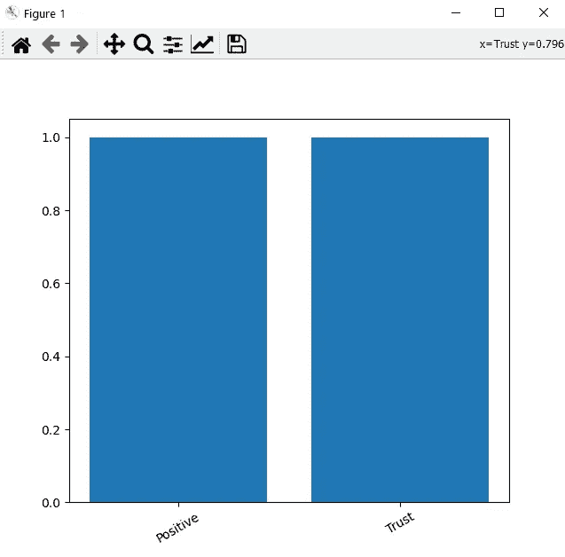

x 轴代表情绪，y 轴代表情绪发生的次数。

这就是使用 NLP 预测情绪的方法。现在，让这个程序成为一个网络应用程序，我们使用 Flask。我们将整个程序转换成一个函数，并通过 Flask 的另一个脚本调用这个函数。

在 Flask 应用程序脚本中，我们将原始文本传递给创建的函数，它会返回条形图表示和句子中出现的情绪列表。

因为我们正在创建一个 web 应用程序，所以我们必须使用 HTML 和 CSS 来创建网页。

我已经将完成所有 NLP 的文件命名为“mainfile”，将函数命名为“emotionproc”。创建 Flask 应用程序的代码如下。

```
from mainfile import emotionproc
from flask import Flask, render_template,url_for,request
app = Flask(__name__,template_folder='templates')[@app](http://twitter.com/app).route('/')
def home():
    return render_template('home_temp.html')[@app](http://twitter.com/app).route('/',methods=['POST'])
def mainfunc():
     text =request.form['u']
     text,w=emotionproc(text)
     d={}
     for a,b in zip(w.keys(),w.values()):
         d[a]=b
     d=str(d)
     return render_template('result.html',txt=text,txt2=d)if __name__=='__main__':
    app.run(debug=True)
```

项目的结构应该是这样的，应该有模板文件夹，其中将包含网页的 HTML 和 CSS 文件，静态文件夹包含静态图像。

为了在调试模式下运行这个脚本，我们将 debug 保持为 True，它允许在 web 服务器运行时对脚本进行更改，同时观察更改。

要运行此脚本，请打开 CMD 转到您的项目目录并键入命令 python flaskapp.py

(我已经将我的 Flask app 文件命名为 flaskapp.py，你可以随意命名)

这将返回一个在本地主机上运行的 web 服务器。

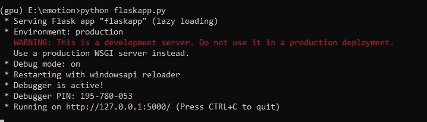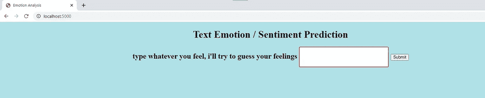

Web 应用程序

瞧啊。！！您的 NLP 模型的 web 应用程序已创建。

我已经在我的 github 库上传了全部代码，请查看。

[https://github.com/nike10/Emotion_Sentiment_Analysis](https://github.com/nike10/Emotion_Sentiment_Analysis)

现在是在 Heroku 上部署 webapp 的部分。这非常简单，只需在 Heroku 上创建一个免费帐户，并将您的 git 存储库与它链接起来。

您必须记住的唯一事情是添加一个 ProcFile 和 requirements.txt 文件

procfile 告诉 Heroku，文件的执行顺序应该开始，reu requirements . txt 在 Heroku 的服务器上安装运行 webapp 所需的所有依赖项。

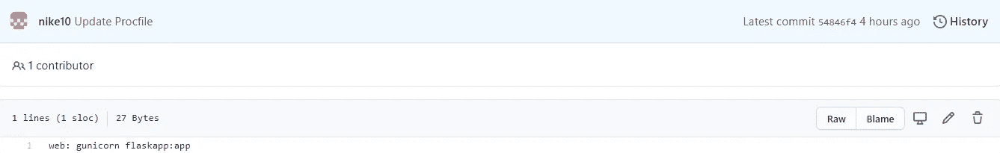

Procfile 的意思是，
web:guni corn(**guni corn**‘绿色独角兽’是用于 UNIX 的 Python WSGI HTTP 服务器。)
Flask app(Flask 所在文件的名称):app(在 flaskapp.py 脚本中创建的 Flask 实例的名称)

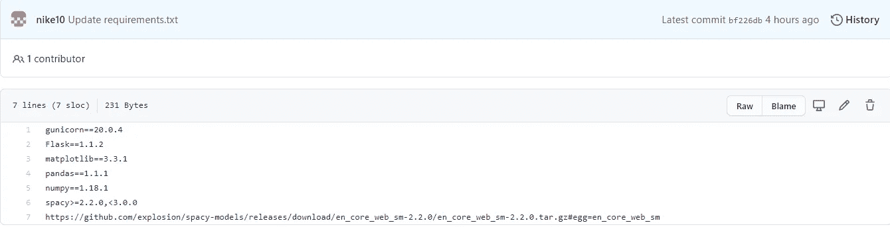

Heroku 在部署模型时将参考这个 requirements.txt 文件来安装必要的依赖项。

要部署模型，在 Heroku 上的 deploy 选项卡下启用自动部署，然后单击 Deploy Branch — Manual Deploy。

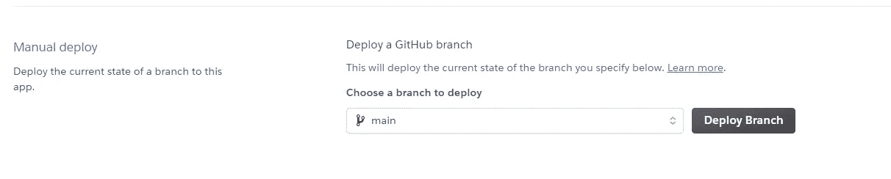

```
-----> Python app detected
-----> Requirements file has been changed, clearing cached dependencies
-----> Installing python-3.6.12
-----> Installing pip 20.1.1, setuptools 47.1.1 and wheel 0.34.2
-----> Installing SQLite3
-----> Installing requirements with pip
Collecting gunicorn==20.0.4
Downloading gunicorn-20.0.4-py2.py3-none-any.whl (77 kB)
Collecting Flask==1.1.2
Downloading Flask-1.1.2-py2.py3-none-any.whl (94 kB)
Collecting matplotlib==3.3.1
Downloading matplotlib-3.3.1-cp36-cp36m-manylinux1_x86_64.whl (11.6 MB)
Collecting pandas==1.1.1
Downloading pandas-1.1.1-cp36-cp36m-manylinux1_x86_64.whl (10.5 MB)
Collecting numpy==1.18.1
Downloading numpy-1.18.1-cp36-cp36m-manylinux1_x86_64.whl (20.1 MB)
Collecting spacy<3.0.0,>=2.2.0
Downloading spacy-2.3.2-cp36-cp36m-manylinux1_x86_64.whl (9.9 MB)
Collecting en_core_web_sm
Downloading https://github.com/explosion/spacy-models/releases/download/en_core_web_sm-2.2.0/en_core_web_sm-2.2.0.tar.gz (12.0 MB)Collecting pytz>=2017.2Collecting blis<0.5.0,>=0.4.0
Downloading blis-0.4.1-cp36-cp36m-manylinux1_x86_64.whl (3.7 MB)
Collecting MarkupSafe>=0.23
Downloading MarkupSafe-1.1.1-cp36-cp36m-manylinux1_x86_64.whl (27 kB)
Collecting six>=1.5
Downloading six-1.15.0-py2.py3-none-any.whl (10 kB)
Collecting chardet<4,>=3.0.2
Downloading chardet-3.0.4-py2.py3-none-any.whl (133 kB)
Collecting urllib3!=1.25.0,!=1.25.1,<1.26,>=1.21.1
Downloading urllib3-1.25.11-py2.py3-none-any.whl (127 kB)
Collecting idna<3,>=2.5
Downloading idna-2.10-py2.py3-none-any.whl (58 kB)
Collecting importlib-metadata>=0.20; python_version < "3.8"
Downloading importlib_metadata-2.0.0-py2.py3-none-any.whl (31 kB)
Collecting zipp>=0.5
Downloading zipp-3.4.0-py3-none-any.whl (5.2 kB)
Building wheels for collected packages: en-core-web-sm
Building wheel for en-core-web-sm (setup.py): started
Building wheel for en-core-web-sm (setup.py): finished with status 'done'
Created wheel for en-core-web-sm: filename=en_core_web_sm-2.2.0-py3-none-any.whl size=12019121 sha256=4265dee181d75d23532c984c558c79de5541b07d4f38be0ff636b8dd38d91c9d
Stored in directory: /tmp/pip-ephem-wheel-cache-ktr735xh/wheels/1d/bc/94/171b09b7fcce517723f40606754e5b7374770cc39290e092bf
Successfully built en-core-web-sm
-----> Discovering process types
Procfile declares types -> web
-----> Compressing...
Done: 140.1M
-----> Launching...
Released v19
https://emotionprediction.herokuapp.com/ deployed to Heroku
```

在这之后，你检查给定的链接，你的应用程序是部署和生活！

恭喜你。！

如果在部署过程中出现任何错误，请下载 Heroku CLI 并按照[https://devcenter.heroku.com/articles/heroku-cli](https://devcenter.heroku.com/articles/heroku-cli)上给出的步骤操作

要获取错误日志详细信息，请在命令中键入，

```
heroku logs --tail --app Name_of_your_app
```

**谢谢。希望这篇文章对你有用。**