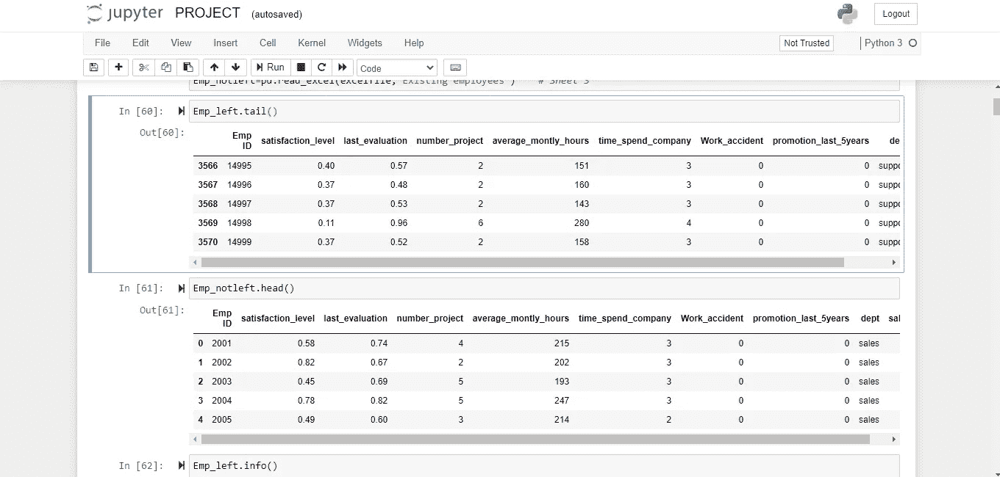
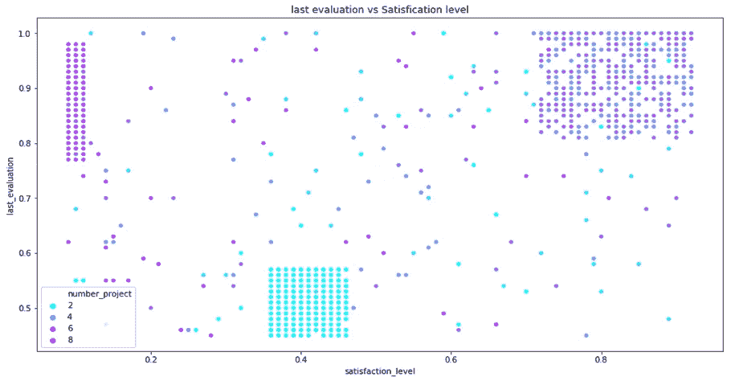
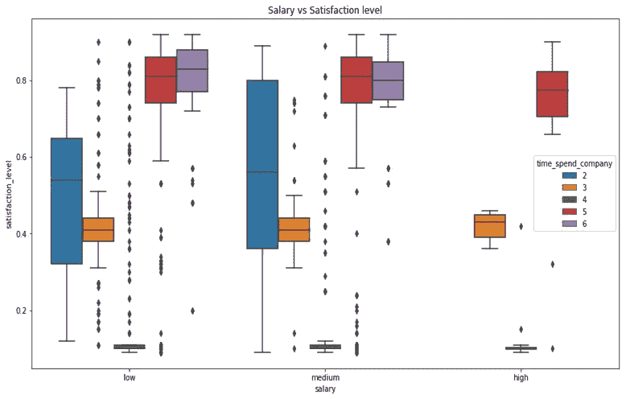
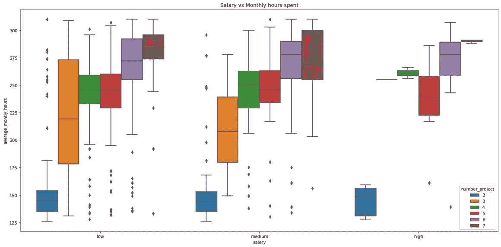
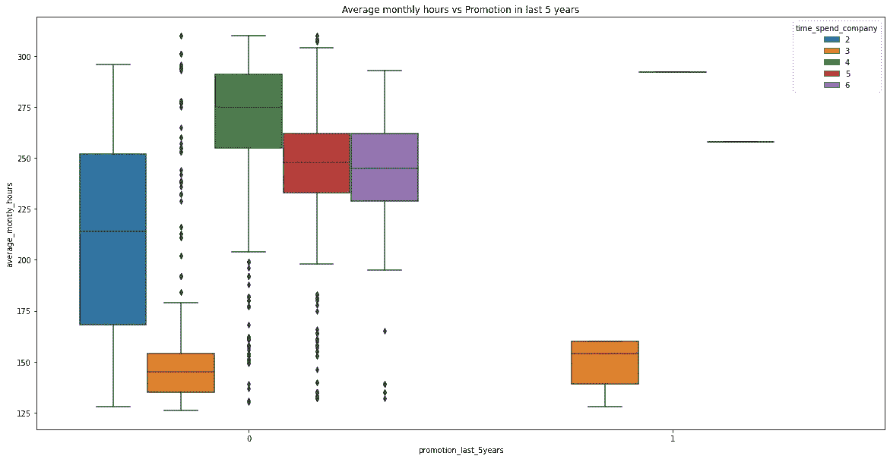
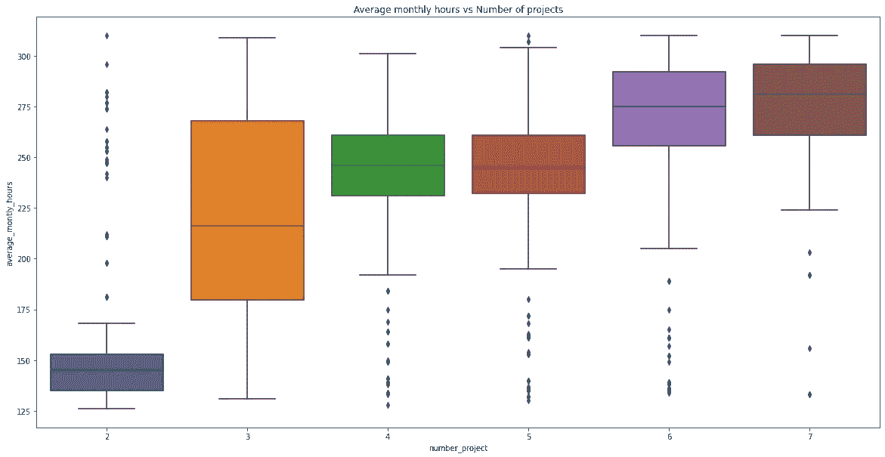
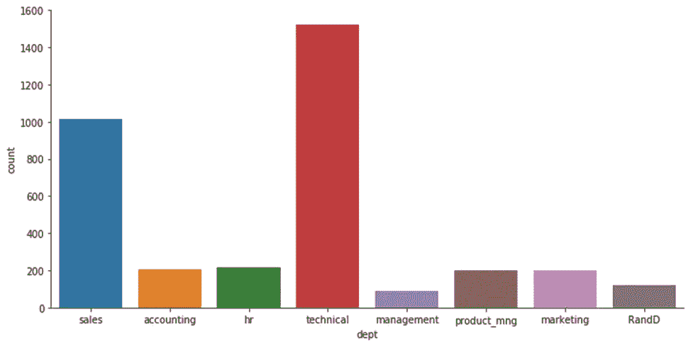
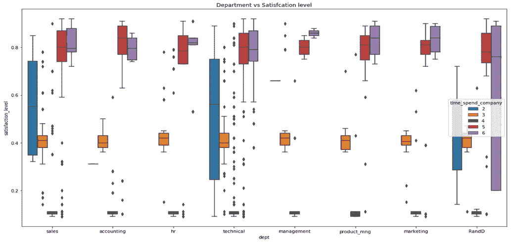

# 员工流失预测。

> 原文：<https://medium.com/analytics-vidhya/employee-attrition-prediction-df77255610ef?source=collection_archive---------12----------------------->


> 这些数据是 X 公司的，该公司正在努力控制人员流失。有两组数据:“现有员工”和“已离职员工”。

每个员工都有以下属性:

*   上次评估
*   项目数量。
*   平均每月小时数。
*   在公司的时间。
*   他们是否发生过工伤事故。
*   他们在过去 5 年中是否有过晋升。
*   部门(列销售)。
*   工资。
*   员工是否已经离职

> 第一步:我们需要加载我们的 csv 文件。文件的链接:

```
[https://github.com/bot1812/Web-App/blob/master/python%5B1%5D.xlsx](https://github.com/bot1812/Web-App/blob/master/python%5B1%5D.xlsx)
```

使用**命令下载 Jupyter 笔记本 *pip 安装 Jupyter*T5【Windows】。然后**让我们开始吧！****

导入所有必需的模块:

```
import numpy as np
import pandas as pd
import matplotlib.pyplot as plt
import seaborn as sns
import warnings
warnings.filterwarnings(**'ignore'**)
```

读取我们要使用的文件:

```
excelfile=pd.ExcelFile(**"python.xlsx"**)
Emp_left=pd.read_excel(excelfile,**'Employees who have left')**Emp_notleft=pd.read_excel(excelfile,**'Existing employees'**)
Emp_left.tail()
Emp_notleft.head()
```



```
Emp_left.info()<class 'pandas.core.frame.DataFrame'>
RangeIndex: 3571 entries, 0 to 3570
Data columns (total 10 columns):
 #   Column                 Non-Null Count  Dtype  
---  ------                 --------------  -----  
 0   Emp ID                 3571 non-null   int64  
 1   satisfaction_level     3571 non-null   float64
 2   last_evaluation        3571 non-null   float64
 3   number_project         3571 non-null   int64  
 4   average_montly_hours   3571 non-null   int64  
 5   time_spend_company     3571 non-null   int64  
 6   Work_accident          3571 non-null   int64  
 7   promotion_last_5years  3571 non-null   int64  
 8   dept                   3571 non-null   object 
 9   salary                 3571 non-null   object 
dtypes: float64(2), int64(6), object(2)
memory usage: 251.1+ KB
```

我们看到每个部门有多少员工:

```
Emp_left.dept.value_counts()sales          1014
technical       697
support         555
IT              273
hr              215
accounting      204
marketing       203
product_mng     198
RandD           121
management       91
Name: dept, dtype: int64
```

现在，我们将 IT、支持和技术整合为一个技术价值。

```
Emp_left[‘dept’]=np.where(Emp_left[‘dept’]==’support’,’technical’,Emp_left[‘dept’]).astype(‘str’)
Emp_left[‘dept’]=np.where(Emp_left[‘dept’]==’IT’,’technical’,Emp_left[‘dept’]).astype(‘str’)
Emp_notleft[‘dept’]=np.where(Emp_notleft[‘dept’]==’support’,’technical’,Emp_notleft[‘dept’]).astype(‘str’)
Emp_notleft[‘dept’]=np.where(Emp_notleft[‘dept’]==’IT’,’technical’,Emp_notleft[‘dept’]).astype(‘str’)
```

> **第二步**:我们开始根据每个因素和员工离职的原因来比较员工的价值观。

```
plt.figure(figsize=(20,12))
plt.title("Last evaluation vs Satisfication level")
sns.scatterplot(x=Emp_left['satisfaction_level'],y=Emp_left['last_evaluation'],hue='number_project',data=Emp_left, palette='bright')
plt.show()
```



从上图绘制的点:

*   项目数量超过 4 个的员工满意度很低
*   对项目数量等于 2 的员工的最后评估很低，他们的满意度也很低。

> **第 3 步**:我们现在根据在公司工作的时间来比较工资和满意度:

```
plt.figure(figsize=(20,10))
plt.title(‘Salary vs Satisfaction level’)
sns.boxplot(x=Emp_left[‘salary’],y=Emp_left[‘satisfaction_level’],hue=’time_spend_company’,data=Emp_left)
plt.show()
```



> **第 4 步**:为了分析完美的原因，我们根据他们完成的项目数量，绘制了工资与每月花费时间的箱线图。

```
plt.figure(figsize=(20,10))
plt.title(“Salary vs Monthly hours spent”)
sns.boxplot(x=Emp_left[‘salary’],y=Emp_left[‘average_montly_hours’],hue=’number_project’,data=Emp_left)
plt.show()
```



> **步骤 5** :更多方框图，了解员工离职的更多原因:

```
plt.figure(figsize=(20,10))
plt.title(“Average monthly hours vs Promotion in last 5 years”)
sns.boxplot(x=Emp_left[‘promotion_last_5years’],y=Emp_left[‘average_montly_hours’],hue=’time_spend_company’,data=Emp_left)
plt.show()
```



```
plt.figure(figsize=(20,10))
plt.title(‘Average monthly hours vs Number of projects’)
sns.boxplot(x=Emp_left[‘number_project’],y=Emp_left[‘average_montly_hours’],data=Emp_left)
plt.show()
```



我们现在可以看到哪个部门的员工离职人数最多:



需要思考的几点—

*   销售和技术人员是离职人数最多的。

> **第六步**:正如我们看到的，技术员工是离职人数最多的。现在，我们可以根据员工在公司的时间来了解部门和员工的满意度。

```
plt.figure(figsize=(18,10))
plt.title(“Department vs Satisfcation level”)
sns.boxplot(x=Emp_left[‘dept’],y=Emp_left[‘satisfaction_level’],hue=’time_spend_company’,data=Emp_left)
plt.show()
```



> **第七步**:求出员工离开公司的比例:

```
# Adding both dataset from employees who left with the existing employeesEmp_left[‘Left’]=1
Emp_notleft[‘Left’]=0
final_Emp=pd.concat([Emp_left,Emp_notleft],axis=0)
final_Emp.info()# Creating dummies
columns=[‘dept’,’salary’]
dummies=pd.get_dummies(final_Emp[columns],drop_first=True)
final_Emp=pd.concat([final_Emp,dummies],axis=1)
final_Emp.head()# Dropping uncessary columns
final_Emp=final_Emp.drop(columns,axis=1)
final_Emp.info()# Dividing the dataset into X and Y
X=final_Emp.drop([‘Emp ID’,’Left’],axis=1)
y=final_Emp[‘Left’]
print(“The proportion of employees left is {}% from total dataset”.format(round(final_Emp.Left.value_counts()[1]/len(final_Emp)*100,2)))
```

*   从总数据集来看，离职员工的比例为 23.81%。

我们使用以下技术，通过测量每种技术的准确性来找出容易离职的员工。

这些技术是:

*   **逻辑回归。**
*   **随机森林分类器。**
*   **支持向量分类器。**
*   **过采样。**

从以上观察，我们发现 ***【随机森林分类器】*** 的准确率最高。因此我们基于此建立了一个模型。

```
# Random Forestfrom sklearn.model_selection import GridSearchCV
from sklearn.model_selection import KFoldrfc=RandomForestClassifier(random_state=50)n_folds=KFold(n_splits=5,shuffle=True, random_state=50)parameters={'criterion':['gini','entropy'],'max_depth': range(5,30,5),'max_features': range(10,18,2),
            'min_samples_split': range(2,10,2)}model_cv = GridSearchCV(estimator=rfc,param_grid=parameters,cv=n_folds,verbose=1,
                        return_train_score=True,scoring='recall')
final_rfc=RandomForestClassifier(criterion='entropy',max_depth=20,max_features=14,min_samples_split=2,random_state=50)
final_rfc.fit(X_train.drop('Emp ID',axis=1),y_train)
y_pred=final_rfc.predict(X_test.drop('Emp ID',axis=1))from sklearn.metrics import classification_report
print(classification_report(y_test,y_pred))
final_rfc.feature_importances_
X_train.columns
features=np.array(X_train.drop('Emp ID',axis=1).columns)
important=final_rfc.feature_importances_
indexes_features=important.argsort()
for i in indexes_features:
    print("{} : {:.2f}%".format(features[i],important[i]*100))**# Finding employees who are prone to leave :**y_test1=pd.concat([y_test,X_test[‘Emp ID’]],axis=1)
y_test3=pd.DataFrame(y_pred)y_test3.reset_index(inplace=True, drop=True)gf=pd.concat([y_test1.reset_index(),y_test3],1)new_df=gf[gf.Left==0]new_df=new_df.drop(‘index’,axis=1)new_df.columns=[‘Left’,’Emp ID’,’Predicted_left’]Employees_prone_to_leave=new_df[new_df[‘Predicted_left’]==1]
Employees_prone_to_leave=Employees_prone_to_leave.reset_index()
Employees_prone_to_leave=Employees_prone_to_leave.drop([‘Left’,’Predicted_left’,’index’],axis=1)
```

> 最终产出:(容易离职的员工)

```
Emp ID
0   6467
1   2416
2   9176
3   9241
4   5200
5   9057
6   2802
7   3862
8   4770
```

**促使员工离职的因素:**

*   下面是一些重要的特性，它们对人员流失的贡献率为%.
*   满意度:34.63%
*   花在公司的时间:27.47%
*   平均每月工作时间:10.84%
*   最近一次评估:12.14%
*   项目数量:9.25%

这些是导致员工离开公司的驱动因素。

该模型的准确率为 93.33%，相当不错！谢谢你把这篇文章读到最后。

## Y 你也可以在我的 Github 账号:[这里了解项目详情。](https://github.com/bot1812)