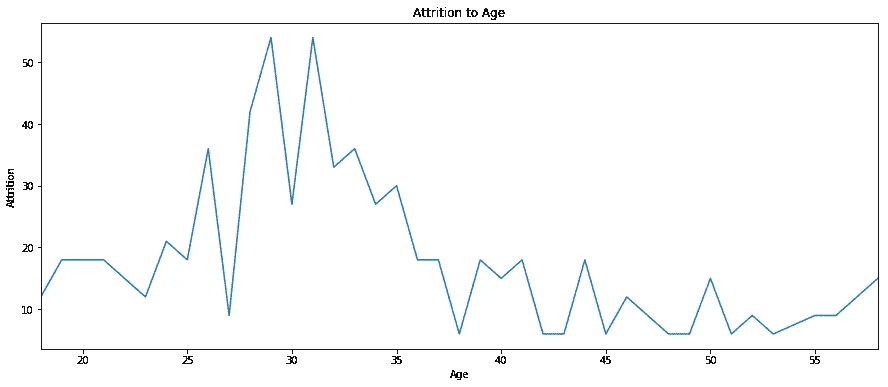

# 员工流失率预测

> 原文：<https://medium.com/analytics-vidhya/employees-churn-rate-prediction-6a91043345b5?source=collection_archive---------8----------------------->

# 找出你的员工中谁要离开公司，为什么

员工流动成本很高。公司花费时间、金钱和精力来培训新员工以适应新的文化和工作环境。那些辞职的人带走了经验、培训和文化。新员工需要时间来管理现有产品，理解工作程序，了解现有系统和文化等。建议 2016 年美国 [劳动力总数的 15.1%离职。](https://business.dailypay.com/blog/employee-retention-rate)


市场竞争，尤其是对高技能员工的竞争，增加了员工流失率，因此公司需要预测谁可能会辞职，以吸引她/他留下来！

[SHRM](https://www.shrm.org/hr-today/trends-and-forecasting/research-and-surveys/Documents/2016-Human-Capital-Report.pdf) 预测年流失率约为 19%，并假设填补一个职位的平均雇佣成本为 4129 美元。一些研究表明，更换一个初级职位的成本可能高达员工工资的 40%。

在这项研究中，我们将根据 [kaggle](https://www.kaggle.com/vjchoudhary7/hr-analytics-case-study) 上免费提供的培训数据集来预测员工流失率。然后我们会向管理层提出建议，用最有效的方法来降低离职率。

这个例子在 Jupyter 笔记本上进行了测试，并且在 kaggle 控制台上可用。

# 数据探索和工程

数据集由六个表组成:数据字典、员工一般数据、员工满意度调查、经理满意度调查、员工上班时间和下班时间。让我们首先导入必要的库，并开始研究数据字典:

```
import pandas as pd, xgboost
import matplotlib.pyplot as plt
import seaborn as sns
from sklearn import metrics
#Explore Data Dictionary
data_dictionary = pd.read_excel('data_dictionary.xlsx', skiprows=0, sheetname='data_dictionary')
data_dictionary
```


数据字典表中的示例数据

一旦我们理解了表中的内容，我们就可以开始进一步展开；现在让我们导入雇员的一般数据和两个调查表。为了更容易处理，我还用零替换了所有的空值

```
#gd stands for General Data
gd = pd.read_csv("general_data.csv")
sd = pd.read_csv("employee_survey_data.csv")
md = pd.read_csv("manager_survey_data.csv")
#fill Null values from survey with Zero
sd.fillna(value=0, inplace=True)
md.fillna(value=0, inplace=True)
#Join survey result with general data
gd=gd.join(sd, on=['EmployeeID'], how='inner', lsuffix='_caller', rsuffix='_other')
gd=gd.join(md, on=['EmployeeID'], how='inner', lsuffix='_caller', rsuffix='_other')
gd.head()
```


每个雇员有 33 个相关列，不包括入职和离职记录

让我们看看留在公司的人与离开的人的百分比:

```
#Percentage of Stayed/Left shows that the Dataset is imbalanced.
print("Did not leave: ", gd.Attrition.value_counts()['No']/len(gd)*100,"%")
print("Left: ", gd.Attrition.value_counts()['Yes']/len(gd)*100,"%")
```

损耗率为 16.13%。让我们从年龄开始做一些数据探索:

```
#Age to Attrition relationship
age_att=gd[gd['Attrition']== 'Yes'].groupby(["Age"])['Attrition'].count()
plt.figure(figsize=(16,4))
plt.title('Attrition to Age')
plt.xlabel('Age')
plt.ylabel('Attrition')
age_att.plot(figsize=(15, 6))
plt.show();
```



我们可以看到，离开的高峰年龄是 30 出头，大多数人在 26 岁至 35 岁之间离开。

职业道路和辞职有关系吗？对于已在公司工作 4 年或以上的员工:

```
career_att=gd[(gd['Attrition'] == 'Yes') & (gd['YearsAtCompany'] >= 4)].groupby(["YearsSinceLastPromotion"])['Attrition'].count()
plt.figure(figsize=(16,4))
plt.title('Attrition to Career Path')
plt.xlabel('Years Since Last Promotion')
plt.ylabel('Attrition')
career_att.plot(figsize=(15, 6))
plt.show();
```


我们可以看到，当人们花了 4 年时间，然后他们没有得到晋升时，他们就离开了巅峰

让我们看看员工性别是否与流失率有关:

```
sns.countplot(x = "Gender",data=gd)
plt.show()
sns.countplot(x = "Attrition",data=gd,hue="Gender")
plt.show()
```


左边的照片显示了公司中男女员工的比例，右边的照片显示了员工流失情况，Yes 代表离开公司的员工

如上图所示，性别对流失率没有实际影响。

工资级别有性别歧视吗？

```
xs=gd.groupby(["Gender"])['MonthlyIncome'].mean()
plt.title('Income')
plt.xlabel('Gender')
plt.ylabel('Pay Mean')
plt.ylim([0,80000])
plt.bar(xs.index, xs)
plt.show();
```


在工资级别上没有基于工资级别平均值的歧视

观察:年轻员工的平均收入可能比年长员工高吗？对我们的数据集来说，这是事实！让我们找出基于年龄组的收入平均值

```
Age18_21=gd[gd['Age']<21]
Age21_25=gd[(gd['Age']>=21) & (gd['Age']<25)]
Age25_35=gd[(gd['Age']>=25) & (gd['Age']<35)]
Age35_45=gd[(gd['Age']>=35) & (gd['Age']<45)]
Age45_55=gd[(gd['Age']>=45) & (gd['Age']<55)]
Age55_65=gd[(gd['Age']>=55)]
Age=['18-21', '21-25', '25-35', '35-45', '45-55', '55-65']
Income=[Age18_21['MonthlyIncome'].mean(), Age21_25['MonthlyIncome'].mean(), Age25_35['MonthlyIncome'].mean(), Age35_45['MonthlyIncome'].mean(), Age45_55['MonthlyIncome'].mean(), Age55_65['MonthlyIncome'].mean()]
d={'Age':Age,'Income':Income}
df=pd.DataFrame(data=d)
sns.barplot(x = "Age",data=df, y="Income")
plt.show()
```


年轻雇员的平均收入高于年长雇员

教育水平对流失率

1.  '大学以下'
2.  大学
3.  单身汉
4.  主人
5.  “医生”

```
sns.countplot(x = "Attrition",data=gd,hue="Education")
plt.show()
```


教育程度与辞职无关

为了预测谁将在未来辞职，我们使用了以下最相关的字段:“雇员 ID”、“年龄”、“商务旅行”、“部门”、“离家距离”、“教育”、“教育字段”、“性别”、“工作级别”、“工作角色”、“婚姻状态”、“每月收入”、“NumCompaniesWorked”、“PercentSalaryHike”、“StockOptionLevel”、“TotalWorkingYears”、“TrainingTimesLastYear”、“YearsAtCompany”、“YearsSinceLastPromotion”、“YearsWithCurrManager”、“环境满意度”、“工作满意度”和“工作生活平衡”

让我们从我们的预测模型开始，首先我们必须创建一个新的数据框架，它具有如下所选的特征:

```
features = ['EmployeeID', 'Age', 'BusinessTravel', 'Department', 'DistanceFromHome', 'Education', 'EducationField', 'Gender', 'JobLevel', 'JobRole', 'MaritalStatus', 'MonthlyIncome', 'NumCompaniesWorked', 'PercentSalaryHike', 'StockOptionLevel', 'TotalWorkingYears', 'TrainingTimesLastYear', 'YearsAtCompany', 'YearsSinceLastPromotion', 'YearsWithCurrManager', 'EnvironmentSatisfaction', 'JobSatisfaction', 'WorkLifeBalance']
X = gd[features].copy()
```

获取分类变量列表，我们需要将文本类别转换为数字，我们使用 LabelEncoder 库来完成:

```
Obj_Type = (X.dtypes == 'object')
object_cols = list(Obj_Type[Obj_Type].index)print("Categorical variables:")
print(object_cols)#Categorical variables:
#['BusinessTravel', 'Department', 'EducationField', 'Gender', #'JobRole', 'MaritalStatus']
from sklearn.preprocessing import LabelEncoder# Apply label encoder to each column with categorical data, also null values to be filled with 0
label_encoder = LabelEncoder()
y = label_encoder.fit_transform(gd['Attrition'])
for col in object_cols:
    #make NAN as 0 Catgory Variable
    X[col] = label_encoder.fit_transform(X[col].fillna('0'))    
#Let us have a look at the Data now
X.head()
```


如果您注意到文本值被转换为数字，因为 pridection 模型只处理数字

为了准确预测，我们必须用现有值的平均值替换缺失值，以免模型出现偏差。我们使用简单的估算器。

> 填补缺失值的插补转换器。默认值是平均值:如果是“平均值”，则使用每列的平均值替换缺失值。只能用于数值数据。

```
from sklearn.impute import SimpleImputer
my_imputer = SimpleImputer()
imputed_X = pd.DataFrame(my_imputer.fit_transform(X))
# Imputation removed column names; put them back
imputed_X.columns = X.columns
imputed_X.head()
```

现在一切都完成了，让我们从训练数据中分离验证集:

```
from sklearn.model_selection import train_test_split
X_train, X_valid, y_train, y_valid = train_test_split(imputed_X, y, train_size=0.8, test_size=0.2,                                                 random_state=43)
```

# 预测模型

在预测模型中，我选择使用极限梯度提升 XGBoost，这是一种基于决策树的算法。多个树被集成以提高模型的预测能力。

```
classifier = xgboost.XGBClassifier(learning_rate=0.1, n_estimators=169, max_depth=9,
 min_child_weight=6, gamma=0, subsample=0.9, colsample_bytree=0.8)
classifier.fit(X_train, y_train)
# predict the labels on validation dataset
predictions = classifier.predict(X_valid)
f1_score = metrics.f1_score(y_valid,predictions)
print ("Result of XGB: ", f1_score)
```

f1 的得分很高，为 0.95，这是因为我们中断了数据集。现在，我们可以按照以下代码将预期离职的员工列表导出到 CSV 文件中:

```
d={'EmployeeId':X_valid['EmployeeID'],'Predicted Attrition':predictions, 'Attrition':y_valid}
df=pd.DataFrame(data=d)
df.to_csv("test_predictions.csv", index=False)
```

使用 XGBoost 模型的一个很大的优点是它的内置函数显示了一个特性重要性表。重要性度量提供了一个分数，该分数指示每个类别在增强决策树的构建中的价值。因此，现在的问题是，哪种功能(类别)对员工流失更有影响？

```
featuress = pd.DataFrame({'Feature':features, 'Importance':classifier.feature_importances_})
featuress = featuress.sort_values('Importance', ascending=False).reset_index().drop('index',axis=1)
plt.figure(figsize=(15, 6))
base_color = sns.color_palette()[0]
sns.barplot(x = "Importance", data=featuress, y="Feature", color = base_color)
plt.show()
```


按对员工辞职决定的影响排序的类别

# 推荐

看起来婚姻状况是离职的第一个影响因素，这可能与换城市有关，第二个因素看起来像许多员工与他们的经理相处不好，或者他们没有得到提升等等。影响因素是指示性的，人力资源应该将这些因素联系起来，得出如何降低流失率的结论。

你可以在 Kaggle 上找到完整的工作示例[，如果你有任何问题，请不要犹豫发表评论。](https://www.kaggle.com/mabusalah/attrition-prediction?scriptVersionId=35399142)