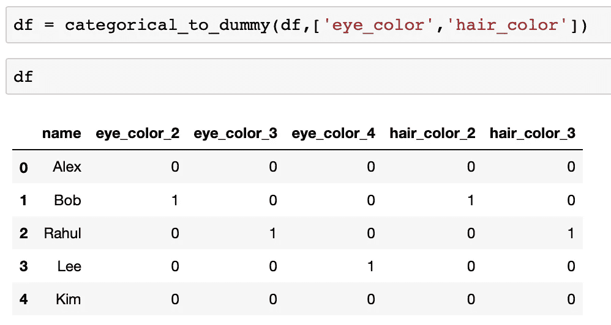

# 如何编码你的分类特征

> 原文：<https://medium.com/analytics-vidhya/encoding-categorical-variables-as-dummy-variables-279c7d6c2e8f?source=collection_archive---------1----------------------->

这是一篇关于将分类变量编码为虚拟变量的动机和最佳实践的短文。

假设你有一个分类变量，比如眼睛的颜色。该值的范围为 1-4，其中 1 代表棕色，2 代表绿色，3 代表蓝色，4 代表灰色。数值 2 并不意味着绿色比棕色重要两倍，但计算机会简单地将这些类别作为数值读取。因此，当我们把这样的分类变量传递到我们的分析中时，它可能会以一种错误的方式给不同的颜色赋予错误的重要性。这就是伪编码的用武之地。下面的笔记本简单介绍了如何使用这个名字很神奇的 *get_dummies* 函数。

*drop_first* 删除第一个分类变量列。我们为什么要这样做？原因有两个。首先，您可以使用 *n-1* 虚拟特征*来表示 *n* 个特征。*考虑上述示例，如果 *eye_color_2* 、 *eye_color_3* 和 *eye_color_4* 都为 0，则这自动意味着 *eye_color_1* 为 1。因此，我们实际上并不需要其中的一列。

这不仅仅是为了让你的数据集变得整洁或者更小。我们总想这样做的第二个原因是为了避免****的哑变量陷阱。**虚拟变量陷阱是一个数据科学家可能会发现自己陷入的陷阱，现在他们的回归模型突然对他们的数据集不起作用了。这是因为列之间存在多重共线性。这在回归模型中是非常不理想的。**

**最后，我编写了一个简洁的函数 if，它将转换 list *列中的所有分类特性，*将这些列追加到数据集，最后删除原始分类列。**

**您可以在下面看到它的运行情况:**

****

# **结论**

**如果希望模型正常工作，请在使用 get_dummies 时始终启用 drop_first 选项。**