# 将时间序列编码为图像

> 原文：<https://medium.com/analytics-vidhya/encoding-time-series-as-images-b043becbdbf3?source=collection_archive---------0----------------------->

## 格拉米角视场成像

深度学习的热潮很大程度上是由它在计算机视觉和语音识别方面的成功推动的。然而，当涉及到时间序列时，建立预测模型可能会令人毛骨悚然([递归神经网络很难训练](https://www.coursera.org/lecture/neural-networks/why-it-is-difficult-to-train-an-rnn-kTsBP)，研究不太适用，并且没有预先训练好的模型，1D-CNN 可能不方便)。

为了利用计算机视觉的最新发展带来的技术和见解，我将介绍并讨论一种将时间序列编码为图像的方法:T2(Gramian)角场。

除了数学的先决条件(最小-最大标量，点积和 Gram 矩阵)，这篇文章将包含以下方面的解释和解决方案:

*   为什么 Gram 矩阵结构是单变量时间序列的良好 2D 表示？
*   为什么克矩阵点积不能代表 CNN 的数据？
*   让 Gram 矩阵结构为 CNN 做好准备的操作是什么？

以及以下内容的 Python 要点:

*   格拉米角场计算的有效数字实现。
*   使用 matplotlib+movie editor 生成 gif。

**TL:DR:** 我们对数据进行极坐标编码，然后对结果角度进行类似 Gram 矩阵的运算。

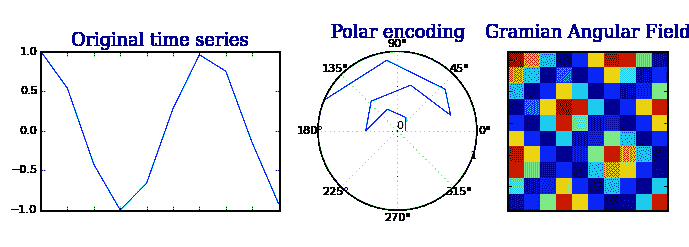

格拉米角场转换的各个步骤(见下面的 GIF 代码)

# 数学先决条件

因为 Gramian 角域的数学本质上与内积和相应的 Gram 矩阵相关联，这里有一个提示:

这个方法的数学本质上与内积和相应的 Gram 矩阵联系在一起，我写了一个关于它的意义的简短提示。

## 点积

内积是两个向量之间的**运算，其中**测量它们的“相似度”**。它*允许使用来自传统*欧几里德几何*的概念*:长度、角度、二维和三维的正交性。**

在最简单的情况下(2D 空间)，两个向量 u 和 v 之间的内积定义为:

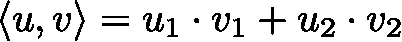

2D 空间中的点积

可以看出:

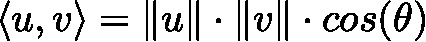

2D 空间中的另类表达

因此，如果 *u* 和 *v* 的规格为 *1* ，则我们得到:

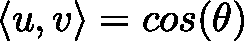

单位向量的内积由它们的角差θ来表征

因此，在处理**单位向量**时，它们的**内积仅由 *u* 和 *v* 之间的角度θ** (用弧度表示)来表征。此外，结果值位于[-1，1]内。

在本文的其余部分，这些属性将被证明是有用的。

**注:**在欧几里得设置(维数 n)中，两个向量 *u* 和 *v* 的内积正式定义为

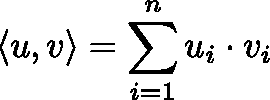

*u* 和 v 之间的内积

## 格拉姆矩阵

Gram 矩阵在线性代数和几何中是一个有用的工具。其中，它经常用于计算一组向量的*线性相关性。*

**定义:**一组 *n* 向量的 *Gram 矩阵*是由每对向量的点积(*见相似度*)定义的矩阵。从数学上来说，这意味着:

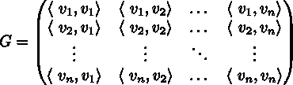

一组 n 个向量的格拉姆矩阵

同样，假设所有 2D 向量的范数为 1，我们得到:

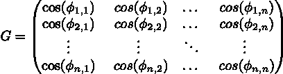

单位向量的 Gram 矩阵

其中φ*(I，j)* 是矢量 *i* 和 *j* 之间的夹角。

> **要点:为什么要使用克矩阵？**
> 
> Gram 矩阵保持了时间依赖性。由于时间随着位置从左上向右下移动而增加，因此时间维度被编码到矩阵的几何中。

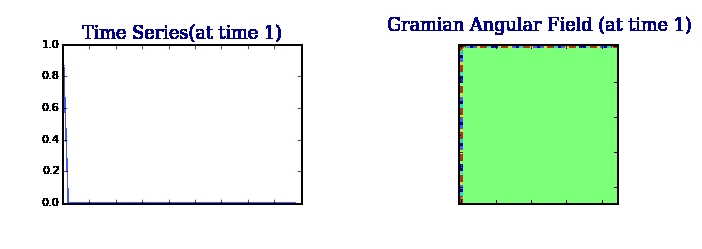

不同时间步长的已知 GAF 值

**注:**本文的动机也是直觉，单变量时间序列在某种程度上无法解释数据的共现和潜在状态；我们应该致力于找到替代的和更丰富的表达方式。

# 天真的实施

让我们计算时间序列值的 Gram 矩阵:

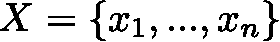

## 用最小-最大缩放器将系列缩放到[-1，1]

为了使内积不会偏向具有最大值的观察值，我们需要调整数据:

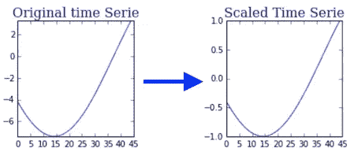

最小-最大缩放

在本用例中，*标准定标器不是合适的* *候选*，因为其输出范围和产生的内积都可能超过[-1，1]。

然而，结合最小-最大缩放器，内积可以保持输出范围:

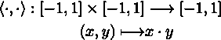

点积保留了范围

选择[-1，1]内的点积并不是无害的。作为神经网络的输入范围，范围[-1，1]即使不是必需的，也是非常理想的。

## 嘈杂的图像？

现在时间序列已经缩放，我们可以**计算成对点积**并将它们存储在 Gram 矩阵中:

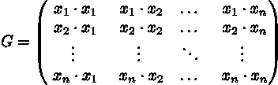

标度时间序列的 Gram 矩阵

让我们通过检查 G:

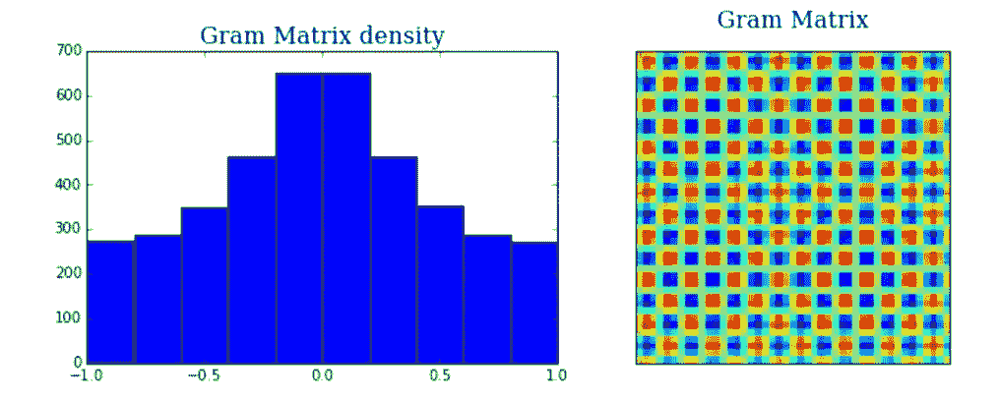

Gram 矩阵值遵循高斯分布(时间序列是余弦分布)

我们观察到两件事:

1.  **输出**似乎**遵循以 0 为中心的高斯分布**。
2.  **生成的图像有噪声**。

**前者解释了后者**，因为数据的高斯性越强，就越难将其与高斯噪声区分开来。

This will be a problem for our Neural Networks. Additionally, it has been established that [CNN work better with sparse data](https://www.quora.com/Why-are-deep-neural-networks-so-bad-with-sparse-data).

## The origin of non-sparsity

The Gaussian distribution is not very surprising. When looking at the 3D plot of the inner product values *z*, for every possible combination of (*x*, *y*) ∈ R², we obtain:

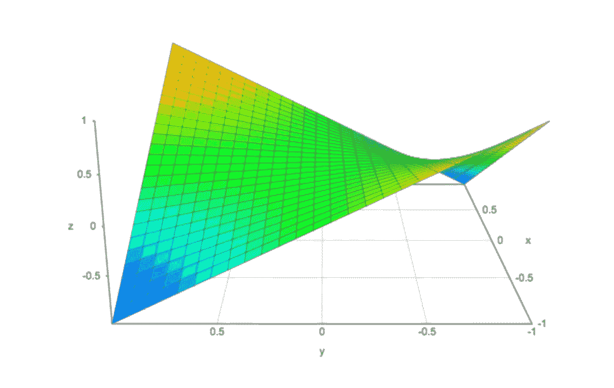

3D surface of the dot product

Under the assumption that **the values** of the time series follow a Uniform distribution [-1, 1], the Gram Matrix values follow a Gaussian-like distribution. Here are **histograms of the outputs** of the Gram Matrix valued for different time series lengths *n*:

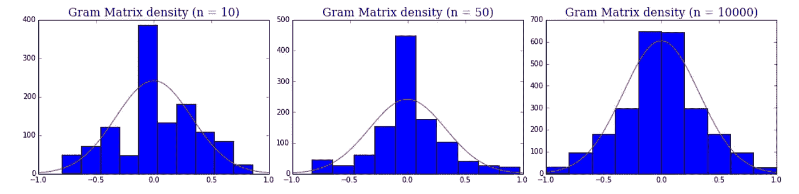

Gram Matrix output for time series of length n (in red is the density of N(0, 0.33))

# Preliminary Encoding

## Why do we need one?

As univariate time series are in 1D and the dot product fails to distinguish the valuable informations from Gaussian noise, there is no other way to take advantage of “angular” relations than changing the space.

We must therefore encode the time serie into a space of at least 2 dimensions, prior to using Gram Matrix like constructs. To do so, we will construct a **bijective mapping** between our 1D time serie and a 2D space, so as not to lose any informations.

> This encoding is largely inspired from **polar coordinates transformations**, except in this case, the radius coordinate expresses time.

## Step 1: Scale the serie onto [-1, 1] with a Min-Max scaler

We proceed similarly than in the naïve implementation. Coupled with the Min-Max scaler, our polar encoding will be bijective, the use the *arccos* function bijective (see next step).

## **Step 2: Convert the scaled time serie into “polar coordinates”**

Two quantities need to be accounted for, the **value of the time series** and its **corresponding timestamp**. These two variables will be expressed respectively with the **angle** and the **radius**.

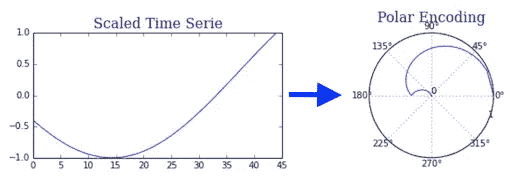

Polar Encoding for time series

Assuming our time series is composed of ***N*** timestamps ***t*** with corresponding values ***x****, then:*

*   The angles are computed using ***arccos(x).*** They lie within [0, ∏].
*   半径变量的计算方法是:首先，我们将区间[0，1]分成 *N* 个相等的部分。我们因此获得 *N+1* 定界*点{0，…，1}。然后，我们丢弃 0，并将这些点连续关联到时间序列。*

从数学上来说，它可以解释为:

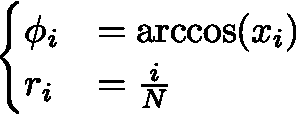

标度时间序列的 2D 编码

这些编码有几个**优点**:

1.  整个编码是**双射**(作为双射函数的组合)。
2.  它**通过 *r* 坐标保存时间相关性**。这将被证明是非常有用的[*]。

# 时间序列的内积？

现在我们在 2D 空间中，接下来的问题是我们如何使用内积运算来处理稀疏性。

## 为什么不是极坐标编码值的内积？

2D 极空间中的内积有几个限制，因为每个向量的范数已经针对时间依赖性进行了调整。更准确地说:

*   两个不同观测值之间的内积将偏向于最近的一个(因为范数随着时间而增加)。
*   当计算观察值本身的内积时，所得的范数也是有偏差的。

因此，如果一个类似内积的运算存在，它应该仅仅依赖于角度。

## 使用角度

由于任何内积运算都无法将两个不同观察值的信息转换成一个值，因此我们无法将两个角度给出的信息保存在一起。我们必须做出一些让步。

为了最好地解释两个角度上的单个和联合信息，作者将**定义为内积**的替代运算:

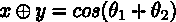

自定义操作

其中 *θ* 分别是从 *x* 和 *y* 编码的角度。

**注:**我选择了不同的符号而不是使用内积，因为这个操作不满足内积(线性，正定)的[要求。](https://en.wikipedia.org/wiki/Inner_product_space#Definition)

这导致了以下类似 Gram 的矩阵:

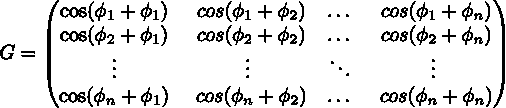

> 作者的动机是:“第二，与笛卡尔坐标相反，极坐标保留了绝对的时间关系。”

## 优势

1.  **对角线由缩放时间序列的原始值**组成(我们将从深度神经网络学习的高级特征中近似重建时间序列。)
2.  时间相关性通过相对于时间间隔 k 的方向叠加的相对相关性来说明

## 朝向更稀疏的表示？

现在让我们绘制格拉米角场值的密度:

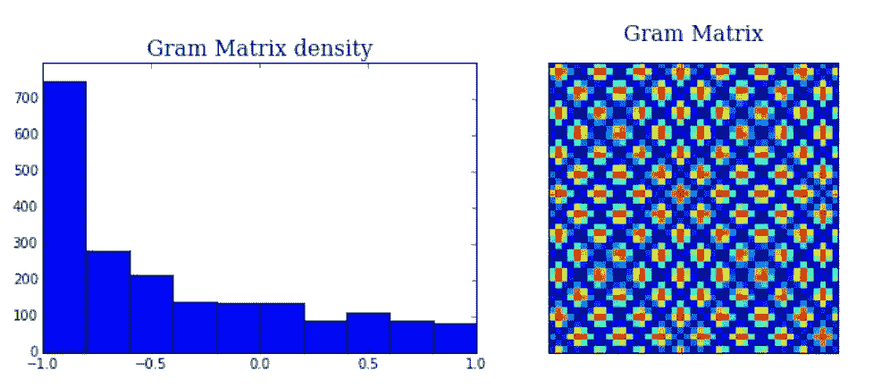

The Gramian Angular Field is less noisy / sparser than the Gram Matrix.

As we can see from the plot above, the Gramian Angular Field is much sparser. To explain this, let’s re-express *u* ⊕ *v* in Cartesian coordinates:

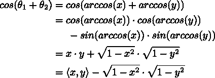

Converting back the expression in Cartesian coordinates

We notice in the last term above that the **newly constructed operation** corresponds to a **penalized version of the conventional inner product:**

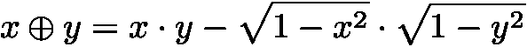

New operation = Penalized Inner Product

Let’s gain some insights on the role of this penalty. Let’s first have a look at the 3D plot of the full operation:

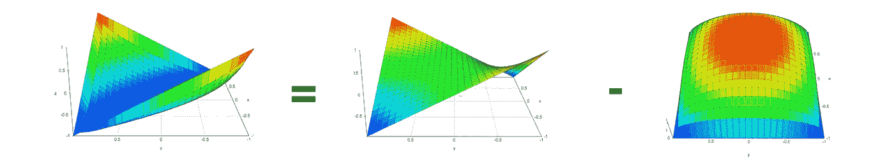

3D plot of the operation

As we can see:

*   The penalty shifts the mean output towards -1.
*   The closer x and y are to 0, the larger is the penalty. The main consequence is that points which were closer to the gaussian noise … (with the dot) are (with the penalized dot)
*   For x = y: it is casted to -1
*   The outputs are easily distinguishable from Gaussian Noise.

## **Drawbacks**

*   With the main diagonal, however, the generated GAM is large due to the augmentation n ⟼n², where the length of the raw time series is n. The author suggests to reduce the size of the GAF by applying Piecewise Aggregation Approximation (Keogh and Pazzani 2000).
*   It is not an inner product..

# Show me the code!

A numpy implementation to convert univariate time series into an image and other python code used for this article can be found [here](https://github.com/devitrylouis/imaging_time_series).

As for the gif, I will release it soon (implemented with matplotlib, numpy and moviepy).

# Sources

> This blogpost is largely inspired from the [detailed paper](https://aaai.org/ocs/index.php/WS/AAAIW15/paper/viewFile/10179/10251) Encoding Time Series as Images for Visual Inspection and Classification Using Tiled Convolutional Neural Networks, by Zhiguang Wang and Tim.
> 
> This paper also mentions another interesting encoding technique: Markov Transition Field. This encoding will not be covered in this article.

 [## [1403.6382] CNN Features off-the-shelf: an Astounding Baseline for Recognition

### Abstract: Recent results indicate that the generic descriptors extracted from the convolutional neural networks are…

arxiv.org](https://arxiv.org/abs/1403.6382)  [## [1411.1792] How transferable are features in deep neural networks?

### Abstract: Many deep neural networks trained on natural images exhibit a curious phenomenon incommon: on the first…

arxiv.](https://arxiv.org/abs/1411.1792) 

[https://arxiv.org/pdf/1506.00327.pdf](https://arxiv.org/pdf/1506.00327.pdf)

[https://stats.stackexchange.com/questions/47051/sparse-representations-for-denoising-problems](https://stats.stackexchange.com/questions/47051/sparse-representations-for-denoising-problems)