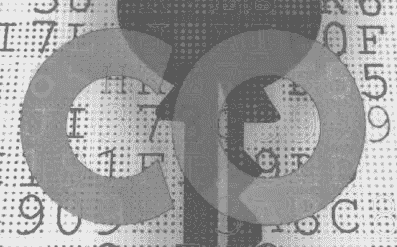

# 加密计算、实现技巧

> 原文：<https://medium.com/analytics-vidhya/encrypted-computations-implementation-tricks-fd78d6c140ad?source=collection_archive---------9----------------------->



这是一个帮助软件开发人员和数据科学家构建解决方案的指南，这些解决方案使用全同态加密(FHE)对加密数据执行一些计算。

全同态加密有许多应用。例如，它允许对搜索引擎进行私人查询，它可以对私人数据进行数据分析，提高选举的透明度。

FHE 有几个很棒的模式和实现，在本指南中，我将使用微软海豹突击队库和 BFV FHE 模式。我准备了笔记本在 Google Colab 中运行测试，但是你也可以在你的 PC 上、Docker 容器中或者云中使用常规的 python IDE。

在我之前的[帖子](/@alextmn1/encrypted-computations-using-google-colab-beca92c45f7c)中，我解释了如何在 Google Colab 上设置海豹突击队-Python 并运行几个基本示例，但是设置非常简单，可以在 Colab 笔记本中用几行代码组合起来。

```
!git clone -b 3.3.2 https://github.com/Huelse/SEAL-Python!cd SEAL-Python/SEAL/native/src;cmake .;make!pip3 install -r SEAL-Python/requirements.txt!cd SEAL-Python;python3 setup.py install
```

# 基本用法

首先，我们需要指定初始化参数:

```
from seal import *poly_modulus_degree = 4096parms.set_poly_modulus_degree(poly_modulus_degree)parms.set_coeff_modulus(CoeffModulus.BFVDefault(poly_modulus_degree))
```

*poly_modulus_degree* 的值确定加密方案中的下划线多项式次数，更大的 *poly_modulus_degree* 使得密文更大，所有操作更慢，但是能够进行更复杂的加密计算。推荐值为 1024、2048、4096、8192、16384、32768，但也有可能超出此范围。

然后我们需要设置模数参数。

```
parms.set_plain_modulus(256)
```

明文模数可以是任何正整数，它决定了明文数据类型的大小和乘法中噪声预算的消耗。为了获得最佳性能，尽量使明文数据类型尽可能小是很重要的。

请注意，在 BFV 模式中，每个加密值都有一个噪声预算。在密码文本操作期间，噪声预算被消耗。一旦密文的噪声预算达到零，它就变得太坏而不能被解密。

现在让我们定义密钥，加密器和解密器

```
context = SEALContext.Create(parms)keygen = KeyGenerator(context)public_key = keygen.public_key()secret_key = keygen.secret_key()encryptor = Encryptor(context, public_key)evaluator = Evaluator(context)decryptor = Decryptor(context, secret_key)
```

公钥用于加密，它是完全开放的(公开的)，因此任何人都可以加密，而私钥是私有的，因为它用于解密数据。

# 加密计算

我们首先需要加密数据。

```
enc1 = Ciphertext()
enc2 = Ciphertext()
enc3 = Ciphertext()# hex numbers
encryptor.encrypt(Plaintext("A1"), enc1)
encryptor.encrypt(Plaintext("2E"), enc2)
encryptor.encrypt(Plaintext("3E"), enc3)
```

在本例中，我们有 3 个加密的十六进制值 0xA1、0x2E、0x3E。让我们做一个加法和一个乘法。

```
evaluator.add_inplace(enc1, enc2)
evaluator.multiply_inplace(enc3, enc2)
```

FHE 只支持乘法加法和子结构，所以如果你需要除以一个数，你必须先把它反过来，然后再用乘法。此外，不要忘记所有的计算都是在我们定义的纯文本模数 256 或 0x100(十六进制)内执行的，因此实际结果看起来像这样:

#(0xa 1+0x2E)mod 0x 100 = 0x cf
#(0x2E * 0x3E)mod 0x 100 = 0x 24(在 mod 操作之前为 0xB24)

# 重新线性化

这是一种在相乘后将密文的大小减小到初始大小的操作。您还需要为它创建一个特殊的密钥。

```
relin_keys = keygen.relin_keys()print(“size of enc3 value before Relinearization: “ + str(enc3.size()))evaluator.relinearize_inplace(enc3, relin_keys)print(“size of enc3 value after Relinearization: “ + str(enc3.size()))>> size of enc3 value before Relinearization: 3 
>> size of enc3 value after Relinearization: 2
```

# 提高加密计算的速度

您可以在两个大型阵列上并行应用 FHE 运算。这被称为 ***批处理*** ，它极大地提高了性能。在批处理中，使用两个向量或值数组，而不是一个值对。

批处理是计算加密数字的推荐方式。

你必须为此使用一个特殊的编码器，叫做*分批编码器*

```
parms = EncryptionParameters(scheme_type.BFV)poly_modulus_degree = 8192parms.set_poly_modulus_degree(poly_modulus_degree)parms.set_coeff_modulus(CoeffModulus.BFVDefault(poly_modulus_degree))batch_encoder = BatchEncoder(context)slot_count = batch_encoder.slot_count()
```

固定大小向量的槽数等于*poly _ modulus _ degree*(8192)。您必须在两个向量中设置加密值，然后调用**加法**或**乘法**操作，该操作将一次性并行执行。

```
#encrypt vec #1 ( each number is 7 )
plain_vec1 = **uIntVector( [7] * slot_count )**
plain_text1 = Plaintext()# encode python matrix in Plaintext
batch_encoder.encode(plain_vec1, plain_text1)# and encrypt
encrypted1 = Ciphertext()
encryptor.encrypt(plain_text1, encrypted1) #encrypt vec #2 (  each number is 3 )
plain_vec2 = **uIntVector( [3] * slot_count )**
plain_text2 = Plaintext()
batch_encoder.encode(plain_vec2, plain_text2)encrypted2 = Ciphertext()
encryptor.encrypt(plain_text2, encrypted2)#  multiply encrypted vectors in parallel
***evaluator.multiply_inplace(encrypted1, encrypted2);***# decrypt
plain_result = Plaintext()
decryptor.decrypt(encrypted1, plain_result);
pod_result = uIntVector()batch_encoder.decode(plain_result, pod_result);***# The result should be: 8192 x 7 x 3 = 172032*** print( f"{pod_result[:3]}...f{pod_result[-3:]} sum: {sum(pod_result)} ")>>> *uIntVector[21, 21, 21]...fuIntVector[21, 21, 21] sum: 172032*
>>> completed in 0:00:00.112214
```

# 其他技巧

1.  比较两个数字

BFV 没有提供这样的功能。因此，您必须要求解密加密值，以便进行比较。但是，您可以通过添加一个随机数来对密钥所有者隐藏结果。该协议可能如下:

你有 2 个加密值:A，B.
生成一个新的随机数 N 并加密它 EN
计算:A-B+EN 并请求解密结果= > R
取解密结果并子构造 R- N
if (R- N) > 0 然后 A > B

2.实现庞大的计算，如数据库 FHE 搜索

即使使用批处理，这样的任务也是一个挑战，因为数据库中可能有数百万条记录，您可能需要对加密数据执行完整扫描，这会影响性能。

你可以做的是使用一些哈希函数来定义一些记录数量较少的桶。如果这些桶仍然太大，你可能想看看 cuckoo 散列法，它使用两种不同的散列函数来解决冲突。

# 在加密数据上实现私有计算的其他方法

FHE 是一种非常优雅和安全的方式，即使对于后量子世界来说也是如此。但是 FHE 的数学很复杂，只限于加法、减法和乘法。

实现这种计算的另一种方法可能是软件保护扩展(SGX)，这是一种内置于一些现代英特尔中央处理器(CPU)中的技术。

内存中有一些私有区域，称为 enclave，其内容受到保护，不能被 enclave 本身之外的任何进程读取或保存。CPU 有一个由英特尔在制造过程中融合的根对称密钥。

在 enclave 内部运行的应用程序使用唯一的对称密钥来保护其数据，该对称密钥是使用运行的应用程序的散列作为派生参数从 CPU 的根对称密钥派生的。

因此，如果您更改应用程序，哈希将会不同，应用程序将无法再访问其数据，因为密钥将会不同。

这种方法允许应用程序对操作系统、BIOS 或硬件所有者屏蔽数据，并使这些数据仅在 enclave 内可用，从而实现私有加密计算。

本文的 Colab 笔记本在这里或者我在 T2 的 GitHub 库中。