# 静态加密—涉及哪些内容？

> 原文：<https://medium.com/analytics-vidhya/encryption-at-rest-whats-involved-ef8dba69f65b?source=collection_archive---------8----------------------->


加密技术已经存在了很多很多年。当我们现在想到它时，我们会想到计算机。但它远远早于计算机。在我看来，加密的方法和现在的技术都很迷人！我将向您介绍什么是加密的步骤，希望在本文结束时，您能够理解和欣赏“静态加密”。


首先，什么是加密，什么是*静态加密*和*为什么*很重要？为什么会有一整个研究领域致力于此？

# 加密

从根本上来说，加密是一种行为，即把一些容易阅读的东西(一个短语或一段文本)转换成看起来像纯胡言乱语的东西。在加密中，将人类可读的文本编码成字符串，如果没有用于加密的“密钥”就无法读取，通常称为“密码密钥”。一个古老而基本的例子是凯撒密码。这是通过将字母表映射到移位字母表来实现的，很像下面的例子:

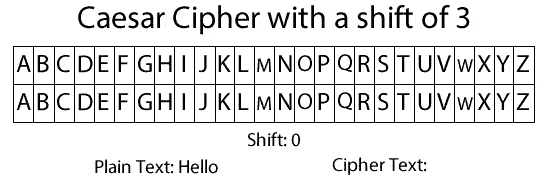

正如你所看到的，移位三只不过意味着将字母表向左移动三个位置。这样，A 变成了 D，B 变成了 E，依此类推。让我们再举一个例子，使用移位 5 来编码短语“密码很酷”:

```
Alphabet:           ABCDEFGHIJKLMNOPQRSTUVWXYZ
5-Shifted Alphabet: FGHIJKLMNOPQRSTUVWXYZABCDEPlain text:  Ciphers are cool
Cipher text: HNUMJWX FWJ HTTQ
```

正如你所看到的，每个字母都被另一个字母所取代，从而将短语转换成了胡言乱语。这是一个非常简单的密码，计算机只需几分之一秒就能解密。现代密码要强大得多，通常需要复杂的方程式和算法来生成加密文本。

当我们使用互联网时，我们的电脑、笔记本电脑、手机或其他类似设备发送的信息通常(在完美的世界中应该总是)在通过互联网传输之前被加密——这给了我们传输中的加密。这通常比静态加密更受关注，因为它是更常见的攻击点。

让我们设置一个简单的场景来解释传输中加密的重要性。你在电脑上，给某个社交媒体平台上的朋友发消息，比如说脸书。如果在你的网络上有其他人(一个“监听器”)，或者在你和脸书的服务器之间有其他人，他们可以截取和读取你和你朋友之间发送的信息。然而，当这些消息被加密时，收听者将无法解释你发送的内容。至少要付出相当多的额外努力。

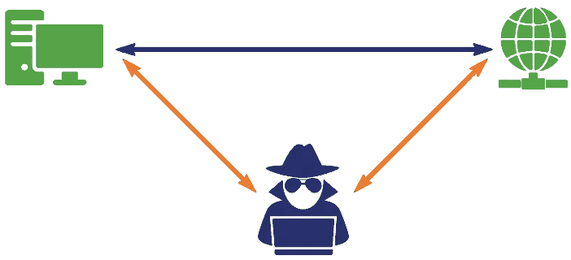

以上概述了加密的重要性，以及数据在互联网上传输时是如何暴露的。

# 那么，静态加密？

正如您可能猜到的，静态加密是在数据*未*传输或被程序使用时加密数据的行为。这使得它处于“持久”状态，通常保存在硬盘或其他类似的存储设备上。

对于普通用户来说，这可能不是一个问题，可能是你永远不需要担心的事情。但当你开始关注存储敏感数据的大型企业级设备时，比如托管数据库的计算机，这就变得非常重要了。如果有人设法通过互联网访问计算机，或者更糟的是亲自访问，该怎么办？如果他们能访问存储在上面的数据呢？只要在谷歌上搜索“数据泄露”并切换到新闻标签，你就会看到这对大公司会有什么影响。

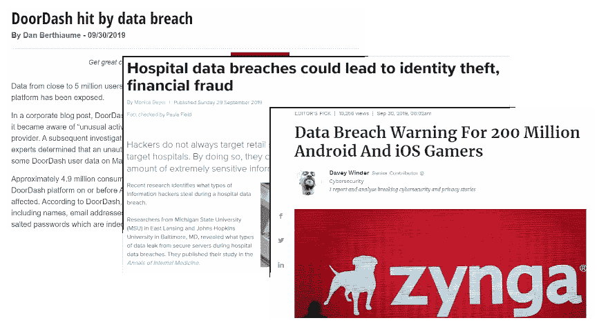

有了静态加密，这些担忧可以得到缓解。是的，黑客也许能够解密他们发现的东西，但如果选择了合适的加密方法，从统计上来说，这需要很长时间(想想几十年或几百年)。

正如 Caesar 密码是一种非常基本的加密形式一样，有许多现代密码可供选择来使用静态加密。举一个用于云计算的例子，让我们看看 Oracle 的静态加密方法，称为透明数据加密(TDE)。查看 Oracle 数据库 18c 版本的文档，他们采用的加密形式之一是国际标准 **AES** ( **高级加密标准**)。

但是那是什么，它是如何工作的，如果人类用手而不是电脑来做它会是什么样子？在你继续下去之前，我会在接下来的章节中深入研究这个算法背后的数学。

# 高级加密标准(AES)

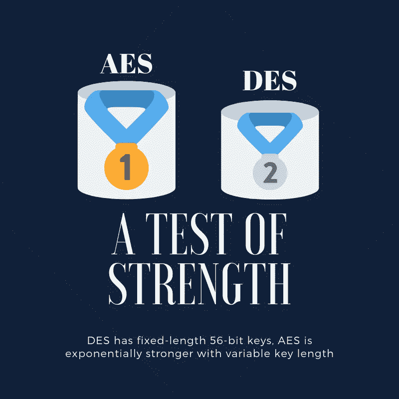

AES 是这种算法的通用名称，但它实际上并不是最初的名称。1997 年，美国国家标准与技术研究所(NIST)开始着手寻找新的加密标准。随着时间的推移，当时的标准 DES 变得越来越脆弱，越来越容易被攻破。在几年的过程中，不同的加密方法被提交和考虑。从该计划中选择出来成为 AES 的密码是由文森特·里门和琼·代蒙创造的 **Rijndael 密码**(读作‘rain-Dahl’)。

DES 受到使用 56 位固定长度密钥的限制。这相当于你键盘上 7 个字符的长度，对现在几乎所有的网站来说都太短了，因为太容易猜了。AES 的亮点在于它允许不同长度的密钥——128 位、192 位和 256 位。所有这些都将应用于 128 位块中的数据。随着密钥长度的变化，它越长就越安全。

回到 56 位是 7 个字符，128(最小密钥长度)是 16 个字符。更难猜测。因此，随着时间的推移，可以使用越来越长的密钥，或者您可以评估数据的敏感性，并决定从一开始就使用更长的密钥。进行评估的原因是，密钥越长，所需的计算也越多。

那么 AES 中的密钥是如何用来加密数据的呢？在上面的凯撒密码中，密钥只是告诉你字母表移动多远的数字，在上面的例子中是 5。AES 要复杂得多。这是潜水深度超出预期的地方。当我开始写这篇文章的时候，我想给你们一个简单的数学概述；这一意图的结果是用 python 编写了一个[脚本，可以用 128 位密钥执行简单的 AES。](https://github.com/HughGDA/rijndael/blob/master/rijndael.py)

在我们开始之前，有一些警告:

*   我使用了大量的字符串，而不是二进制和十六进制数字，这样做是为了尽可能的详细，并且更容易形象化每一步发生了什么。
*   这是一个基本的实现，旨在帮助理解主题，所以我限制了输入以适应示例的格式。
*   同样，由于这是一个理解而不是实现的工具，我选择了一些更容易理解的数学而不是高效的数学。

在这次分解中，我不会讨论整个脚本(剧透:它很长)，但我会从最适用的来描述正在发生的事情。

## (AES 的)基础知识

在最基本的情况下，Rijndael 密码接受一些纯文本输入，即一个密码密钥，并根据密钥长度确定轮数。鉴于我编写这个程序是为了处理一个 128 位的密钥，我添加了 rounds 作为输入，但实际上它应该是一个固定的数字。尽管在可能的情况下，我尽可能灵活地保留了脚本，希望它能在以后变得更加强大。

该算法将纯文本转换成二进制，将这种二进制表示分解成长度为 128 位的块。这种二进制表示相当于 32 个十六进制字符，或 16 个键盘字符。计算中使用的矩阵将明文块和密钥的 32 个十六进制字符组织成 4x4 矩阵，其中每个矩阵元素是一个十六进制对。

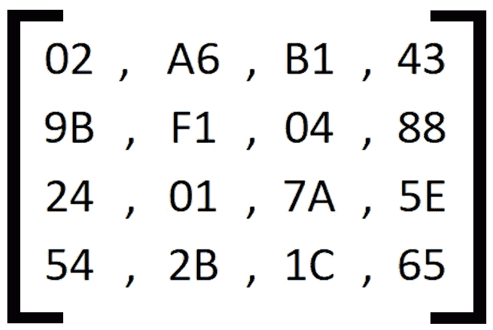

示例 4x4 矩阵

这些矩阵是按列构造的(虽然在我的代码中，为了便于计算，我在某些部分将其转换为按行的，但让我们假装我没有这样做)。这意味着，如果我们把左边的例子变回一个字符串，它会变成:“02 9B 24 54 A6…”等等。这很重要，因为如果它们是按行构造的，输出会有很大的变化。

Rijndael 密码的主要功能

在初始回合之前，有必要生成“扩展密钥”。就我自己的理解，我一直认为这是第零步。在我看来，至少就数学而言，这是最复杂的一步。有必要在整个密码中引入更多的安全性。

在“第零步”之后，第一轮由 *addRoundKey* 步组成，随后是九轮 128 位密钥(更大的密钥更多)。每一轮由 *byteSubstitution* ，接着是 *shiftRow* ，接着是 *mixColumn* ，接着是 *addRoundKey* 组成。省略*混合列*步骤，接着进行第十轮。这是一大堆扔给你的术语，现在来解释一下它的意思。

# 扩展圆形密钥—零步

rcon '(称为舍入常数，我们将在后面的步骤中研究)在每列的顶行中是非零的。舍入常数的非零元素计算如下:

*   对于舍入零，使用 01(十六进制表示)
*   每隔一轮是在 2⁸的伽罗瓦域内用不可约多项式 x⁸+x⁴+x +x+1 加倍的前一轮
*   等等，那两点到底是什么？？

## 伽罗瓦域

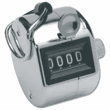

计数点击器

一个简单的解释是，它是一个有限域——在一个无限域中，数字可以一直上升，但在一个有限域中，它们会环绕上升。

以遥控器为例。按下按钮，它上升一级。转到“9999”并点击按钮，它会返回到“0000”。伽罗瓦域就是这样，但要复杂得多。

让我们来分解一下上一节的要点。2⁸告诉我们，我们的字段使用二进制数，基数为 2(即由 0 和 1 组成)，它有 8 个位置。因此，我们字段中的数字可以是最多包含 8 个字符的二进制数。

一个数字超过 8 个字符怎么办？这就是“不可约多项式”的由来。较长数的伽罗瓦域等价物是较长数对不可约多项式取模，即当您将较长数除以不可约多项式时的余数。

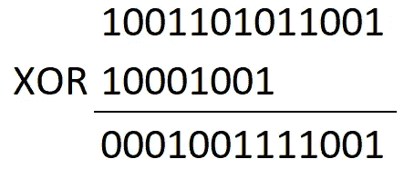

谢天谢地，二进制使得模运算简单多了。二进制数的除法相当于排列每个数的最高有效位，并执行“异或”(XOR)运算。

有了异或，你有两个输入和两个输出，1 或 0(二进制，对吗？).你决定的方式是，如果两个输入相同，它是 0，如果它们都不同，它是 1。所以你一直排列你的数，直到余数小于不可约多项式。

“但是不可约多项式不是二进制的！”我听到你说。别担心，我们可以解决这个问题。给定的多项式转换成二进制表示:

```
x⁸+x⁴+x³+x+1 == 1x⁸+0x⁷+0x⁶+0x⁵+1x⁴+1x³+0x²+1x¹+1x⁰ == 100011011
```

当我们展开它，我们可以看到，长形式的多项式只是某个 x 值的 1 或 0 倍。去掉 x，我们可以看到一个二进制数出现。

我们有了圆周率常数，接下来呢？

## 扩展圆形密钥

在计算出舍入常数之后(或者在我的代码中，只是简单地提供)，必须扩展密钥。一开始它是一个 4x4 的矩阵。展开后，它应该有额外的列数，等于轮数乘以矩阵的大小(分别是 10 和 4)，在我们的例子中，给出 40 个额外的列，总共 44 个。

在计算中，通常是从 0 开始计数。所以我们得到的键给出了位置为 0，1，2 和 3 的列。这有什么关系？对于扩展密钥，我们有两条规则要遵循；如果新列**是位于可被 4 整除的位置的**，我们做一件事，如果**不是**，我们做另一件事。

如果它*是*被 4 *整除就更复杂了，那我们就从这个开始吧。为了举例，我们将讨论添加到我们的原始密钥上——以“AES 基础知识”一节中的示例 4x4 矩阵作为初始密钥。这意味着我们的下一列将是第五列。但是因为我们从 0 开始计数，这将是位置 4。对于可被 4 整除的位置，取前一列(在本例中是位置 3)，将每个元素上移一个位置，然后执行字节替换。*

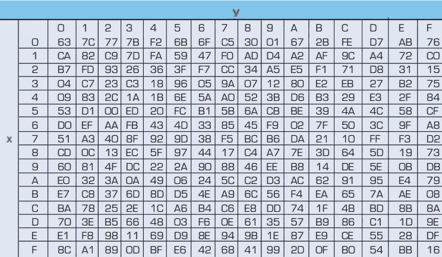

字节替换表

按照上面的替换表进行字节替换。如您所见，它查找 X 和 y。这些是每个元素中的十六进制对，对的左边是 X，右边是 y。例如，在 SHIFT 列的下面，元素 0 是“88”。因此，我们在 X=8 和 Y=8 处扫描，以找到“C4”。查看元素 1，“5E”，我们在 X=5 和 Y=E 处查找“58”。我们对元素 2 和元素 3 做同样的事情。结果见 SUB 栏。

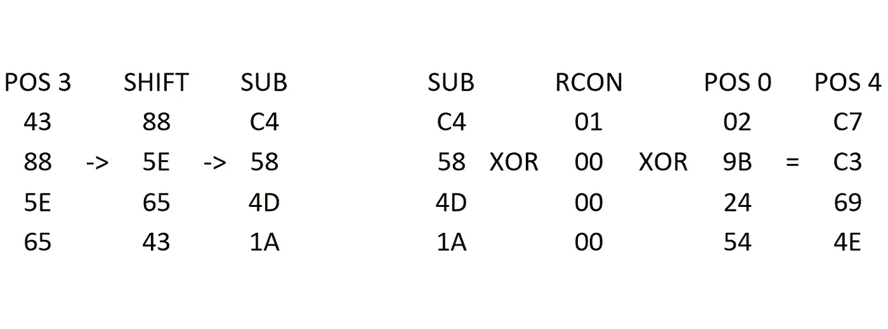

有一种计算替换的方法，我写的脚本实现了这种方法。然而，这篇文章已经够长了，所以我将在以后解释它的工作原理。

找到列 SUB 后，它必须与当前的 RCON 列进行异或运算。每四个新列与一个 RCON 列相关联。因此，对于位置 4 到 7，我们使用第一个 RCON 列(列“0”)，对于位置 8 到 11，使用第二个，依此类推。然后，XOR 的结果再次与前面 4 个位置的列进行 XOR。在我们的例子中，位置-4 就是位置 0:

```
current position = 4
4-4=0
```

在所有 xor 运算中，有必要将十六进制转换成二进制，我在这里省略了。新的第五列在上面显示为位置 4 的列！

不能被 4 整除的位置就容易多了。您只需将位置-1 的列与位置-4 的列进行异或运算。所以位置 5 就是位置 4 或位置 1。对于我们的 128 位密钥，这一直持续到我们有 44 列，由我们的原始密钥加上我们的 40 个新列组成。

## 添加关键步骤

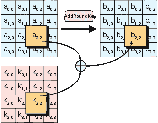

该步骤在每轮开始前执行一次*，然后在每轮结束时再次执行。从我们的 44 列扩展键中，每次执行此步骤时，都需要找到正确的四列来使用。我用的方程是`round*4 to (round+1)*4`。还记得我之前说过我喜欢认为存在“第零步”吗？这是我这样描述它的另一个原因；`round = 0`，给出了第一个 addRoundKey 的 0 到 4 列。在 python 中，你可以这样描述数字的范围:`in range(0,4)`，这意味着从 0 到 4 的数字，但不包括 4。这导致范围为“0，1，2，3”。*

现在，我们已经选择了四个键列，这四列纯文本以十六进制形式表示。同样，我们将从头开始采用 4x4 矩阵作为键的列 0 到 3，并引入一个新矩阵作为纯文本:

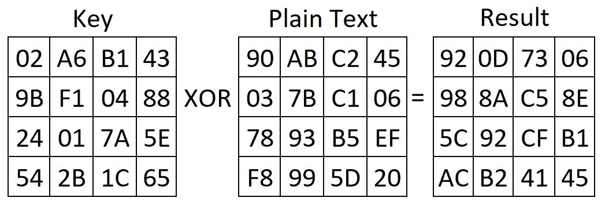

一旦我们有了正确的键列和纯文本，我们就逐个元素地执行 XOR 运算来寻找新的矩阵。这意味着我们从第一列的第一行得到“02”异或“90”得到“92”。然后我们看第一行的第二列；A6 '异或' AB '得到' 0D '。我们遵循这种匹配两个矩阵中的位置的趋势，并以这种方式继续下去，直到每个元素都被异或。

## 按替换步骤

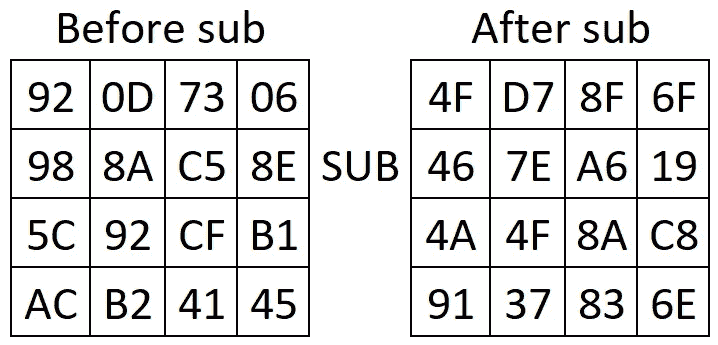

你可能很高兴知道你现在已经到达了一个很短的部分，正如我在上面的"**扩展圆密钥"**中已经讨论过的。我们只需按照 addRoundKey 的“结果”矩阵中的表格做同样的事情。就这样，byteSubstitution 步骤到此结束！

## 移位行步骤

同样，这应该是一个不错的小步骤。我们将使用 byteSubstitution 中的“After sub”矩阵。首先，我们需要标记从 0 开始计数的每一行；所以我们有 0，1，2，3 行。接下来，将每一行的每个元素向左移动与该行的标签相等的次数。

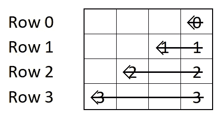

也就是说顶行不动，1 行左移一次，2 行左移两次，3 行左移三次。行是环绕的，所以如果移动的话，最左边的元素会移动到最右边。

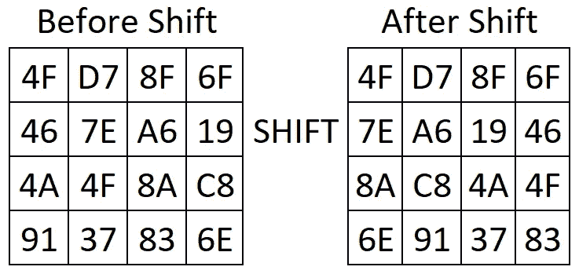

## 混合列步骤

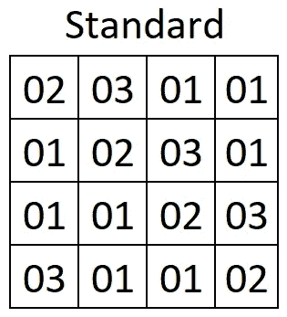

现在我们回到稍微长一点的步骤，使用一点矩阵运算。对于这一步，我们使用标准矩阵(如左图所示),并将其乘以上一步的“移位后”矩阵。

记住:矩阵乘法的顺序非常重要。所以这一步是`standard matrix * matrix from previous step`。要快速复习矩阵乘法，[点击这里](http://bit.ly/matrixRefresher)。

我们需要记住我们之前接触过的伽罗瓦域，所以如果结果太高，我们需要执行模运算，就像点击器循环一样。幸运的是，使用二进制有三个好处，可以节省我们很多时间:

*   你可以在数字的末尾加上一个 0 来乘以 2
*   乘以 3 等同于乘以 2，然后将结果与原始数字进行异或运算
*   具有二进制数的伽罗瓦域中的加法等同于两个数的异或运算

执行标准矩阵乘法会导致以下结果:

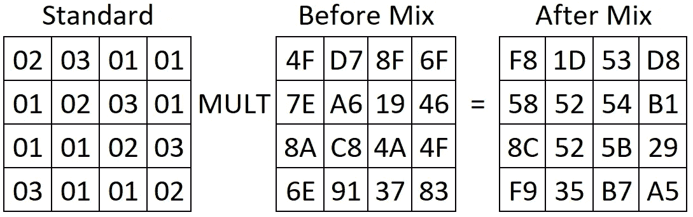

让我们将左边的第一行和右边的第一列转换成二进制，以显示发生了什么。

```
ROW:
02 = 00000010, 03 = 00000011, 01 = 00000001, 01 = 00000001
COLUMN:
4F = 01001111
7E = 01111110
8A = 10001010
6E = 01101110MULTIPLICATION
(4F*02)+(7E*03)+(8A*01)+(6E*01)
= (4F*02)+(7E*03)+(8A)+(6E)
= (4F*02)+((7E*02) XOR 7E)+8A+6ESIMPLIFY
4F*02 = 01001111
        00000010
        --------
        100111107E*02 = 01111110
        00000010
        --------
        11111100
    XOR 01111110
    ------------
        10000010ADDITION (REPLACE WITH XOR)
(10011110 XOR 10000010) XOR (10001010 XOR 01101110)
= 00011100 XOR 11100100
= 11111000
== F8
```

与该算法中的其他一些步骤相比，mixColumns 是相对“简单”的数学，但这一步漫长的二进制算术说服了我编写 python 脚本来伴随它。

## 现在都在一起

现在我们知道了每一步是什么，以及它是如何工作的(至少在某种程度上)，让我们来看看它们是如何排列的。

1.  生成扩展密钥
2.  在第 0 轮执行一次 addRoundKey
3.  对于除最后一轮以外的每一轮 do: byteSubstitution、shiftRow、mixColumn、addRoundKey
4.  最后一轮 do: byteSubstitution，shiftRow，addRoundKey

像这样把一切放在一起，听起来似乎很简单。

# 所以现在我安全了，对吧？

是也不是。现在我们知道了 AES 密码的工作原理，这对于保护数据大有帮助，但这只是您应该采取的许多步骤之一。加密您的静态数据，加密传输中的数据，设置一个强大而安全的网络接口，甚至可以使用虚拟专用网络(VPN)来增加一点额外的安全性。这完全取决于您需要多大程度的数据保护。

但请始终考虑；没有一个万全之策。为了保证数据的安全，你需要多种安全功能。

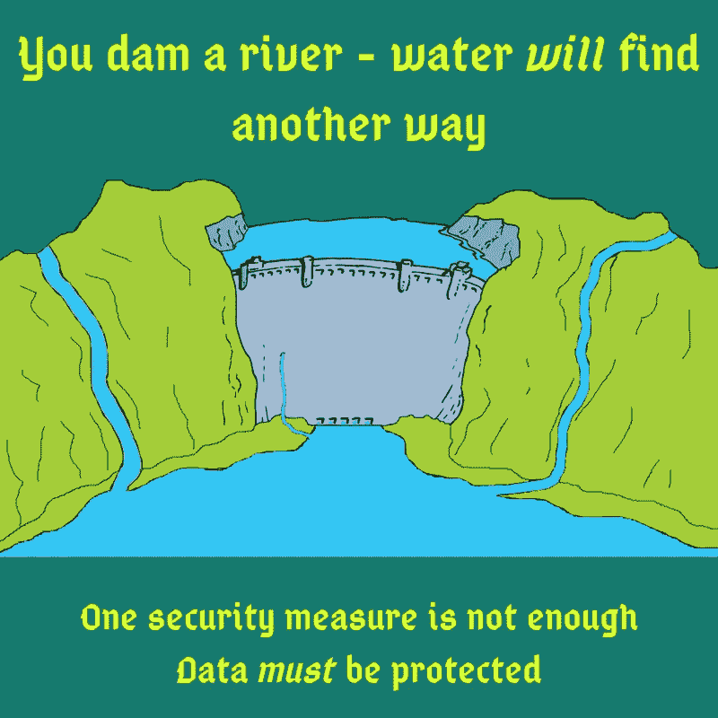

如果你认为使用静态数据或其他数据库安全方法对你或你的企业有用，考虑注册甲骨文云试用:[http://bit.ly/OCTrialLink](http://bit.ly/OCTrialLink)

有问题或意见吗？在 https://www.linkedin.com/in/hugh-gallagher/[的 LinkedIn 上找到我](https://www.linkedin.com/in/hugh-gallagher/)

> **所有观点均为本人观点，不代表甲骨文**

> 感谢[瑞安·林奇](https://medium.com/u/90b0c48b8b03?source=post_page-----ef8dba69f65b--------------------------------)和[格雷斯·拜尔斯](https://medium.com/u/a7a7d9c1661c?source=post_page-----ef8dba69f65b--------------------------------)在剪辑过程中的帮助。