# 端到端基于深度学习的移动 app。

> 原文：<https://medium.com/analytics-vidhya/end-to-end-deep-learning-based-app-af67d4008550?source=collection_archive---------10----------------------->

## 聪明烹饪


聪明烹饪

大家好，今天在这篇文章中，我将分享我构建梦想应用程序的经验，即 [Cook smart](https://play.google.com/store/apps/details?id=com.amply.recipefinder) 。

[](https://play.google.com/store/apps/details?id=com.amply.recipefinder)

我们将逐步讨论什么是问题陈述、想法和执行。

请下载应用程序，并等待下载模型。

## 为什么？

> 问题陈述

这是我每次想到烹饪时都会面临的问题，不仅仅是我。我从我的许多朋友那里听到了同样的话。他们也有类似的问题，也就是说，我们家里有食材，但仍然缺乏准备不同种类食物的知识。当准备一顿饭或小吃时，人们倾向于准备他们已经准备了多年的同样的老东西。该列表几乎不包括 5 到 10 个经常被调整的食谱。因此，我想出了一个主意，用我们之前用过的相同原料制作不同的美食。每次收集家常食材时制作不同食物的想法

## 怎么会？

> 这个概念

这个想法是这样的..在做饭前，我们必须打开智能烹饪应用程序扫描食材。我们所拥有的。一旦项目被成功识别，它将使用配料搜索食谱，并以列表格式显示结果。

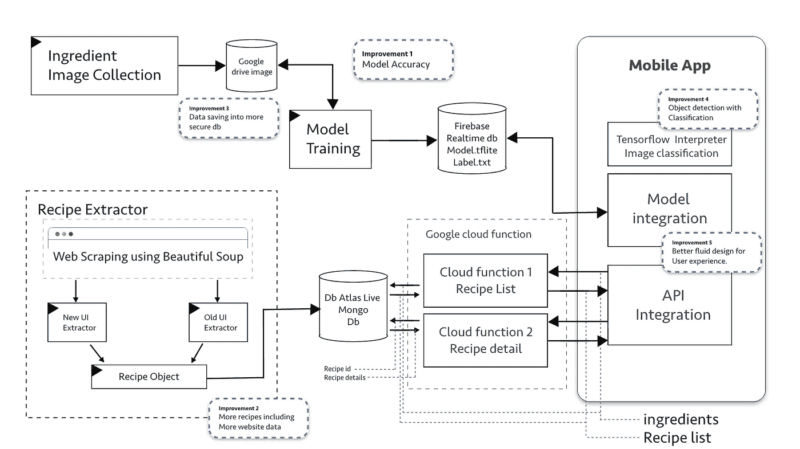

> 这个 app 怎么用？

下面是该应用的 gif 图。及其工作流程。


应用流程

## 什么？

> 我们会学习的

为了完成这个应用程序，我们将经历许多不同的练习。分别是**使用 Tensorflow** 进行图像分类、原生 android 应用开发、**使用原生 android 应用开发的 Tensorflow lite】、Python **脚本**、Python **网页抓取**、Python **Flask-API 开发**、**无服务器函数**(使用 Python 的 **GCP 函数**或**lambda【AWS】、 **Mongo DB、Firebase 实时数据库、****让我们看看如何利用这些来制作一个很棒的应用程序。请注意，这一切都将是实时的，我们将看到如何**部署**一切。所以继续前进。**

应用程序的完整系统设计。我们将逐一查看每一个街区。

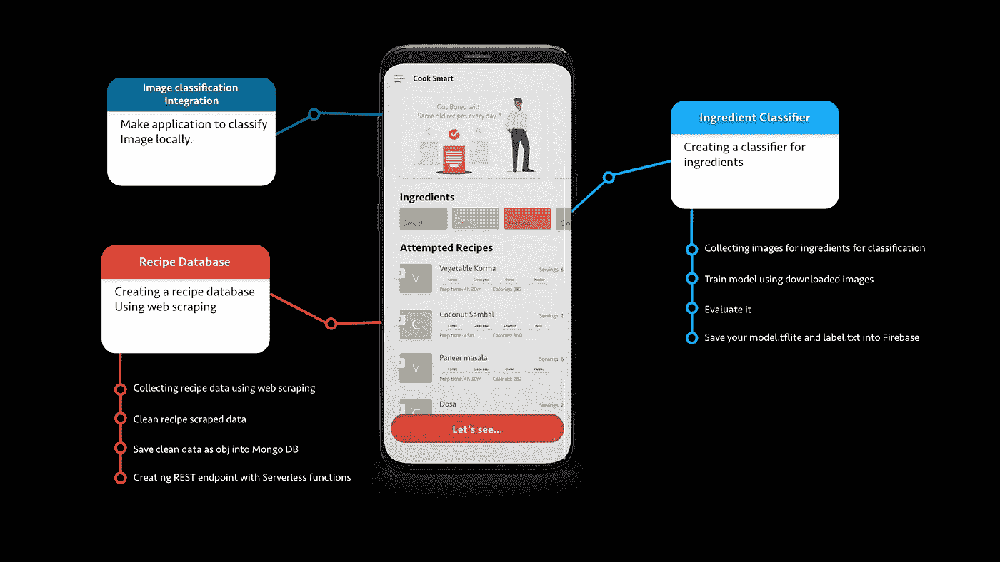

## **配料图像分类**

这是机器学习在这个应用中的一部分。为了再做一次，我们需要把这个任务分成更小的块。即，

1.  收集配料数据。
2.  为此训练一个深度神经网络模型。
3.  一旦它达到令人满意的精度，我们就可以保存到 Firebase 中。

**收集数据**

没有人能从网上下载每种配料的图片，每种配料我们至少需要 500 张图片。所以我使用了一个使用[google _ image _ download()](https://pypi.org/project/google_images_download/)lib 的脚本来从 Google 下载图片。这是我收集配料图像的脚本。

在使用这个 google_image_download()时，我发现并不是所有的图片都从这个库中下载，所以我添加了一个递归函数 manage_download()来下载所有需要的图片。

对于这项工作，我收集了不到 12k 的图像，大约 160 张图像作为每种成分，我们有 74 种成分(输出标签)。:)

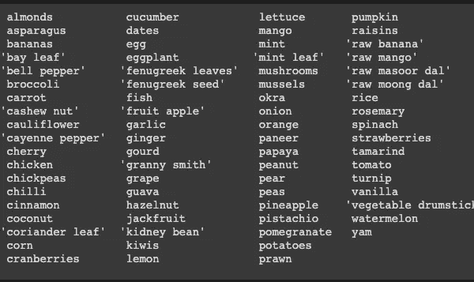

使用 google_image_download()下载配料图像

**使用这些图像预处理和训练模型**

黄金部分是制作一个将成分分类的模型。当我们的数据准备好了，我们需要开始为模型训练。所以有两种主要的方法。

1.  使用 MobileNetV2、inception v3 进行迁移学习
2.  自己的 CNN 模型。

迁移学习:简单地说，迁移学习是我们将使用预训练的 CNN 模型和现有模型的方式，它将帮助我们进行特征提取。但首先，让我们下载。

```
IMG_SHAPE = (IMAGE_SIZE, IMAGE_SIZE, 3)# Create the base model from the pre-trained model MobileNet V2
insp_base_model = tf.keras.applications.InceptionV3(input_shape=IMG_SHAPE,include_top=False,weights=’imagenet’)
```

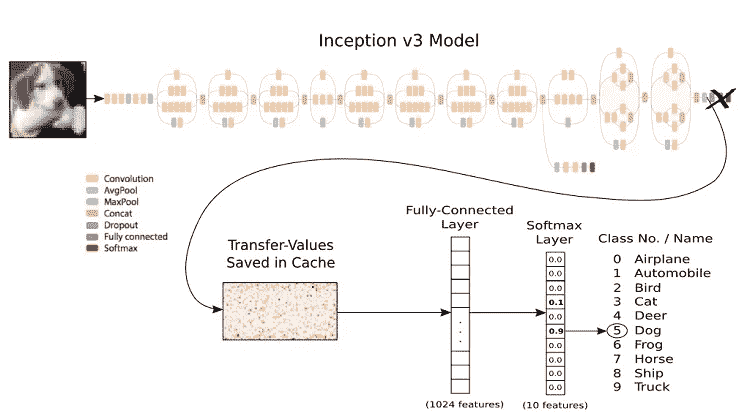

这里的基本模型有 MobileNetV2，或者我们也可以采用 InceptionV3 或 VGG16，这里有一个关于我们如何使用上述模型的示例代码。

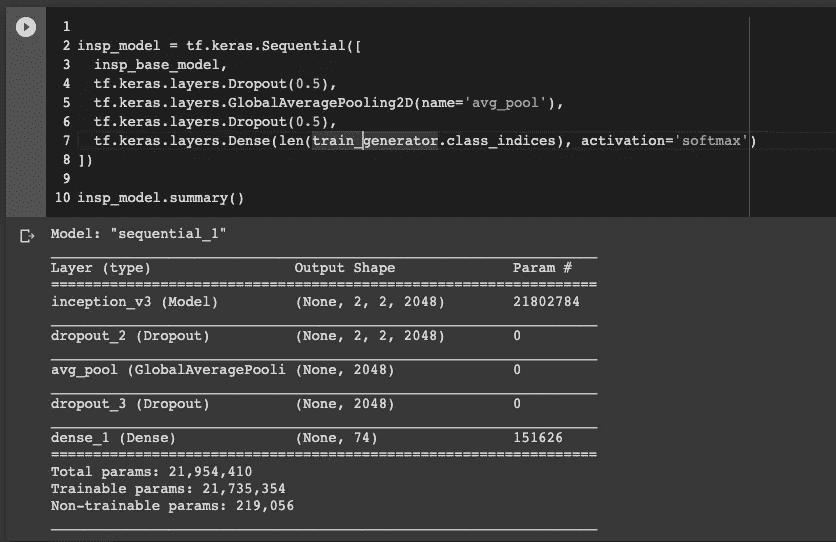

然后我们会编译模型并拟合(训练它)。下面是我编译的代码。

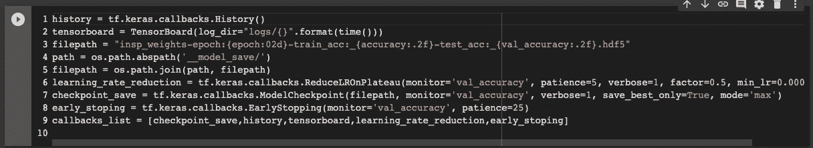

回拨列表

回调列表维护 early _ stoping(即，如果模型在准确性上没有改进，则停止它)，checkpoint_save(即，对于每次迭代，检查我们是否获得了比先前更好的准确性，如果为真，则保存模型文件。)、learning_rate_reduction(即动态学习率变化)所有这些，以便我们不会错过我们项目的任何改进模型。

```
insp_model.compile(loss=’categorical_crossentropy’,optimizer=adam,metrics=[‘accuracy’])history = insp_model.fit_generator(train_generator, epochs=100, callbacks = callbacks_list, validation_data=val_generator)
```

一旦模特接受训练。我们可以将模型文件保存到 model.tflite 中，下面是相关代码。

**我发现了什么准确性？**

我发现 Vgg16 层非常好用。看看这里。

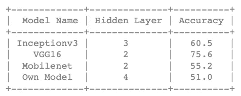

通过各种模型获得的精确度，包括我自己的 CNN 模型。

```
saved_model_dir = 'save/fine_tuning'
tf.saved_model.save(model, saved_model_dir)
converter=tf.lite.TFLiteConverter.from_saved_model(saved_model_dir)
tflite_model = converter.convert()
with open('model.tflite', 'wb') as f:
   f.write(tflite_model)
```

如果你像我一样使用 google colab，我们可以用下面的代码下载某个文件。或者保存到

```
from google.colab import files
files.download(‘model.tflite’)
files.download(‘labels.txt’)
```

第二种方法是创建自己的模型。

因此，对于这种方式，我们需要使用 CNN 过滤器，最大池，并根据我们的辍学层，所以这里是我设法创建模型的方式。

```
model = tf.keras.Sequential([tf.keras.layers.Conv2D(filters = 32, kernel_size = 3, input_shape=input_shape_img, activation=’relu’, padding=’same’, ),
tf.keras.layers.MaxPooling2D(2),
tf.keras.layers.BatchNormalization(),
tf.keras.layers.Dropout(0.5),tf.keras.layers.Conv2D(filters = 32, kernel_size = 3, activation= ‘relu’, padding=’same’, kernel_initializer = ‘he_uniform’),
tf.keras.layers.MaxPooling2D(2),
tf.keras.layers.BatchNormalization(),
tf.keras.layers.Dropout(0.5),tf.keras.layers.Conv2D(filters = 64, kernel_size = 3, activation= ‘relu’, padding=’same’, kernel_initializer = ‘he_uniform’),
tf.keras.layers.MaxPooling2D(2),
tf.keras.layers.BatchNormalization(),
tf.keras.layers.Dropout(0.5),tf.keras.layers.Conv2D(filters = 64, kernel_size = 3, activation= ‘relu’, padding=’same’, kernel_initializer = ‘he_uniform’),
tf.keras.layers.MaxPooling2D(2),
tf.keras.layers.BatchNormalization(),
tf.keras.layers.Dropout(0.5),tf.keras.layers.Flatten(),
tf.keras.layers.Dense(128, activation= ‘relu’),
tf.keras.layers.Dropout(0.5),
tf.keras.layers.Dense(len(train_generator.class_indices), activation=’softmax’)
])model.compile(loss='categorical_crossentropy',optimizer=adam,metrics=['accuracy'])history = model.fit_generator(train_generator, epochs=100, callbacks = callbacks_list, validation_data=val_generator)#Loss plot
acc = history.history['accuracy']
val_acc = history.history['val_accuracy']
loss = history.history['loss']
val_loss = history.history['val_loss']
plt.figure(figsize=(8, 8))plt.subplot(2, 1, 1)
plt.plot(acc, label='Training Accuracy')
plt.plot(val_acc, label='Validation Accuracy')
plt.legend(loc='lower right')
plt.ylabel('Accuracy')
plt.ylim([min(plt.ylim()),1.2])
plt.title('Training and Validation Accuracy')plt.subplot(2, 1, 2)
plt.plot(loss, label='Training Loss')
plt.plot(val_loss, label='Validation Loss')
plt.legend(loc='upper right')
plt.ylabel('Cross Entropy')
plt.ylim([0,3.0])
plt.title('Training and Validation Loss')
plt.xlabel('epoch')
plt.show()
```

**将模型保存成可执行格式(在这种情况下。tflite)**

一旦模型准备好了，我们需要将 tflite 格式的模型保存到 android 应用程序可以访问的地方。为此，我使用了 Firebase。这是我上传文件到 Firebase 实时数据库的脚本。

## **制作 REST API 端点**

为了创建 REST API 端点，我遵循了以下步骤。即

1.  收集配方数据。
2.  清理食谱数据，并使这些成为食谱对象。
3.  保存到 Mongo 数据库。
4.  通过互联网访问这些端点的无服务器功能。

**收集(网页抓取食谱数据)**

为了我的食谱，我从 http://allrecipes.com/的 T2 搜集了这些数据。向 allrecipes.com 团队大声疾呼，如果这些人没有配方数据，我可能要花 100 倍的时间来收集数据。

为食谱清洗类，并使它们成为对象。

用于清理配方数据的 Python 类

这里他们有两个不同的用户界面用于不同的食谱，我发现主要有两种类型的用户界面。我从两种类型的用户界面中获取了 1000 多种印度食谱。有了这个，我不得不区分成分的名称。也就是说，我得到的配料数据就像“1 茶匙压碎的大蒜”，我必须将它们转换成数量:1，配料:大蒜，方法:压碎，所以为此我使用了 [spacy lib](https://spacy.io/) 。

下面是我的 recipe 对象的一个片段。

配方对象

**保存到 Mongo**

这是一个非常简单的步骤，我们只需要导入 pymongo。使用 insert_one()我们可以将所有食谱添加到我们的 mongo DB 中。

Mongo 数据库插入

然后你会发现像下图这样的数据。在这里，我使用 compass 在 Mongo DB 中可视化数据。为了让它活起来，我已经将数据上传到 Mongo DB Atlas 中。atlas 提供 500mb 的免费 mongo 主机，而我只有 20mb 左右的数据，这对我来说再合适不过了。

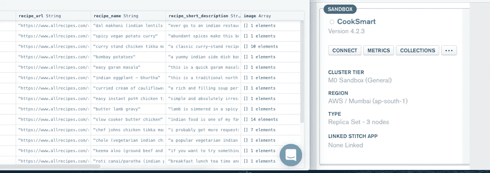

**无服务器功能**

为了与这个数据库通信，我们需要一个端点，在这里我们可以通过查询配料来获取这些食谱。为此，我们可以选择基于 Flask 服务器的 API 或云无服务器端点。我有两个 API。即

1.  获取包含配料名称的配方列表
2.  用配方 id 获取配方细节，向用户展示完整的配方。

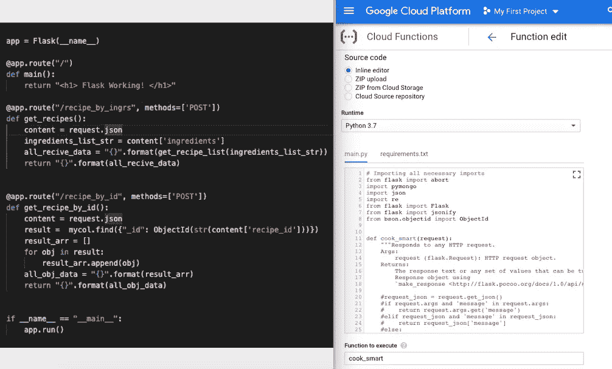

左(Flask API)右(Google cloud functions for server less API)

我选择无服务器 API，因为它支持一个月 200 万次调用。任何人都不能要求更多。

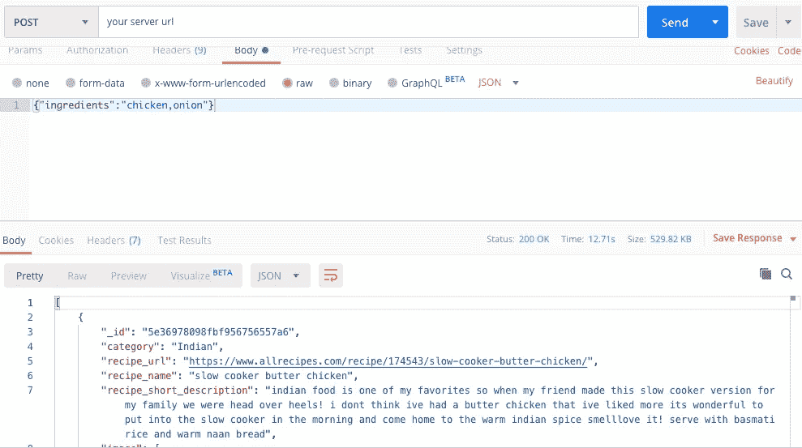

获取食谱的示例响应。

**安卓应用**

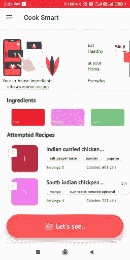

现在到了这样一个阶段，我们将把所有的块组合起来，制作一个真正能解决问题的 android 应用程序。为此，我们需要遵循以下步骤:

1.  Tensorflow 与 android 应用程序的集成。
2.  使用 Model.tflite 文件和 label.text 文件在应用程序中进行预测。
3.  为食谱和食谱细节调用 REST APIs。

为了设计这个应用程序，我使用 Adobe XD 进行用户体验设计和用户界面设计。

第一步变得很容易，因为在 Tensorflow 网站上，他们提供了一个使用 Tensor flow lib 的示例应用程序。尽管如此，如果有人觉得很难，只需添加到 app.gradle 文件，如下所示。

```
*// Build off of nightly TensorFlow Lite* implementation **'org.tensorflow:tensorflow-lite:0.0.0-nightly'** implementation **'org.tensorflow:tensorflow-lite-gpu:0.0.0-nightly'** implementation **'org.tensorflow:tensorflow-lite-support:0.0.0-nightly'**
```

然后你就可以在 android 应用中使用 TensorFlow-lite 了。在*ClassifierFloatMobileNet.java*中更改您的型号和标签文件

```
@Override
**protected** String getModelPath() {
  **return "model.tflite"**;
}

@Override
**protected** String getLabelPath() {
  **return "labels.txt"**;
}
```

它会在*CameraActivity.java*中反映出来，这是直接从摄像机中检测到的成分。如下图所示。

*   **图片* — —安卓应用中的相机活动*

为了用 android 调用 API，我使用了 AsyncHttpClient，它是 okhttp 的扩展。这里有一个函数，我们可以在 android 应用程序中获取食谱。

```
**private void** getRecipesData(String ingredientStr) **throws** JSONException, UnsupportedEncodingException {
        **avi**.show();
        **mTextProgress**.setVisibility(View.***VISIBLE***);
        **recipesList** = **new** ArrayList<>();
        AsyncHttpClient client = **new** AsyncHttpClient();
*//        Log.v("ingr_pass", ingredientStr);* JSONObject jsonParams = **new** JSONObject();
        jsonParams.put(**"ingredients"**, **""** + ingredientStr); *//{"ingredients":"chicken,onion"}* StringEntity entity = **new** StringEntity(jsonParams.toString());
        client.setTimeout(15 * 1000); *// 15 sec timeout* client.post(ListOfRecipeActivity.**this**, **RECIPES_URL**, entity, **"application/json"**, **new** AsyncHttpResponseHandler() {
            @Override
            **public void** onSuccess(**int** statusCode, Header[] headers, **byte**[] responseBody) {

                Gson gson = **new** Gson();
                String jsonOutput = **new** String(responseBody);
                **if** (!jsonOutput.trim().equals(**"[]"**)) {
                    **mEditSearchRecipe**.setVisibility(View.***VISIBLE***);
                    **llNoData**.setVisibility(View.***GONE***);
                    **avi**.hide();
                    **mTextProgress**.setVisibility(View.***GONE***);
                    Type listType = **new** TypeToken<ArrayList<Recipes>>() {
                    }.getType();
                    **recipesList** = gson.fromJson(jsonOutput, listType);
                    populateRecipes(**recipesList**);
                    System.***out***.println(**"recipes:"** + jsonOutput);
                    **ingrListStr** = **""**;
                } **else** {
                    **llNoData**.setVisibility(View.***VISIBLE***);
                    **avi**.hide();
                    **mTextProgress**.setVisibility(View.***GONE***);
                    **ingrListStr** = **""**;
                    **mEditSearchRecipe**.setVisibility(View.***GONE***);
                }

            }

            @Override
            **public void** onFailure(**int** statusCode, Header[] headers, **byte**[] responseBody, Throwable error) {
                **avi**.hide();
                **mTextProgress**.setVisibility(View.***GONE***);
                **ingrListStr** = **""**;
            }
        });
    }
```

为了将数据填充为一个列表，我使用了 recycler view 并借助了一个适配器。

```
**private void** populateRecipes(ArrayList<Recipes> recipesArrayList) {
    **adapter** = **new** RecipesAdapter(**this**, recipesArrayList);
    **adapter**.setClickListener(**this**);
    **mRecyclerRecipes**.setAdapter(**adapter**);
    **mEditSearchRecipe**.setVisibility(View.***VISIBLE***);
}
```

适配器

```
**public class** RecipesAdapter **extends** RecyclerView.Adapter<RecipesAdapter.ViewHolder>  {

    **private** ArrayList<Recipes> **mRecipeList**;
    **private** LayoutInflater **mInflater**;
    **private** RecipeClickListener **mClickListener**;

    **private** String **mIngrList**;

    *// data is passed into the constructor* **public** RecipesAdapter(Context context, ArrayList<Recipes> data) {
        **this**.**mInflater** = LayoutInflater.*from*(context);
        **this**.**mRecipeList** = data;
    }

    *// inflates the cell layout from xml when needed* @Override
    @NonNull
    **public** ViewHolder onCreateViewHolder(@NonNull ViewGroup parent, **int** viewType) {
        View view = **mInflater**.inflate(R.layout.***each_recipe_design***, parent, **false**);
        **return new** ViewHolder(view);
    }

    *// binds the data to the TextView in each cell* @Override
    **public void** onBindViewHolder(@NonNull ViewHolder holder, **int** position) {

        Recipes recipes = **mRecipeList**.get(position);

        holder.**mTextCount**.setText(**""**+String.*valueOf*(position+1));

        Random rnd = **new** Random();
        **int** color = Color.*argb*(255, rnd.nextInt(256), rnd.nextInt(256), rnd.nextInt(256));
        holder.**mCardViewRecipe**.setCardBackgroundColor(color);

        holder.**mTextRecipeName**.setText(**""**+recipes.getRecipeName().substring(0, 1).toUpperCase() + recipes.getRecipeName().substring(1).toLowerCase());
*//        holder.mTextIngrList.setText(mIngrList);* 
        holder.**mTextIngr1**.setText(**""**+recipes.getRecipeIngredient().get(1).getIngr());
        holder.**mTextIngr2**.setText(**""**+recipes.getRecipeIngredient().get(2).getIngr());
        holder.**mTextIngr3**.setText(**""**+recipes.getRecipeIngredient().get(3).getIngr());

        **mIngrList** = **""**;
        **if** (recipes.getRecipeServings() != **null**) {
            holder.**mTextServing**.setText(**"Servings: "**+String.*valueOf*(recipes.getRecipeServings()));
        }**else** {
            holder.**mTextServing**.setText(**"Data Not found!"**);
        }

        **if** (recipes.getRecipePreptime() != **null**) {
            holder.**mTextPrepTime**.setText(recipes.getRecipePreptime());
        }**else** {
            holder.**mTextPrepTime**.setText(**"Data Not found!"**);
        }

        **if** (recipes.getRecipeCalories() != **null**) {
            holder.**mTextCalories**.setText(**"Calories: "**+String.*valueOf*(recipes.getRecipeCalories())+**" cals"**);
        }**else** {
            holder.**mTextCalories**.setText(**"Data Not found!"**);
        }

        holder.**mTextIngrFirstChr**.setText(**""**+recipes.getRecipeName().substring(0, 1).toUpperCase());

    }

    **public void** filterList(ArrayList<Recipes> filterdNames) {
        **this**.**mRecipeList** = filterdNames;
        notifyDataSetChanged();
    }

    *// total number of cells* @Override
    **public int** getItemCount() {
        **return mRecipeList**.size();
    }

    *// stores and recycles views as they are scrolled off screen* **public class** ViewHolder **extends** RecyclerView.ViewHolder **implements** View.OnClickListener {
        TextView **mTextRecipeName**, **mTextPrepTime**, **mTextIngrFirstChr**, **mTextServing**, **mTextCalories**, **mTextCount**;
        TextView **mTextIngr1**,**mTextIngr2**,**mTextIngr3**;
        CardView **mCardViewRecipe**;

        ViewHolder(View itemView) {
            **super**(itemView);
            **mTextRecipeName** = itemView.findViewById(R.id.***tv_recipe_name***);
            **mTextIngrFirstChr** = itemView.findViewById(R.id.***tv_ingr_name***);
*//            mTextIngrList = itemView.findViewById(R.id.tv_recipe_ingr_list);* **mTextServing** = itemView.findViewById(R.id.***tv_recipe_ingr_serv***);
            **mTextPrepTime** = itemView.findViewById(R.id.***tv_recipe_prep_time***);
            **mTextCalories** = itemView.findViewById(R.id.***tv_recipe_calories***);
            **mTextCount** = itemView.findViewById(R.id.***tv_count***);
            **mTextIngr1** = itemView.findViewById(R.id.***tv_ingr_1***);
            **mTextIngr2** = itemView.findViewById(R.id.***tv_ingr_2***);
            **mTextIngr3** = itemView.findViewById(R.id.***tv_ingr_3***);

            **mCardViewRecipe** = itemView.findViewById(R.id.***card_view_recipe***);
            itemView.setOnClickListener(**this**);
        }

        @Override
        **public void** onClick(View view) {
            **if** (**mClickListener** != **null**) **mClickListener**.onRecipeClick(view, getAdapterPosition());
        }
    }

    *// convenience method for getting data at click position* Recipes getItem(**int** id) {
        **return mRecipeList**.get(id);
    }

    *// allows clicks events to be caught* **public void** setClickListener(RecipeClickListener itemClickListener) {
        **this**.**mClickListener** = itemClickListener;
    }

    *// parent activity will implement this method to respond to click events* **public interface** RecipeClickListener {
        **void** onRecipeClick(View view, **int** position);
    }

    **public void** clear() {
        **int** size = **mRecipeList**.size();
        **mRecipeList**.clear();
        notifyItemRangeRemoved(0, size);
    }

}
```

这就是我们如何在应用程序中填充配方列表。

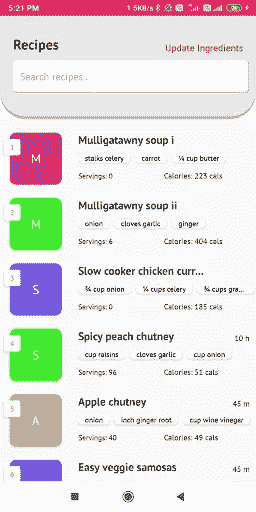

这是我在取苹果配料时找到的食谱清单。

我们可以从搜索结果中搜索我们想要的相关食谱。

如果我们没有得到预期的结果，我们总是可以使用更新成分来修改我们的搜索。

由于这个应用程序已经完成开发，我们将把它部署到 Android play 商店。

**将应用部署到 Playstore**

为了部署该应用程序，首先我们必须创建签名的 apk，其余的你可以从这里跟随的是一个 [youtube 视频。](https://youtu.be/AWawL5HFn64)

**接下来是什么？**

1.  要改进这种应用，最确定的方法是添加更多的成分。
2.  以提高模型的准确性。
3.  添加更多的食谱，因为我们在未来只有印度食谱，我会添加更多的食谱

如有任何疑问，请联系我。

**感谢阅读。**

**信用&参考**

1.  蔬菜成分分类。

[https://www.ijraset.com/fileserve.php?FID=16219](https://www.ijraset.com/fileserve.php?FID=16219)

2.全面的方法。

[https://www . research gate . net/publication/327936696 _ A _ comprehensive _ review _ of _ fruit _ and _ vegetable _ class ification _ techniques](https://www.researchgate.net/publication/327936696_A_comprehensive_review_of_fruit_and_vegetable_classification_techniques)

3.对于所有食谱

[](http://allrecipes.com/) [## Allrecipes |食物、朋友和食谱灵感

### 在 Allrecipes 上寻找并分享日常烹饪灵感。发现食谱，厨师，视频，和如何基于…

allrecipes.com](http://allrecipes.com/) 

4.无服务器功能的谷歌云

[http://console.cloud.google.com/](http://console.cloud.google.com/)