# 端到端指南:使用 Dash 创建 Web 应用程序

> 原文：<https://medium.com/analytics-vidhya/end-to-end-guide-creating-a-web-application-using-dash-cd5a8553bcec?source=collection_archive---------6----------------------->

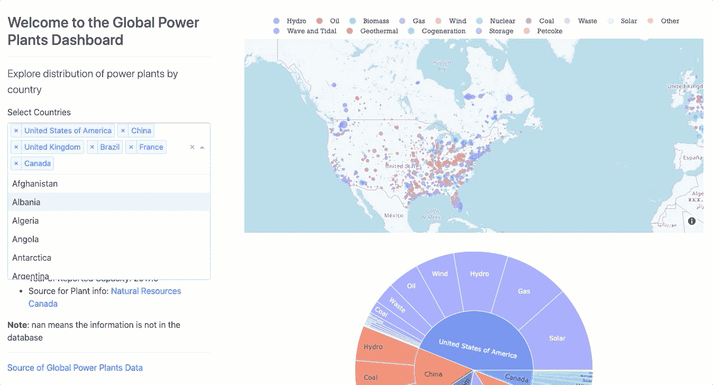

[使用 Dash 创建的全球发电厂仪表板](https://global-power-plants.herokuapp.com/)

在本指南结束时，你将知道如何**创建**和**在网络上部署**你自己的仪表板。

# 为什么是 Dash？

为什么要使用 Dash 而不是其他优秀的工具来构建应用程序呢？我对学习 Dash 感兴趣是因为:

*   它与 Spark 等其他大数据框架兼容，用于构建大型数据集的前端
*   它可以使用 R 或 Python 为非结构化数据集创建高度可定制的交互式仪表盘
*   它不需要 HTML 或 Javascript 知识

# 为什么不直接用 BI 工具呢？

我想先说 Tableau 和 Power BI 是很棒的工具。如果您的目标是使用结构化数据集制作一个漂亮的交互式仪表板，它们是一个很好的选择。

**然而，在处理非结构化数据时，Tableau 和其他 BI 工具无法提供与 Python 和 R 同等水平的灵活性。**如果数据在分析之前需要大量的预处理和转换，使用 Python 或 R 可能会更高效。

我发现 Dash 最吸引人的地方是它与大数据和并行计算框架的可集成性。Dash 应用程序可以作为[火花簇](/plotly/dash-is-an-ideal-front-end-for-your-databricks-spark-backend-212ee3cae6cc)的前端。如果您的文件太大，内存无法容纳，并且您不想使用云计算框架，Dash 也与 Vaex 兼容。Vaex 是一个 python 库，用于懒惰的“核外”数据帧(类似于熊猫),其大小可以和你的硬盘驱动器一样大！Vaex 的创始人写了一篇出色的[博文](/plotly/interactive-and-scalable-dashboards-with-vaex-and-dash-9b104b2dc9f0)，如果你对处理大型数据集感兴趣，我强烈推荐这篇博文。

# 全球发电厂数据集

仪表盘上显示的全球发电厂数据来自[世界资源研究所](https://datasets.wri.org/dataset/globalpowerplantdatabase)。全球发电厂数据集非常全面，包含 164 个不同国家约 30，000 家发电厂的信息。数据集包含发电厂的详细特征，如地理位置、电厂所有者、主要燃料和次要燃料类型等。

# 了解数据

构建仪表板的第一步是熟悉数据集，并找出我想要传达的相关信息。缩小特征列表后，对数据质量进行评估。

我使用了 missingno 库来可视化数据集中缺失值的分布。

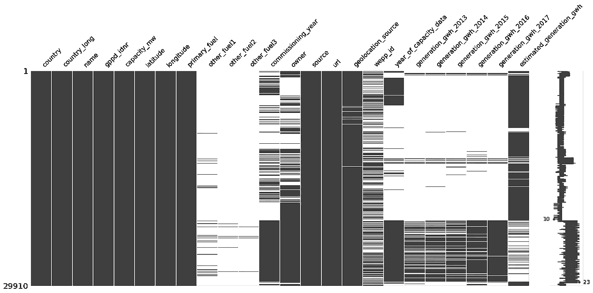

这是至关重要的一步，因为它有助于细化导入特性的列表。我认为不值得包含来自字段`other_fuel2` & `other_fuel3`的值，因为大部分值都丢失了。

# 设计仪表板

我认为交互式地图是获取数据集的最佳方式。我开始用 Plotly 的`px.scattermap`标绘所有发电厂的经纬度。

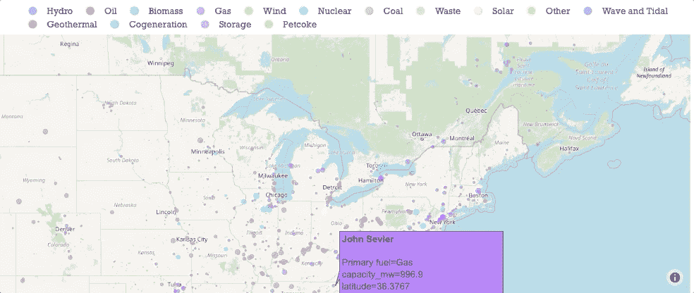

它还具有附加功能，允许用户通过点击图例按燃料类型过滤发电厂。

我感兴趣比较的一个主要数量是全球不同类别发电厂的分布。我使用旭日图是因为它们是可视化分层数据分布的有效方法。

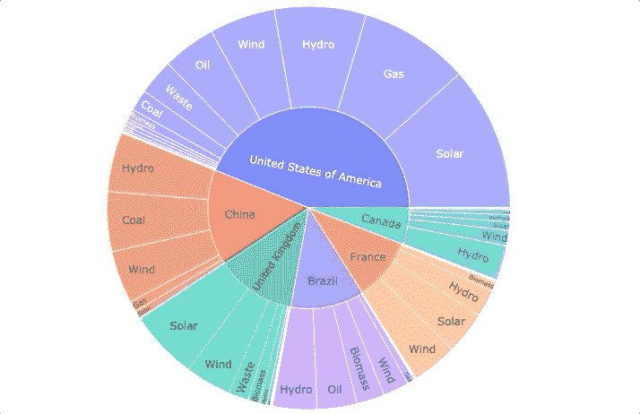

此图显示了发电厂的分布，发电厂最多的前五个国家。

我使用 Dash 的[多值下拉菜单](https://dash.plotly.com/dash-core-components/dropdown)来过滤显示在旭日图和地图上的国家。

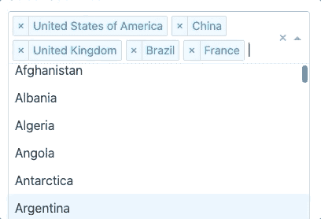

将数据集作为 pandas 数据帧导入后，数据集中所有国家的名称都被提取到 pandas 系列中。**多值下拉列表将包含国家的熊猫系列作为 iterable 来创建破折号组件所需的字典。**

# 连接组件

到目前为止，我们已经成功地创建了单独的组件，但是我们仍然没有将它们连接起来。

为了连接不同的组件，我们必须使用 Dash 回调函数。

**什么是破折号回调函数？**

> *Dash 回调函数是 python 函数，只要输入组件的属性发生变化，Dash 就会自动调用这些函数。*

每当用户在多值下拉列表中选择一组不同的国家时，就会调用一个 python 函数，称为**破折号回调**。这个函数的输入参数将是用户选择的新国家，它将返回一个更新的地图和一个旭日图。

代码看起来类似于这样:

**注意:**如果你尝试运行代码，它不会编译。这只是一个中间步骤。您可以在下面滚动，找到一个可以编译并运行的版本。

“输入”(一组国家)和“输出”(更新的地图和旭日图)作为`@app.callback`装饰器的参数被声明性地**描述。**

如果你不知道 decorator 是什么，本质上，声明`@app.callback` decorator 告诉 Dash 每当“输入”值改变时调用它下面的函数。

因此，每当用户更改所选国家时，就会调用`def update_figures`函数。这个函数的输入参数从`@app.callback`装饰器中选择国家。例如，如果我们在装饰器中有两个“输入”，那么`def update_figures`函数就必须有两个参数。装饰器有两个“输出”:地图和图形。因此，`def update_figures`返回两个对象:scatter_map 和 graph。

类似地，我使用了另一个`@app.callback`装饰器在用户点击某个电厂时更新摘要。

注意，在装饰器中,“输入”现在是`dcc.Graph`组件(散点图),“输出”是 Dash markdown 组件。

函数`update_summary`采用一个名为`click_Data`的参数。这来自于`dcc.Graph`组件的`clickData`属性。`clickData`是`dcc.Graph components`的四个用户交互属性之一。其他属性是`hoverData`、`selectedData`和`relayData`。关于他们的更多信息可以在[这里](https://dash.plotly.com/interactive-graphing)找到。

我发现`clickData`是全球发电厂仪表盘的最佳选择。我建议测试一下，看看哪一个最适合你的仪表板。

# 应用布局的结构

有几种不同的方法来配置 Dash 应用程序的布局。我使用 dash-bootstrap-components 库来设计我的应用程序。如果你刚刚开始，我强烈推荐[这个由魅力数据制作的](https://www.youtube.com/watch?v=vqVwpL4bGKY&t=182s&ab_channel=CharmingData)视频。

使用 Bootstrap，我将应用程序分为两个主要部分:

*   侧栏
*   制图法

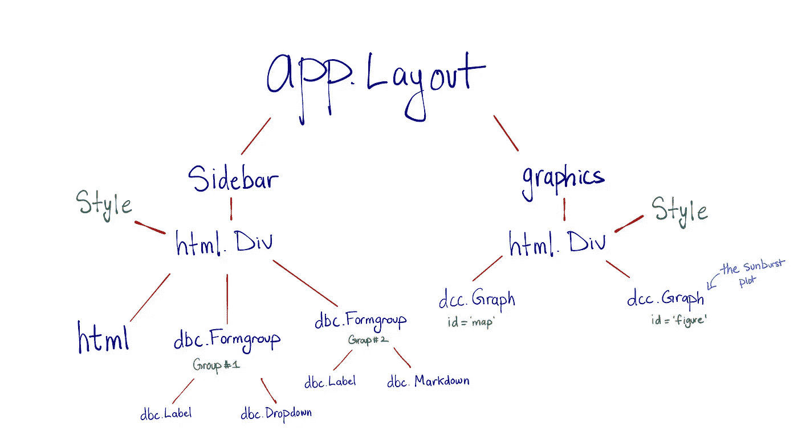

*   `dash_html_components` (HTML)库包含所有 HTML 标签的组件。
*   `dash_core_componets` (dcc)描述了更高层次的交互组件，如地图和旭日图
*   `dash_bootstrap_components` (dbc)库包含 Dash 的引导组件

从高层次上看，Dash 应用程序的布局就像一棵树。这种层次结构在添加或删除组件方面提供了很大的灵活性。没有必要使用 Bootstrap 来设计您的应用程序，但是，它确实提供了更多的灵活性。有许多免费的引导样式表可用，应用程序的主题可以用一行代码来更改:

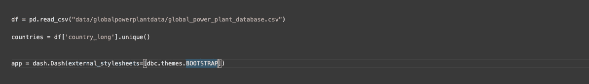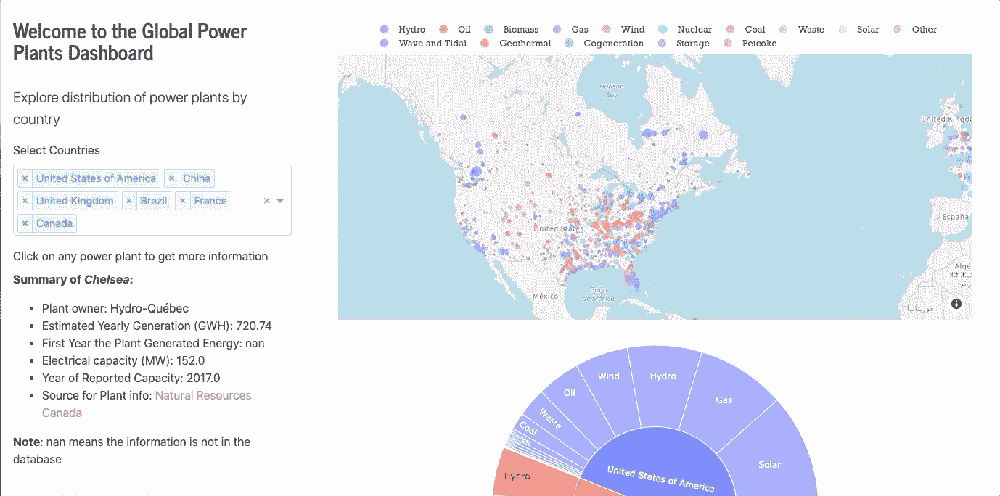

上面的例子展示了修改应用程序主题的简易性。

`dash_bootstrap_components.themes`模块包含 Bootstrap 和 Bootswatch 主题的内容交付网络(CDN)链接。可以修改或编译你自己的主题。可以通过用样式表的 URL 替换`dbc.themes.BOOTSTRAP`在本地提供。欲了解更多信息，您可以阅读[文档](https://dash-bootstrap-components.opensource.faculty.ai/docs/themes/)。

在对所有内容进行调整和样式化之后，我们创建仪表板的最终 python 脚本如下所示:

# 在 Web 上部署应用程序

一旦我们准备好共享仪表板，我们就可以开始部署过程。有许多方法可以在 Web 上部署您的应用程序。下面显示的方法是我遇到的快速部署 web 应用程序的最简单的方法。它不涉及创建虚拟环境或使用命令行(CLI)。

**步骤 1** : **初始化并创建一个 GitHub 库**。要在 Web 上部署您的应用程序，我们的存储库中需要以下五个文件:

*   `app.py`
*   包含数据集的 CSV 文件
*   `README.md`
*   `requirement.txt`
*   `Procfile`

前三个文件不言自明。到目前为止,`app.py`是我们一直在做的事情，而`README.md`是一个 markdown 文件，包含了关于这个项目的信息。

`requirement.txt`看起来是这样的:

这个文件包含我们的应用程序使用的所有包及其各自的版本。

添加您在环境中使用的软件包的正确版本非常重要。如果你不知道你的软件包的版本，不要担心！`print(name_of_package.__version__)`命令将打印包的版本，您可以使用我上面显示的格式直接将它们复制粘贴到`requirement.txt`文件中。**`gunicorn`**是部署的必备包！**它是一个用于 UNIX 的 Python WSGI HTTP 服务器。如果您没有这个包，只需在终端中使用`$ pip install gunicorn`命令。**

**`Procfile`是部署我们的应用程序的基本文件，它看起来像这样:**

**您可以将上面的行复制粘贴到您的存储库中。完成后，我们的应用程序存储库如下所示。**

**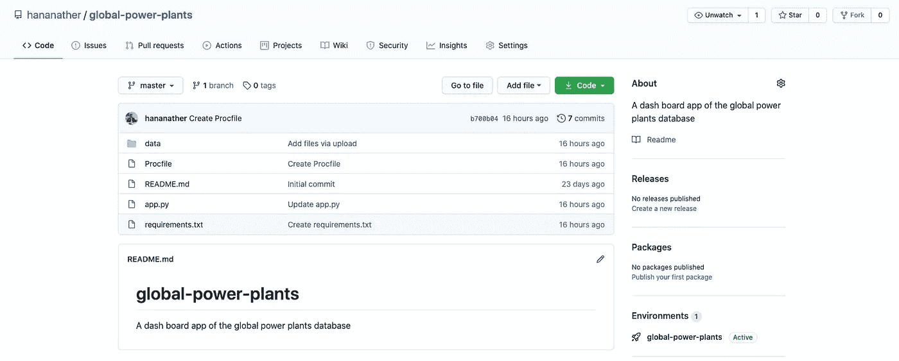**

**第二步:在 Heroku 上创建一个新的应用程序。注册了 [Heroku](http://www.heroku.com) 之后，我们创建了一个新的应用程序，并为我们的应用程序选择了一个名称。**

**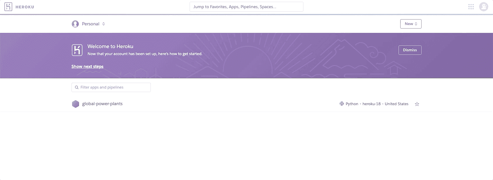**

****步骤 3:将我们的 GitHub 存储库连接到 Heroku 应用程序。**一旦我们创建了 Heroku 应用程序，我们可以看到几种部署方法。在我看来，最简单的选择是用 GitHub 连接，因为它不需要命令行界面(CLI)或虚拟环境的知识。在选择 GitHub 作为我们的部署方法之后，我们输入我们在**步骤 1** 中创建的 GitHub 存储库的名称。**

**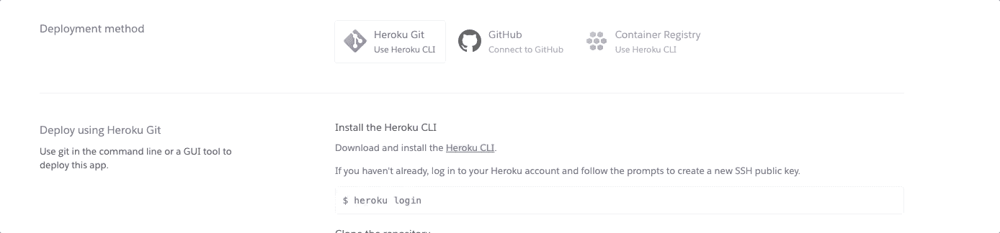**

**这是 Heroku 应用程序成功连接到我们的 GitHub 存储库时的样子。**

****第四步:手动部署。**最后，我们通过“Deploy Branch”命令部署我们的应用程序。这一步需要几分钟。**

**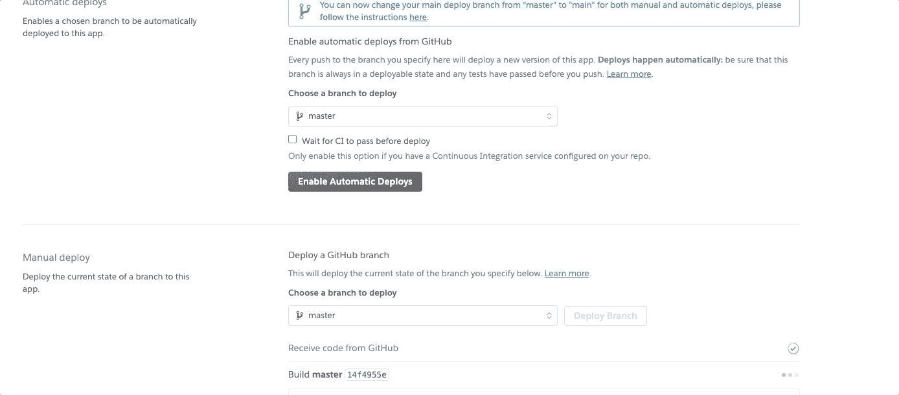**

**安装所有需要的包并将 GitHub 库部署到网站需要几分钟时间。**

****第五步:查看 App！一旦部署步骤完成，我们就可以在浏览器中查看我们的应用程序的网页了！全球发电厂仪表盘可以在[这里](https://global-power-plants.herokuapp.com/)查看！****

**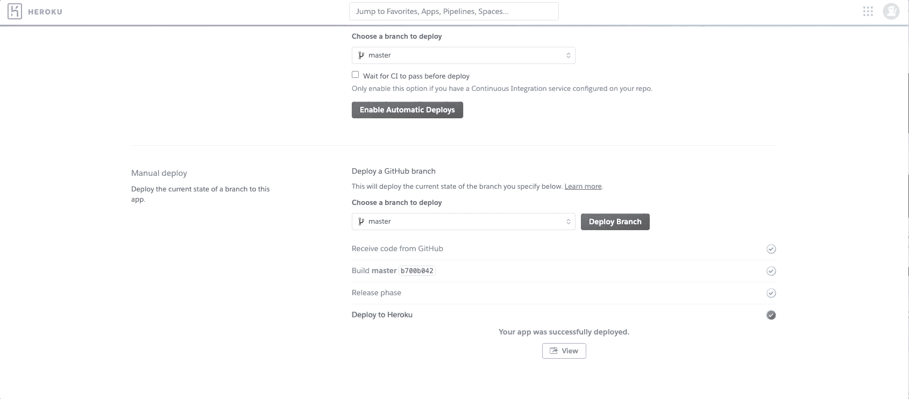**