# 部署亚马逊食品评论的实现

> 原文：<https://medium.com/analytics-vidhya/end-to-end-implementation-of-amazon-food-reviews-model-with-deployment-77d2f472a7dd?source=collection_archive---------9----------------------->

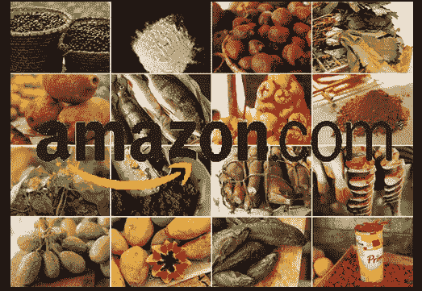

# 内容

1.  数据集概述。
2.  数据预处理。
3.  列车测试分离。
4.  使用单词包的文本特征化。
5.  超参数调谐。
6.  使用朴素贝叶斯算法建立模型。
7.  绩效指标。
8.  使用 Flask API 将模型部署到 Web 应用程序中。
9.  由 Heroku 平台生产模型。
10.  结果。

## 首先我们想知道什么是亚马逊美食点评分析？

这个数据集由亚马逊的美食评论组成。这些数据跨越了 10 多年的时间，包括截至 2012 年 10 月的所有约 500，000 篇评论。评论包括产品和用户信息、评级和明文评论。我们也有来自所有其他亚马逊类别的评论。

亚马逊评论通常是最公开可见的消费品评论。作为一个经常使用亚马逊的用户，我对检查亚马逊评论的大型数据库的结构和可视化这些信息很感兴趣，以便成为一个更聪明的消费者和评论者。

来源:https://www.kaggle.com/snap/amazon-fine-food-reviews

## 介绍

亚马逊美食点评数据集由来自亚马逊的美食点评组成。

1.  评论数:568 454
2.  用户数量:256 059
3.  产品数量:74258
4.  时间跨度:1999 年 10 月至 2012 年 10 月
5.  数据中的属性/列数:10

## 属性信息:

1.  身份
2.  产品 Id —产品的唯一标识符
3.  UserId —用户的唯一标识符
4.  有用性分子——认为评论有用的用户数量
5.  helpfullnesdenominator—表示他们认为该评论是否有帮助的用户数量
6.  分数—介于 1 和 5 之间的等级
7.  时间—审核的时间戳
8.  摘要—审核的简要摘要
9.  文本—审阅的文本

## 目标

给出一个评价，确定该评价是正面的(评分为 4 或 5)还是负面的(评分为 1 或 2)。

[Q]如何确定一个评论是正面的还是负面的？

[Ans]我们可以使用分数/评级。评分为 4 或 5 可被视为正面评价。1 或 2 的评论可能被认为是负面的。3 的评论是中性的，忽略。这是一种确定评论极性(积极/消极)的近似和代理方式。

## 数据预处理

数据预处理是一种用于将原始数据转换成干净数据集的技术。换句话说，无论何时从不同来源收集数据，都是以原始格式收集的，这对于分析是不可行的。

要了解亚马逊美食评论数据集和特征的完整概述，请访问我以前的博客链接 [**这里**](/analytics-vidhya/amazon-fine-food-reviews-featurization-with-natural-language-processing-a386b0317f56) **。**

# 列车测试分离

当机器学习算法用于对不用于训练模型的数据进行预测时，训练-测试分离过程用于估计机器学习算法的性能。

如果你有**个数据集**，你需要首先使用 Sklearn `train_test_split`函数来分割它。

## 使用 BOW 矢量器的特征化

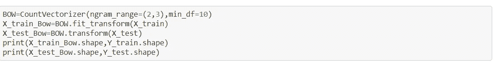

## 超参数调谐

我们希望选择最佳深度和最佳 min_split 以获得更好的模型性能，通过使用网格搜索交叉验证来选择这些。

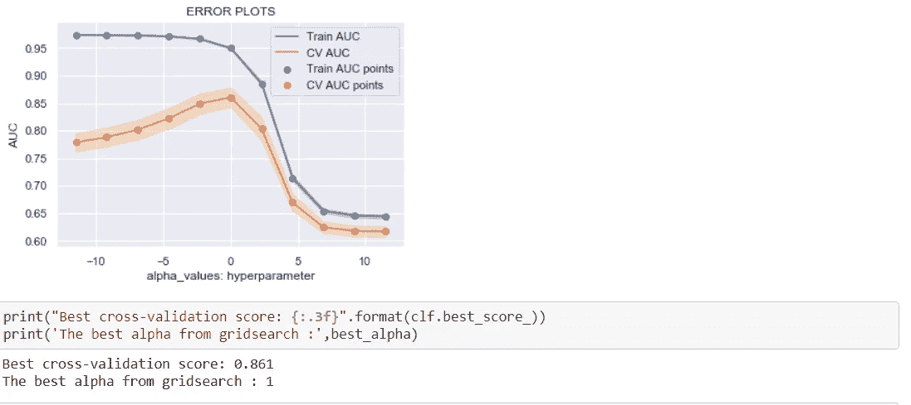

## 用朴素贝叶斯算法训练模型

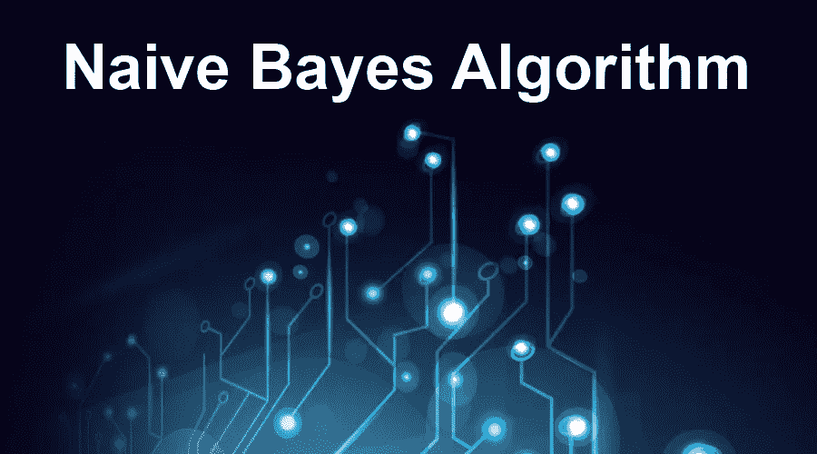

## 对这些特征集应用多项式朴素贝叶斯

朴素贝叶斯是一种基于贝叶斯定理的统计分类技术。它是最简单的监督学习算法之一。朴素贝叶斯分类器是一种快速、准确和可靠的算法。朴素贝叶斯分类器在大数据集上具有很高的准确率和速度。

朴素贝叶斯是最简单快速的分类算法，适用于大数据块。朴素贝叶斯分类器被成功地用于各种应用中，例如垃圾邮件过滤、文本分类、情感分析和推荐系统。它使用贝叶斯概率定理来预测未知类别。

朴素贝叶斯假设特征是条件独立的。理论上，如果假设不成立，则 NB 的性能会下降。但是研究表明，即使有一些特征依赖，朴素贝叶斯也能给出最好的结果。

要了解 NaiveBayes 算法和实现的详细信息，请访问我之前的[**博客**](/analytics-vidhya/naive-bayes-algorithm-with-amazon-food-reviews-analysis-66bb59b66e62)

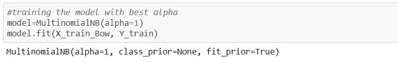

在我们使用网格搜索 CV 找到最佳参数后，我们希望使用测试数据检查性能，在本例研究中，我们使用 AUC 作为性能度量。

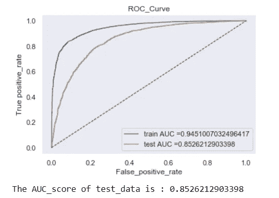

## 性能指标

绩效指标用于衡量企业的行为、活动和绩效。这应该是在一个范围内测量所需数据的数据形式，允许形成支持总体业务目标实现的基础。

要了解机器学习中使用的性能指标的详细信息，请访问我以前的博客链接[**这里**](/@sachin.s1dn/performance-metrics-for-machine-learning-models-80d7666b432e) **。**

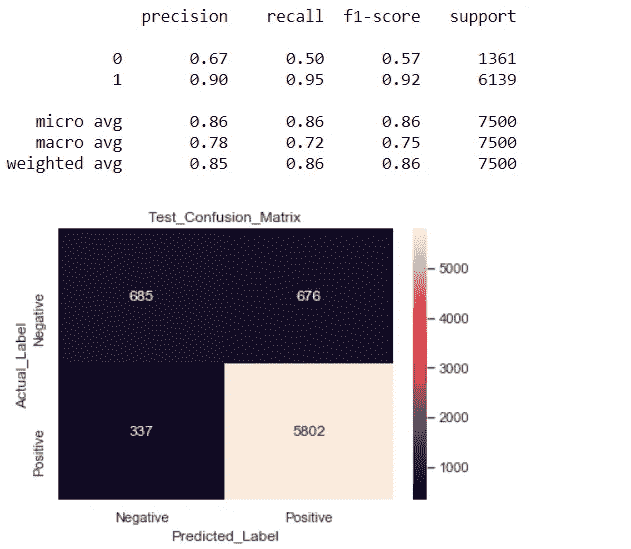

## 将训练好的模型保存在 pickle 文件中用于生产

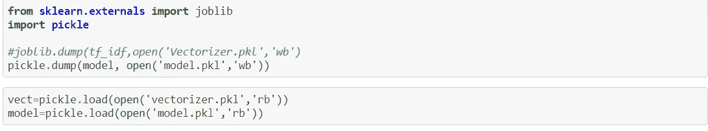

# 亚马逊 _ 食品 _ 评论 _ 模型 _ 部署

建立一个机器学习项目是一回事，但最终重要的是你如何向世界展示你的项目。在 GitHub 上记录你的整个项目是另一回事，但将你的深度学习模型部署为 web 应用程序是完全不同的另一回事。

为了让机器学习工程师在工作中取得成功，他们需要构建其他团队可以使用的服务或人们可以直接使用的产品。本质上，目标是提供一个模型作为服务，为此，有一个叫做 API 的概念。API 是计算机系统通过互联网协议相互通信的方式。它们充当代理，将信息从用户传到服务器，然后再从服务器传到用户，并返回答案。Flask 提供了这种能力。Flask 将充当模型和 HTML 文件之间的 API。

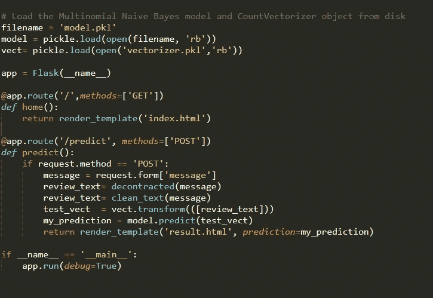

我们首先创建一个项目文件夹，在这个文件夹中我们定义了 requirements.txt 文件中的所有依赖项。为了确保所有的依赖都与我们的应用程序隔离开来，我们为我们的工作空间创建了一个虚拟环境。

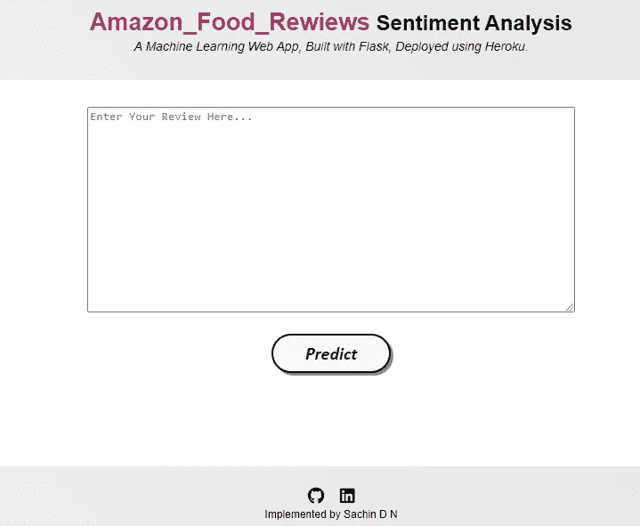

为了进行部署，我们希望训练我们的模型并将输出保存在 pickle 文件中，这些 pickle 文件用于预测生产中的新评论。

## 步伐

*   创建 GitHub 存储库(可选)
*   使用巨大的数据创建和挑选一个模型。
*   创建一个烧瓶应用程序。
*   本地测试烧瓶应用程序(可选)
*   部署到 Heroku。
*   测试工作应用程序。

# 结果

**正面评价**

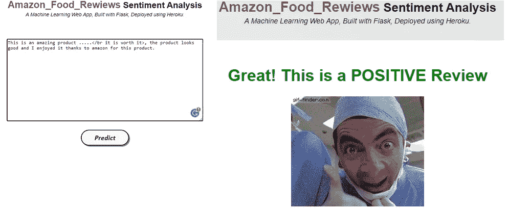

**负面评论**

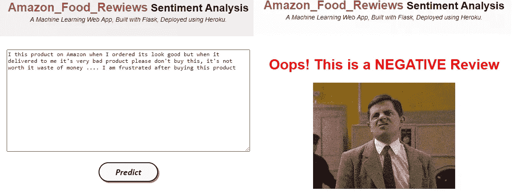

我已经在 Heroku 平台部署了 app，看看这里的

**要了解亚马逊食品评论数据集和特征的完整概述，请访问我以前的博客链接 [**这里**](/analytics-vidhya/amazon-fine-food-reviews-featurization-with-natural-language-processing-a386b0317f56) **。****

**要了解机器学习中使用的性能指标的详细信息，请访问我以前的博客链接[**这里**](/@sachin.s1dn/performance-metrics-for-machine-learning-models-80d7666b432e) **。****

**要了解完整代码请访问我的 [**GitHub**](https://github.com/Sachin-D-N/Amazon_Food_Reviews_Model_Deployment/blob/main/End_To_End_Solution_of_amazon_Food_Reviews.ipynb) 链接。**

**感谢您的阅读和耐心。我希望你喜欢这个帖子，如果我的帖子有错误，请告诉我。**

# **参考**

*   **应用人工智能**
*   **维基百科(一个基于 wiki 技术的多语言的百科全书协作计划ˌ也是一部用不同语言写成的网络百科全书ˌ 其目标及宗旨是为全人类提供自由的百科全书)ˌ开放性的百科全书**
*   **Coursera**
*   **数据营**

****联系人:** [邮箱](https://sachin-d-n.github.io/Amazon_Food_Reviews_Model_Deployment/sachin.s1dn@gmail.com)[LinkedIn](https://www.linkedin.com/in/sachin-d-n-1st-8150351b2/)[Github](https://github.com/Sachin-D-N/Amazon_Food_Reviews)[媒介](https://sachin-s1dn.medium.com/) [Twitter](https://twitter.com/home)**

***博客也发布在*[*https://sachin-d-n . github . io*](https://sachin-d-n.github.io/Amazon_Food_Reviews_Model_Deployment/)*。***