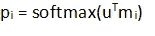

# 端到端内存网络:亮点

> 原文：<https://medium.com/analytics-vidhya/end-to-end-memory-network-highlights-29dba9a6d59b?source=collection_archive---------5----------------------->

首先，由于 Siri、Alexa、Cortana 和谷歌助手，神经网络越来越受欢迎。越来越多的应用程序将神经网络与自然语言处理结合使用，以创建将定义 21 世纪的产品。

托马斯·科尔诺斯基在 [Unsplash](https://unsplash.com?utm_source=medium&utm_medium=referral) 上的照片

# 背景

神经网络是模拟动物大脑功能的松散算法。它由一组相互连接的神经元、连接、权重和传播函数组成。这些组件一起帮助学习和训练模型。神经网络有两大类，即前馈网络和递归网络。前馈网络是神经元的有向无环图，而递归网络允许神经元在相同或先前层之间具有连接。

[前馈 vs 递归网络](https://www.researchgate.net/profile/Dana_Hughes3/publication/305881131/figure/fig5/AS:391681317851147@1470395511494/Feed-forward-and-recurrent-neural-networks.png)

# 递归神经网络

RNN 的最大优势之一是，它可以将信息存储为记忆，因此有助于利用上下文信息。长短期记忆(LSTM)是最受欢迎的 RNN 架构之一。每个 LSTM 单元由一个单元和三个门组成，即输入门、输出门和遗忘门。

[LSTM 网](https://acheremskoy.files.wordpress.com/2017/01/lstm.png)

然而，顾名思义，LSTM 使用的记忆概念是短期的。有许多存储器网络通过提供相对长期的存储器来解决这个问题。端到端存储网络就是这样一个例子。

# 端到端存储网络

该网络的模型架构由 *Sainbayar Sukhbaatar、Arthur Szlam、Jason Weston 和 Rob Fergus 在[论文](https://arxiv.org/abs/1503.08895)中发表。*为了便于理解，让我们从一个示例开始，该示例中的解决方案是将内存作为架构的一部分:

故事:

1.  玛丽买了牛奶。
2.  约翰搬到了卧室。
3.  桑德拉回到了厨房。
4.  玛丽走到走廊上。

查询:牛奶在哪里？

答案:走廊

按照这个例子，在回答查询之前，我们需要考虑整个故事的上下文。在这种使用情况下，端到端内存网络的使用变得非常重要。该存储器网络的架构如下:

[图片来源:端到端存储网络](https://arxiv.org/abs/1503.08895)

为了更简单的理解，让我们把它分成两部分。

架构的第一部分有助于为查询找到相关的句子。它从将查询转换成大小为 k 的单词嵌入开始。作为该过程的一部分，查询 q 首先被转换成大小为 V 的向量(V 是所使用的词汇的大小)。例如，以下是查询“牛奶在哪里”(解析后)的向量:

然后用一个包字模型或者嵌入 B(k × V)，把向量转换成一个大小为 k 的字嵌入，设向量最后叫做 u(大小为 k)。

下一步，故事需要转化为记忆。与上面的方法类似，每个句子都被解析，然后使用嵌入 A(k × V)编码成大小为 k 的向量。

现在，我们将故事和查询作为向量嵌入。我们取查询和每个内存向量的内积，然后进行 softmax 运算，以找到最佳匹配。

在这个阶段，我们已经找到了与查询最相关的句子。例如，如果查询是“牛奶在哪里”，基于计算的概率向量，找到的相关句子是“玛丽得到了牛奶”。

在第二部分，将计算查询的最终答案。我们将通过使用嵌入 C(k × V)将故事的句子编码为向量来重新开始。

使用上一部分的概率向量，我们将如下计算输出:

为了更容易解释，我们将之前找到的查询和相关句子(即“牛奶在哪里”和“玛丽得到了牛奶”的组合)作为新的查询进行评估。使用这个新的查询，并再次将每个句子作为记忆向量，我们试图从故事的上下文中推断出答案。

最后，借助于矩阵 W (V × k ),通过下式获得输出预测。

# 结论

我们可以用大量的故事来训练这个网络，以及相应的查询和回答。像 LSTM 一样，可以增加架构的复杂性，以包括多个层，从而提高结果的准确性。

