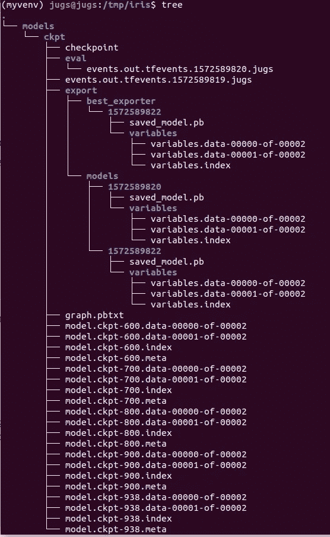
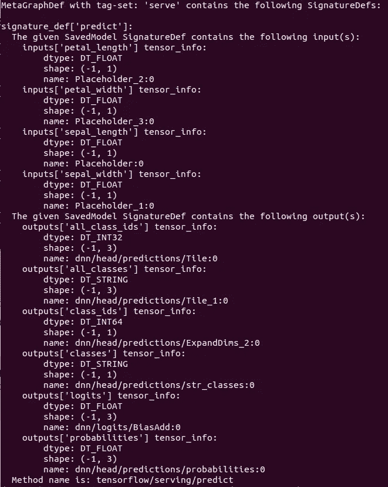
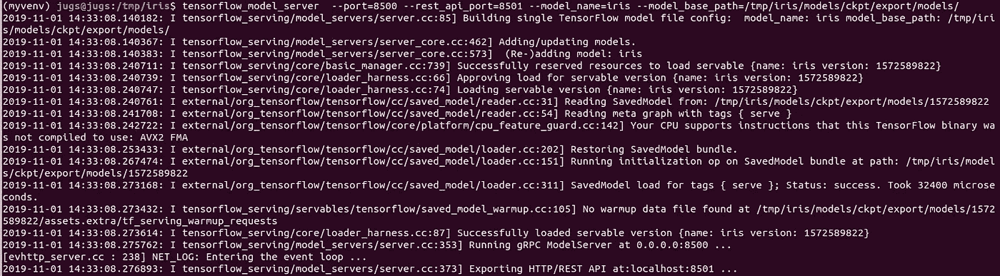

# Tensorflow 和 tensor flow Extended-2 中的端到端 ML

> 原文：<https://medium.com/analytics-vidhya/end-to-end-ml-in-tensorflow-and-tensorflow-extended-2-ac20276ebef0?source=collection_archive---------7----------------------->


卢卡·布拉沃在 [Unsplash](https://unsplash.com?utm_source=medium&utm_medium=referral) 上的照片

这将是这个系列的第二部分，早些时候我发布了一个[第一部分](/@jagesh.maharjan007/end-to-end-ml-in-tensorflow-and-tensorflow-extended-1-db32b32334b7)，介绍了创建模型的基本方法。这一次将更多地使用具有多个要素的真实数据，并对数据集进行一些变换。

我将使用的数据集是来自 IRIS 数据集的开源数据集，用于根据输入特征对花卉类型(三种花卉类别)进行分类。不多说了，让我们直接进入代码吧。

让我们导入一些 python 包/头文件。

```
from sklearn import datasets
from sklearn.model_selection import train_test_split
import tensorflow as tf
```

来自 sklearn 的数据集已经有了 iris 数据集，所以我们可以通过调用名称来加载数据集，但是，我们也可以使用 pandas.read_csv 从磁盘加载 CSV 文件。但此时我们保持简单。在另一个系列中，我们将从 CSV 加载数据，并使用 Tensorflow transform 进行数据转换。

加载数据后，我们可以将数据分为训练集和评估/测试数据集。此外，我们将特征和标签分开。然后，我们创建一个输入特征关键字为 x 的特征列，其形状为(4，)。

```
INPUT_FEATURE = 'x'
NUM_CLASSES = 3iris = datasets.load_iris()
X = iris.data
y = iris.targetindex_list = range(len(y))
index_train, index_eval = train_test_split(index_list, train_size=0.8)
X_train, X_eval = X[index_train], X[index_eval]
y_train, y_eval = y[index_train], y[index_eval]feature_columns = [
 tf.feature_column.numeric_column(INPUT_FEATURE, shape=[4])
]
```

现在，我们使用 estimator API 定义配置，如下所示。

```
training_config = tf.estimator.RunConfig(
 model_dir=’/tmp/iris/models/ckpt/’,
 save_summary_steps=100,
 save_checkpoints_steps=100)
```

然后，我们使用名为 DNNClassifier 的估计器 API 构建 DNNClassifier，其中包含带有隐藏单元的参数、上面的配置、类的数量和保存检查点模型的目录。

```
classifier = tf.estimator.DNNClassifier(
                  config=training_config,
                  feature_columns=feature_columns,
                  hidden_units=[10, 20, 10],
                  n_classes=NUM_CLASSES,
                  model_dir='/tmp/iris/models/ckpt/')train_spec = tf.estimator.TrainSpec(
                 input_fn=train_input_fn,
                 max_steps=10000)
```

在此管道下，我们将使用 estimator API 来训练和保存模式，具有训练输入功能和评估输入功能。这就是为什么 estimator API (TensorFlow 高级 API)是一个很好的工具。

```
def serving_input_receiver_fn():
    receiver_tensors = {
        'sepal_length': tf.placeholder(tf.float32, [None, 1]),
        'sepal_width': tf.placeholder(tf.float32, [None, 1]),
        'petal_length': tf.placeholder(tf.float32, [None, 1]),
        'petal_width': tf.placeholder(tf.float32, [None, 1]),
    } features = {
        INPUT_FEATURE: tf.concat([
            receiver_tensors['sepal_length'],
            receiver_tensors['sepal_width'],
            receiver_tensors['petal_length'],
            receiver_tensors['petal_width']
        ], axis=1)
    }
    return  tf.estimator.export.ServingInputReceiver(receiver_tensors=receiver_tensors, features=features)latest_exporter = tf.estimator.LatestExporter(
        name="models",
        serving_input_receiver_fn=serving_input_receiver_fn,
        exports_to_keep=10)best_exporter = tf.estimator.BestExporter(
        serving_input_receiver_fn=serving_input_receiver_fn,
        exports_to_keep=1)exporters = [latest_exporter, best_exporter]eval_input_fn = tf.estimator.inputs.numpy_input_fn(
        x={INPUT_FEATURE: X_eval},
        y=y_eval,
        num_epochs=1,
        shuffle=False)eval_spec = tf.estimator.EvalSpec(
        input_fn=eval_input_fn,
        throttle_secs=180,
        steps=10,
        exporters=exporters)
```

一旦我们准备好了所有的成分，我们就可以使用估计器的 train_and_evaluate 函数进行训练和评估了。

```
tf.estimator.train_and_evaluate(classifier, train_spec=train_spec, eval_spec=eval_spec)
```

培训完成后，您可以看到带有评估分数的培训输出。以及保存在指定目录下的模型

```
({'accuracy': 1.0,
  'average_loss': 0.0020009247,
  'loss': 0.060027737,
  'global_step': 938},
 [b'/tmp/iris/models/ckpt/export/models/1572589822',
  b'/tmp/iris/models/ckpt/export/best_exporter/1572589822'])
```

这些是保存模型的目录



图:保存的模型

您可以从终端使用 saved_model_cli 函数检查模型的签名，以找出输入和输出参数。

```
(myvenv) jugs@jugs:/tmp/iris$ saved_model_cli show --dir /tmp/iris/models/ckpt/export/models/157258982
```



图:保存模型的签名

因此，现在我们可以使用 TensorFlow 服务来服务/托管模型以进行部署。

```
tensorflow_model_server --port=8500 --rest_api_port=8501 --model_name=iris --model_base_path=/tmp/iris/models/ckpt/export/models/
```



到目前为止，我们的模型正在部署中，并准备好从传入的客户端提供服务。所以现在我们可以创建一个客户端部件来进行推理。

```
import json
import requests
import os
import numpy as npendpoint = “[http://localhost:8501/v1/models/iris:predict](http://localhost:8501/v1/models/iris:predict)"
headers = {“content-type”:”application-json”}instances = [{“sepal_length”:[6.8],”sepal_width”:[3.2],”petal_length”:[5.9],”petal_width”:[2.3]}]data = json.dumps({“signature_name”:”predict”,”instances”: instances})response = requests.post(endpoint, data=data, headers=headers)
prediction = json.loads(response.text)[‘predictions’]
prediction
```

我们所需要的模型输出只是基于签名定义的预测结果。

```
[{'class_ids': [2],
  'classes': ['2'],
  'all_class_ids': [0, 1, 2],
  'all_classes': ['0', '1', '2'],
  'probabilities': [2.90285893e-08, 0.00058580871, 0.999414206],
  'logits': [-9.90864372, 0.00382383168, 7.445755]
}]
```