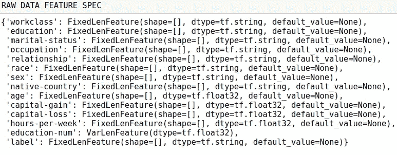
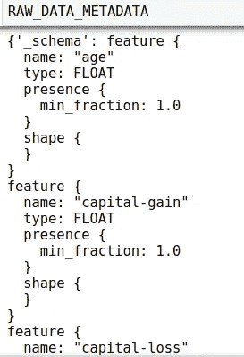
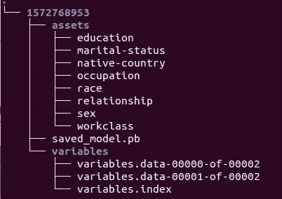
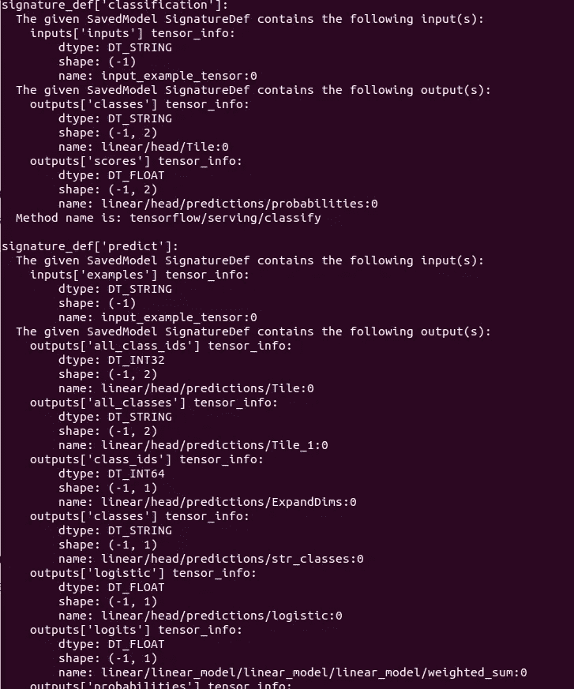
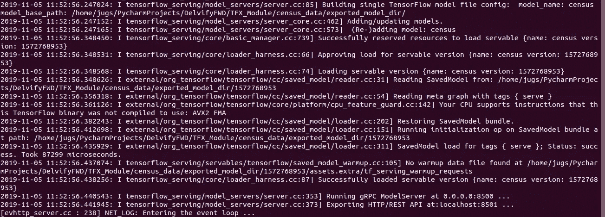

# Tensorflow 和 tensor flow Extended-3 中的端到端 ML

> 原文：<https://medium.com/analytics-vidhya/end-to-end-ml-in-tensorflow-and-tensorflow-extended-3-d2de4354c816?source=collection_archive---------9----------------------->

这一部分将与之前的[部分](/@jagesh.maharjan007/end-to-end-ml-in-tensorflow-and-tensorflow-extended-2-ac20276ebef0?source=friends_link&sk=29fa0ab2ff933a01d4470d46dd7e7533)类似，然而，这一部分更侧重于张量流变换和阿帕奇波束。我碰巧使用了 TensorFlow Transform Github 存储库中的 census_example 示例，在那里我发布了一些问题并设法解决了这些问题。因此你可以参考[这个](https://github.com/tensorflow/transform/blob/master/examples/census_example.py)例子了解更多细节。因此，我不会张贴所有的代码，由一些，我们将需要知道和推理。

```
CATEGORICAL_FEATURE_KEYS = [
  **'workclass'**,
  **'education'**,
  **'marital-status'**,
  **'occupation'**,
  **'relationship'**,
  **'race'**,
  **'sex'**,
  **'native-country'**,
]

NUMERIC_FEATURE_KEYS = [
   **'age'**,
   **'capital-gain'**,
   **'capital-loss'**,
   **'hours-per-week'**,
]

OPTIONAL_NUMERIC_FEATURE_KEYS = [
   **'education-num'**,
]
LABEL_KEY = **'label'**
```

此示例使用人口普查数据来预测给定要素的收入是大于等于 50k 还是小于 50k。输入要素分为分类要素键、数字要素键、可选数字要素键。我们需要知道这一点，因为我们需要在张量流变换中将数据转换为各自的数据类型。

```
RAW_DATA_FEATURE_SPEC = dict([(name, tf.io.FixedLenFeature([], tf.string)) **for** name **in** CATEGORICAL_FEATURE_KEYS] +
                             [(name, tf.io.FixedLenFeature([], tf.float32)) **for** name **in** NUMERIC_FEATURE_KEYS] +
                             [(name, tf.io.VarLenFeature(tf.float32)) **for** name **in** OPTIONAL_NUMERIC_FEATURE_KEYS] +
                             [(LABEL_KEY, tf.io.FixedLenFeature([], tf.string))])RAW_DATA_METADATA = dataset_metadata.DatasetMetadata(
    schema_utils.schema_from_feature_spec(RAW_DATA_FEATURE_SPEC))
```

要素数据类型被转换为 RAW_DATA_FEATURE_SPEC，它是 Tensorflow 的一部分，而基于要素规范，tensorflow_transform 的 tf_metadata 函数创建输入要素类型的方案。功能规范和模式如下所示



图:功能规格



图:数据模式

在使用这些数据训练模型之前，最关键的部分是数据转换，或者我们称之为预处理函数，我们将在训练过程中将其作为包装函数传递。

```
**def** preprocessing_fn(inputs):
    outputs = inputs.copy()
    **for** key **in** NUMERIC_FEATURE_KEYS:
        outputs[key] = tft.scale_to_0_1(outputs[key])

    **for** key **in** OPTIONAL_NUMERIC_FEATURE_KEYS:
        dense = tf.compat.v1.sparse_to_dense(
            outputs[key].indices, [outputs[key].dense_shape[0], 1],
            outputs[key].values,
            default_value=0.)
        dense = tf.squeeze(dense, axis=1)
        outputs[key] = tft.scale_to_0_1(dense)

    **for** key **in** CATEGORICAL_FEATURE_KEYS:
        tft.vocabulary(inputs[key], vocab_filename=key)

    table_keys = [**'>50K'**, **'<=50K'**]
    initializer = tf.lookup.KeyValueTensorInitializer(
        keys=table_keys,
        values=tf.cast(tf.range(len(table_keys)), tf.int64),
        key_dtype=tf.string,
        value_dtype=tf.int64)
    table = tf.lookup.StaticHashTable(initializer, default_value=-1)
    outputs[LABEL_KEY] = table.lookup(outputs[LABEL_KEY])
    **return** outputs
```

现在我们将使用 apache beam 管道将我们的训练数据或评估数据转换为 TFRecord。apache beam 是为处理批量数据和流数据而构建的高级 API，用于快速处理(这里不做详细介绍，留待下一节课讨论)。

```
**with** beam.Pipeline() **as** pipeline:
    **with** tft_beam.Context(temp_dir=tempfile.mktemp()):
        ordered_columns = [**'age'**, **'workclass'**, **'fnlwgt'**,**'education'**, **'education-num'**,**'marital-status'**, **'occupation'**, **'relationship'**, **'race'**, **'sex'**,**'capital-gain'**, **'capital-loss'**, **'hours-per-week'**, **'native-country'**,**'label'**]
        converter = tft.coders.CsvCoder(ordered_columns, RAW_DATA_METADATA.schema)

        raw_data = (
            pipeline
            | **"ReadTrainData"** >> beam.io.ReadFromText(train_data_file)
            | **"FixCommasTrainData"** >> beam.Map(**lambda** line: line.replace(**', '**, **','**))
            | **"DecodeTrainData"** >> MapAndFilterErrors(converter.decode)
        )

        raw_dataset = (raw_data, RAW_DATA_METADATA)
        transformed_dataset , transform_fn = (raw_dataset | tft_beam.AnalyzeAndTransformDataset(preprocessing_fn))
        transformed_data, transformed_metadata = transformed_dataset

        transformed_data_coder = tft.coders.ExampleProtoCoder(transformed_metadata.schema)

        _ = (
            transformed_data
            | **"EncodeTrainData"** >> beam.Map(transformed_data_coder.encode)
            | **"WriteTrainData"** >> beam.io.WriteToTFRecord(os.path.join(working_dir, TRANSFORMED_TRAIN_DATA_FILEBASE))
             )
```

apache beam pipeline 的函数 *ReadFromText* 将读取文本文件，并在每一行(一条记录)中固定逗号，然后使用 MapAndFilterErrors 类解码 CSV 编码数据。然后简单地用原始数据和模式创建原始数据集，如上所示。然后用我们的预处理函数作为包装器，使用 AnalyzeAndTransformDataset 进行转换。最后，将转换后的数据作为 TFRecord 数据类型文件写入磁盘。我们对评估数据集进行同样的操作。

现在，我们创建一个训练包装器，将转换后的数据集作为其输入参数。

```
**def** _make_training_input_fn(tf_transform_output, transformed_examples, batch_size):
    **def** input_fn():
        dataset = tf.data.experimental.make_batched_features_dataset(
            file_pattern=transformed_examples,
            batch_size=batch_size,
            features=tf_transform_output.transformed_feature_spec(),
            reader=tf.data.TFRecordDataset,
            shuffle=**True** )
        transformed_features = tf.compat.v1.data.make_one_shot_iterator(dataset).get_next()
        transformed_labels = transformed_features.pop(LABEL_KEY)
        **return** transformed_features, transformed_labels
    **return** input_fn
```

此外，我们为一个服务函数创建了一个包装器，可以在评估过程中使用，也可以在以后的服务过程中使用。只是我们不需要标签功能，这违背了培训的目的。

我们将使用 estimator API 进行训练，并将使用 LinearClassifier，但也可以随意使用任何其他 API，如 DNNClassifier。

```
estimator = tf.estimator.LinearClassifier(
    feature_columns=get_feature_columns(tf_transformed_output),
    config=run_config,
    loss_reduction=tf.losses.Reduction.SUM
)

train_input_fn = _make_training_input_fn(
    tf_transformed_output,
    os.path.join(working_dir, TRANSFORMED_TRAIN_DATA_FILEBASE + **'*'**),
    batch_size=TRAIN_BATCH_SIZE
)
estimator.train(input_fn=train_input_fn, max_steps=TRAIN_NUM_EPOCHS * num_train_instances / TRAIN_BATCH_SIZE)
```

一旦训练完成，我们将把输出模型保存在 working_dir 中。



图:保存的模型

训练完成后，我们可以使用 TensorFlow 的 saved_model_cli 检查我们保存的模型的签名定义。



图:保存模型的签名定义

我们已经准备好使用 TensorFlow 服务来服务从人口普查数据集中训练的模型。



图:使用 Tensorflow 模型服务来服务模型

现在，是时候为推理创建一个客户机了。然而，在前面的小节中，我使用 python 创建了一个用于推理的客户机。我们可以用旋度来做推论，这也是最简单的方法。

```
$ curl -d ‘{“examples”: [{“age”:30.0, “workclass”:”Self-emp-not-inc”, “education”:”Bachelors”, “education-num”:17.0, “marital-status”:”Married-civ-spouse”, “occupation”:”Exec-managerial”, “relationship”:”Husband”, “race”:”White”, “sex”:”Male”, “capital-gain”:0.0, “capital-loss”:0.0, “hours-per-week”:40.0, “native-country”:”United-States”}]}’ -X POST [http://localhost:8501/v1/models/census:classify](http://localhost:8501/v1/models/census:classify)
{
 “results”: [[[“0”, 0.498906225], [“1”, 0.501093805]]
 ]
```