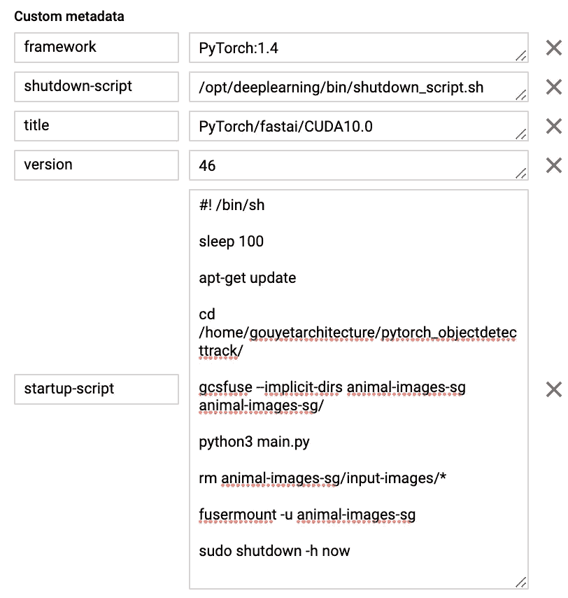

# 具有 GCP 云功能的端到端 ML 工作流

> 原文：<https://medium.com/analytics-vidhya/end-to-end-ml-workflow-with-gcp-cloud-functions-b86bb766838e?source=collection_archive---------6----------------------->


Cloud Functions 是谷歌云平台(GCP)提供的一个无服务器托管选项，允许用户部署事件驱动的代码，而不必管理底层硬件。

有了这么多可用的 GCP 产品，问题就变成了:相对于 App Engine、Compute Engine、Cloud Run、Kubernetes 等其他产品，我们应该何时使用云功能。？

有许多场景都值得使用云函数——一个很大的指标是，如果您想要在不同的 GCP 产品之间设置一个触发器，它会很有帮助。

让我们看一下这个**示例场景**:每当我有一组新的图像(在这个例子中是动物)时，我想运行一个对象检测模型，我将这些图像手动上传到一个 GCS 桶中。我希望该模型(这将检测斑马)在图像上传后自动运行。

这可以在云函数的帮助下完成，还有一个 GCS bucket(用于我们的图像)和一个计算引擎 VM，其中模型将通过启动脚本运行。

此工作流的架构如下所示:


如上图所示，云函数允许我们将两个 GCP 产品连接在一起:一个 GCS bucket(这是我们的云函数的*触发器*)和一个计算引擎 VM(这是我们的云函数*触发*)。

在我们的图像被手动上传到我们的 GCS bucket (input)文件夹后，我们的云功能将启动我们的计算引擎实例。一旦实例被打开，一个启动脚本将 a) [挂载](https://cloud.google.com/storage/docs/gcs-fuse)我们的 GCS bucket，并且 b)在我们的 bucket 的输入文件夹中的映像上运行我们的模型(现在挂载为 VM 中的文件系统)。当模型完成运行时，它会将新的图像(已经识别出斑马的图像)写入我们的 bucket 的输出文件夹。然后，在卸载我们的 bucket 之前，我们的启动脚本会删除我们的输入图像文件。

以下是关于如何设置的分步指南:

**第一步:创建云存储桶(云功能*触发*)**

让我们创建一个云存储桶，在这里我们将上传我们的输入图像并接收我们的输出图像。这个存储桶可以在控制台中创建，也可以通过命令行创建:

```
gsutil mb -c standard -l us-west1 gs://animal-images-sg
```

让我们添加两个文件夹:“输入图像”和“输出图像”


**步骤 2:配置虚拟机(*目标*云功能)**

第二步是设置我们的 VM 并配置它来运行我们的 ML 模型。

我选择了一台已经安装了 PyTorch 的 n1-standard-4 机器，引导盘如下:


设置这个特定实例的 gcloud 命令是:

```
gcloud compute instances create zebra-classifier --zone=us-west1-b --machine-type=n1-standard-4 --scopes=https://www.googleapis.com/auth/cloud-platform --tags=http-server,https-server --image=c2-deeplearning-pytorch-1-4-cu101-20200414 --image-project=ml-images --boot-disk-size=100GB --boot-disk-type=pd-standard
```

接下来，我从 Github 克隆了对象检测模型 repo(git 预装了这个启动盘):

```
git clone [https://github.com/stefangouyet/pytorch_objectdetecttrack](https://github.com/stefangouyet/pytorch_objectdetecttrack)
```

*这段代码是从 Chris Fotache 的对象检测 Github* [*资源库*](https://github.com/cfotache/pytorch_objectdetecttrack) *中派生出来的，它为在 PyTorch 中使用 CNN 和 YOLO 算法提供了一个很好的起点。*

为了下载我们的 YOLO 权重，我们首先运行以下代码:

```
cd config/
. download_weights.sh
```


现在，我们安装 GCS 保险丝:

```
export GCSFUSE_REPO=gcsfuse-`lsb_release -c -s`echo "deb http://packages.cloud.google.com/apt $GCSFUSE_REPO main" | sudo tee /etc/apt/sources.list.d/gcsfuse.listcurl https://packages.cloud.google.com/apt/doc/apt-key.gpg | sudo apt-key add -sudo apt-get updatesudo apt-get install gcsfuse
```

安装后，让我们尝试安装我们的*动物图像-sg* 桶，它将安装在一个同名的文件夹中:

```
cd pytorch_objectdetecttrack/mkdir animal-images-sggcsfuse --implicit-dirs animal-images-sg animal-images-sg/
```


现在 GCS Fuse 正在工作，让我们尝试在一些输入图像上运行我们的模型。

我已经向 bucket 的输入文件夹添加了四幅图像:


重新安装铲斗后，我们可以看到外壳中的图像:


*仅供参考:要卸载铲斗*，*运行*:

```
fusermount -u animal-images-sg
```

一旦装载了 bucket 并显示了新的图像，就该运行存储在 main.py 文件中的对象检测模型了:

```
python3 main.py
```


Python 脚本输出四个新图像(文件名后附加“*-det”*)。这些将被写入我们的输出图像文件夹，并将显示在我们的 GCS 存储桶中:


单击任何输出图像将显示对象检测模型已经正确运行，显示原始图像，以及斑马周围的边界框。


我们将继续关闭虚拟机，并编写启动脚本:

```
#! /bin/sh

sleep 100apt-get updatecd /home/gouyetarchitecture/pytorch_objectdetecttrack/

gcsfuse --implicit-dirs animal-images-sg animal-images-sg/python3 main.pyrm animal-images-sg/input-images/*fusermount -u animal-images-sgsudo shutdown -h now
```

这个启动脚本告诉我们的虚拟机 a)移动到当前目录，b)挂载我们的 GCS Fuse bucket，c)运行我们的对象检测模型，d)删除我们的输入文件夹中的图像，e)卸载我们的 bucket，以及 f)关闭虚拟机。我们将脚本添加到虚拟机的*自定义元数据*部分，关键字为 *startup-script:*



**第三步:设置云功能连接存储和计算引擎**

我们的最后一步涉及使用云函数，我们将把它连接到我们的 GCS bucket 和我们的计算引擎实例。


首先，我们希望我们的事件类型设置为“完成/创建”这告诉云函数等待在我们的桶中创建或覆盖一个对象(更多信息可以在 GCP 的文档中找到)。


接下来，我们指定想要使用哪个桶(在我们的例子中，是 animal-images-sg 桶)。


最后，我们声明当我们的云函数被触发时，我们希望发生什么。这可以用几种不同的语言来定义——通常，我使用 Node.js(本例中是版本 8)来定义:

```
var http = require('http');var Compute = require('@google-cloud/compute');var compute = Compute();exports.startInstance = function startInstance(req, res) {var zone = compute.zone('us-west1-b');var vm = zone.vm('zebra-classifier');vm.start(function(err, operation, apiResponse) {console.log('instance start successfully');});res.status(200).send('Success start instance');};
```


上面的 index.js 文件包含一个函数 *startInstance* ，它将在区域 *us-west1-b* 中查找我们的 *zebra-classifier* 实例，并调用内置的 *vm.start* 函数。

并且 package.json 文件可以保留其默认配置:


**概要:**

这就是全部的设置！

我们现在可以看到我们的端到端工作流程:

当我们将新映像上传到 GCS 存储桶时，我们的虚拟机会自动启动:


在我们的 bucket 中上传图像会打开我们的 zebra 分类器 VM 实例

我们已经上传了 10 张图片，其中 7 张是斑马。等待几分钟后，我们会发现一个空的输入文件夹和一个输出文件夹，其中有七幅斑马的图像，动物周围有一个边框:


输入图像被删除，输出图像现在可见


我们可以检测出哪些图像包含斑马！

我希望你喜欢读这篇文章。如果您有任何意见或建议，请在下面留言联系我。谢谢！