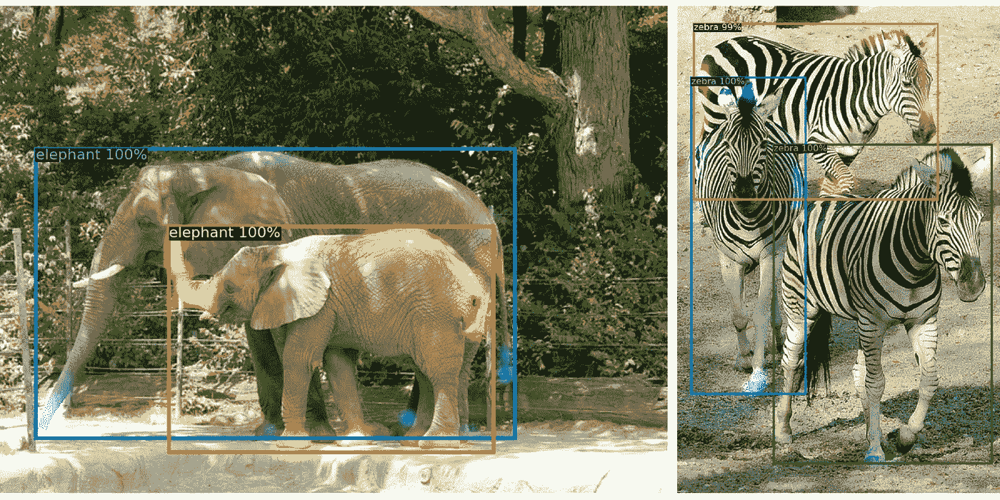
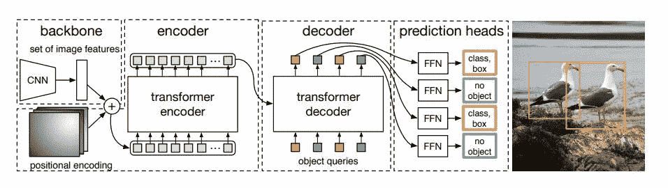
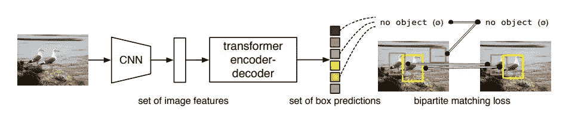

# 使用变压器的端到端对象检测(DETR)-脸书·艾

> 原文：<https://medium.com/analytics-vidhya/end-to-end-object-detection-with-transformers-detr-by-facebook-ai-833f4086280a?source=collection_archive---------8----------------------->

来源:[https://arxiv.org/pdf/2005.12872.pdf](https://arxiv.org/pdf/2005.12872.pdf)

# **物体探测一目了然**

在计算机视觉中，目标检测是一项任务，我们希望我们的模型能够区分前景目标和背景，并预测图像中目标的位置和类别。

有许多用于物体检测的框架，但脸书人工智能的研究人员提出了 DETR，这是一种创新而有效的方法来解决物体检测问题。

# 介绍

借助于基于变换器的编码器-解码器架构，DETR 将对象检测问题视为直接集预测问题。我说的集合是指边界框的集合。变形金刚是深度学习模型的新品种，在 NLP 领域表现突出。这是第一次有人用变形金刚进行物体检测。

本文的作者在最受欢迎的对象检测数据集之一 COCO 上评估了 DETR，对比了非常有竞争力的更快的 R-CNN 基线。

在结果中，DETR 取得了类似的表现。更准确地说，DETR 在大型对象上表现出明显更好的性能。然而，它在小对象上的表现并不好。

# DETR 模式

大多数现代对象检测方法相对于一些初始猜测进行预测。两级检测器(R-CNN 系列)预测盒 w.r.t .建议，而单级方法(YOLO)预测 w.r.t .锚或可能的对象中心网格。最近的工作表明，这些系统的最终性能很大程度上取决于这些初始猜测的确切设置方式。在我们的模型(DETR)中，我们能够去除这种手工制作的过程，并通过使用绝对盒预测对输入图像而不是锚直接预测检测集来简化检测过程。

对于检测中的直接集合预测来说，两件事是必不可少的:

1.  一组预测损失，强制在预测框和实际框之间进行唯一匹配
2.  一种预测(在一次传递中)一组对象并对它们的关系建模的体系结构

脸书人工智能的研究人员在预测和基础事实对象之间使用了二分匹配，这确保了预测和基础事实对象/边界框之间的一对一映射。

DETR 在单次通过解码器的过程中推断出一组固定大小的 N 个预测，其中 N 被设置为明显大于图像中对象的典型数量。这 N 个用户必须根据他们的需要来决定。假设在一个图像中最多有 5 个对象，因此我们可以定义(N=7，8，..).假设 N=7，那么 DETR 推断出一组 7 个预测。在这 7 个预测中，5 个预测将用于对象，2 个预测用于∅(no 对象)意味着它们将分配给背景。每个预测是一种包含类和包围盒(c，b)的元组。

# DETR 建筑

DETR 的整体架构很容易理解。它包含三个主要组件:

1.  CNN 主干网
2.  编码器-解码器变压器
3.  简单前馈网络

来源:[https://arxiv.org/pdf/2005.12872.pdf](https://arxiv.org/pdf/2005.12872.pdf)

DETR 使用传统的 CNN 骨干来学习输入图像的 2D 表示。该模型将其展平，并在将其传递到 transformer 编码器之前用位置编码对其进行补充。然后，变换器解码器将固定数量(N)的学习位置嵌入作为输入，我们称之为对象查询，并另外关注编码器输出。我们将解码器的每个输出嵌入传递到共享前馈网络(FFN ),该网络预测检测(类和边界框)或∅(no 对象(类)。

解码器遵循转换器的标准架构，使用多头自和编码器-解码器注意机制转换大小为 d 的 N 个嵌入。与原始转换器的不同之处在于，我们的模型在每个解码器层并行解码 N 个对象，而原始转换器使用自回归模型，一次预测一个元素的输出序列。

解码器将 N 个对象查询转换成输出嵌入。然后通过前馈网络将它们独立解码成盒坐标和类别标签，从而产生 N 个最终预测。使用自身和编码器-解码器对这些嵌入的关注，该模型使用所有对象之间的成对关系来整体推理所有对象，同时能够使用整个图像作为上下文。

最终预测由一个具有 ReLU 激活函数和隐藏维数 d 的 3 层感知器和一个线性投影层计算。FFN 根据输入影像预测盒子的归一化中心坐标、高度和宽度，线性图层使用 softmax 函数预测分类标注。因为我们预测一组固定大小的 n 个边界框，其中 n 通常大于图像中感兴趣对象的实际数量，所以使用额外的特殊类别标签∅来表示在一个槽内没有检测到对象。这个类在标准对象检测方法中扮演类似于“背景”类的角色。

来源:[https://arxiv.org/pdf/2005.12872.pdf](https://arxiv.org/pdf/2005.12872.pdf)

在上面的图像中，我们可以看到我们的 DETR 推断出 6 个预测，但 6 个预测中只有 2 个预测被分配给对象，其余的预测属于∅(no 对象类别。

# 结论

脸书人工智能的研究人员提出了一种简单的物体检测方法。这是第一次有人用变形金刚来探测物体。在自然语言处理领域，我们看到变形金刚表现突出，这似乎是自然语言处理领域的一个重大突破。

DETR 不需要任何后处理步骤，如我们在 YOLO 或 SSD 中使用的非最大值抑制，因为二分匹配确保了预测和地面真相框之间的一对一映射。

**参考文献**

【https://arxiv.org/pdf/2005.12872.pdf 