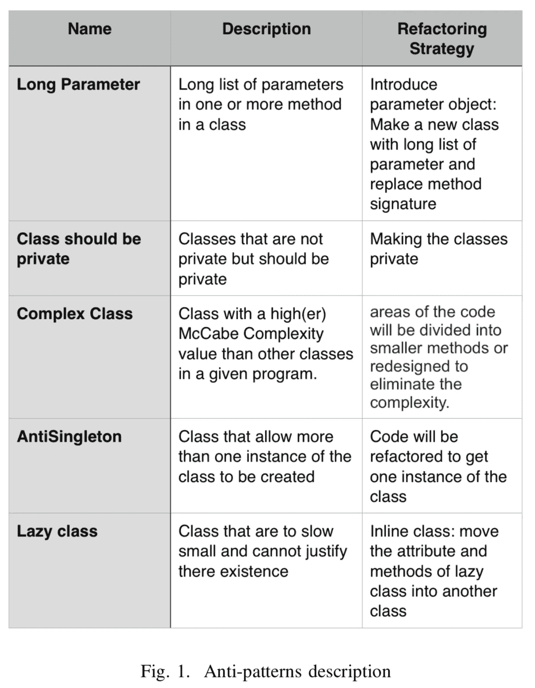
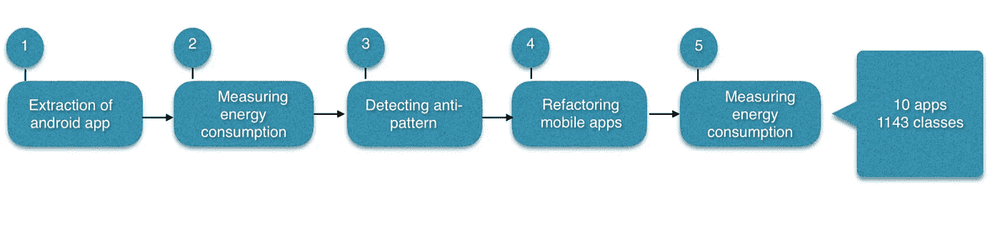
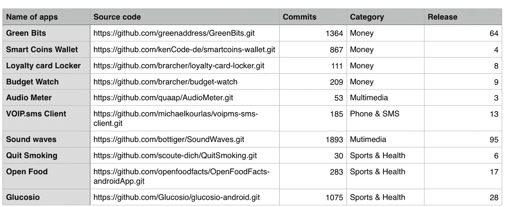
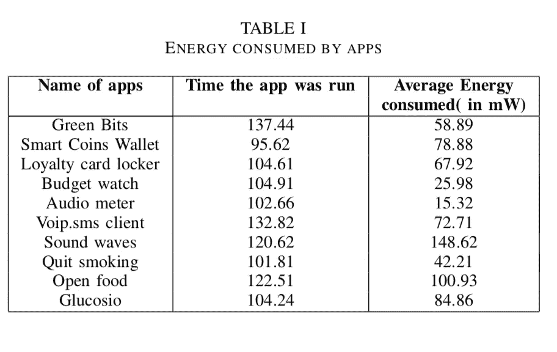
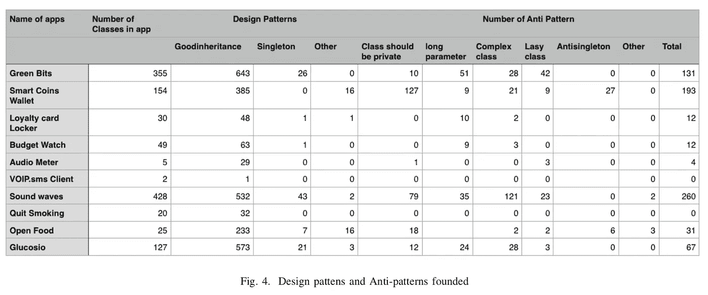
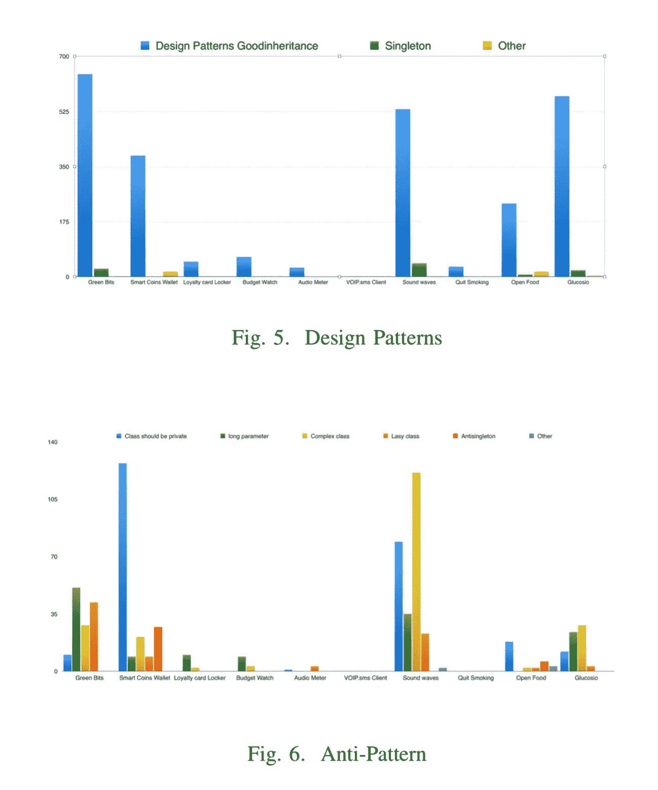
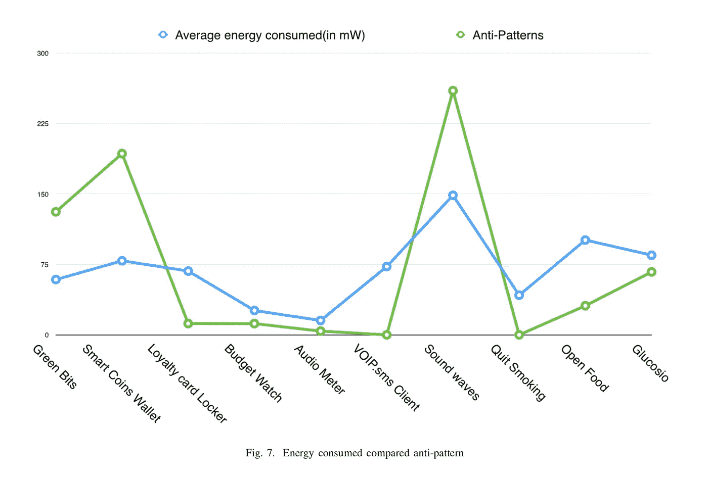
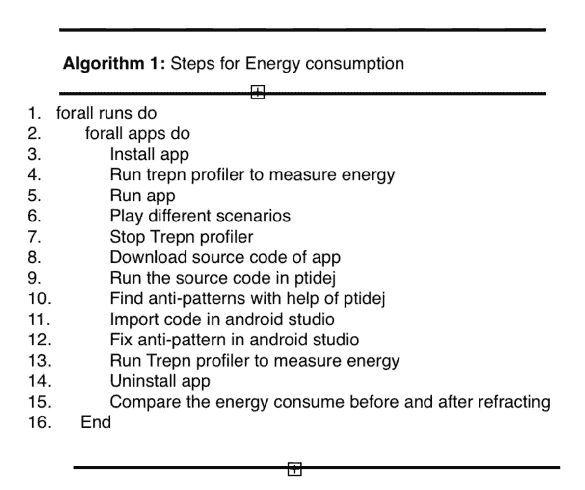
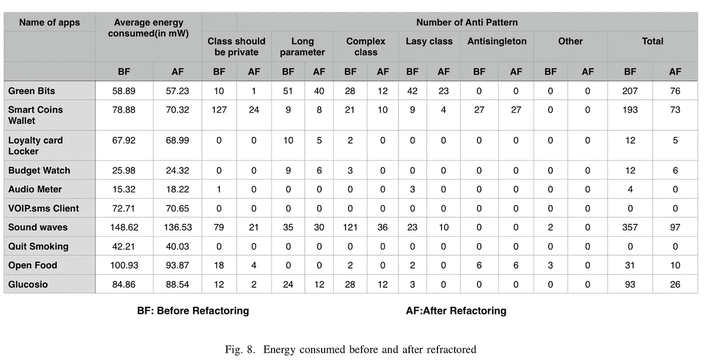
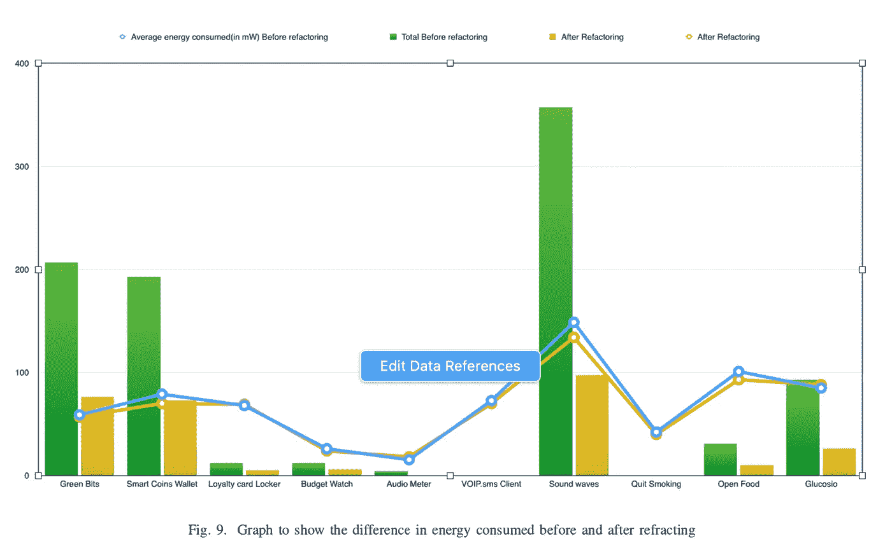

# Android 应用中的能效

> 原文：<https://medium.com/analytics-vidhya/energy-efficiency-in-android-application-9d1e37c55d2d?source=collection_archive---------13----------------------->

随着移动应用程序的引入，软件开发的传统格局已经发生了变化。由于电池、CPU 和内存等移动设备资源有限，这些应用带来了新的挑战。电池消耗是一个热门话题，研究表明它取决于设计质量。因此，了解反模式如何影响能耗是很重要的。许多研究人员已经找到了一种消除这种反模式的方法，但是还没有多少研究表明它们是如何影响能量消耗的。

在本文中，我试图通过分析反模式如何影响移动应用程序的能耗来填补这个空白。我分析了从 F-droid 中提取的不同类别的 10 个应用程序，以检测 5 个最常见的反模式。我从分析一个反模式的移动应用程序的能耗开始。然后，我试图了解哪种反模式对能耗的影响更大。

最后，我比较了使用反模式和不使用反模式的应用程序的能耗。我发现折射 app 的能耗和反模式 app 的能耗差别很大。因此，应用程序开发人员在应用维护活动时，应该牢记反模式所导致的能量消耗

# 介绍

在过去的七年里，移动应用程序市场出现了一个福音，软件工程师们已经看到了软件开发领域的深刻变化。android 应用的发展带来了新的限制，这些限制与内部和外部资源都有关系。此外，这掩盖了质量属性可靠性和功能性。

移动应用已经成为我们生活的一部分。我们每时每刻都需要它们，例如浏览互联网、查看电子邮件等。因此，应用程序的质量是必要的，并且需要是最新的。因此，对新的特征和更新有着持续的需求，这导致了功能上的变化，并且有时导致原始设计的恶化。

这种现象被揭示为一种反模式。反模式的一个例子是复杂类，当一个类具有很高的 McCabe 复杂度时，就会出现这种情况，也就是说，它告诉我们这个类的复杂度是多少。惰性类通常由高度复杂的方法组成，因此在实现和设计阶段会引起猜测。另一个常见的反模式是 Long 参数，它是一个在类的一个或多个方法中有一长串参数的类。这个类使得代码难以重用和理解，因为它具有低内聚性，并且阻碍了软件维护。

对于移动应用，资源管理至关重要。因此，开发人员应该避免使用反模式，因为它们会导致电池耗尽。我们可以通过重构从移动应用中移除反模式，这有助于我们在不改变代码行为的情况下改变代码的结构，但这需要确定代码需要重构的地方。

尽管有很多关于反模式和能量消耗的工作，但是还没有太多的工作将它们联系在一起。在本文中，我旨在通过研究 10 个 android 应用程序中的 5 个反模式，以及反模式应用程序中的能耗与重构应用程序中的能耗有何不同，来填补这一空白。在我的实验中，我使用了 MI redmi 4 作为 Android 设备，这款手机由 1.4GHz 八核处理器和 4100mAH 不可拆卸电池供电。我相信这是一部适合我案例研究的手机。

这个项目中的工作可以概括为:我对移动应用程序的能效进行了研究。我测量了重构前后手机 app 的能耗。这一结果为开发者的设计选择影响移动应用的能耗提供了证据。本文的结构如下:第 2 节提供了相关的工作，第 3 节提供了我对整个项目的研究方法。第 4 节讨论了对有效性的威胁，第 5 节给出了项目的结论和讨论。

# 相关著作

在本节中，我们将讨论 Android 反模式的相关工作，以及它们如何影响移动应用程序的能耗，以及自动化重构如何帮助消除反模式。

*A .移动反模式*

利纳雷斯-瓦斯奎兹等人利用移动应用程序中的 DECOR 来检测 1800 个反模式。他通过对 1200 多个应用的研究表明，反模式对移动应用的易错性有负面影响。他进一步发现，一些反模式与特定类别的应用程序更相关。

Verloop 利用一些折射工具，如 PMD12 或除臭剂来检测 android 应用程序中的代码气味。在这两部作品中，作者都没有考虑 Android 特定的反模式。Reimann 等人提出了 android 应用程序的 31 种质量气味，这些气味直接影响用户体验、电池效率或安全性等质量属性。他还使用重构工具对某些代码味道进行了检测和修正。

许多其他研究人员使用辣椒粉方法，通过使用 Google play 商店的 106 个流行的 android 应用程序分析移动应用程序的演变，来识别面向对象和 Android 特定的反模式

*B .能源消耗*

有一些研究提出了能源消耗的框架和工具，以分析软件发展对能源消耗的影响。有一个专门的硬件挖掘软件库被测试称为绿色矿工。它从物理上测量 Android 移动设备的能耗，并自动向开发人员或研究人员报告。它可以利用 Green-Miner web 服务 13 收集和分发绿色开采测试及其结果。Green-Miner 硬件客户端单元有一个 USB 集线器、一个 Raspberry PI、谷歌 Nexus 手机、一个带 INA2019chip 芯片的试验板和一个 Arduino。使用这个用户可以获得和可视化的 android 应用程序的能耗。

能量模型可以由软件环境能量分布图(SEEP)给出，它的轮廓和进展增强了每个制导能量演示。可悲的是，这是一个罕见的真正的生产者给渗透。因此，已经提出了非常规的方法来测量移动设备的能量利用

Pathak 等人提出了一种用于 Android 应用程序的细粒度能量分析器，它可以使工程师理解和增强他们的应用程序能量熟练程度。年，创造者提出了产品仪器 eLens 来测量 Android 应用程序的功耗。该仪器可以评估真实应用的功耗，误差在真实估计值的 10%以内。在最常用的活力设备分析器中，最突出的是季风功率监视器，它已经在一些工程中使用。通过利用这种能源设备剖析器，利纳雷斯-瓦斯奎兹等人设想对独特的 Android API 使用示例如何影响便携式应用中的活力利用进行主观调查。

Pinto 等人提出了一种重构的方法来提高并行编程框架的活力利用率。他们将这种重构方式与 15 个开源扩展进行了物理连接，并宣布保留 12 个

Sahin 等人研究了异常状态计划选择如何影响应用程序的活力利用率。他们研究了编程计划和功率利用曲线之间的映射如何为编程创建者和设计者提供关于他们的产品控制利用行为的巧妙数据。

Da Silva 等人分析了内联策略重构如何影响用 Java 编写的三个嵌入式编程的执行和活力利用率。他们研究的后效表明，内联策略可以在一些例子中建立活力利用，而在其他例子中减少活力利用。Hecht 等人指导了一项以个体为中心的观察性研究，并结合了三个 Android 执行敌人在两个开源 Android 应用程序上的执行效果。这些创建者在一个典型的客户端情况测试中评估了第一个和调整后的应用程序的性能。他们详细说明了纠正这些 Android 代码气味可以充分增强 UI 和内存执行。

分析师们研究了六种常用重构对 197 个应用程序的影响。他们的调查结果表明，重构会影响活力利用率，并且它们可以增加或减少应用程序所利用的活力度量。的发现同样突出了对集成到 ide 中的活力留意重构方法的需求。

最近，科学家们分析了分布在最佳编程设计环境中的研究结果，并强调了对编程活力利用问题进行更多检查的要求。

# 方法

本文的目的是帮助计划在控制能源利用的同时增强其应用的轮廓特性的工程师。为了实现这个目标，第一步是量化反模式(即，糟糕的设计决策)对能源生产率的影响。

*A .研究设计*

为了研究反模式的效果，我从开源软件 F-droid 随机下载了 10 个 android 应用程序

Android 应用程序库。这些应用程序将来自五个不同的类别(多媒体、游戏、电话和短信、货币、体育和健康)。为了选择在我们的研究中使用的应用程序，我们设置了相应的标准:不止一个类，其中大约有一个反模式的案例。

由于我已经测量了手机上应用程序的能源利用率，我们验证了候选应用程序可以在本次研究中使用的手机上编译和运行。我已经考虑了 5 个反模式长参数，类应该是私有的，复杂的类，反单体和懒惰的类。图 1 显示了反模式的细节。我选择这些反模式是因为它们在移动应用程序中最常见，并且在文献中有很好的定义，并推荐了删除它们的步骤。

*B .数据提取*

该部分由以下步骤组成:

*1-下载 Android 应用:*我使用 F-droid 下载应用，因为它是开源的，所以很容易获得源代码，因此可以折射应用。这个脚本为我们提供了应用程序的名称、与源代码的连接、Android API 变体以及 Java 记录的数量。我利用 API 表单来分离不适合我们手机的应用程序，并利用 java 记录的数量来引导只包含一个类的应用程序。过滤完应用程序后，我将源代码导入 Android studio，在那里完成了重构。图 2 显示了与源代码一起使用的应用程序、类别以及应用程序的提交和发布次数。

*2 —使用反模式测量能耗:*

下载应用程序后，该应用程序运行近 100 秒，然后使用 Trepn Profile 计算该应用程序消耗的能源，它会告诉我们有关能源的信息。Trepn Profiler 是用于移动设备的电源和性能分析应用程序。它旨在帮助您识别占用 CPU、消耗过多数据或耗尽电池的应用程序。它给我们提供了关于每秒钟消耗的电池电量、CPU 负载和平均能耗的信息。我计算了每个应用程序运行近 100 秒时消耗的能量，可以在表 1 中看到。

*3 —反模式检测:*重构申请者的识别和年龄是利用我们过去的机械化方法 Ptidej 来执行的。Ptidej 是一个在 Eclipse 平台下用 Java 开发的工具套件，它分为 4 个工具，第一个是 SAD，用于检测和纠正软件架构缺陷，第二个是 EPI，用于识别给定程序中的设计模式，第三个是我正在使用的 DRAM，它用于用邻接矩阵可视化程序的静态和动态数据，最后一个是 Aspects，用于对面向方面的抽象进行建模和计算。

通过 Ptidej，我开发了理论、方法和工具，通过促进习惯用法、设计模式和体系结构的使用来理解、评估和改进软件系统的质量。我已经使用 Ptidej 获得了应用程序中的类的数量以确定其大小，然后我获得了应用程序中的所有设计模式以及一个反模式。但是我决定使用两种设计模式——好的继承、单例模式和其他我已经分类的模式。

在反模式的例子中，我选择了 5 种反模式——类应该是私有的、长参数的、复杂的、懒惰的和反单例的。这些设计模式和反模式是根据它们在移动应用程序中的常见情况而选择的。类的数量、设计模式和反模式可以在图 4 中看到。

*4 — Android 应用重构:*我正在利用 Android Studio 和 Eclipse 重构工具支持来应用 Ptidej 推荐的重构。对于没有仪器支撑的情况，我将重构物理地连接到源代码中。目前，还没有支持工具来过早地重构绑定资产和 Hashmap 的使用。为了确保重构后的代码在这种情况下得到执行，我们设置了断点，并允许调试器在断点处停止。一些重构技术非常简单，因为类应该是私有的，我们只需要将类从公共的变为私有的，但是还有一些其他的反模式需要很大的努力才能被重构。

*5)在没有反模式的情况下测量能耗:*这与第二步类似，我再次运行应用程序 100 秒，并使用 Trepn Profiler 测量应用程序消耗的能耗。这一步的不同之处在于，应用程序没有任何反模式，所以我们只是在折射应用程序后获取能耗来查看差异。

所有应用程序都在下一次运行开始前执行。随后，我远离了移动商店的数据与应用程序运行标识的保留内存，这可能会导致追求更快的一些执行。同样，在分析之前，屏幕亮度被设置为基本亮度，移动设备被设置为保持屏幕打开。最终目标是避免评估中的任何阻抗，只有基本的 Android 管理保持在手机上运行。

*陈少华研究问题*

我将本案例研究的研究问题表述如下:

(RQ1)反模式和能效之间有什么联系？
这项调查背后的原因是，确定使用反模式的移动应用程序的能源效率是否与未使用反模式的应用程序的电话熟练程度形成对比。我们测试伴随的零假设 H01:包含实例敌人的应用程序和没有反模式的应用程序之间的能量生产率没有区别。如图 4 所示。随着应用中反模式数量的增加，能耗也在增加。因此，我们可以说，能量消耗与一个反模式的数目是直接命题的。通过比较两个应用程序，我们可以看到。当我们比较前两个应用时，第一个是具有 355 个类别和 133 个反模式的绿色位，第二个是具有 154 个类别和 193 个反模式的智能硬币钱包。我们可以看到，第一个应用程序中的类更多，因此第一个应用程序中的能耗应该更多，即绿色位，但由于第二个应用程序中的反模式更多，因此该应用程序中的能耗更多。因此，可以看出能量效率取决于反图案的数量。

(RQ2)反模式类型和能效之间有什么联系？
在这个问题中，我们分析了某些反模式是否比其他反模式更能提高能源利用率。我们测试下面的零假设:H02:在包含不同种类的反模式的应用程序的能量熟练程度之间没有区别。从图 3 中可以看出，能耗取决于反模式，不同的反模式对能耗有不同的影响。这种差异可以看到，当我们比较 2 个应用程序智能硬币钱包和声波

反模式数量最多，能耗最大。智能硬币钱包有类应该是私有的作为最大数量的反模式，声波有复杂的类作为最大的反模式。但是可以看出，当应用程序中的复杂类的数量较大时，与应该是私有的类的数量较大时相比，能量消耗较大。

*D .案例研究的结果*

我们发现能量消耗与反模式的数量直接相关，这可以在图 4 中看到，图中清楚地表示了当反模式越多时，能量消耗也增加。我们还看到，有一些应用程序比其他应用程序有更多的反模式，但消耗的能量更少。我们还注意到，不同的反模式有不同的能量消耗，一些反模式对消耗有很大的影响，而另一些反模式在能量消耗上没有很大的差异。

在图 8 中，我们展示了参与反模式和重构版本的应用程序的能耗量。我们观察到，移除应用中的反模式有时会对应用的能效产生负面影响。在 10 个应用程序中，3 个应用程序在移除反模式后显示了负面结果。这一结果建议工程师在移除反模式时应该保持警惕，以提高他们应用程序的设计质量，因为该任务可能会不期望地影响活力熟练程度。这一发现与 Sahin 等人[22]过去的发现是可预测的，即重构通常不会促进活力熟练程度的提高。我们还发现，移除长参数表反模式会增加能耗。我们通过创建新对象(即，包含长参数列表的参数对象)在某种程度上增加了更多的内存使用来解释为 LP 获得的结果。

在研究的应用中，我们总共修正了 10 个应用反模式。在七种情况下(即 70%)，我们获得了原始版本和重构版本的应用程序之间的预期能耗差异。从图 10 中可以看出，与能量差相比，反模式减少的数量很大。对于三个应用程序，可以清楚地看到能耗的差异，但对于其他应用程序，重构前后的能耗差异并不大。

总的来说，我们的结果表明，不同类型的反模式可能会对应用程序的能效产生不同的影响。我们的下一个研究问题将更详细地调查这一假设。

# 计划验证

本节讨论了根据实证研究的通用指南[10]验证我的研究的计划。

理论与观察之间的关系存在结构效度威胁。如果在检测反模式或应用重构时出现错误，就会发生这种情况。我将使用 Ptidej 检测反模式。尽管如此，我们不能确保我们区分了所有可能的反模式，或者每一个被识别的都是明显的反模式。

关于利用重构进行上下文分析，我们利用 Android Studio 和 Eclipse 的重构设备支持来限制人为错误。还有，我们

确认所提议情况的正确执行，并检查 ADB 监视器，以避免在连接重构后出现复发。

对内部有效性的威胁涉及到我们对反模式、工具和分析方法的选择。在这个研究中，我们利用了一个特定的代理的反模式子集作为结构质量的中介。关于估计，我们计算的活力利用肯定理解假设和情况被重新创造了几次，以保证可测量的合法性。正如在构建合法性中所阐明的，我们的估算机械装配在任何情况下都与过去的估算设置一样精确。

对外部有效性的威胁关系到我的结果一般化的可能性。我的研究集中在大约 10 个不同大小的 android 应用程序上，它们都有不同的空间。然而，更多的检查和更大的数据集是有吸引力的。这种检查的未来复制对证实我们的发现是重要的。外部合法性的危险不仅仅适用于固定数量的应用程序，还包括它们被选择的方式(任意)，它们的种类(仅仅是免费的应用程序)，以及出处(一个应用程序商店)。因此，这项工作对应用程序抽样问题[32]毫无防备，当只检查应用程序的一个子集时，就会出现抽样偏差。因此，我尝试从每个类别中选择应用程序。

# 结论

在本文中，我分析了 android 应用程序中的反模式如何影响能耗。并进一步展示了具有反模式的移动应用程序的能耗如何不同于已经被折射为更好的设计的应用程序的能耗，以及根据所应用的重构类型，有可能提高或降低移动应用程序的能耗。我展示了重构某些反模式是有益的，而对于某些反模式则不是。从本文中获得的成果将极大地激励开发人员和研究人员，激发他们增强应用程序的概要性质，并激发工具制造者创造计算机化方法的兴趣。