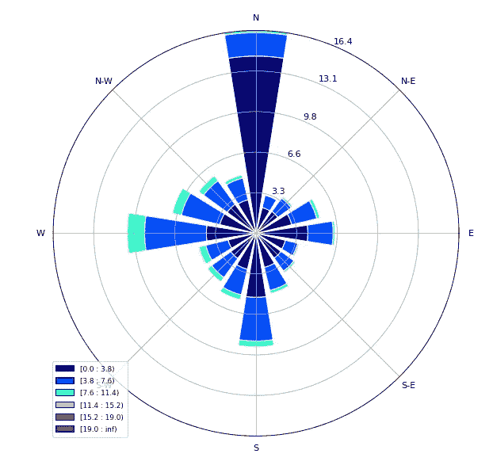
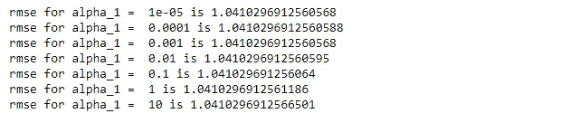

# 建筑能源预测-ASHRAE

> 原文：<https://medium.com/analytics-vidhya/energy-prediction-of-buildings-ashrae-5d873cf038f1?source=collection_archive---------5----------------------->

泰勒·尼克斯在 [Unsplash](https://unsplash.com?utm_source=medium&utm_medium=referral) 上的照片

## **概述**:

ASHRAE，美国供暖和空调工程师协会，成立于 1894 年，专注于建筑系统，能源效率，室内空气质量，制冷和行业内的可持续发展。迄今为止，ASHRAE 已经举办了三次能源消耗竞赛。
这些竞赛的主要目标是预测未来几年的能源消耗，以便更好地投资于能源效率。
最近于 2019 年 10 月开展了第三届比赛。在这场比赛中，他们提供了一年中 16 个不同地点的 1449 栋建筑的四种不同能源的每小时消耗量。他们要求参赛者预测未来两年这些能源的每小时消耗量。

**数据集:**

 [## ASHRAE -大能量预言 III

### 一栋建筑会消耗多少能源？

www.kaggle.com](https://www.kaggle.com/c/ashrae-energy-prediction/data) 

**问题陈述:**

手头的任务是根据给定的建筑规格、天气数据和前一年的仪表读数，预测未来两年建筑的能耗。
这一预测让投资者对通过使用 ML、DL 等尖端技术和任何统计方法来降低成本和提高效率的投资有一个简单的想法。

**评估指标:**

当预测值和真实值都是巨大的数字时，如果您不想惩罚预测值和实际值之间的巨大差异，通常会使用 RMSLE。

**探索性数据分析:**

列车数据包括 1449 栋建筑物的仪表读数(一栋建筑物中所有四个不同的仪表)和获取这些读数的时间(每小时时间序列数据)。表 0: 1413、表 1: 498、表 2: 324、表 3: 145 的建筑数量。天气列车数据包含 16 个不同的地点和这些地点的天气条件(2016 年)，如气温、云层覆盖率、海平面压力和风速。
建筑物元数据由 1449 个建筑物的规格组成，如建筑物的层数、主要用途和建筑的平方英尺。

天气测试数据包含 2017 年和 2018 年的天气情况。测试数据包含具有四个仪表和时间戳的所有建筑物的行 id。

**一表一栋楼全年抄表:**

前 145 天，0 号楼电表读数为零。

**计量分析:**

**电表:**

电表读数从 130 千瓦时变为 220 千瓦时。
与接下来的 150 天相比，前 150 天的用电量较少。

**冷冻水:**

冷冻水消耗分布不同于电力消耗。通常冷冻水的消耗量从 250 千瓦时到 2500 千瓦时不等。

**蒸汽:**

在 2016 年的前 150 天和第 320 天至第 330 天，蒸汽消耗量更多。蒸汽消耗量从 10 毫瓦时到 80 毫瓦时不等。与其他能源消耗相比，蒸汽的能源消耗更多。

**热水:**

夏季，即第 100 天至第 200 天，热水消耗量较少，其他季节则较多。热水消耗量通常从 100 千瓦时到 800 千瓦时不等。

**风向风速可视化的风玫瑰图:**

彩色块告诉我们风速，单位是英里/小时。径向线告诉我们风向。北方有每小时 19 英里以上的高风速。

**建筑分析:**

大约 30%的建筑用于教育目的，因为这些数据是在各个大学收集的。

**通过合并数据进行探索:**

1.建筑的平方英尺与 building_id
2 相关。露水温度和空气温度高度相关。
3。大多数特征与仪表读数的相关性较小。

**缺失数据:**

气象列车数据:

在天气训练数据中，大约 50%的云覆盖数据丢失，大约 36%的 precip_depth 数据丢失。

建筑数据:

令人惊讶的是，75%的 floor_count 数据在建筑物元数据中缺失！
约 53%的年度建造数据缺失。

**检测异常值:**

可以观察到 1099 个 building_id 抄表值异常。

**预处理:**

1.  删除丢失数据超过 50%的列。
2.  平方英尺的值很高，使用对数转换为小值。
3.  使用对数转换仪表读数值以计算 RMSE。
4.  对天气数据中的 Primary_use 列应用标签编码器，因为它是分类的。
5.  用平均值按组站点、日和月估算天气数据中的缺失值。
6.  天气数据的时间校准，天气数据以 UTC 时区给出，而火车数据以当地时间给出。
7.  移除电表的异常值和零仪表读数。

**特征工程:**

1.IsHoliday:根据位置检查当天是否放假

2.周末:根据时间戳检查是否是周末。

3.month_group:将每连续四个月作为一个组进行分组

4.horizsolar:地球上散射的太阳辐射量可以用 GHI(全球水平辐照度)来测量

5.相对湿度:在相同温度下，空气中水蒸汽的含量，用饱和所需量的百分比表示。

6.滞后特征:天气数据中每列 72 小时窗口大小的平均值。

# **建筑模型:**

首先，让我们决定哪个模型在这个数据集上表现更好。不是在整个数据集上训练，而是使用具有 50%数据的计量器来取一个块。仅仪表 0 就包含 57%的数据。

基线模型:

简单的基线分数可以通过取标签的平均值或中间值来计算。50%数据的基线得分是 1.76。因此，可以预计基线得分可能会更高，为 2.5 分。

SGDRegressor:

ARDRegressor:

决策树回归器:

xgb 回归量:

LGBM:

前馈神经网络；

从上面的模型中，LGBM 在这个数据集上给出了最好的性能，并且它很快，GPU 可以用于更快的训练。

**训练策略:**

1.使用 LGBM 进行 GroupKFold(3)培训。

2.使用 LGBM 进行一米(四米)训练。

3.使用 LGBM 进行现场(16 个现场)培训。

4.通过采样数据使用 LGBM 堆叠 16 个模型。

5.不使用滞后特征的前馈神经网络。

6.具有滞后特性的前馈神经网络。

7.最佳模型集合。

8.后处理

未来工作:

预处理列车数据，手动检查列车数据中的峰值和异常值。为每栋建筑训练 XGboost 模型，总共创建 1449 个模型。

Kaggle 分数:

源代码:

 [## ASHRAE 能源预测

### 建筑物的能源预测。通过创建一个能源预测中心，为 ASHRAE 的发展做出贡献

github.com](https://github.com/devathaabhishek/Energy-Prediction---ASHRAE.git) 

LinkedIn 个人资料:

 [## Abhishek Devata -助理经理-韦丹塔有限公司-铝业务| LinkedIn

### 查看 Abhishek Devata 在全球最大的职业社区 LinkedIn 上的个人资料。Abhishek 有 3 份工作列在…

www.linkedin.com](https://www.linkedin.com/in/abhishek-devata-30b153ba) 

**参考文献:**

[https://www . ka ggle . com/corochann/ASHRAE-feather-format-for-fast-loading](https://www.kaggle.com/corochann/ashrae-feather-format-for-fast-loading)

 [## ASHRAE -大能量预言 III

### 一栋建筑会消耗多少能源？

www.kaggle.com](https://www.kaggle.com/c/ashrae-energy-prediction/discussion/119261) 

[https://www . ka ggle . com/Patrick 0302/locate-cities-against-weather-temperature](https://www.kaggle.com/patrick0302/locate-cities-according-weather-temperature)

[https://www . ka ggle . com/gemartin/load-data-reduce-memory-usage](https://www.kaggle.com/gemartin/load-data-reduce-memory-usage)作者 [@gemartin](http://twitter.com/gemartin)

#[https://www.kaggle.com/rishabhiitbhu/ashrae-simple-eda](https://www.kaggle.com/rishabhiitbhu/ashrae-simple-eda)
#[https://www.kaggle.com/lhd0430/ashrae-energy-prediction-eda](https://www.kaggle.com/lhd0430/ashrae-energy-prediction-eda)

[https://github . com/grapestone 5321/Great _ Energy _ Predictor _ Shootout _ 1 _ 2/blob/master/papers/R-ESL-PA-96-07-03-4 . pdf](https://github.com/grapestone5321/Great_Energy_Predictor_Shootout_1_2/blob/master/papers/R-ESL-PA-96-07-03-4.pdf)