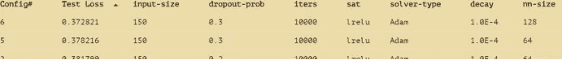

# 能源预测:提高效率

> 原文：<https://medium.com/analytics-vidhya/energy-prediction-towards-efficiency-4e6c4fe29a69?source=collection_archive---------14----------------------->

里卡多·安南达尔在 [Unsplash](https://unsplash.com?utm_source=medium&utm_medium=referral) 上拍摄的照片

# **简介**

能源是世界上几乎所有过程的重要驱动力来源。植物需要能量来生产人类生存所需的食物，动物通过捕猎其他动物来获取能量，以便在野外茁壮成长，而人类也需要能量来思考，并作为这个世界上的社会主体负责任地生活。人类文明已经将能源的重点从简单地利用它们来满足人类的基本需求，转移到改变人类在获取和消费能源方面的价值的重大创新。

在过去的几十年里，由于容易获得大量的不可再生能源，如地下的煤和石油，能源消耗呈指数增长。然而，利用原始能源后产生的大部分废物仍然含有大量的潜在能源，或“浪费的”能源，这些能源本来可以回收，但最终却被填埋或废弃。如果这些能源大量分散在全球各地，我们为什么要考虑回收这些能源，因为收获的成本要比从产生的废物中回收它们便宜得多？

事实证明，我们正面临着一个冷酷的事实:全球能源供应短缺正在发生，并且在人类的时间尺度内将持续很长时间。工业也受到不稳定的油价和能源消耗增加的巨大影响，以抵御夏天的炎热和冬天的寒冷。能源很贵。许多利益相关者努力在他们的生产线上制造更节能的流程，以及他们如何能够关闭能量循环，以便输入到流程中的能量能够被充分利用。他们希望能够预测能源消耗将如何变化，以便优化能源使用并节省大量运营成本。

# **目标**

本项目旨在仅根据建筑物附近的温度信息，预测 126 号建筑物在 T+96(提前一天)的能耗，以便建筑物所有者做出明智的决策，提高建筑物的能耗效率。

我们的模型将预测未来(即 T+1 天)建筑的日常能耗，假设数据集以 15 分钟为间隔，从 2014 年 7 月 24 日下午 12.30 到 2016 年 5 月 26 日下午 8.15。这也将极大地缓解使用太大数据集的计算能力(例如每周将使用 672 个数据点的窗口)来训练我们的预测模型以节省时间。我们的模型将使用神经网络框架来提供对 126 号建筑 1 天能耗的准确而可靠的预测。这些数据集中使用的能量单位是兆瓦(MW ),虽然它是功率单位，但我们将互换使用术语“能量”和“功率”。

# 数据集分析

建筑物附近有四个气象站，提供建筑物周围的温度记录(即 wx1、wx2、wx3 和 wx4)和一个建筑物-126 的能耗记录供分析。我们尝试提取温度数据和能量数据，并决定使用 wx1 和 wx2 的融合平均温度数据，因为它具有更好的完整性。数据提取将在后面的部分中讨论，但让我们只将 wx1 + wx2 温度数据作为用于神经网络训练的数据集。

**图一。**从 2014 年 7 月 24 日至 2016 年 5 月 26 日，126 号建筑在 3 年内每隔 15 分钟的能耗。

**图二。【2014 年 7 月 24 日至 2016 年 5 月 26 日，126 号楼附近 3 年内每隔 15 分钟的温度变化。**

根据上面的图 1，我们可以观察到能耗峰值有两种趋势。从 12 月到 3 月的 4 个月期间，能量消耗稳定在大约 6500 MW 的最高值(*用红色*圈出)，相比之下，6 月到 10 月期间的能量峰值大约为 5000 MW ( *用绿色*圈出)。这可能是由于冬季气温低于 0 摄氏度(如上图 2 所示)，供暖系统可能会全天候开启以维持工作流程。在 6 月至 10 月期间，高峰也是由于在夏季期间需要冷却系统，在夏季期间温度通常较高，并且为了防止工作过程过热。春季和秋季通常能耗较低，因为与夏季和冬季的极端天气相比，周围温度不会突然影响工作流程。

然而，我们还可以从图 1 中看到，2014 年 11 月 24 日之前记录的能耗非常低，因此它们成为我们模型训练的“异常值”。因此，我们决定排除 2014 年 11 月 24 日至 2016 年 5 月 26 日的数据集。下图 3 和图 4 分别显示了能耗和温度变化曲线。

**图 3。**126 号楼自 2014 年 11 月 24 日至 2016 年 5 月 26 日每隔 15 分钟的能耗。红色虚线表示数据集从 2014 年 11 月 24 日开始。

**图四。【2014 年 11 月 24 日至 2016 年 5 月 26 日每隔 15 分钟的温度变化。**

由于这些是三年来的总体趋势，我们放大了每周和每天的消耗量，分别如图 5 和图 6 所示。我们跳过月趋势，因为它与年趋势有高度的相似性。

**图五。【2014 年 12 月 126 号楼能耗周趋势。**

从每周趋势中，我们可以看到每周都有一个重复的模式，其中工作日通常能耗较高，尽管能耗并不总是相同(以粉色阴影显示)，同时周末的能耗似乎低于工作日(红色阴影)。但是，12 月 8 日是公共假日，显示能耗低于正常工作日，用绿色箭头表示。总体而言，每周能源消耗的总体趋势与上图相似，但在公共假日期间会有所下降。

周趋势可能已经给了我们足够的信息来训练我们的预测模型。但是，15 分钟间隔的数据集可能太大而无法训练，并且需要很长时间。因此，我们试图更仔细地观察每日趋势，如下图 6 所示。

**图六。**2014 年 12 月 18 日-2014 年 12 月 19 日-126 号建筑日能耗。

从每日能量消耗曲线来看，值得注意的是，它通常在早上 7 点到晚上 7 点(办公时间)保持较高水平。非办公时间的能源消耗开始减少。所以，每天的能量消耗总是有一个重复的模式

至于天气数据，在每周的天气数据中，我们没有特殊的事件或模式。然而，每日数据呈现出一种模式(图 7)，温度通常在下午升高，从晚上到早上降低，这是相当明显的。

**图 7。**2014 年 12 月 18 日-2014 年 12 月 19 日的每日天气数据。

# **自相关**

自相关被定义为滞后时间序列和当前时间序列在连续时间间隔内的相似程度。例如，当我们想要知道 30 分钟后的数据点与当前时间的数据点相比有多相似时，即 t = 0，产生-1 < x < 1 的值，其中 x 是自相关值。通过使用 statsmodels 模块中的自相关函数，我们能够绘制数据集的自相关曲线(融合 wx1 + wx2 平均值),如下图 8 所示。

**图 8。**自相关曲线为整个数据集 wx1 + wx2 的平均融合。

**图九。**在达到负自相关因子之前，wx1 + wx2 平均融合温度数据集的自相关曲线。

从上面的自相关曲线中，我们可以看到，能量消耗的正相关性一直保持正相关性，直到数据点~3600，在此处数据下降到负相关性。这意味着，如果我们试图使用不相关或负相关的数据点，我们可能会得到不准确的结果，这也意味着更差的预测。这一点很重要，尤其是对于像能耗和温度数据这样的大型数据集。我们可以在过滤掉具有不相关特征的数据后做出更好的预测，并用高度相关的特征训练我们的模型。

**图十。**能源消耗数据集的季节分解。

上述趋势显示了基于一年四季的峰值能耗。上图的季节性也表明，如前所述，每个特定时间都有一个重复的模式，即每天的能源消耗都有一个重复的模式。

# **数据集选择**

如前所述，在本项目中，我们从施耐德电气收到了四个气象站的温度变化数据和一份 126 号楼的能耗记录。我们尝试绘制单个气象站的测试损失，即 wx1、wx2、wx3 和 wx4。他们在产生的测试损失曲线中显示了相似的模式。因此，我们尝试使用单独的数据，并将这些数据融合到一个简单的网络中，以查看哪些数据可以给出更好的预测结果。结果表明，与其他组合相比，融合 wx1 和 wx2 显示出稍好的测试损耗。我们可以将 wx1 和 fused (wx1 和 wx2)的测试损失比较视为代表性数据集(见下表 1)。这种比较也与其他数据集相同，其中 wx1 和 wx2 的融合稍微好了大约 0.01。还通过从 wx1 和 wx2 取平均温度来进行数据融合以支持缺失值。

**表 1a。**简单网络中 wx1 测试损耗

**表 1b。**简单网络中 wx1 和 wx2 平均融合测试损耗

在决定使用这些数据后，我们试图将它输入到一个更复杂的网络中，并且我们已经尝试了几种方法来改进它(图 11)。然而，非常引人注目的是，训练的模型过度拟合，我们决定使用修改的数据集(见图 3)。过拟合问题得到了很好的解决(图 12)。下一节将讨论我们如何实现这一目标并进一步推进的更多细节。

**图 11。** wx1 和 wx2 平均熔丝测试损耗*复杂网络中未修改的*数据集

**图 12。** wx1 和 wx2 平均熔丝测试损耗*修改了复杂网络中的*数据集

基于上面获得的自相关曲线，我们可以看到数据集与前 3600 个数据点高度相关。因此，我们尝试使用该窗口范围内的功能。由于 3600 点的数据集还是很大的，我们尝试把窗口限制在一周以内，也就是 T-672。我们还决定使用 T-96 与数据分析图 3 中观察到的模式进行比对。

# **数据预处理**

在通过融合 wx1 和 wx2 获得我们的数据集之后，我们通过使用平均值和标准偏差来归一化我们的数据集。归一化的公式如下所示:

标准化后，数据集的持久性为 0.371115。然后，这些预处理的数据将分别被随机分成 70%和 30%的训练集和测试集。

# **特性**

我们尝试了几个基本功能:

T+96 的温度预报。

T+96 时的星期几。

T:0:-96 时的平均值、最小值、标准差和最大值。

差异时间:0:-48

根据图 6 中的每日数据趋势，我们可以看到能耗显示出每 24 小时间隔的总体重复模式。回想一下，给定的数据点是以 15 分钟为间隔的，我们决定使用 T-96 的窗口作为我们的输入特征，但是对于 DIFF，我们使用 48 (12 小时间隔)，因为它比 96 (24 小时间隔)给出更好的结果。

# **培训**

为了训练我们的神经网络模型，我们使用了以下几个超参数:

神经网络大小为 32、64 和 128，因为每次试验的测试损失不同。

训练的总迭代次数为 10，000 次，以防止过早停止。

根据使用的功能数量，输入尺寸为 54。

使用的解算器类型为“Adam ”,用于平滑梯度路径并稳定列车和试验损失的减少。“SGD”法效果不好，因为它倾向于绕过最小损耗梯度，而不是最小点本身，这在某些情况下不好。

使用的饱和器是 lrelu 或 relu，以加速达到最小梯度的过程。

我们使用的神经网络配置每层的感知器比前一层减少了 2/3。第一层应该很大，因为我们想捕捉重要的信息，深入到各层，我们减小了尺寸，以尽量减少噪音，但仍然抢救重要的信息。然而，我们不认为最后一层可能太小，以防止达到极小点的速度减慢。

# **简单网络的结果**

**表 2。**测试简单网络的损耗，最佳配置为 0.32486

**图 13。**简单网络训练和测试*修正*数据集的损耗曲线。

图 14。修正数据集的简单网络滞后曲线。a)和 b)显示了训练和测试损失预测的曲线图。实际值和预测值之间的线形图看起来很相似，但是可以看出实际值和预测值之间有一个滞后。c)和 d)是实际值和预测值之间的相关图。它们显示了很好的相关性，因为我们仍然可以在图上看到正相关性。e)此图显示了我们预测的数据的滞后，它显示了测试的最高峰在 T+96，第二个峰 T+0 在 0.68 左右。

# **超越坚持**

那么，我们如何进一步突破作为我们基准的持久性呢？好吧，看看我们下面使用的这些丰富的功能:

*   使用的正规化方法是辍学和“L2”。Dropout 将随机选择要关闭的节点，使得权重在神经网络节点中均匀分布。另一方面，“L2”有助于加速降低试验损失。结果可以在下图中看到。

**表 3。**测试简单网络的损耗，最佳配置为 0.339775。

**图 15。**用正则化方法检验损失曲线的“L2”和退学者。

图 16。正则化特征的滞后曲线。a)和 b)显示了实际能量和预测能量之间的训练和测试图。我们可以看到，列车运行图在实际和预测之间非常吻合。同时，测试集显示与我们使用的简单网络没有太大的不同。c)和 d)显示了实际预测和训练预测之间的相关性。在训练散点图上，它看起来比以前更加线性，而测试集显示没有太大差异。e)该图表明，与使用简单网络时相比，训练滞后改善了很多，但是测试损耗仅获得了轻微的增加，大约为 0.72。

*   差异输入也包括在内，这有助于进一步改进模型。我们尝试使用正则化和差分，然后观察结果。当使用 0.2 的下降、10–4 的衰减时，模型显示得最好，对于差异特征，我们使用 48 和 8 个间隙。

**表 4。**使用差异输入测试正则化的损失。测试损失的最佳配置是 0.28。

**图 17。**训练并测试*修改后的*数据集的损耗曲线，输入差异。

**图 18。**具有高级特征差异的滞后曲线。a)和 b)显示了实际图和预测图之间的训练和测试图。请注意，预测显示了与实际相似的模式，但在图表上似乎有一点滞后。c)和 d)显示了实际和预测之间的相关性，如果我们将它与之前的图表进行比较，它看起来真的很分散。这是由于图形的滞后。e)表明，当使用正则化方法时，测试滞后好于训练滞后，但是与之前相比仍然不够好。该图中的测试滞后约为 0.62。

*   动量和力输入。动量是一阶差分，而力是二阶差分。只有当两个输入都使用时，它才会有效。我们决定不包括力和动量，因为结果并不比前面的好。

**表五。**用差异输入测试正则化的损失。测试损失的最佳配置是 0.372821。

**图 19。**用不同的输入、动量和力来训练和测试*修改的*数据集的损失曲线。

我们得到的滞后看起来与之前的一个差异相似，所以你可以参考图 18。

*   输入缩放和自动编码器。输入缩放使用 tanh 饱和器对数据进行箝位，以减少数据集中的异常值。然而，离群值在这个数据集中并不显著，因此我们可以让 clamp 为假，以加快网络速度(见表 6)。Autoencoder 还用于降低输入维数，以便训练神经网络忽略数据集中的噪声。我们尝试使用的 autoencoder 是三层的，输入和输出层大小相同。在这种情况下(表 7 ),该表显示最佳配置是使用 4 个瓶颈大小，但由于它也没有显示真正好的结果，我们决定不使用自动编码器。

**表 6。**使用差异输入和输入缩放测试正则化损失。测试损失的最佳配置是 0.297723。

从表中可以看出，使用 clamp 与否没有太大的区别，所以我们将 clamp 设置为 false。

**表 7。**使用差异输入、输入缩放、力、动量和自动编码器测试正则化损失。测试损失的最佳配置是 0.36665。

**图 20。**使用差分输入、输入缩放、力、动量和自动编码器训练和测试*修改的*数据集的损失曲线。

滞后曲线也没有显示出与图 18 有很大的差别，滞后大约为 0.62。

*   力和动量的损失有助于减少滞后，因为差异是嘈杂的。我们尝试这样做是因为我们想尝试减少滞后，但似乎我们从这里得到的并没有太大的区别。它仍然有和以前一样的滞后。

**表 8。**使用差异输入、输入缩放、力、动量、力损失和动量损失测试正则化损失。测试损失的最佳配置是 0.327466。

**图 21。**训练和测试*修改的*数据集的损耗曲线，具有不同的输入、输入缩放、力、动量、力损耗和动量损耗。

**图 22。**具有差异输入、输入缩放、动量、力、动量损失和力损失的*修改的*数据集的滞后曲线。

# **XGBoost**

XGBoost 是神经网络的一种替代方案，可以利用增强决策树进行预测。虽然 XGBoost 提供了更容易的数据处理、大维度输入以及更快的训练和评估，但是在使用该模型时也有一些缺点。它们不能自动更新自己，这意味着它们需要从整个数据集进行重新训练，并需要许多深度提升回合来模拟输入变量之间的复杂交互。

基于以上特点，我们对神经网络和 XGBoost 的测试损失进行了比较。从结果可以看出，在这种情况下，使用神经网络可以获得更好的测试损失。我们可以在下表和下图中看到它们。

**表 9。**使用以下最佳配置测试损失:reg_lambda (1)，colsample_bytree (1)，num_round (10)，max_depth (5)，subsample (0.2)，learning_rate (0.4)，以及 num_parallel_tree (8)。最佳测试损失为 0.83642。

**图 23。**使用表 8 中提到的特性测试 XGBoost 的损耗。

# **结论**

我们训练的模型显示了不错的结果，测试损失为 0.289776。虽然持久性被打败了，但我们认为这个模型可以通过使用更大的窗口来进一步改进，以减少训练和测试损失之间的差距。然而，由于时间限制，我们只能做这么多，并且还可以使用更深入的特征，例如导致正确使用平方感知器的适当的初步特征。这可能有助于减少滞后并提高模型预测的准确性。

在决定哪个预测模型最适合本项目案例时，涉及到了一些机会成本。如果我们选择具有更好滞后的模型，我们将得到更严重的测试损失。另一方面，如果我们喜欢更好的测试损失，我们将不得不牺牲我们的模型有严重的滞后。滞后也停留在 T+96，因为与当前数据高度相关。当我们试图将预测点调整到 T+95 时，这被证明是正确的，滞后峰值也在 T+95 处(图 24)。

**图 24。**T+95 时*修改*的滞后曲线。

总的来说，我们可以使用该预测模型来评估在工作日的不同季节期间 T+96 的能量消耗，以便我们可以有效地管理将被消耗的能量资源。

由 Andrew Wiraatmaja、Christopher、Elysia Kho、Leonardo Irvin Pratama 和 Michael Teguh Laksana 撰写。